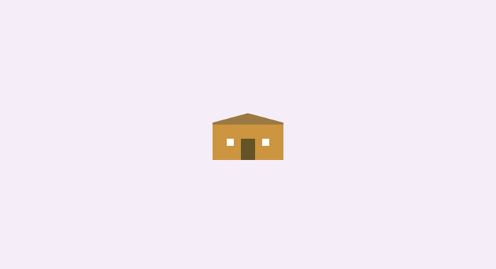
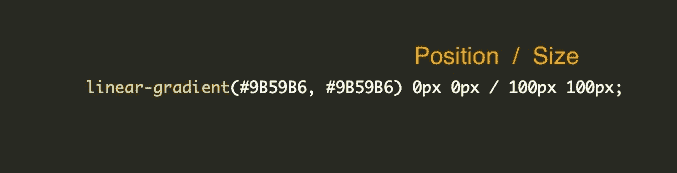

# 爱上单格插图

> 原文：<https://betterprogramming.pub/fall-in-love-with-single-div-illustrations-674ddeb51c62>

## 关于如何在 CSS 中创建图像的简短教程

作者的单格延时摄影。

我一直很钦佩用 CSS 创作单幅插图的人。一个`div`，多个背景层，大量 CSS 代码，嘣！你有插图。我一直认为这一定很有挑战性，我永远也不可能创造出这样的东西。我错了。

要创建一个简单的图像，你只需要知道一件事:背景在 CSS 中是如何工作的。就是这样。你不必使用 CSS 变量。它们有助于维护干净的代码。阅读那些带有变量的图像要容易得多，但这不是必需的。

# 最简单的例子

让我们从一些简单的事情开始。如果你理解了这个例子，你就可以开始了:

第一个例子中的 CSS 和 HTML

我们的第一个单格图像！

好吧，这是什么？一个 100x100px 的矩形，带有一个以相同颜色开始和结束的`linear-gradient`。我们的第一个背景也已经定义了 X 轴上的`background-position: 0px 0px;`和 Y 轴上的 0px。这意味着我们的背景从左上角开始。然后我们有`background-size: 100px 100px;`，它显然定义了我们紫色的大小。而最后一条`background-repeat: no-repeat;`，就是防止回复我们的层。

结论:

*   我们的`div`是纯色#9B59B6，因为我们用相同的颜色开始和结束渐变。
*   是 100x100px。

太好了，让我们继续添加一层:

带有附加层的第一个示例的 CSS 和 HTML

带有附加层的第一个示例

就是这样！我们彼此有两层。注意图层顺序！较早的层位于其他层之上。把它想成一个`z-index`。

我不喜欢把房产分成几块，所以让我们清理一下:

背景速记

正斜杠分隔`background-position`值和`background-size`值。正式语法需要斜杠。

线性渐变位置和大小

如果我们有更多的背景层，事情可能会有点乱。你可能不记得背景的第 31 行是指向窗户还是栅栏。

这样干净多了！

前面使用 CSS 变量的例子

# 小房子

你已经知道了足够的知识来创作插图。为了在最后的练习前热身，让我们做一个小房子。

我们需要几层:

*   房子的前面
*   门
*   屋顶的左侧
*   屋顶的右侧
*   窗口 1 和窗口 2

单格房屋的 HTML 和 CSS

单格房屋

你可以在 CodePen 上玩这个房子[。](https://codepen.io/walickialbert/pen/dypjYrg)

## 三角形

这座房子最具挑战性的部分是创造三角形。让我们把这段代码分成几段。

让我们看看这个例子:

50%/50%红色和棕色的线性渐变

我们的目标是为我们的屋顶创建一个三角形。目前，我们的梯度有一个零度角，所以让我们改变它。我想有一个小的屋顶倾斜角度，所以我把它改为 12 度:

线性渐变，50%/50%红色和棕色，12 度角

我想你知道你现在应该做什么。让我们减少梯度的百分比。我将其更改为 19 度，以便在右侧有一个完美的起点:

三角形快完成了

最后，我们需要用透明背景替换红色背景:

HTML 和 CSS

我们的屋顶元素

这里我们有一个直角的漂亮屋顶。

# 房子的一个复杂的例子

我喜欢把自己扔进深水区。这就是为什么我创建了一个详细的房子作为我的第一个单分区图像:

我的第一张单格图片！

这看起来像一个复杂的例子，但是如果你创建了前一个例子，你也可以创建复杂的版本。文章中我的样本和这个样本之间唯一的区别是单位。在这里，我使用`vmin`单元来创建一个响应图像。

今天到此为止。感谢阅读！

*最初发表于***。**