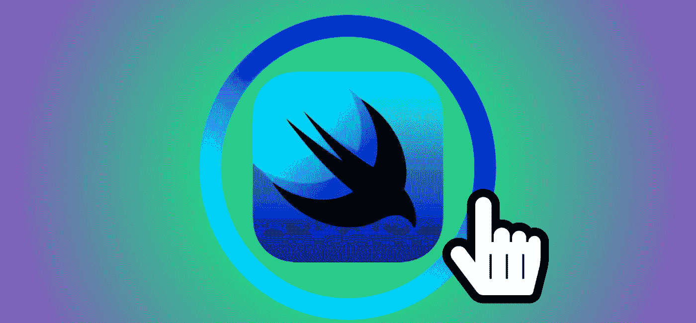
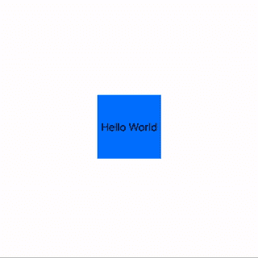
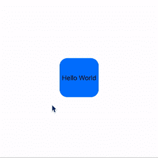

# 花式 SwiftUI:制作一个交互式覆盖控件

> 原文：<https://betterprogramming.pub/fancy-swiftui-making-an-interactive-overlay-control-202e691c04bf>

## 当你的应用程序感觉不错的时候



它们可能并不总是合适的。它们可能不符合某些设计标准。见鬼，有时候他们可能看起来超过了顶端(最近第一次当爸爸)。

但是，这并不能改变我是 UI 上的菜单和控件的超级粉丝的事实，比如桌面上传统的右键/控制键点击下拉菜单。也许这也是因为我太习惯于在视频游戏中动态显示菜单和覆盖图了。它们是确认用户在 UI 中的焦点和释放该区域可用信息和特性的简单方式。而且几乎最好的是，它只在用户想要/需要的时候出现。

今天，我们将看看 SwiftUI 中的叠加。具体来说，我并没有把覆盖图看作是改变视图设计的一种方式，而是提出了一种与其父控件进行通信的交互控件。

通过 SwiftUI 中新的声明式 UI 方法，交互式覆盖控件获得了一些新的好处。首先，将一个覆盖视图连接到一个父视图需要很少的代码。说到代码，覆盖层也在 UI 构建的桌子上获得了一席之地——不再有单独的故事板/xib，也不再像某种见不得人的后门交易那样在幕后将它们连接起来。最后，由于 Combine，我们可以在覆盖图和父图之间建立更强的关系。Combine:从 2019 年开始将 UI 家族聚集在一起。

# 构建我们的用户界面

打开 Xcode 11，启动一个启用 SwiftUI 的新项目。打开预先制作的 ContentView.swift 文件，离开 Hello World 文本视图。那是我们的父母。

为了构建我们的基本 UI，我们要做的就是在文本视图周围构建一个框架，设置一种颜色，我们的目标是制作一个可以改变颜色的覆盖控件。在这个过程中，我们还会给它添加一些特色。

```
Text(“Hello World”) .frame(width: 100, height: 100) .background(Color.blue)
```

## 去 Z 还是不去 Z？

现在，在我们设置覆盖之前，我想指出 ZStack。是的，ZStack 允许你将视图堆叠在彼此之上，我们可以假装它是一个覆盖图。这很酷，但是在代码中，它没有明确地让一个视图的父视图位于另一个视图之上。覆盖图确实明确地将分层视图声明为另一个视图的子视图，这在某些属性中有所体现(例如，覆盖图的偏移属性将基于父视图的属性)。ZStack 可以人为地建立这种关系，但可以说它仍然被视为兄弟姐妹。

因为我们希望我们的控件特别关注它想要与之交互的父控件，所以我们将使用一个覆盖。

## 那就叠加吧！

让我们在文本视图上声明我们的覆盖。我们现在画一个圆圈，这样我们可以在预览中看到它。

```
.overlay(Circle())
```

到目前为止…看起来很丑，但我们正在大步前进！让我们再多设置一点 UI，改变我们的圆形，设置它为一个线条宽度足够大的笔画，以及设置足够大的框架，让我们的圆形包围我们的文本框架。

```
Circle() .stroke(Color.red, lineWidth: 30) .frame(width: 300, height: 300)
```

现在我们有了这个设置，让我们让我们的戒指互动。我们的目标是将文本视图更改为戒指的颜色。

为了做到这一点，我们将设置一个颜色状态，文本的背景将被设置，这将由我们的圆圈上的点击手势设置。

```
//Add this to our ContentView
[@State](http://twitter.com/State) var textColor = Color.blue//Change this for our Text View
.background(textColor)//Add this to our Circle
.onTapGesture { self.textColor = Color.red }
```

最后，让我们使覆盖只有在我们召唤它时才可见。在这种情况下，我们将在文本视图上使用另一个点击手势。这将触发另一个状态，作为显示或隐藏覆盖的条件。

```
//Add this to our ContentView
[@State](http://twitter.com/State) var showOverlay = false//Add this to our Text View
.onTapGesture { self.showOverlay.toggle() }//Cmd+Click Circle, select “Make Conditional”,
//and set self.showOverlay as our condition
VStack {
    if self.showOverlay {
        Circle()
            .stroke(Color.red, lineWidth: 30)
            .frame(width: 300, height: 300)
            .onTapGesture { self.textColor = Color.red }
    } else {
        EmptyView()
    }
}
```

当我们通过 Cmd+Click 使 circle 有条件时，Xcode 会自动将其包装在 VStack 中，并设置一个 if/else，其中 else 是一个 EmptyView()。这似乎是苹果显示或隐藏视图的首选方式。它看起来很笨拙，我非常想把它变成一个三元语句，但是现在我们把新的状态设置为条件，让它保持原样。



基本的，但是很管用！

瞧啊。我们已经达到了我们的目标。以下是我们的成果:

*   我们创建了一个覆盖。
*   我们的覆盖图只在用户召唤时出现。
*   与我们的覆盖图交互会触发父视图的变化。

以下是我们创建的代码要点:

我们的覆盖控制代码

# 让它变得新奇

我明白了:这不是有史以来最令人兴奋的 UI/UX。幸运的是，这不是乐趣需要结束的地方。通过使用我们在这里创建的东西，我们可以修改我们的 UI 来创建一些更有趣、更吸引人的东西。



我们叠加控件的增强版本

创建增强版最终只增加了 19 行代码(参见下面的要点)。所需要做的是将我们的圆放到一个新的自定义视图中，使用 trim 创建一个弧形效果，并使用 ZStack 通过 ForEach 循环将多个弧形显示为一个完整的圆。然后，到处添加一些 UI 和动画。立即我们的覆盖看起来更有吸引力，有趣，酷！

*免责声明:我不是一个真正的 UI/UX 类型的人，所以对我来说这是幻想*。*

增强覆盖控制的代码

## 美国的观点

为了不跑题，我想谈谈我是如何处理我们的状态的。基本版和增强版之间的一个很大的区别是叠加图被提取为一个单独的视图。我还将我们的状态作为绑定参数传入新视图。

通过我在 SwiftUI 上阅读的一些示例项目和文章，我看到了视图层次结构之间的状态和数据流以许多不同的方式处理，尽管许多人声称它们是“确定的方式”。我没有这样的说法。

然而，我选择这条路的原因有两个:

*   使用覆盖图的父视图不应该被它的子视图属性弄得乱七八糟(看我在那里做了什么？)除非是针对家长需求的独特。如果我的层次结构能够整齐地自成一体，那么它就没有必要变得杂乱无章。(看看两者之间的覆盖声明有多么不同，我想你会同意在增强版中它更加清晰)
*   对我来说，可重用性和保持上下文是创建函数和(现在)视图的关键。如果它与我的子视图有关，并且可以生活在我的子视图中，为什么我要把它的内脏分散到别处？同样，它弄乱了父视图，使得在其他地方使用子视图需要引用我在原始父视图中所做的，并在预期的父视图中复制它。

## 错误的笔记

写这篇文章的时候肯定有一些 bug 还生活在 SwiftUI 里(我用的是 Xcode 11 Beta 7)。例如，在 circle 的 trim 属性的三元组中，我的代码不会编译，除非我将 item 强制转换为 double，并且不允许我在该强制转换中执行任何操作。所以当你看到那条线上可怕的过度杀戮时，请保留你的判断。

# 你在控制中

有许多其他方法可以编辑这个覆盖图或创建另一种覆盖图。我们可以使用不同的手势作为触发器，比如长按。或者在堆栈上使用弹簧动画代替线性动画。

总而言之，这取决于你的应用程序 UI/UX 会找到什么最适合。

可能要记住的最重要的事情之一是以某种方式让用户知道你的覆盖控件的存在(可能是在你的视图上使用 Z 层的一次性教程遮罩，或者在你的应用程序的开始漫游中，如果它有一个的话)。只要用户不要错过检查新奇的覆盖控件，这可以让他们了解更多你的应用程序的精彩功能和体验！