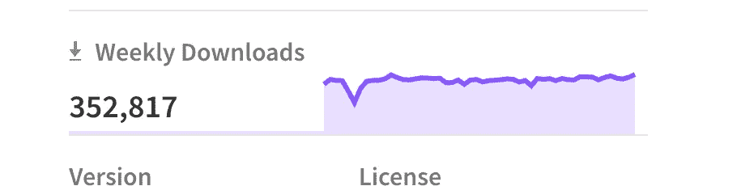
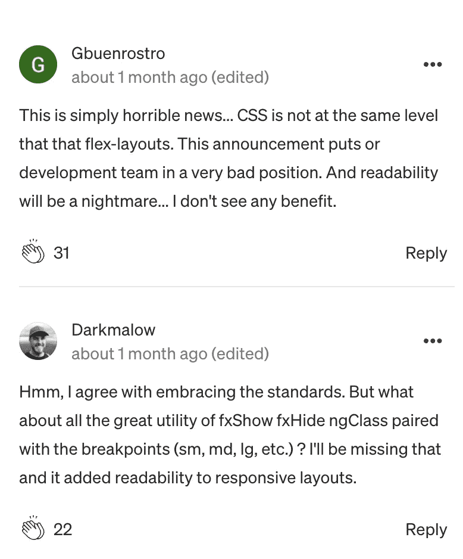

# 为什么 Flex-Layouts 的过时引起了 Angular 开发者的关注

> 原文：<https://betterprogramming.pub/farewell-flex-layouts-is-angular-starting-to-become-a-worry-4eea953b717b>

## 大量的重构即将出现

托马斯·杜莫提尔在 [Unsplash](https://unsplash.com?utm_source=medium&utm_medium=referral) 上拍摄的照片|图像高度有所改变

作为一名 Angular 开发人员很大程度上是一种享受。你可以获得出色的功能，比如用 TypeScript 编写你的应用，以及其他第三方组件，比如 Angular Material。有时候，有些小问题，比如你不太“理解”的设计选择或者不太有意义的文档。这对于任何框架来说都是正确的，但是对于 Angular 本身来说却不是一个有效的例子。

无论你是使用 Angular 还是 React Native(甚至是普通的 JavaScript)来编写你的应用程序，你基本上都会被引导到这些解决方案中的一个，因为你在库中寻找的是什么。对于 Angular，我选择它是因为它的类型安全，也因为我觉得它是一个非常固执己见的库(至少比 React Native 强)。一些开发人员回避强烈的意见，而是更喜欢完全按照自己的方式做事。那不是我——我很高兴被 Angular 的设计决策所引导，去创建和制作网络应用。

但这并不是说所有这些设计决策都有意义或者容易相处。从我们都不花钱使用 Angular 的角度来看，很容易为增加有用的功能而高兴。一个很好的例子是[最近增加的强类型表单](https://github.com/angular/angular/discussions/44513)。这是 Angular 最受欢迎的改进，并立即使使用表单和表单组变得更加愉快。

作为一名 Angular 开发人员，收到这些生活质量的更新是很好的，因为这感觉就像框架进入了一个新的成熟阶段。改进现有的特性，并引入这些特性，在任何开发人员社区都很受欢迎，尤其是在 Angular 社区。这也说明了 Angular 团队内部的良好决策，因为使表单具有强类型客观上是“正确的”事情(而不是追求其他一些只实现了一半的闪亮特性，忽略 Angular 内部其他更重要的事情)。

> 改进现有的特性，并引入这些特性，在任何开发人员社区都很受欢迎，尤其是在 Angular 社区。

然而，任何开发人员——也许任何有棱角的开发人员 moreso——在使用开发框架时都会有“前进一步，后退两步”的感觉。虽然 Angular 14 提供了许多出色的功能，但 Angular 15(实际上是下一个版本)带来了一些令人失望的消息，甚至有点令人担忧。

 [## 现代 CSS 的角度:布局

### 这个星期，我们处理布局。

blog.angular.io](https://blog.angular.io/modern-css-in-angular-layouts-4a259dca9127) 

“什么？”你会想，“为什么他在一篇关于 Angular 是一个问题的文章中抛弃了一篇关于现代 CSS 的文章？”。也许你会被原谅浏览那篇文章并想，“哦，我的 Angular 应用程序的布局帮助。这是相当古怪的，”并可能完全忽略它。然而，这篇文章中存在一个相当重要的问题。也就是说 Angular 的柔性布局被弃用。

# 为什么这是一个问题？

Angular flex-layout 是一个智能系统，可以帮助您以更简单、更具描述性的方式来布局 Angular 应用程序。使用它，您可以使用 flex-layout 完成最基本的布局任务，通常无需编写自己的 CSS。这是编写用户界面的一种简单又好的方法。

快速学习 flex-layout 并立即在 Angular 应用程序中使用它的能力几乎是显而易见的，每周超过 350，000 的下载量说明了这个包的受欢迎程度。

布局系统的工作方式也是向 Angular 组件调用添加属性，这将为您在这些元素上设置适当的 CSS。这有助于 flex-layout 的易用性，但也引入了对 flex-layout 的依赖。如果 flex-layout 消失了，你卸载了 flex-layout 包，你的应用程序的视觉设计将会被完全破坏，你的应用程序将无法编译。

你唯一的选择就是重做 CSS 中的所有东西，或者学习像 Tailwind CSS 这样的东西来达到同样的目标。这两个选项都同样不吸引人，因为第一个选项意味着你不可避免地要重新发明轮子，而第二个选项意味着你最终会在你选择的任何东西和像 Angular Material 这样的自制包之间产生 CSS 冲突。

根据正在开发的应用程序的庞大规模，这个问题的规模会增加一个数量级。如果你有一个小的应用程序，你可以在一两周内完成重构，调整你的测试，这样就没问题了。

但是，如果你不幸决定用 Angular 编写一个庞大的应用程序，并希望继续使用 Angular 的新版本，那么你可能需要花费更长的时间来重构你的应用程序。请记住，你完成这个重构并不是为了提高你的应用程序的质量或性能。你只是这样做，所以你的网站看起来和今天一样。

> 这两个选项都同样不吸引人，因为第一个选项意味着你不可避免地要重新发明轮子，而第二个选项意味着你最终会在你选择的任何东西和像 Angular Material 这样的自制包之间产生 CSS 冲突。

这基本上是 Angular 开发人员的现实，他们使用 flex-layout 作为第一方实现，这一现实现在正在他们中的许多人身上显现。你可以阅读上面链接的文章中的评论:

LTS 形式的 Angular v15 将支持灵活布局。但是从 Angular 16 开始，你就只能靠自己了，要么自己重写所有的 flex-layouts 指令，要么学习 Tailwind CSS 并解决它和 Angular 材质风格之间的冲突。两者听起来都很不吸引人。

## 这是最后一个失去主线支持的包吗？

在 flex-layout 遭到不必要的反对之前，使用 Angular 就像使用你朋友的豪车一样。你不了解汽车的每一个部件是如何工作的，可能有些你不了解，但你仍然很乐意使用这辆车。它会一直被维护，你会从中得到安慰，因为你有钱的朋友会承担费用和车需要的任何东西。你只需要小心驾驶汽车。

但是现在，你的朋友从车上取下了挡风玻璃雨刷。我是说，这是他们的车。他们有权。你当然可以改变你使用汽车的方式，只在不下雨的时候使用它。必要时，你可以自己做雨刷。它们不会像工厂里生产的那么好，这需要花费你一些时间，当你完成的时候，它不会像你最初拥有的那么好。但尽管如此，还是有可能的。即使你经历了所有的麻烦，你还是会想，这车的哪个部分是下一个要去的？毕竟这是他们的车。他们用它做什么由他们自己决定。

对我来说，过去几年创建一个 Angular 应用程序的感觉基本上是一样的。运行`ng new`，添加棱角分明的材料，然后添加弹性布局，我就有了一个漂亮的、反应灵敏的应用程序。我的应用程序不是“棱角分明的应用程序”它们是“角度/角度材料/灵活布局应用程序”通过从这个堆栈中提取一个特性，我立即意识到由于一个战略决策而导致的重构所涉及的大量工作。不是因为安全问题、可用性、功能性或任何这些事情而做出的决定。主要是因为 Angular 团队等人没有时间和资源继续开发。

> 我的应用不是“棱角分明的应用”。它们是“角度/角度材料/柔性布局应用程序”。

不过，在我们被这个问题冲昏头脑之前，我们必须记住，它是有棱角的，是有棱角的团队的框架。从框架中增加或删除内容是他们的特权和不可否认的权利。由他们根据团队的规模和能力来管理工作量和期望，这两者都不是无限的。

但是，在这种想法下，我们应该期待像角状物质这样的成分被永远保持下去吗？如果我们应该，为什么我们应该？Flex-layout 可以被最小化为“只是一个布局库，这样人们可以自己做”，那么如何阻止 Angular Material 被最小化为“只是一个 UI 库，人们可以自己用 Materialize 做这件事呢？CSS 和一些自定义组件”？

也许这过于简单化了。也许有太多的角形材料，像 flex-layout 一样，不推荐使用。尽管如此，猫已经从袋子里出来了，它不会再回到袋子里了。核心角形组件可能会被弃用，你很有可能会受到影响。如果是的话，你可能要进行一个月的重构。

如果有太多的工作要做，那么核心的角度特征将被弃用。这令人担忧。

> *核心角形部件*可能会被弃用，你很有可能会受到影响。如果是的话，你可能要进行一个月的重构。

# Angular 是一个成熟的框架吗？

Angular 2.0 最初是在 2016 年 9 月发布的，所以它已经以目前的容量存在了六年。flex-layout 包在 2018 年落地。因此，这是六年的“新”角度应用程序开发和四年利用灵活布局包的应用程序。放弃这么多人使用的 Angular 名称空间下的包让我想知道 Angular 整体的成熟度。当然，现在开始放弃框架中被广泛使用和喜爱的部分已经太晚了？这与“还有什么会被否决？”我在上面提到的推理。

# 滴答，在你不得不做出一些艰难的选择之前，你还有大约六个月的时间

Angular 15 于 2022 年 11 月登陆，[每六个月会有一个新的主要版本登陆](https://angular.io/guide/releases#release-frequency)。因此，到明年 5 月，当 Angular 16 登陆，flex-layout 的 LTS 时期结束时，你必须在升级和重构你的应用程序或继续使用旧版本的 Angular 之间做出选择。新的东西伴随着角度的发布而来，比如对 RxJS 的新依赖，等等。、较新版本的 typescript 和包将随着时间的推移转移到较新的依赖项。

最终，你在项目中使用的一些东西将需要一个新的版本，而这个包的依赖性将与你相对复古的 Angular 15 应用冲突。

> …你*将不得不在升级* ***和*** *重构你的应用程序或继续使用旧版本 Angular* 之间做出选择

你是不是该告诉你的项目经理，你必须暂停你的项目一个月左右，以重构你庞大的、严重依赖 flex 布局的项目？那会是一次尴尬的谈话。

# 最重要的是

所有这一切最大的讽刺是角释放频率页面的第一段，它说:

> “我们认识到，你需要角框架的稳定性。稳定性确保可重用的组件和库、教程、工具和学到的实践不会意外过时。稳定对于 Angular 周围的生态系统的繁荣至关重要。”

棱角分明的柔性布局正在消失，这正是“习以为常的实践意外过时”的定义认识到我们需要稳定真的很好。现在是做点什么的理想时机。在 v16 及以后的版本中，Angular flex-layout 将继续获得官方支持。