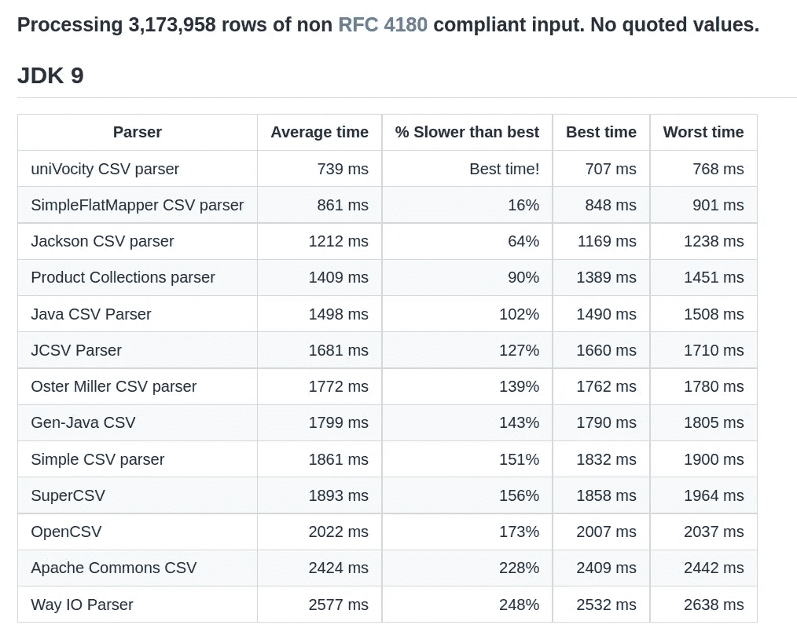
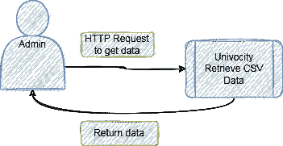

# 使用 Univocity 解析器 Java 库快速灵活地解析 CSV

> 原文：<https://betterprogramming.pub/fast-and-flexible-csv-parsing-using-univocity-parsers-java-library-94f765ac8e20>

## Spring Boot 演示项目中的大学解析器介绍


照片由 [Guillaume Jaillet](https://unsplash.com/@i_am_g?utm_source=medium&utm_medium=referral) 在 [Unsplash](https://unsplash.com?utm_source=medium&utm_medium=referral) 上拍摄

[Univocity Parsers](https://github.com/uniVocity/univocity-parsers) 是一个用 Java 编写的文件解析器库。它的性能令人难以置信，并为数据处理提供了一个方便的接口。据统计，它是最快的 CSV 解析器:



来源于[https://github.com/uniVocity/csv-parsers-comparison](https://github.com/uniVocity/csv-parsers-comparison)

使用一个库来代替构建自定义的解析器是很方便的。但是这个库也为开发新的解析器提供了一个坚实的框架。

在本教程中，我将向您展示如何使用 Univocity 解析器库从 CSV 文件中检索信息。我将用一个简单但实用的用例在 Spring Boot 项目中演示它的用法。

我们开始吧！

# 演示项目

作为开发人员，解析 CSV 文件并基于数据输出执行各种操作是一项常见的任务。让我们假设您在一个 CSV 文件中存储了几个服务配置属性。作为管理员用户，您希望通过 REST 端点检索服务数据。

以下是流程概述:



演示应用流程概述

## 添加依赖项

我通过[https://start.spring.io/](https://start.spring.io/)创建了一个简单的 Sprint Boot 项目。让我们添加本演示的依赖项:

## 创建数据

让我们用以下逗号分隔的记录创建一个名为`data.csv`的文件:

```
SERVICE_ID,SERVICE_NAME,SERVICE_CASE,SERVICE_CLIENT
1,SERVICE1,TEST1,CLIENT1
2,SERVICE2,TEST2,CLIENT2
12,SERVICE12,TEST12,CLIENT21
```

这个文件就像一个数据库，我们将查询它的信息。

*注意该库还可以解析不同格式的文件，例如 TSV。*

## 创建 DTO 类

让我们创建一个保存数据的 Java 类。它看起来是这样的:

*   `@Data` Lombok 注释消除了样板代码(Getters、Setters 等。).
*   来自大学的`@Parsed`注释类似于来自 Java Persistence 的`@Column`注释。它对应于我们的 CSV 文件中的列名。

## 添加服务

让我们添加一个服务来处理记录:

这类似于使用 Spring JPA 从数据库中查询数据。但是我们不想在每次收到请求时都读取 CSV 文件。该服务将充当缓存。

*   我们用 CSV 文件中的数据填充`dataMap`。这是我们的储藏室。
*   `@PostConstruct`注释保证 bean 将被完全初始化，我们可以使用必要的依赖项。
*   方法从`resources`文件夹中读取文件。
*   我们为`[CsvParser](http://docs.univocity.com/parser/html/2.1.0/com/univocity/parsers/csv/CsvParser.html)`定义了一个`[CsvParserSettings](http://docs.univocity.com/parser/html/2.1.0/com/univocity/parsers/csv/CsvParserSettings.html)`配置类。
*   我们添加了一个`[BeanListProcessor](http://docs.univocity.com/parsers/2.7.2/index.html?com/univocity/parsers/common/processor/BeanProcessor.html)`,将解析后的输入生成的所有 Java 对象存储到一个列表中。这样，我们将使用`Getters`轻松访问数据。
*   注意，我们还指示`CsvParserSettings`使用`selectFields`方法选择特定字段。这意味着我们不会加载我们不需要的字段。这也加快了进程。
*   `getDataById`和`getAllData`方法类似于 JPA 存储库方法。

## 添加休息控制器

现在，让我们添加一个 Rest 控制器来检索数据:

我们将使用 GET 请求来相应地检索数据。

## 测试应用程序

考验的时候到了！

在终端或浏览器中，执行以下 GET 请求:

```
[http://localhost:8080/getAll](http://localhost:8080/getAll)
```

您应该会看到这样的响应:

服务响应

注意`serviceClient`已经被忽略。

让我们尝试通过 id 来检索服务名:

```
GET [http://localhost:8080/getServiceCaseById?id=2](http://localhost:8080/getServiceCaseById?id=2)
```

回应:

```
TEST2
```

太好了！它像预期的那样工作。

# 结论

在本教程中，您学习了如何使用 Univocity Parsers Java 库读取 CSV 文件并轻松操作数据。

这个库很健壮，提供了更多的选项，比如 CSV 编写、自定义解析器设置等。要了解所有支持功能的更多信息，请访问[文档](https://github.com/uniVocity/univocity-parsers)。

这个演示的源代码可以在我的 [GitHub 库](https://github.com/kirshiyin89/univocity-parsers-spring-boot-demo)中找到。

如果你喜欢这篇文章，你可能也会喜欢我的另一篇 Spring Boot/CSV 相关的文章:

[](/kafka-streams-how-to-process-a-csv-file-to-perform-calculations-173758da117d) [## Kafka Streams:如何处理 CSV 文件以执行计算

### 处理一个大的 CSV 文件，并根据历史天气记录计算日平均温度

better 编程. pub](/kafka-streams-how-to-process-a-csv-file-to-perform-calculations-173758da117d) 

感谢您的阅读，祝您编码愉快！