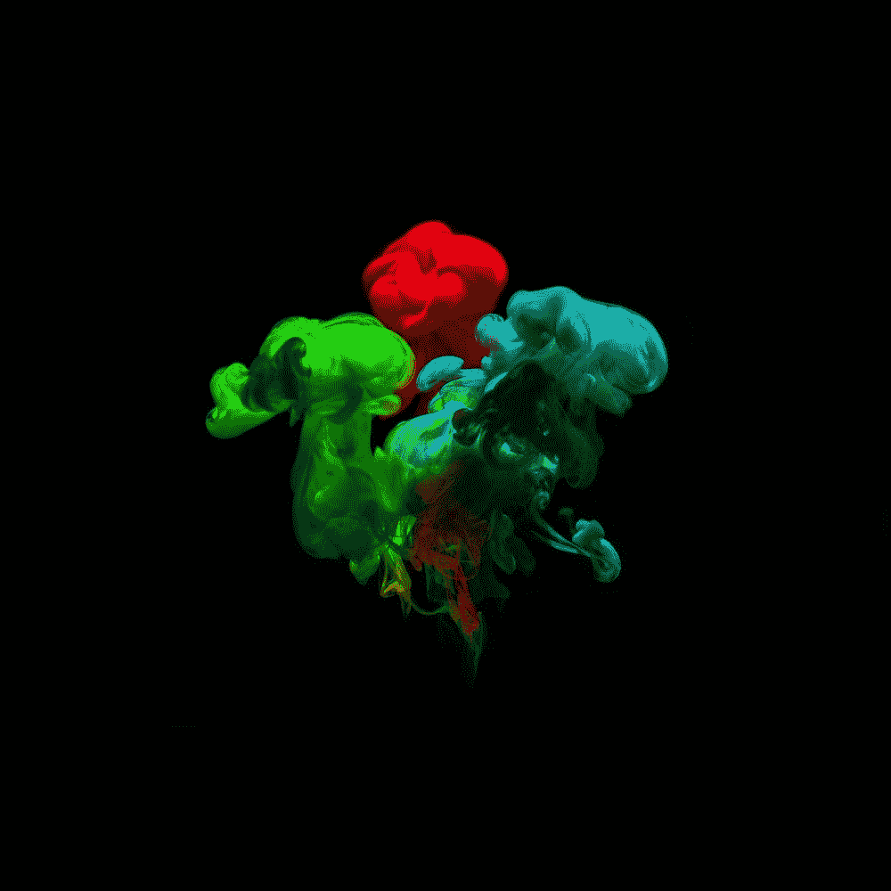

# 基于 Halide 的 Android 快速图像处理

> 原文：<https://betterprogramming.pub/fast-image-processing-in-android-with-halide-53cf8f5fda65>

## 我曾经写过 Halide 如何让我们编写快速且可维护的代码。这一款将在 Android 应用程序中展示其威力。


由[丹·史沫特莱](https://unsplash.com/@nadyeldems)在 [Unsplash](https://unsplash.com/photos/76YvNs5gzLM) 上拍摄。

Halide 是一种开源的领域特定语言，旨在使在现代机器上编写和维护高性能图像处理或数组处理代码变得更加容易。

我一直在写一个关于卤化物的系列，这篇文章是这个系列的第三篇。在前两篇文章中，我谈到了

*   [第 2 部分——理解 Halide 编程语言的一般概念](/write-fast-and-maintainable-code-with-halide-the-general-concepts-4d865466bb8c)
*   [第 1 部分——用 Halide 编写快速且可维护的代码——试播集](/write-fast-and-maintainable-code-with-halide-part-1-6a5c3a519250)

在这篇文章中，我将讲述如何在 Android 上使用 Halide，以及它能给我们带来什么样的性能提升。

为了展示性能优势，我将重用`YUV`到`RGB`颜色格式转换的问题陈述。我过去写过几篇文章，用这个例子展示了在 Android 中进行图像处理的不同方法。

> 免责声明:本文中的任何观点都是我个人的观点，并不反映我所工作的组织的观点或立场。
> 
> 我在谷歌的[相机中开发 HDR 模式和夜间模式等功能。这是一个困难的问题陈述——我们需要在资源受限的设备上用复杂的算法处理高分辨率图像。这才是 Halide 真正发光的地方！](https://developers.google.com/camera)

# 问题陈述:YUV 到 RGB 转换

如果你纯粹是对学习如何在 Android 上使用 Halide 感兴趣，你可以跳过这一小节。



Kir Simakov 在 [Unsplash](https://unsplash.com/photos/wl6YjDpm8UQ) 上拍摄的照片。

问题陈述是将一个 8MP(800 万像素= ~ 8，000，000 像素)图像转换为一种称为 [YUV_420_888](https://developer.android.com/reference/android/graphics/ImageFormat#YUV_420_888) 的特定格式，该格式具有一个平面`Y`通道和两个半平面子采样`UV`通道，该格式通常由 Android 中的[位图](https://developer.android.com/reference/android/graphics/Bitmap)支持。你可以在维基百科上阅读更多关于 [YUV 格式的内容。此外，下面的文章对问题陈述有更好的描述。](https://en.wikipedia.org/wiki/YUV)

我之所以选择这个作为问题陈述，是因为`YUV_420_888`是 Android 相机 API 支持的最常见的输出格式之一，并且图像通常在 Android 中作为`Bitmap`使用——因此这是一个需要解决的相当常见的问题陈述。

我一直在试验不同框架/技术的性能，以了解它们如何在 Android 上执行图像处理算法。我用了同样的问题陈述来相互比较。这里有一些我测试过的使用其他技术的例子

*   [使用 Android 中的原生代码快速处理图像](/processing-images-fast-with-native-code-in-android-db8b21001fa9)
*   [如何使用 RenderScript 将 YUV_420_888 YUV 图像转换为位图](https://medium.com/computational-photography/fast-image-processing-in-android-with-renderscript-4bc6992ba48e)
*   [使用多线程技术加快 Android Java 中的图像处理速度](https://blog.minhazav.dev/faster-image-processing-in-android-java-using-multi-threading/)

我通过在像素 4A 设备上运行，用上面列出的不同解决方案为问题陈述记录了以下数字

到目前为止，基于`RenderScript`的方法被认为是最快的。但是，从 Android 12 开始，RenderScript 已被弃用。你可以在这里阅读更多相关信息[。开发团队分享了一些替代方案，这些方案有望在新硬件上获得更好的性能。](https://developer.android.com/guide/topics/renderscript/migrate)

在下一节中，我将分享针对这个问题的基于卤化物的解决方案，然后查看使用这种方法的基准测试结果。

# YUV 到 ARGB 一代的卤化物代码

正如在[上一篇文章](/write-fast-and-maintainable-code-with-halide-part-1-6a5c3a519250)中提到的，Halide 允许我们将算法从调度中分离出来。所以首先让我们看看 YUV 到 RGB 转换的算法。

在这种情况下，我们将假设输入图像格式为 [YUV_420_888](https://developer.android.com/reference/android/graphics/ImageFormat#YUV_420_888) 。这种图像格式的一些关键方面是

亮度通道(Y 通道)是全分辨率平面通道。

*   这意味着 Y 平面保证不会与 U/V 平面交错。

色度通道(UV 通道)是二次采样，可以交错。

*   通过二次采样，这意味着四个 Y 像素对应一个 UV 像素。
*   通过交错，这意味着 UV 数据可以在图像的每一行以`UVUVUVUVUVUV`模式打包在存储器中。

在到目前为止的示例中，`ARGB`输出具有每个通道(`R`或`G`或`B`或`A = alpha`)，其中`uint8`数据存储在单个`int32`值中。我们会继续做同样的事情。

# 该算法

卤化物发生器可能看起来像这样

用于 YUV 到 RGB 颜色转换的卤化物发生器

# 时间表

在 Halide 中，如果我们不写任何显式的时间表，一切都是内联计算的。编写时间表通常涉及卤化物、目标硬件和某种程度的反复试验的专业知识。在我看来，第一步应该是编写基准并在目标硬件上运行。为此，您可以在 [google/benchmark](https://github.com/google/benchmark) 使用开源基准框架。

让我们从第一个日程表开始

## 默认计划

YUV 到 RGB 卤化物的默认时间表

这将内联完成所有计算，即在每个像素的两个 for 循环内。

在像素 4A 上运行它，我得到了上面提到的生成器的以下结果。

这个数字类似于我们用标准本机代码得到的数字。但是我对卤化物能挤出的数字有更高的期望。

## 分割、并行化和矢量化

要了解关于这些原语的更多信息，您可以阅读本系列的第 2 篇文章— [了解 Halide 编程语言的一般概念](/write-fast-and-maintainable-code-with-halide-the-general-concepts-4d865466bb8c)。

YUV 到 RGB 卤化物的优化时间表

该调度将循环分割成更多部分，对`xi`循环中的指令进行矢量化，并对`y`循环进行并行化。让我们看看基准测试的结果

> *嘣！你看到默认时间表的疯狂加速了吗？*

可能会有进一步的优化，比如减少计算`uv_centered`的次数，或者尝试不同的分裂因子，但到目前为止看起来还不错。

# 用 Android 包装这个卤化物生成方法

上述生成器将生成一个 C++方法，如下所示

YUV 转 RGB 卤化物发生器的生成方法

可以直接从`C++`库或 JNI 代码中使用。

> 将来，如果需要的话，我会写关于如何在 Android studio 中设置 Halide 并端到端使用它。LMK，如果这将有助于超过评论。

为了将所有东西连接在一起，我们需要将整个端到端的管道连接起来，这意味着

```
Java --> JNI --> Halide --> Java --> Bitmap
```

这导致了`~28ms`的整体延迟。所以如果我们看看目前为止考虑过不同方法的结果

最新结果表明，与现有结果相比，卤化物的实施是最快的和最新的。

> 这给了我们高性能+易于维护的代码！一个工程团队还想要什么？
> 
> 对于这个问题，我找到了另一个更快的解决方案(大约 12 毫秒的延迟)，但需要硬件特定的实现(利用 NEON 固有的)和处理并行化等等。它不容易编写或维护，但绝对值得以后发表一篇文章。

# 结论和结束语

> 写非常高效代码的人说他们花在优化代码上的时间至少是写代码的两倍。
> 
> *—互联网上的某个人*

Halide 使尝试和调整不同的时间表变得更加容易。比手动改变循环顺序、分割逻辑、线程等更容易。并且消除了编写和维护 ABI 特有的矢量化代码的痛苦。

> 像 Halide、自动矢量化 C++代码这样的方法是可移植的，并且更容易维护。

*   与显式手动调整的 CPU 特定代码相比

> 在优化之前，请始终考虑您的用例

*   示例—库开发人员与应用程序开发人员
*   了解真正的瓶颈，比如如果完全运行需要 2s，在`28 ms`和`12 ms` 之间进行优化可能不会带来巨大的优势。

如果您的应用程序对性能至关重要:基准测试→分解→优化(重复)

# 参考

*   [卤化物—halide-lang.org](https://halide-lang.org/)
*   [卤化物教程](https://halide-lang.org/tutorials/tutorial_introduction.html)

## 系列文章

*   [第 2 部分——理解 Halide 编程语言的一般概念](/write-fast-and-maintainable-code-with-halide-the-general-concepts-4d865466bb8c)
*   [第一部分——用 Halide 编写快速且可维护的代码——试播集](/write-fast-and-maintainable-code-with-halide-part-1-6a5c3a519250)

## 我的一些相关文章

*   [用安卓原生代码快速处理图像](/processing-images-fast-with-native-code-in-android-db8b21001fa9)
*   [如何使用 RenderScript 将 YUV_420_888 YUV 图像转换成位图](https://medium.com/computational-photography/fast-image-processing-in-android-with-renderscript-4bc6992ba48e)
*   [使用多线程技术加快 Android Java 中的图像处理速度](https://blog.minhazav.dev/faster-image-processing-in-android-java-using-multi-threading/)

```
**Want to Connect?**This article was originally published at [blog.minhazav.dev](https://blog.minhazav.dev/fast-and-maintanable-image-processing-in-android-with-halide-part-3/).
```