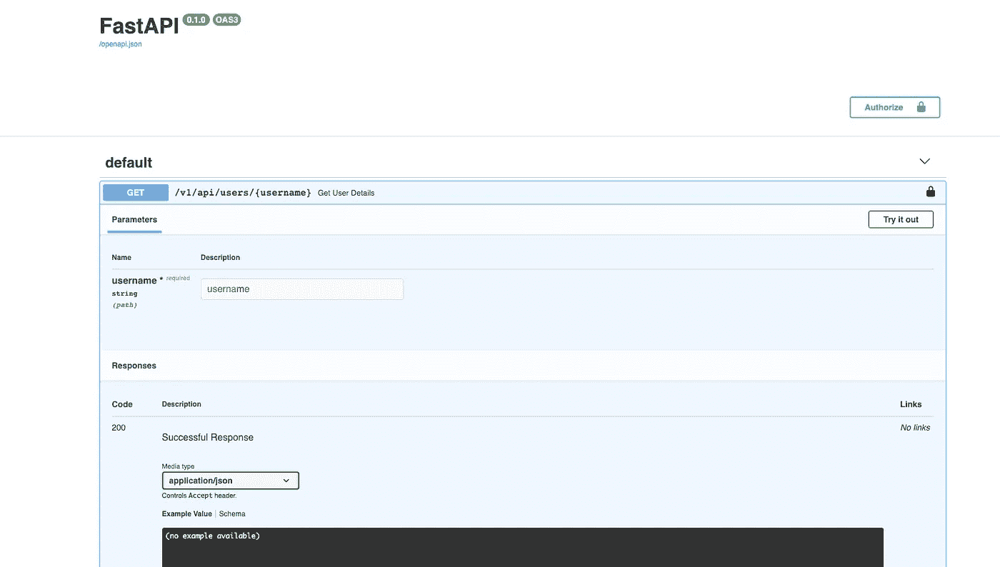

# 使用 FastAPI 在生产中实现更好的机器学习

> 原文：<https://betterprogramming.pub/fastapi-for-better-ml-in-production-358e555d9ca3>

## 快速部署和惊人的卓越性能

克里斯蒂安·恩格梅尔在 [Unsplash](https://unsplash.com?utm_source=medium&utm_medium=referral) 上拍摄的照片。

如今，越来越多的应用程序在其代码中包含一些 ML。

将数据科学/ML 研究人员的工作部署到生产中是一项复杂的任务，耗费了开发人员太多的时间。在本文中，我们将发现如何通过使用 [FastAPI](https://fastapi.tiangolo.com/) 来节省大量的时间和精力。

FastAPI 是由 Sebastián Ramírez 编写的 web 开发框架，构建在 Python 3.6 之上。它为您提供了一种真正快速的方法来将您的 ML 部署到生产环境中——并且具有惊人的出色性能。

让我们来看看为什么你应该开始使用它，为什么它的效果这么好！

首先，FastAPI 包含“快速”一词是有原因的。在性能方面，它可以与 Express (Node)或 Gin (Go)等框架相媲美。除了是 Python 中性能最好的 web 框架之一之外，它还基于 Strattle，Strattle 是构建异步应用程序的理想平台。

“快”的第二个解释是一个友好的库，超级快/很容易开始工作。它有很多内置的功能工具，比如异常、装饰器、测试和认证。下面是一个开发简单 FastAPI 路由的示例:

在这个例子中，我们使用 FastAPI 开发了一个小 API。声明的路径类似于 Flask 框架的路径(使用装饰器)。一个很好的特性是函数声明中的`Query`关键字，它提供了以类似于使用`Body`关键字的方式验证请求参数的能力，我们可以在进入函数之前验证主体请求。

FastAPI 支持 [Pydantic](https://pydantic-docs.helpmanual.io/) ，这是一个类型验证库，它赋予 FastAPI 在本地完美处理类型的能力。

FastAPI 的第二个优点是它对异步操作的本地支持。与 Flash 等其他 web 框架不同，你可以用一个`async`函数来声明你的路线。这背后的大背景是，它与 Python 的事件循环配合得很好，并且载体不会阻塞 Python 程序的主线程。

使用 FastAPI 的异步路由示例:

正如我们在这里看到的，我有一个路由，它提供了来自 DB 的用户详细信息。
让我们假设从数据库获取这些数据是一项会损害性能的密集型操作。在 route 上使用`async`使我能够允许主线程跳过对来自`blocking_io_function`函数的结果的等待，并在需要时等待结果。这样，我就不会浪费计算时间来等待长时间的 I/O 操作来提供结果。

这段代码中更酷的一点是 route 函数中的`Depends`关键字，它声明了在深入研究 route 函数之前要调用的一些前提条件。在这种情况下，我们验证用户凭证，但它也可以是其他任何东西。

使用 FastAPI 的另一个重要方面是提供给我们的自动文档。FastAPI 建立在 OAS(开放 API 规范)之上，OAS 为我们提供了 API 测试选项的完整文档。

以前的代码 API 文档。

那么，为什么 FastAPI 对于在生产中部署 ML 如此之好呢？

*   快速发展。
*   由于 Strattle 及其对异步操作的本机支持，使得 ML 推理任务更快。
*   为您提供 API 的完整文档。
*   高度可维护的库(看看 [GitHub](https://github.com/tiangolo/fastapi) )有很多集成支持，比如认证、测试、GraphQL、WebSockets 等。

感谢阅读！当你在产品中发布你的 ML 时，考虑使用 FastAPI。