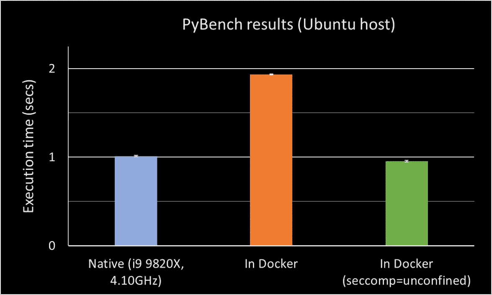
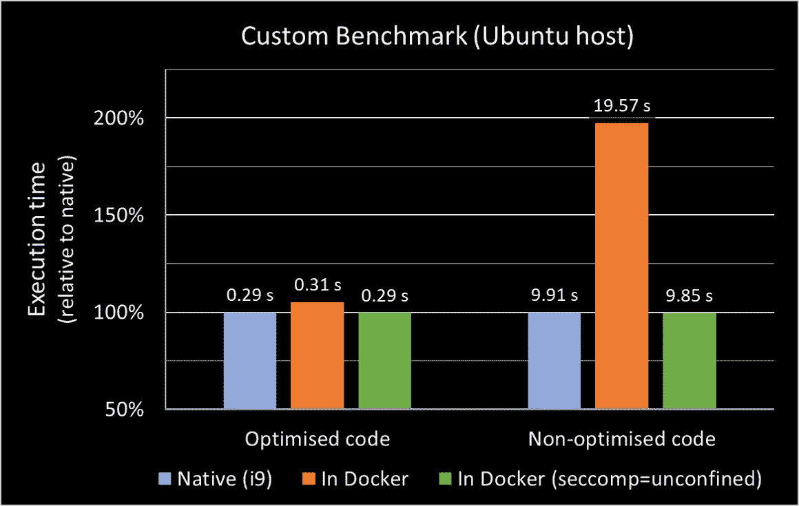

# Docker 中更快的 Python

> 原文：<https://betterprogramming.pub/faster-python-in-docker-d1a71a9b9917>

## 从您的容器中获得最佳性能


TL；DR:通过对您的配置进行一些简单的调整，您可以将 Docker 容器中 Python 代码的执行速度提高到接近本地速度:

*   在 Ubuntu 主机上，Docker 中的基准执行时间大约是本地时间的两倍；这种差异可以通过修改容器的安全设置来消除
*   当运行优化良好的代码时，差异要小得多——而不是带有(不必要的)for 循环的代码
*   在 Windows 主机上，Python 代码在 Docker 中实际上运行得更快，并且容器安全设置似乎不会对执行速度产生太大影响

我测试了一堆配置。最大的好处(就执行速度而言)来自于禁用容器内活动的安全计算配置文件。当然，这涉及到必须考虑的安全问题。当运行不受信任的代码来:

启动容器时，禁用`seccomp`并将其配置文件设置为`unconfined`:

```
--security-opt seccomp=unconfined
```

例如，从这段代码中运行演示容器如下所示:

```
docker run -it --security-opt seccomp=unconfined 4oh4/pi
```

# 介绍

我们最近注意到 Docker 容器中一些计算密集型处理的运行速度低于预期。当然，运行容器的一些开销是可以预期的，但是当它导致明显的速度下降时，我们可能会开始质疑这种便利是否值得。

这在很大程度上归结于安全性。当运行可信工作负载时，我们可以选择通过禁用其中一些保护来获得更好的性能。

## 本文概述

这篇文章写得很好，所以你可以快速浏览。关键要点和方法在顶部，而结果和解释越往下越详细:

1.  使用 Phoronix 测试套件进行性能基准测试
2.  自定义 Python 基准
3.  修改安全计算(`seccomp`)配置文件
4.  其他设置
5.  结论

注意:这篇文章中讨论的一些变化包括关闭功能。但是功能倾向于做一些有用的事情——否则，它们就不会存在。在这种情况下，它们通常与安全相关。在做出大的改变之前，理解其中的含义和权衡，尤其是在处理共享计算资源时。

# 基准绩效

在本文中，我们使用`PyBench`和`Phoronix Test Suite`来测试 Docker 容器内部的性能。`PyBench`混合使用内置函数调用和嵌套 for 循环来模拟典型的计算密集型 Python 应用程序。

有一个现成的 Docker 映像，所以运行基准很简单:

```
$ docker run -it phoronix/pts
Unable to find image ‘phoronix/pts:latest’ locally
latest: Pulling from phoronix/pts
be71862069d7: Downloading 86.1MB/2.3GB
```

一旦容器被实例化，您应该会看到 Phoronix 控制台。要安装并运行基准测试，请键入:

```
benchmark pybench
```

在一些下载和安装之后，测试应该运行，结果应该显示在控制台中:

```
PyBench 2018-02-16:
    pts/pybench-1.1.3
    Test 1 of 1
    Estimated Trial Run Count:    3
    Estimated Time To Completion: 8 Minutes [21:52 UTC]
        Started Run 1 @ 21:45:12
        Started Run 2 @ 21:46:30
        Started Run 3 @ 21:47:49Total For Average Test Times:
        2973
        2972
        2970Average: 2972 Milliseconds
    Deviation: 0.05%
```

结果是完成基准测试的平均时间是 2972 ms——记住，时间越短越好。本文中的基准测试结果是在 4.10GHz (10 核)的英特尔酷睿 i9–9820 x Ubuntu 计算机和 1.6GHz (4 核)的 i5–8265 u Windows 计算机上运行的。

# 本地基准测试

您还可以运行本机基准(在 Docker 容器之外)。在主机上安装相对容易——大多数常见系统都有二进制文件。在 Ubuntu 上，在[安装](https://linuxconfig.org/how-to-install-the-latest-phoronix-test-suite-on-ubuntu-18-04-bionic-beaver)之后，从控制台运行命令:

```
$ phoronix-test-suite benchmark pybench
```

# 自定义 Python 基准

为了确认结果，我还编写了一个定制的基准，使用随机抽样来估计 pi 的值。该基准包含两个实现:

1.  使用`numpy`和矩阵的优化示例
2.  使用 for 循环的懒惰示例(慢得多)

我们将在下面看到，当运行优化良好的代码(比如使用`numpy`)时，一些性能改进带来的好处要小得多。运行基准测试最简单的方法是从 Docker Hub 中提取映像:

```
$ docker run -it 4oh4/pi
```

源代码可以在 GitHub 上找到:

[](https://github.com/4OH4/pi) [## 4OH4/pi

### 使用随机抽样的 Python 估算—基准测试的长期运行流程运行基准测试(矢量化…

github.com](https://github.com/4OH4/pi) 

自定义基准测试的结果是 10 轮的平均时间，每轮是 10 次重复的总执行时间。

该脚本在运行优化的和未优化的代码之间交替，并在最后整理结果。

# 安全计算(seccomp)配置文件

这是我发现影响速度的主要配置选项。

`seccomp`(或安全计算模式)是 Linux 内核中的一个安全设施。它允许将进程限制为运行有限的系统调用子集，从而使运行不受信任的代码更加安全。默认 Docker 配置文件禁用了总共 300 多个系统调用中的大约 44 个。运行容器时，可以使用参数启用/禁用特定调用或删除所有限制:

```
--security-opt seccomp=unconfined
```

对性能的影响非常明显，PyBench 的执行时间恢复到了本机速度:



PyBench 是在 Ubuntu 主机上运行的结果:本机，在 Docker 容器内，具有标准配置，并且安全计算模式不受限制。结果是六次测试的平均值——两轮三次重复——误差线显示了获得的全部结果。

用`seccomp=unconfined`在 Docker 中运行实际上比本地运行稍快，尽管差别很小，并且在误差范围内。

在运行定制基准测试时可以看到类似的结果:使用随机抽样来估计 pi 的值。定制基准包含两个版本的代码:一个使用`numpy`进行优化，另一个使用基本 Python 中的 for 循环。运行优化算法时，使用`seccomp=unconfined`获得的性能收益要小得多:



在 Ubuntu 主机上运行自定义基准(使用随机抽样估计 pi)的结果:10 轮的平均值，每轮是运行 10 次重复的总时间。

然而，当在 Windows 主机上运行时，这种方法没有产生同样的增益。自定义基准在 Docker 容器中实际上运行得更快，并且在运行未优化的代码时，设置`seccomp=unconfined`对执行时间只有很小的影响:


在 Windows 主机上运行自定义基准测试(使用随机抽样估计 pi)的结果:10 轮测试的平均值，每轮测试是运行 10 次重复测试的总时间。

这让我有点吃惊，但这是一种已知的[效应。当在 Windows 主机上运行时，Docker 位于虚拟机之上——这与在 Linux 主机上运行时的架构有很大不同。](https://stackoverflow.com/questions/27335744/docker-speeds-up-python-why)

你可以在这里找到更多关于 T4 和码头工人的信息。

以下两节详细介绍了一些其他配置选项，我尝试了这些选项，但没有发现能够产生任何额外的好处。

# 其他设置

## 表观摩尔

`AppArmor`是一个内核级的安全模块，允许在每个应用程序的基础上设置权限。[默认 Docker 配置文件](https://docs.docker.com/engine/security/apparmor/)提供了适度的安全设置和广泛的兼容性。

我看不出修改这个设置有任何性能上的好处，但是，如果需要，您可以在启动容器时使用`— -security-opt`参数将其配置文件设置为`unconfined`:

```
--security-opt apparmor=unconfined
```

## 特权模式和 Linux 功能

[默认](https://docs.docker.com/engine/reference/run/#runtime-privilege-and-linux-capabilities)，Docker 容器无特权运行。这限制了他们对主机的访问，是一个有用的安全网。赋予容器`privileged`状态就赋予了它一系列的权限。`seccomp`(见上)也被有效禁用，所以它给出了类似的加速。要授予`privileged`状态，请在运行容器时设置参数:

```
docker run -it --privileged=true 4oh4/pi
```

然而，我没有看到运行`privileged`比运行`seccomp=unconfined`有任何进一步的性能提升。所以避开它——除非你有其他用途。

还有向容器添加/移除 Linux 功能的选项。有些是默认启用的。有些是禁用的，可以添加(全部添加:`--cap-add All`)。然而，我没有看到这样做有任何性能上的好处。

# 结束语

在 Linux 主机上运行时，修改 Docker 容器的安全计算配置会对性能产生显著影响。与许多事情一样，这实际上是速度和安全性之间的权衡。

PyBench 结果反映了典型的应用程序性能，其中有许多程序分支和循环。

这里的性能提升相当大。经过优化的计算密集型工作负载(例如，使用专用库，如`numpy`)已经比未经优化的同类产品运行得更快。修改后的`seccomp`概要文件的性能增益要低得多。对您的工作负载的影响可能介于两者之间，这取决于操作的类型及其实现方式。

在 Windows 主机上运行没有提供同样的性能改进。这可能与架构的不同有关，容器位于 Docker 虚拟机之上。在 Linux 主机上，容器和主机之间可以有更多的交互。

[](https://medium.com/@rupertt/docker-desktop-2-2-for-windows-whats-new-317ec27f6c9d) [## Docker 桌面 2.2 Windows 版—有什么新功能？

### WSL 2 后端选项和 GUI 仪表板优先考虑可用性

medium.com](https://medium.com/@rupertt/docker-desktop-2-2-for-windows-whats-new-317ec27f6c9d) 

# 进一步阅读

[Luc jug gery:" Docker&AppArmor 30.000 英尺视图"](https://medium.com/lucjuggery/docker-apparmor-30-000-foot-view-60c5a5deb7b)

[“码头工人的外观安全配置文件](https://docs.docker.com/engine/security/apparmor/)

[玩转 Docker 课堂:“安全实验室:sec comp”](https://training.play-with-docker.com/security-seccomp/)

[open benchmark . org:" py bench[pts/py bench]"](https://openbenchmarking.org/test/pts/pybench)

[凯文·佩奇:“EC2 上 Docker 容器可能变慢的另一个原因:clock_gettime、gettimeofday 和 seccomp”](https://medium.com/appian-engineering/yet-another-reason-your-docker-containers-may-be-slow-on-ec2-clock-gettime-gettimeofday-and-9d92f6892048)

[“为什么 Python 这么慢？](https://hackernoon.com/why-is-python-so-slow-e5074b6fe55b)

[“Docker 性能改进:提示和技巧](https://stackify.com/docker-performance-improvement-tips-and-tricks/)”