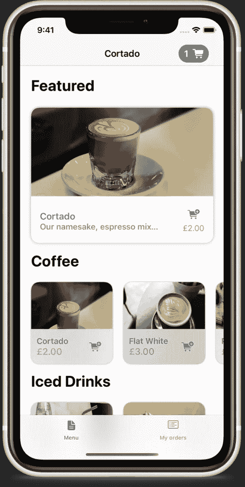
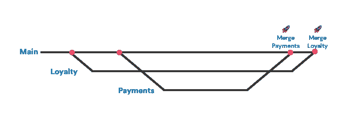
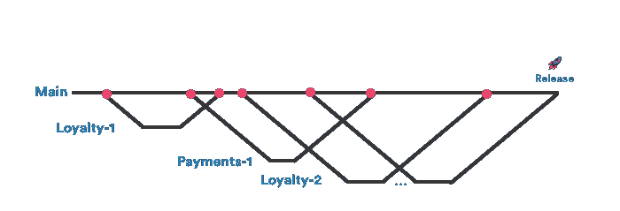
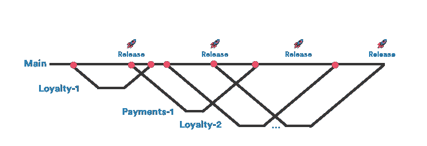
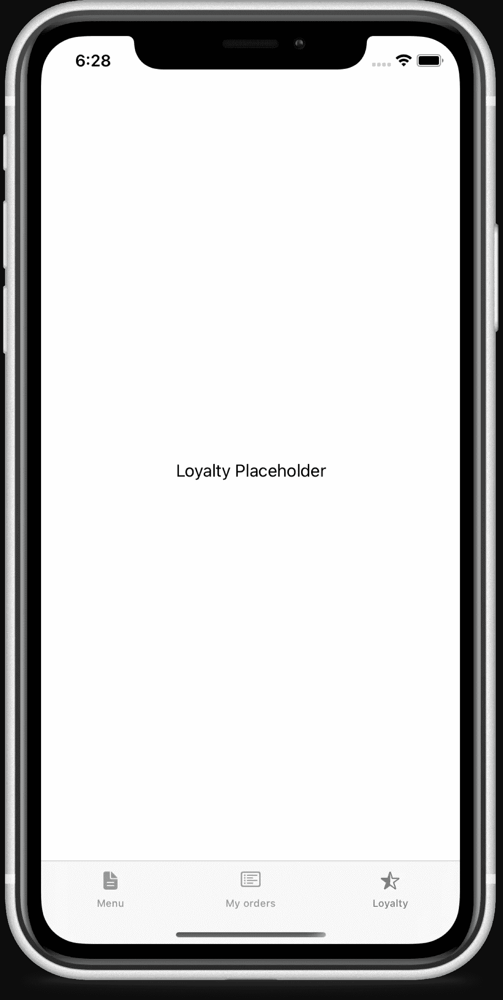
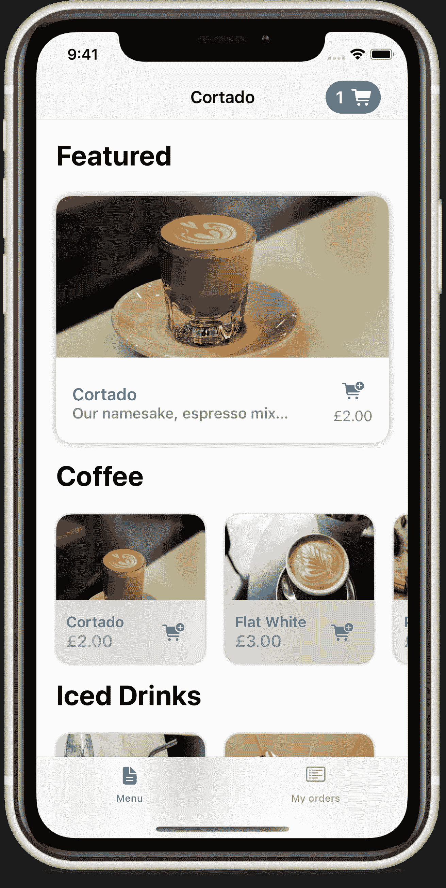

# 面向 iOS 开发者的功能标志

> 原文：<https://betterprogramming.pub/feature-flags-5ff6be0a4568>

SpaceX 在 [Unsplash](https://unsplash.com/s/photos/launch-app?utm_source=unsplash&utm_medium=referral&utm_content=creditCopyText) 上拍摄的

当构建现代应用程序时，事情往往进展得相当快。当你在你的团队中加入多个开发人员时，事情才真正开始进行。有了足够多的开发人员，你会发现你有很多正在开发的东西，还没有准备好投入生产。你如何让开发人员以最高效的速度工作，同时让你的应用程序保持可发布的状态？

输入功能标志。

您以前应该听说过功能标志这个术语。

这里，我指的是将一个特性(及其所有代码)隐藏在一个可以在应用构建中启用的标志后面的过程。您可以选择允许开发人员或测试人员在运行时调整这些特性，但是重要的是，您可以对那些还没有准备好投入生产的特性做出让步。

当您这样做时，您可以让开发人员在他们的代码中进行合并，而无需处理持久的特性分支，也不会对实际产品造成任何更改。这允许你让你的主分支作为一个不断发展的，可发布的代码快照。

让我们来看一个例子。

## 例子

这里我们有一个叫 Cortado 的应用。我们有一个基本菜单和一个我的订单屏幕，我们的产品所有者要求我们添加一个带有虚拟奖励卡的忠诚度屏幕。这将需要添加一个全新的选项卡，以及其他地方的一些小的附加功能，如链接到奖励卡的我的订单屏幕。

SwiftUI 咖啡应用程序

这个特性需要一点时间来构建，它将在接下来的步骤中被分块(可能会被再分块)，以确保每个人都有事情做，并且工作可以通过看板持续进行。

*   添加新选项卡
*   将奖励卡 UI 添加到新页面
*   将最近订单列表添加到新页面
*   在“我的订单”页面顶部添加迷你奖励卡

这项工作将继续进行，而另一个团队正在建立一个新的支付功能，将对支付和订单屏幕进行更改。他们将在我们工作时开始，并在我们之前完成。

我们可以用几种方法来管理这里的分支机构，它们都有一些缺点。在这篇文章的结尾，我们会有一个很好的中间地带，应该让产品和技术满意。

**选项 1:特性分支** 第一个解决方案，是拥有两个团队工作的持久特性分支。这意味着工作是完全分开的，两组代码第一次相遇就是第二次合并。

当我们这样做的时候，main 总是准备好发布，并且可以很容易地应用补丁。如果一切按计划进行，每枚火箭都代表着一次有意义的释放。

这里有一些问题我们需要考虑:

*   集成测试只能在忠诚度分支机构合并完成时进行，任何发现的问题都会延迟该功能的推出。
*   就主要分支而言，支付分支将领先于忠诚度分支，因此它可能具有忠诚度分支不知道的各种特性。
*   应用于 main 的任何错误修复都是两个分支冲突的潜在来源，冲突解决可能需要大量时间——尤其是对于 iOS xcodeproject。
*   如果在支付功能中发现了错误，他们将延迟创建带有忠诚度的构建的能力，这是另一种延迟发布的可能方式。

**选项 2:短期分行**

另一个解决方案是，从主分支分出小的、单一的任务分支，这些分支不会持续很长时间。这有助于保持强劲的步伐，但扼杀了随时发布的能力。

在这里，你可以看到我们有许多不同的分支，更经常地融合在一起。这为更频繁的集成测试打开了大门，使发现 bug 变得更容易，并阻止了巨大的冲突——尽管没有完全消除它们。

这一次，要考虑的问题少了，但它们仍然存在:

*   在功能完成之前，不能发布 main。如果你必须修复一个 bug，你必须在这项工作开始之前从 main 分支，然后在稍后将它合并回来。
*   main 中的代码处于一种潜在的不稳定状态，而且它肯定是未完成的。我们的示例第一个任务将在第一次合并时创建一个空的忠诚度选项卡。
*   许多小分支可能意味着许多小冲突。
*   遵循一个精炼的过程，每个单独的合并将需要单独的代码审查，这可能会降低开发人员的速度。

**选项 3:带有特征标志的短命分支**

使用之前完全相同的方法，这里我们要做一点小小的改变。每个特性的第一个任务是添加一个特性标志，当我们运行构建时可以打开和关闭它。这意味着从那一点开始，主分支将表现得好像这些特性没有被开发，尽管他们的代码处于休眠状态。

你也获得了一点额外的能力——如果你发布了一个特性，而你不喜欢它，你可以直接关闭它。

这里仍然有一些风险，但很少:

*   虽然这段代码处于休眠状态，但它仍然存在，并可能导致问题。这需要在代码审查中有好的眼光，以避免发布部分完成的特性。
*   你必须记得整理这些标志，否则你会遇到打开多个标志只看到一个特征的情况。
*   有时候一个特性标志是不切实际的，特别是当你在故事板中做一些事情的时候，这意味着即使当这个特性被关闭的时候，你也可能会看到一些新的东西。

如果我们选择选项 3，只要我们添加了这些特性标志，我们就可以同时与两个团队合作。两个团队都出发了，构建他们的特性，当他们将一个构建发送给一个测试人员时，他们只是打开他们的特性。当工作开始对我们的一些次要功能，如在我的订单屏幕上的迷你忠诚度用户界面，可以在自己的功能标志。

如果需要任何修复或紧急发布，无论这两个特性处于什么状态，都可以放心地完成。

## 履行

特性标志可以而且应该简单地从一开始就构建。您可以在以后用前面提到的运行时定制之类的东西来扩展这些，但这并不是一开始就需要的。

在这个例子中，我们将使用 Swift，但是您可以在 Kotlin、Javascript、Dart 或其他平台上轻松复制它。

我们只有一个特性列表和一个启用或禁用它们的基本开关。默认为 false 会创建一个安全第一的情况，这将有助于防止那些没有准备好的特性偷偷进入您的下一个版本。扩展这一点的一个好方法是将值存储在用户默认值、核心数据中，或者甚至使它们在。xcconfig 文件，这样您就可以为每个特性设定目标。

## 使用特征标志

拥有特征标志仅仅是开始。现在，我们实际上必须使用它。

特性标志往往会很快暴露出意大利面条式的代码，因为你会注意到这些`if Feature.loyalty.isEnabled`分散在你的代码库中。如果这种情况开始发生，那么在你开始添加这些代码之前，考虑进行重构来解耦你的代码。

我们将在这里看三个不同的例子，SwiftUI 中的视图、ViewModel 和 UIKit 视图。

SwiftUI
SwiftUI 的视图构建器似乎就是为这些而生的。现在，您可以在视图代码中使用控制流，并根据启用的标志添加视图。

这是我们在拥有特性标志和新代码之前的视图。

现在，让我们添加我们的功能标志。我们所要做的就是确保添加@ViewBuilder 属性，并为我们的忠诚度功能添加一个快速 if 语句。

这增加了我们的新特性，并在一个 if 语句中为我们展示了新的视图。

如果我们进入我们的特征文件，并进行以下更改:

运行我们的应用程序时，我们会看到以下内容。

我们的新功能完全没有任何痕迹，我们可以在看不见标签的情况下发布我们的应用程序——太棒了！

**视图模型
如果你不使用 MVVM，可以跳过这一部分。**

这里我们需要采取几个步骤来确保我们可以在视图模型中正确地使用特性标志。第一，为我们的视图模型提取一个协议。我们将要使用的示例获取订单列表，并将在此之后扩展以获取用户戳。

提取协议很容易。通过这样做，我们可以改变视图引用的类型，并根据我们所处的状态注入不同的视图模型。如果你正在构建一个你知道会使用特性标志的应用程序，一个好的方法是从一开始就构建这种协议驱动的方式。

现在我们已经完成了小的重构，我们可以构建新的视图模型，它有一些额外的小属性。

在这里，我们已经能够将额外的特性隐藏在特性标志和类型检查之后。这意味着在一个更高层次的视图中，我们可以注入正确的视图模型，并确保特征标志设置正确。当这个特性最终发布时，我们可以将属性添加到协议中，只使用我们的新视图模型，并删除 if 语句中的两个检查——太棒了！

我在功能标志上遇到过几次的事情是，当你有一个故事板时，它们往往会分崩离析。你不能改变故事板并把它藏在一个特性标志后面，所以你必须做出妥协:

*   添加用户界面，并确保在代码中关闭它——这很容易忘记
*   通过将 UI 添加到代码中来改变它——创建一个程序设计和界面构建器设计的混合体
*   接受这样的事实，即使关闭了某个特性，某些用户界面也会有所不同——这种情况会发生在一个特性中，在这个特性中，你不仅仅是添加了一些东西，你还重建了现有的用户界面

我的解决方案是为我的视图控制器使用笔尖。这有很多优点(我们不会在这里深入讨论),但最大的一个优点是能够为给定的视图控制器编程选择您想要的笔尖。这允许您为同一个视图控制器拥有两个笔尖，或者简单地呈现一个完全不同的笔尖。让我们看看代码中的这些选项。

下面是用代码展示 nib 支持的视图控制器的典型方式。

现在，让我们看两种不同的方法，我们可以使用我们的功能标志来改变这段代码。第一个选择是简单地改变我们初始化器中的笔尖来使用不同的用户界面。

第二种方法，是把这个责任交给我们的协调员或呈现视图控制器，这可能是正确的做法，因为视图不应该决定它显示的是新版本还是旧版本。

在这两个例子中，我们已经设法消除了创建整个第二视图控制器的需要，只需要一个单独的 UI 文件来支持新的 UI。这允许旧的用户界面保持完整无缺。

# 结论

功能标志是一个强大的工具，可以帮助增强对产品的信心。无论你用什么技术来构建你的应用程序，都有一种方法来获得特性标志。我们已经讨论了一些高级用法，比如允许用户在运行时更改它们，或者使用 xcconfigs，一旦将它们集成到开发过程中，这些都是很好的补充。

一旦你适应了，你甚至可以看看延长这些。如果这个问题的答案来自于一个 web 服务，或者您给它们添加了 A/B 测试功能，那会怎么样呢？

机会很多，试一试吧。