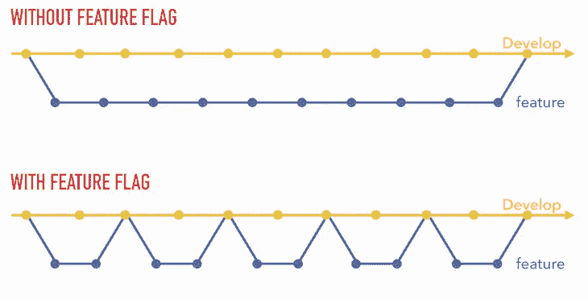

# 特征标志和如何快速迭代

> 原文：<https://betterprogramming.pub/feature-flags-and-how-to-iterate-quickly-7e3371b9986>

## 为什么你的第一个大型功能公关应该是它的功能标志

照片由 [Yogesh Pedamkar](https://unsplash.com/@yogesh_7?utm_source=medium&utm_medium=referral) 在 [Unsplash](https://unsplash.com?utm_source=medium&utm_medium=referral) 上拍摄

*特性标志*(也称为*特性切换*或*特性翻转*)是一项正在开发的技术，它允许您在不部署任何代码的情况下启用或禁用一项特性。

这背后的逻辑是部署一个条件特性，您一次只能为某些用户组激活该特性。如果标志为`on`，则执行代码；如果`off`，代码被跳过。

这是开发运营中的一个很好的实践，它允许您在生产中直接测试您的特性。

# 它是如何工作的

这真的很简单:您有一个中央配置文件或系统来存储您的标志。

当您在代码中部署一个新特性时，您向这个中央配置添加一个询问，以了解这个特定用户是否应该允许这个特性。如果是，标志为`on`，用户可以看到该功能。如果`off`，用户使用没有新功能的应用。

有大量的框架和产品可以帮助你做到这一点。

你永远不要忘记的一件事是，当你想让每个人都可以使用你的功能时，要去掉你的标志。

# 功能标志用例

有几个使用特性标志的用例。我会试着给你一些建议来帮助你理解为什么这是一个很棒的练习。

## 快速合并您的代码，快速部署

是的，当您使用标志时，您可以更快地合并您的代码，因为您不必等到您的代码完全完善后再将其交付给生产。
MVP 可以被合并，因为这段代码将被跳过，直到你将你的标志设置为`on`。

所以你的发布周期会是这样的:

图片由作者提供

正如您所看到的，您可以迭代您的功能以使其完善，并且您部署小的更改，这是更安全的。特性标志将特性生命周期管理从代码部署中分离出来，解放了工程团队，让他们可以从事其他任务。

## 生产中的测试

有时你没有所有的数据在你的非生产环境中测试*(即使你应该总是在非生产环境中测试)*。使用功能标志，您只需为您的 QA 团队(或您的产品经理)激活您的标志，这样他们就可以用真实数据在您的生产中测试该功能。

这将风险降至最低，因为新特性只针对一小部分用户，所以它不会改变应用程序对其他用户的工作方式。

最后一点是，你不需要成为一个工程师来启用/禁用一个特性，所以你的特性工作流不会被你的开发资源阻塞，可以被你的产品团队管理。

## A/B 测试

开发人员可以对一部分用户使用特性标志来实现 [A/B 测试](https://en.wikipedia.org/wiki/A/B_testing)，让你看到两个版本之间的性能对比。

它允许你锁定特定的用户，并且只向这些用户提供这个特性。

## 渐进部署

关于特性标志的另一个伟大的事情是渐进部署，你可以向 10%的用户推广你的特性，看看会发生什么。如果一切正常，您可以逐步增加数量，直到 100%的用户都在使用新功能。

每次您增加使用百分比时，您都应该监控您的功能，并检查一切是否按预期运行。

## 测试版

有时候，客户可能会流失，因为你的产品缺少一些东西，但你已经在做了。

在这种情况下，功能标志可以帮助您让他们提前访问您的功能，并帮助他们了解您正在满足他们的需求。

另一个很棒的事情是你会有早期反馈，我们都知道早期反馈比后期反馈花费少。

## 快速回滚

使用特性标志启用或禁用一个特性就像切换它`on`或`off`一样简单，或者编辑一个配置文件，而不必重新部署和经历冗长的代码推送。

如果你在你的特性中发现了一个 bug，你只需要把你的标志放到`off`中，代码就会立即失效。之后，你可以花时间来纠正你的 bug 并部署补丁。

# 结论

正如我们所看到的，在很多用例中，特性标志是您最好的朋友。使用功能标志后，您会看到它允许您迭代您的功能并获得快速反馈，这允许您更有效率并专注于重要的事情。