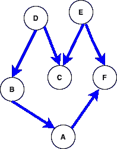
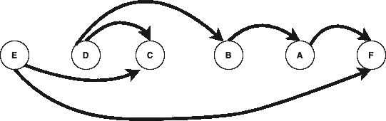

# Python 3.9 测试版中的新特性

> 原文：<https://betterprogramming.pub/features-in-python-3-9-beta-cd33790cea6b>

## 了解 Python 的未来


Python 3.9 测试版已经发布，商店中有一些新的模块和改进的功能需要寻找和实现。让我们安装新版本，然后看看一些模块和功能的工作情况。

# **安装 Python 3.9 测试版**

按照您的操作系统的安装过程，从官方网站安装最新版本。

# **新模块**

最新版本中增加了两个新模块:

*   `zoneinfo`

```
from zoneinfo import ZoneInfo
from datetime import datetime, timedelta
# IANA time zone support>>> dt = datetime(2020, 12, 31, 12, tzinfo=ZoneInfo(“Asia/Kolkata”))
>>> dt.tzname()
‘IST’
```

*   `graphlib`

`graphlib`提供对可散列节点图进行拓扑排序的功能。

拓扑排序是指给定的有向图 G=(V，E)，求顶点的线性排序使得对于 E 中所有边(V，w)，v-> w 从顶点 V 到顶点 w，顶点 V 在排序中先于顶点 w。

我试图在下图中解释拓扑排序是如何完成的:



图表



拓扑排序

```
**>>>** importgraphlib
>>> from graphlib import TopologicalSorter
**>>>** graph = {'E': {'C', 'F'}, 'D': {'B', 'C'}, 'B': {'A'}, 'A': {'F'}}
**>>>** ts = TopologicalSorter(graph)
**>>>** tuple(ts.static_order())
('C', 'F', 'E', 'A', 'B', 'D')
```

你可以在这里阅读更多关于这个功能[的内容。](https://docs.python.org/3.9/library/graphlib.html#graphlib.TopologicalSorter)

# **新模块添加到字符串方法**

*   `str.removeprefix(prefix, /)`

从字符串中删除前缀变得比以前容易得多。

```
>>> 'readable'.removeprefix('read')
'able'
```

要从字符串中删除前缀，使用`removeprefix`将返回`string[len(prefix):]`，否则如果前缀字符串或前缀为空，将返回原始字符串。

```
**>>>** 'readable'.removeprefix('able')
'readable'
```

*   `str.removesuffix(suffix, /)`

如果字符串以给定的后缀结尾，则返回的字符串将是去掉后缀后的值:

```
**>>>** 'MiscTests'.removesuffix('Tests')
'Misc'
```

如果字符串包含一个空的后缀字符串或后缀，将返回原来的:

```
**>>>** 'TmpDirMixin'.removesuffix('Tests')
'TmpDirMixin'
```

# **字典合并和更新操作符**

使用`|`操作符，合并字典变得更加容易。这是这样的:

```
>>> d1 = {1: "spam"}
>>> d2 = {2: "eggs"}
>>> d = d1|d2
>>> d
{1: 'spam', 2: 'eggs'}
```

使用`|=`更新字典将如下更新项目:

```
>>> d3 = {1:"Apple", 2: "eggs"}
>>> d4 = {2:"banana", 3: "Pancakes"}>>> d3 |= d4
>>> d3
{1: 'Apple', 2: 'banana', 3: 'Pancakes'}
```

# **数学函数**

*   `math.lcm()`

这将返回整数参数的最小公倍数:

```
**>>>** importmath
>>> math.lcm(48,72,108)
432
```

*   `math.gcd()`

这将返回整数参数的最大公约数。早期版本只支持两个参数。现在增加了对任意数量参数的支持。

```
**>>>** importmath
>>> math.gcd(9,12,21)
3
```

`math.nextafter()`和`math.ulp()`也被添加到数学模块中。

# **已弃用并删除**

*   `random`

随机模块为各种分布实现伪随机数生成器。它目前接受任何可散列类型作为可能的种子值。在这个版本之后，它将限制其种子为`None`、`int`、`float`、`str`、`bytes`和`bytearray`。

`random.shuffle()`的`random`参数已被弃用。

*   `gzip.GzipFile()`

不推荐在不指定`mode`参数的情况下打开`GzipFile`文件进行写入。

*   `fractions.gcd()`

`fractions.gcd()`在本版本中已被删除，由`math.gcd()`代替。

*   `asyncio.current_task()` 和`asyncio.all_tasks()`

asyncio 是一个使用 async/await 编写并发代码的库。这两个功能已被删除，现在可以使用`asyncio.current_task()`和`asyncio.all_tasks()`来代替。在 [Python 文档](https://docs.python.org/3.9/library/asyncio-task.html)中阅读更多关于这个函数的内容。

`[json.loads()](https://docs.python.org/3.9/library/json.html#json.loads)`的`encoding`参数已被删除。

您还可以在这里查看其他功能和改进:

 [## Python 标准库- Python 3.8.4 文档

### 虽然 Python 语言参考描述了 Python 语言的确切语法和语义，但是这个库…

docs.python.org](https://docs.python.org/3.9/library/) 

# 结论

Python 3.9 对函数的使用方式进行了许多改进，使得使用它们变得更加容易。另一方面，引入了两个新模块— `zoneinfo`和`graphlib`。

我希望你喜欢这篇文章，并从中学到一些东西。感谢所有反馈和建议。

# 资源

*   [https://docs.python.org/3.9/whatsnew/3.9.html](https://docs.python.org/3.9/whatsnew/3.9.html)