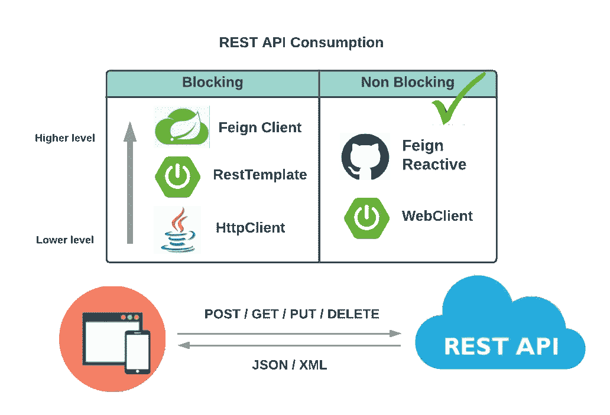
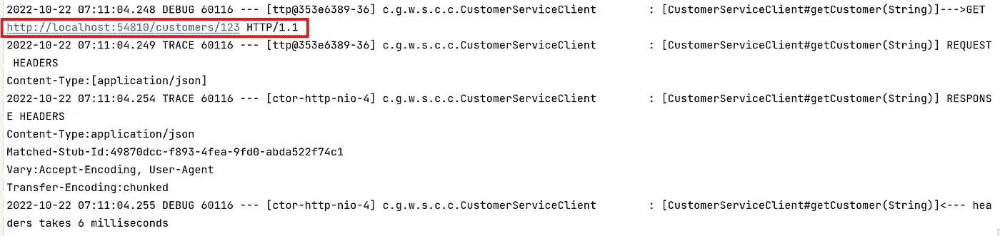

# 假装被动——我对 REST API 消费的首选解决方案

> 原文：<https://betterprogramming.pub/feign-reactive-my-preferred-solution-for-rest-api-consumption-5d79a283b24f>

## 关于如何为第三方 API 集成实现 Feign Reactive 的分步指南

作者照片

几个月前，我写了一篇名为[使用 Resilience4j](/implementing-reactive-circuit-breaker-using-resilience4j-4fe81d28e100?sk=cbb3276325c258162425d6bc89a2e2ba) 实现反应式断路器的文章，其中 Spring WebFlux 的 WebClient 由于其非阻塞特性而被选为我消费 REST API 的首选解决方案。今天，我将介绍 [Feign Reactive](https://github.com/PlaytikaOSS/feign-reactive) ，并推荐它作为我对 REST API 消费的首选解决方案。为了找出原因，让我们深入研究一下。

作者图表

# 什么是假装反应？

Spring WebClient 是一个进行 HTTP 请求的非阻塞反应式客户端。OpenFeign 是一个流行的框架，它帮助我们轻松地创建带有注释的声明性 REST 客户端。在微服务架构中调用外部服务时，它提供了更好的抽象。

[Feign Reactive](https://github.com/PlaytikaOSS/feign-reactive) 是 Feign 在 Spring WebClient 上的实现。它给我们带来了两全其美:在 Spring WebClient 的快速、异步、无阻塞的 HTTP 客户端上编写客户端 API 的 Feign 的简洁语法。

为了使用 Feign Reactive 演示 REST API 消费，我们将构建一个 Spring Boot 应用程序客户服务客户端来消费由另一个 Spring Boot 应用程序客户服务提供的 REST API，后者对客户执行 CRUD 操作。

在客户-服务-客户端中实现假装反应的详细步骤概述如下:

# 步骤 1:在 pom.xml 中添加依赖项

# 第二步:客户客户申报

在下面的`CustomerServiceClient`中捕捉到了 Feign 的声明性，它是一个对客户服务 API 作出反应的客户端。

上面第 1 行的注释`@ReactiveFeignClient`，连同下面主 Spring Boot 类`CustomerServiceClientApplication`中第 2 行的注释`@EnableReactiveFeignClients`，使这个接口成为一个假想的反应客户端。这两种注释都使我们的客户服务-客户服务中的假动作活跃起来。

# 步骤 3: application.yml

Feign 的声明性也反映在我们的`application.yml`中，在这里我们为客户服务 API 集成定义了一组配置细节(下面是示例配置):

# 第四步:假装被动配置

结合上面`application.yml`中的定义，我们可以在`CustomerClientConfig`类中配置一些 API 与客户服务集成的横切关注点。详见下文。我们正在配置以下区域:

1.  记录(下面的第 26–29 行，以及上面`application.yml`中的第 17–19 行)
2.  重试策略(下面的第 31–34 行)
3.  错误处理(下面的第 36–41 行)
4.  超时(下面的第 49–57 行)

就是这样！又快又简单。感谢佯作反应的声明性质！

# 使用 WireMock 进行测试

WireMock 是一个用于存根和模仿 web 服务的库。它构造了一个 HTTP 服务器，我们可以像连接实际的 web 服务一样连接它。当 WireMock 服务器运行时，我们可以设置期望值，调用服务，并验证其行为。

为了将第三方集成测试的 WireMock 引入客户-服务-客户端，让我们遵循下面的实现细节:

# 步骤 1:添加 POM 依赖项

除了`spring-boot-starter-test`，我们还需要 POM 文件中的以下依赖项。注意，我们使用了`wiremock-jre8`，这是为了允许 WireMock 的 JUnit 5 测试:

此外，我们还在 pom 中添加了`maven-failsafe-plugin`。这个插件分离了单元测试和集成测试的执行。Maven 首先执行我们的单元测试。将应用程序打包成一个`.jar`文件后，Maven 将执行我们的集成测试。为了确保`maven-failsafe-plugin`将我们的测试识别为集成测试，我们需要将关键字`IT`(代表集成测试)添加到我们的测试类中，比如`CustomerServiceClientIT`。

# 步骤 2:ApplicationContextInitializer

对于在 Spring 或 Spring Boot 框架上开发的应用程序来说，将 WireMock 服务器生命周期绑定到 Spring `TestContext`是很自然的。每次`ApplicationContext`启动时，Spring 执行每个配置的`ApplicationContextInitializer`。

我们可以开发一个实现`ApplicationContextInitializer`的类，其中我们可以启动 WireMock 服务器，将服务器注册为 Spring 上下文中的 bean，并覆盖 API 的基本 URL 的配置值；参见下面的示例类`WireMockInitializer`。我们用 WireMock 服务器的本地主机基本 URL(第 21 行)覆盖基本 URL `customer-service.urls.base-url`:

# 步骤 3:实现集成测试

现在让我们用 WireMock 编写集成测试。见下图`CustomerServiceClientIT`类。几个要点:

*   `@SpringBootTest`

用`@SpringBootTest(webEnvironment = SpringBootTest.WebEnvironment.RANDOM_PORT)`注释我们的集成测试。我们用一个`RANDOM_PORT`来指定`webEnvironment`。这是为了避免端口冲突，如果同一个 WireMock 服务器需要为多个重复使用应用程序上下文的 IT 测试所共享。

*   `@ContextConfiguration`

我们通过使用`@ContextConfiguration(initializers = {WireMockInitializer.class})`激活我们的 WireMock 初始化器。我们为匹配的基本 URL 创建了这个初始化器。

*   将`WireMockServer`注入其中

第 10 行将`WireMockServer` 注入到我们的测试中，就像其他任何 Spring beans 一样。这是因为我们的初始化器类已经将我们的`WireMockServer` 加载到了`TestContext`中。

*   存根 API 响应

每个测试用例都以`wireMockServer.stubFor`开始(比如第 37–42 行)，它存根了我们的 API 响应。这就是“模拟”发生的地方。确保通过实时 API 调用捕获真实响应，并将其用于存根响应。断言需要匹配存根数据。当使用`stubFor`阻止来自 WireMock 的虚假 HTTP 响应时，我们必须匹配我们的应用程序将调用的 HTTP 方法和路径。wither 方法(例如，`withHeader()`)为我们提供了一种灵活的方式来构造存根 HTTP 响应。

实际的测试验证发生在与客户端 API 调用相同的块中，比如第 49–57 行，其中`WebTestClient`触发了对我们的`WireMockServer`的调用。`WebTestClient`的流畅 API 允许我们定义 HTTP 请求和我们的期望。

测试日志显示基本 URL 确实从实际的第三方基本 URL(在`application.yml`中定义)更改为`WireMockServer`的`localhost` URL，所以我们的调用确实命中了`WireMockServer`。

*   重置`WireMockServer`

记得在测试之间重置我们的存根设置。第 30–33 行，`resetAll()`将`WireMockServer`重置为默认设置，并删除所有 HTTP 存根。这为我们的每个测试提供了一个清晰的设置。

**注意**:我最初用 Spring Boot 3.0.0-M5 开发了一个客户服务客户端。然而，我遇到了与 servlet APIs 相关的错误，主要是因为 WireMock 依赖于 Jetty 9 而不是 Jetty 11。WireMock 还没有兼容 Jakarta EE 9 的版本，这是 Spring Boot 3 的基线。关于这个话题有一个[未解决的问题](https://github.com/wiremock/wiremock/issues/1760)。

出于这个原因，我修改了这个应用程序，使用 Spring Boot 2.7.5，这是我写这篇文章时最新的 2.x 版本。这是升级到 Spring Boot 3 的挑战之一的一个例子，由于第三方库还没有提供 Jakarta EE 9 兼容版本。

# 摘要

我们在这个故事中探讨了假装反应。结合两个世界的精华，在 Spring WebClient 的快速、异步和非阻塞 HTTP 客户端上编写客户端 API 的简明语法 Feign Reactive 为任何 REST API 消费提供了一个完美的解决方案。我们深入探讨了如何在 REST API 客户端应用程序中实现 Feign Reactive。

我们还探索了如何用 WireMock 测试 Feign Reactive 实现。我希望这个故事对您有所帮助，并且我鼓励您在下一个 REST API 客户端项目中尝试一下 Feign Reactive。

这个故事的源代码可以在我的 [GitHub 库](https://github.com/wenqiglantz/customer-service-client-feign-reactive)中找到。

编码快乐！

# 参考

[https://github.com/PlaytikaOSS/feign-reactive](https://github.com/PlaytikaOSS/feign-reactive)

[灵活的 API 模拟| WireMock](https://wiremock.org/)

[使用 WireMock 和 JUnit 5 进行 Spring Boot 集成测试— rieckpil](https://rieckpil.de/spring-boot-integration-tests-with-wiremock-and-junit-5/)