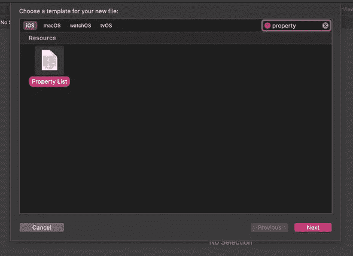
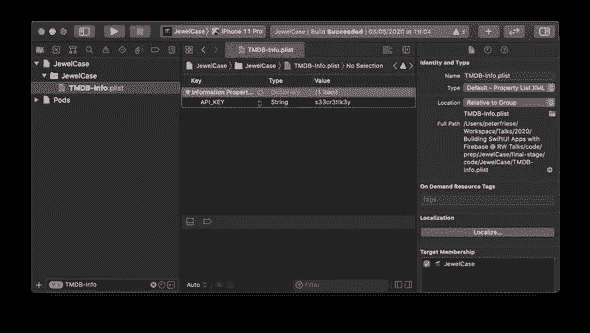
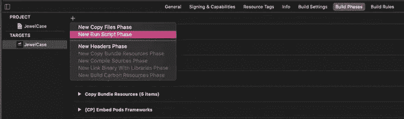

# 保证 API 密钥的安全

> 原文：<https://betterprogramming.pub/fetch-api-keys-from-property-list-files-in-swift-4a9e092e71fa>

## 将这些重要的字符串从代码中取出，放入 PLIST 文件中

图片基于来自[名词项目](https://thenounproject.com/)的 [Komkrit Noenpoempisut](https://thenounproject.com/itim2101/) 的 [Security](https://thenounproject.com/search/?q=key&i=3476538)

许多 API 要求开发者提供 API 密钥和/或 API 秘密，以便能够访问 API。

这既是为了识别正在访问 API 的应用程序，也是为了限制 API 已知的应用程序对 API 的访问。

API 密匙和秘密(如果你有)都应该被视为秘密:任何知道这些的人都可以访问和使用 API，模拟你的应用程序。这导致了各种各样的安全问题:根据 API 的类型，攻击者可能能够访问您的应用程序的数据，危害您的用户的数据，并访问受您和服务提供商之间建立的服务条款保护的信息。他们可能还会攻击 API，导致你在月底有一大笔账单。

所有这些都是确保 API 密匙和秘密安全可靠的好理由。

在这篇文章中，我们将看看如何确保你的 API 密匙和秘密不会意外泄露给你的版本控制系统。存储 API 密钥的最简单但也是最危险的方法是在应用程序的源代码中定义一个常量。您可能见过类似这样的代码:

当将这样的代码提交到您的版本控制系统时，任何有权访问您的存储库的人都可以继续使用他们的应用程序中的 API 键来访问 API。如果您的代码存储在具有严格访问控制的内部存储库中，这可能不是什么大问题，但对于开源项目来说，这是一个巨大的安全风险。

解决这个问题的最简单的方法是将您的 API 密匙外部化到一个配置文件中，而不是签入到您的存储库中。然后，您可以将 API 密钥保存在一个安全的位置(比如密码管理器)，并在需要知道的基础上将其分发给开发人员。例如，您可能希望仅在 CI/CD 服务器上使用 API 密钥来访问生产端点，并向开发人员提供开发端点的 API 密钥(可能有更严格的速率限制和更严格的成本上限)。

在 iOS 中，我们传统上使用 PLIST(属性列表的缩写)文件来存储和管理配置数据。PLIST 文件本质上是具有优势的 XML 文件。例如，Xcode 提供了一个图形编辑器来使编辑 PLIST 文件更加愉快，并且有一个易于使用的 API 来读取 PLIST 文件。

让我们看看这如何帮助我们保持上述代码片段中的 API 密钥的安全，并使我们的代码更加安全。

# 将 API 密钥外部化

正确外部化 API 键的步骤是:

1.  将 PLIST 文件添加到项目中。
2.  在 PLIST 文件中定义键/值。
3.  从 PLIST 文件中读取 API 密钥。
4.  使用 API 键。
5.  处理错误场景。

要向您的项目添加新的 PLIST 文件，请确保在项目导航器中选择项目的根文件夹，然后从根文件夹的上下文菜单中选择“新建文件…”。在 filter 字段中键入“property ”,然后从 Resources 部分选择属性文件类型:

为属性列表文件选择一个好的名称是非常重要的，因为我们稍后将编写一个构建脚本来自动处理这个文件。我推荐以下命名方案:`<name of the API>-Info.plist`。在我们的例子中，我们访问 TMDB ( [电影数据库](https://www.themoviedb.org/))，所以我们将文件命名为`TMDB-Info.plist`。

接下来，继续向新创建的文件添加一个新的键/值对。我选择了`API_KEY`作为关键字的名称。大多数 API 键都是字符串，所以选择`String`作为数据类型，然后在`value`字段中插入键本身。它应该是这样的:

现在让我们编写一些代码来从 PLIST 文件中读取 API 键，并在访问 API 时使用它。

读取 PLIST 文件只是一行代码:`let plist = NSDictionary(contentsOfFile: filePath)`。这会给你一个字典，让读取 API 键像`let value = plist?.object(forKey: "API_KEY") as? String`一样简单。为了尽可能容易地读取 API 键并在我们的代码中使用它，我们将把它包装在一个计算属性中。这也将为我们提供执行一些错误处理的机会。

首先，我们使用`Bundle.main.path(forResource:ofType)`获得 PLIST 文件的路径。如果文件不存在，我们会致命崩溃(不提供文件毕竟是编程错误，应用程序没有办法恢复)，发出一个有用的错误消息。

接下来，我们尝试将 PLIST 文件加载到字典(2)中，然后从字典中读取 API 键的值。如果值不存在或者类型错误，我们会发出另一条错误消息(并使应用程序崩溃)。

最后，我们返回值。由于我们将计算的属性命名为`apiKey`，就像常量一样，我们现在可以从代码中删除常量，我们的应用程序将像以前一样继续工作。

至此，我们已经有了基本的基础设施。在你选择热饮或冷饮放松之前，我们必须谈谈源头控制。

# 源代码控制

如果您不小心将一个 API 键签入了公共存储库，有两种方法可以解决这种情况:

1.  旋转 API 键(即，从代码中删除旧的，获得一个新的，然后确保不要签入新的)。
2.  重写历史(如果你正在使用 Git)。在此之前，我敦促你看一下斯科特·汉瑟曼的视频 [Git Push -Force 将摧毁时间线并杀死我们所有人](https://www.youtube.com/watch?v=dgOpnebZkRo&list=PL0M0zPgJ3HSesuPIObeUVQNbKqlw5U2Vr&index=1)，来自他的精彩系列[计算机的东西](https://www.youtube.com/playlist?list=PL0M0zPgJ3HSesuPIObeUVQNbKqlw5U2Vr)，然后选择选项 1。

比撤销 API 键更好的方法是防止意外签入它。为此，将任何包含 API 键的配置文件添加到您的`.gitignore`文件中。这也意味着每个开发人员可以有他们自己的这个文件的副本，以及他们的特定值。例如，您可能使用一个 API 键和 URL 作为生产端点，而您的同事正在开发一个新特性，使用开发键和 URL 作为开发端点。

为了让新的团队成员更容易(或者当您需要在不同的机器上签出代码时)，提供一个示例配置文件。我建议命名为`<name of the Plist file>-Sample.plist`。然后，将所有必需的键添加到该文件中，并提供占位符值。通过在占位符值前面加上下划线(或任何其他配置中通常不出现的字符)，您可以扩展您的错误处理代码:

(3)中的代码检查从 PLIST 文件中读取的值是否以下划线(表示占位符)开头，并发出一条错误消息，告诉开发人员如何获取 API 密钥。

当将这个 PLIST 文件添加到您的项目中时，请确保不要将它包含在任何构建目标中——我们不想将这个文件包含在我们的应用程序二进制文件中。这仅在从您的存储库中检出项目时相关。

# 额外收获:签出后提供 PLIST 文件

说到您的存储库，如果配置文件(在我们的例子中是`TMDB-Info.plist`)是在从源代码控制中签出项目后自动创建的，那不是很好吗？

我们可以使用 Xcode 构建阶段来实现这一点。以下是方法:

*   在 Xcode 项目编辑器中选择您的目标。
*   导航到构建阶段。
*   添加一个新的运行脚本构建阶段，确保它是目标中的第一个构建阶段。将这个新阶段命名为“复制示例 API 密钥”

*   粘贴以下代码

最后，更改变量`CONFIG_FILE_BASE_NAME`以匹配您的配置文件名。这个构建阶段的代码将基于您已经签入到存储库中的示例文件创建一个新的 API key 配置文件。

这意味着每当您(或您的团队成员之一)签出您的项目并构建它时，就会创建 API key 配置文件。当您运行应用程序时，computed 属性中的错误处理代码将检测到这是一个原始副本，并告诉您用一个正确的 API 键替换占位符值。

# 结论

确保 API 密钥和秘密的安全只是安全地实现和操作应用程序的一个难题，但却是非常重要的一个。我希望这篇文章能帮助你在通往更安全的应用的道路上迈出重要的一步，同时让你和你的团队有一个愉快的体验。