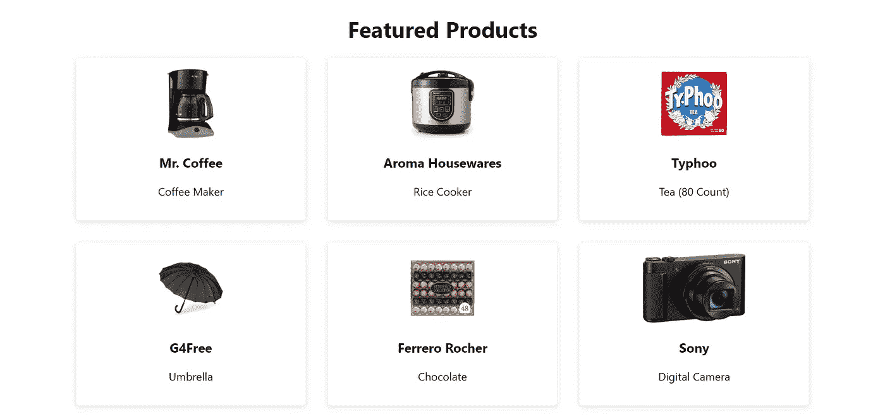
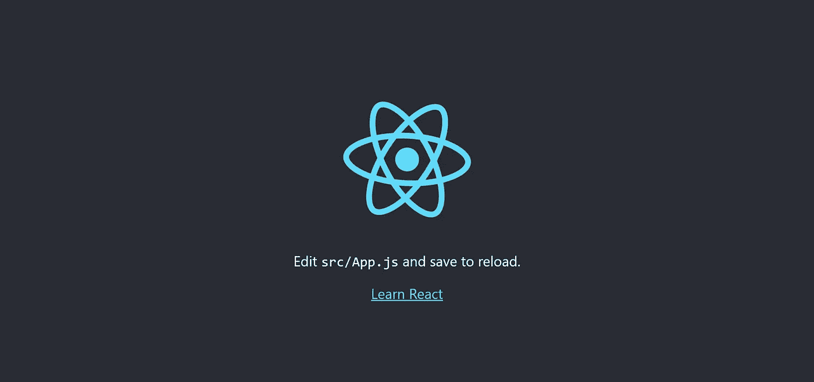
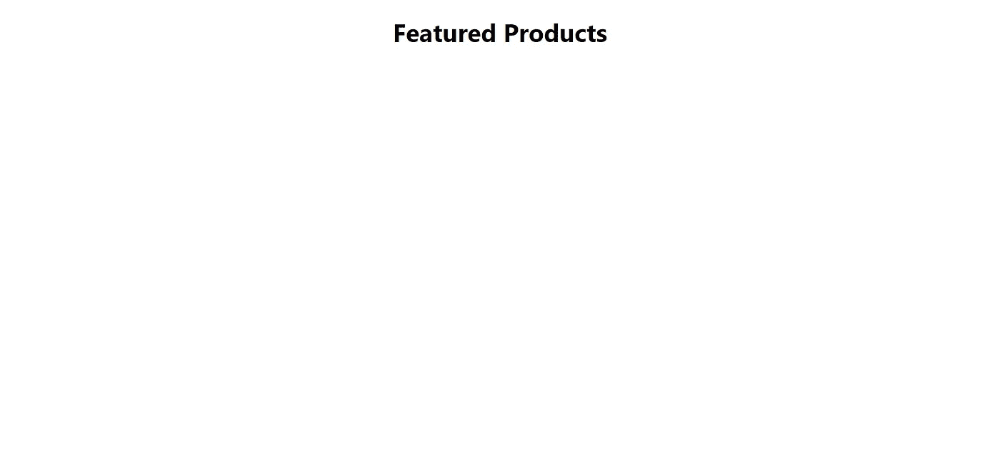
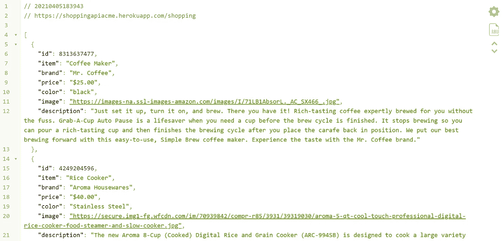
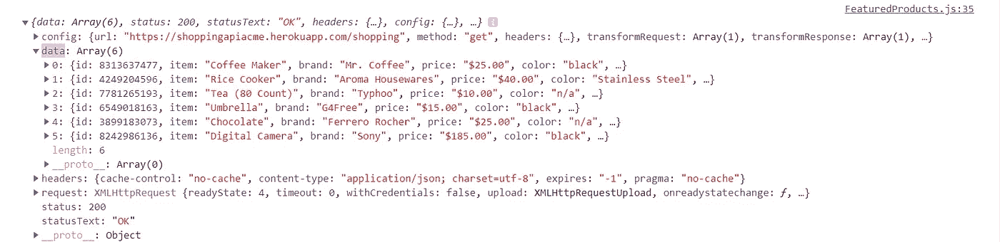
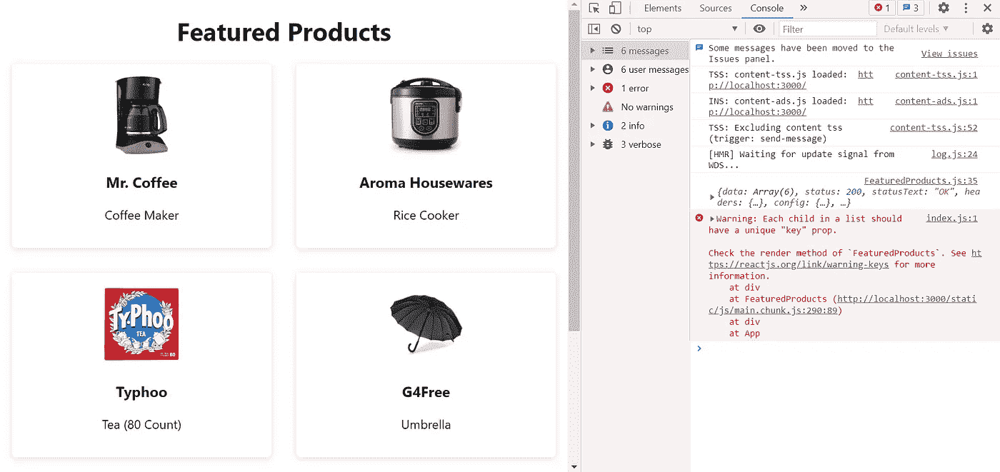
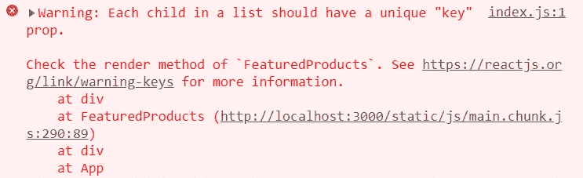
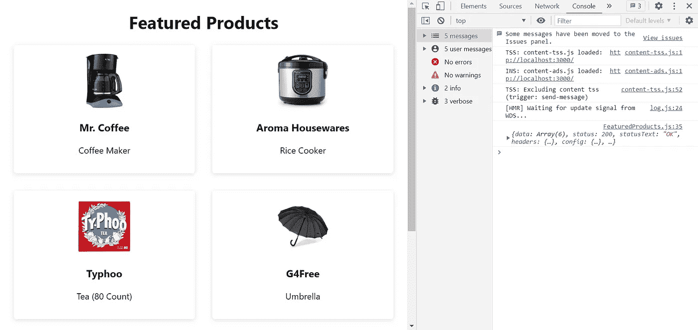

# 在 React 中获取和显示数据(第 1 部分)

> 原文：<https://betterprogramming.pub/fetching-and-displaying-data-in-react-part-1-d40fe279a8be>

## 让我们使用购物 API 创建一个特色产品页面


费伦茨·阿尔马西在 [Unsplash](https://unsplash.com?utm_source=medium&utm_medium=referral) 上拍摄的照片。

本文将重点关注从 API 获取数据并在浏览器中显示。这将使用 React 钩子来完成。为了简单起见，我们将使用我为本文创建的购物 API。然而，这里列出的步骤可以应用于从任何 API 获取和显示数据，无论它是像 [OMDb API](http://www.omdbapi.com/) 这样的第三方 API 还是您自己的 API。

让我们来看看我们将要实现的目标。假设我们有一个网站，上面有一个特色产品页面，我们想在这里展示我们的顶级产品。页面上显示的商品来自我们的购物 API。所以最后，我们想要创建的是一个特色产品页面，显示从这个 API 获取的产品:



特色产品页面

# 入门指南

本文假设您已经创建了一个 React 应用程序。如果没有，只需在终端中运行`npx create-react-app my-app`(用您的应用程序名称替换`my-app`)来创建 React starter 包。当你看到“Happy hacking！”在终点站。

我们将使用 [Axios](https://www.npmjs.com/package/axios) 来发出 Get 请求，所以让我们现在也安装它:

```
npm i axios
```

一旦完成，运行`npm start`来启动你的 React 应用。您应该看到这个:



创建 React 应用

让我们首先创建一个名为`FeaturedProducts.js`的新文件。这里我们保持简单，只在`src`文件夹中创建这个文件。在`FeaturedProducts.js`内部，我们将从一个非常基本的功能组件开始，现在只有一个`h1`:

现在让我们将它导入到我们的`App.js`文件中，在这里我们可以删除徽标和大部分启动代码。我们的`App.js`文件应该是这样的:

如果我们在浏览器中查看，我们应该会看到我们的`h1`:



基本特色产品页面

# 从 API 获取数据

如上所述，我们将使用我创建的简单购物 API。数据包括六种不同的商品，以及它们的价格、图片、描述等。请随意使用它来跟随。



购物 API

我们将使用`useState`和`useEffect`钩子，所以让我们从在`FeaturedProducts.js`导入它们开始。接下来，我们需要创建一个状态变量(我们称之为`products`)和一个更新它的函数(我们称之为`setProducts`)。由于我们将要获取的数据本质上是一个大数组，`products`最初将被设置为一个空数组:

接下来，我们将使用 Axios 从 URL 端点获取数据，所以让我们继续导入 Axios。我们将为此创建一个名为`fetchProducts`的函数。所以在这里，我们将做`axios.get()`，它接受我们的 URL 端点(`[https://shoppingapiacme.herokuapp.com/shopping](https://shoppingapiacme.herokuapp.com/shopping,)`)。这是我们购物 API 的 URL。Get 请求返回一个承诺。然后，在`then`块中，我们将记录响应。如果有错误，我们会将其记录在`catch`块中:

现在我们已经创建了我们的`fetchProducts`函数，我们将使用`useEffect`来调用它。因为`useEffect`钩子总是在第一次渲染时被调用，所以我们需要将`fetchProducts`函数放在`useEffect`中，以便在页面加载时被调用。否则，我们的函数不会被调用，我们的数据也不会被获取。所以现在当我们的页面加载时，我们的数据将被提取。

为了防止`useEffect`钩子被无限循环执行(由于默认情况下它在每次渲染和每次更新后运行)，我们将一个空数组作为第二个参数传递给`useEffect`。通过这样做，我们的`useEffect`钩子将只在第一次渲染后运行——即使组件的状态被更新:

如果我们看一下控制台，我们可以看到我们已经成功地从我们的 API 获取了数据:



从 API 获取的数据

为了显示这些数据，我们需要将这些数据传递给我们的`setProducts`函数，这样我们就可以设置这些数据的状态。正如您在控制台中看到的，我们需要使用`data`(在截图中突出显示)来访问这些数据。所以让我们继续将`setProducts(res.data)`添加到`then`块中的`fetchProducts`函数中:

# 显示数据

现在我们已经获取了数据，我们准备在页面上显示它。因此，在我们的`return`中，让我们为我们的产品创建一个`div`。我们会给它一个`className`的`item-container`(我们会添加一些基本的样式，这样我们可以有一些更有趣的东西来看)。现在，我们将通过它们获取我们的`products`(我们获取的数据)`map`，并调用每个项目`product`(当我们渲染我们想要渲染的特定属性时，我们将为每个项目使用的名称)。然后，我们将这些产品分别放入一张`div`和`className`的卡片中，我们将使用它来创建一些非常简单的卡片:

现在让我们继续添加我们的风格。我们可以去掉`App.css`中的所有东西，在那里添加我们的风格。我们还将集中我们的`h1`(至于`img`，我们将很快达到这一点):

现在，我们需要做的就是把我们的数据显示在屏幕上。如果我们查看控制台中的一个项目，我们可以看到我们可以访问品牌、颜色、描述、id、图像、项目和价格:


从 API 获取的数据

对于我们的卡片，让我们展示商品、品牌和图片。要呈现这些内容，我们只需编写`product`(我们在上面为每个项目选择的名称)，然后是我们想要显示的内容(例如`product.item`):

我们开始吧。我们现在在页面上展示我们的产品:



显示提取的数据

但是，您会注意到，我们在控制台中得到一个警告:“列表中的每个孩子都应该有一个唯一的‘key’道具。”如果我们看一下 [React 文档](https://reactjs.org/docs/lists-and-keys.html)，我们会看到“键”是“一个特殊的字符串属性，当你创建元素列表时需要包含它。”

> "关键字帮助 React 识别哪些项目已被更改、添加或删除。应该给数组内部的元素赋予键，以给元素一个稳定的标识。



丢失密钥警告

为了解决我们丢失密钥的问题，我们将为主卡`div`分配一个密钥。大多数情况下，数据中的 ID 被用作键，所以这就是我们在这里要使用的。如果呈现的项目没有稳定的 id，项目索引可以用作最后的手段，尽管不建议这样做。更多信息，请参考 React 关于[列表和按键](https://reactjs.org/docs/lists-and-keys.html)的文档。

现在，错误消失了:



不再有警告

当我们关闭控制台时，我们可以看到我们产品的特色产品页面:


特色产品页面

# 结论

所以我们开始吧。我们已经使用 React Hooks 和 Axios 从我们的 API 中获取了数据，并将其显示在屏幕上。在第 2 部分中，我们将继续使用这里的数据，并设置动态路由，以便我们可以在自己的页面上动态显示每个项目。敬请关注。

# 最终代码

`FeaturedProducts.js`的最终代码:

`App.js`的最终代码:

`App.css`的最终代码:

# 参考

1.  [OMDb API](http://www.omdbapi.com/)
2.  [Axios](https://www.npmjs.com/package/axios)
3.  [购物 API](https://shoppingapiacme.herokuapp.com/shopping)
4.  [React 文档:列表和密钥](https://reactjs.org/docs/lists-and-keys.html)