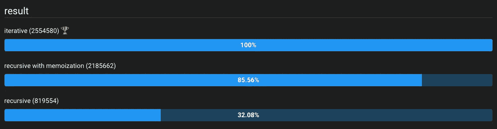
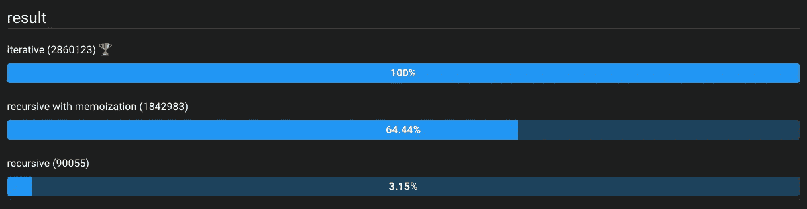
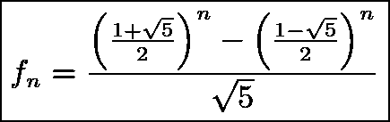
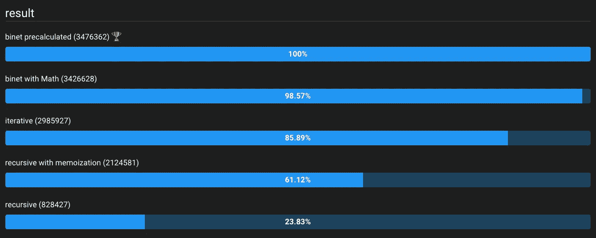

# 用 JavaScript 计算斐波那契数列最快最有效的方法

> 原文：<https://betterprogramming.pub/fibonacci-algorithm-in-javascript-45743f3a0ff6>

## 既不是递归，也不是迭代，比奈的公式是最棒的


澳大利亚八月在 [Unsplash](https://unsplash.com?utm_source=medium&utm_medium=referral) 拍摄的照片

# 斐波那契是什么？

斐波纳契数或斐波纳契数列是一个数字序列，它是通过将数前面的两个*数相加计算出来的。它也被称为黄金比例，在自然界中广泛存在。*

我们从索引`n = 0`开始对序列进行计数，其值为`0`，`n = 1`为`1`。

因此，下一个元素(`n = 2`)是`1`(之前的值是`0 + 1`)。第 3 个元素(`n = 3`)是`2`(如`1 + 1`)，第 4 个是`3` ( `1 + 2`)，第 5 个是`5` ( `2 + 3`)等等

该公式定义为

```
F(n) = F(n-2) + F(n-1) // for n > 2, e.g. F(2) = F(0) + F(1)
```

前 21 个数字是:

```
0,1,1,2,3,5,8,13,21,34,55,89,144,233,377,610,987,1597,2584,4181,6765
```

任何算法都应该为相同的输入返回相同的值。基本上，我们要寻找的是传递序列索引号(`n`)并得到相应的值作为回报。示例:

```
fibonacci(0);  // returns: 0
fibonacci(1);  // returns: 1
fibonacci(2);  // returns: 1
fibonacci(5);  // returns: 5
fibonacci(10); // returns: 55
fibonacci(20); // returns: 6765
```

# 递归算法

最简单和最容易的算法是递归算法。所有递归算法的工作原理都是一样的。该函数调用自身并传递先前计算的结果。

```
function fibonacci(element) {
    if (element === 0) return 0;
    if (element === 1) return 1;

    return fibonacci(element - 2) + fibonacci(element - 1);
}
```

递归算法的缺点是每次都需要重新计算所有以前的值。因此，它不是非常有效，并且时间复杂度是指数级的:`O(2^N)`。

# 记忆递归算法

我们可以用一种叫做记忆化的技术来大大加速我们之前的算法。基本上，我们将在内存中保存之前计算的值，即我们将使用额外的`cache`变量来存储之前的结果。

我们只需要添加`if (cache[element]) return cache[element];`，初始化它，然后如下传递:

```
function fibonacci(element, cache = []) {
    if (element === 0) return 0;
    if (element === 1) return 1;
    if (cache[element]) return cache[element];

    cache[element] = fibonacci(element - 2, cache) + fibonacci(element - 1, cache); return cache[element];
}
```

# 迭代算法

虽然带记忆的递归算法可以工作，但它仍然很慢。因此，我们可以重构代码，使用迭代算法。

我们只需要记住，前两个元素`0`和`1`不能计算，所有接下来的都是前两个元素的和。为了得到`n`元素，我们可以做一个`for`循环来得到我们需要的东西:

```
function fibonacci(element) {
    const sequence = [0, 1]; for (i = 2; i <= element; i++) {
        sequence[i] = sequence[i - 2] + sequence[i - 1];
    } return sequence[element];
}
```

# 基准

如果我们计算递归算法调用元素`n = 20`的`fibonacci()`函数的次数，那么我们得到`21891`调用！

记忆化可以对同一个元素进行多次函数调用，直到`39`——令人印象深刻。

然而，这两种递归算法都与迭代算法相去甚远！

我们可以比较每种算法与基准测试软件的工作速度，基准测试软件将向我们展示`operations/second`，即一秒钟内可以执行多少次测试。越高越好。下面是一个在 [jsben.ch](https://jsben.ch/natyu) 中完成的基准测试示例和结果:



基准测试结果 n = 10。作者图片

我们可以看到对于`fibonacci(10)`带记忆的递归算法，迭代算法速度性能达到 85.56%，递归算法性能达到 32.08%。

当我们将`n`增加到一个更高的数字时，这个数字下降得更多，示例`fibonacci(15)`给出:



基准测试结果 n = 15。作者图片

那真是令人印象深刻！

# 请看比奈的公式

到目前为止，我们已经比较了三种计算斐波那契数列的方法，但是还有一种更好的方法…那就是[比奈公式](http://www.maths.surrey.ac.uk/hosted-sites/R.Knott/Fibonacci/fibFormula.html)。

雅克·菲利普·玛丽·比奈是一位法国数学家，他提出了一个计算斐波那契数的公式。实际上，莱昂哈德·欧拉和亚伯拉罕·德莫佛之前使用的是同一个公式，但是比奈得到了所有的荣誉，现在这个公式被命名为比奈公式:



比奈公式

我们可以把它转换成 JavaScript:

```
function binet(n) {    
    return Math.round((Math.pow((1 + Math.sqrt(5)) / 2, n) - Math.pow((1 - Math.sqrt(5)) / 2, n)) / Math.sqrt(5));
}
```

或者由于常量值较少，例如 5 的平方根约等于:`2.23606797749979`我们可以预先计算它们，并将公式简化为:

```
function binet(n) {
    return Math.round((Math.pow(1.618033988749895, n) - Math.pow(-0.6180339887498949, n)) / 2.23606797749979);
}
```

# 再次进行基准测试

一旦我们用 Binet 的公式更新我们的[基准，结果如下:](https://jsben.ch/Coore)



用比奈公式对结果进行基准测试。作者图片

正如所料，比奈的公式是最快的，因为它不依赖于以前的斐波纳契数。

# 摘要

虽然递归算法是一个流行的计算机科学话题，可能是一个流行的面试问题，但在速度和效率方面，它远不及迭代算法和比奈公式。事实上，比奈是最快的。

因此，如果你正在寻找性能使用比奈的公式。然而，如果速度不是问题，那么递归算法更简单和优雅。

感谢阅读。