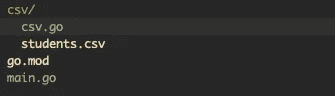
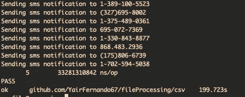
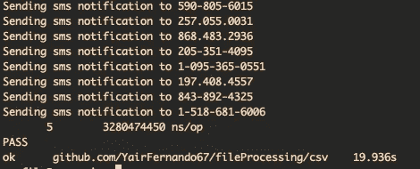
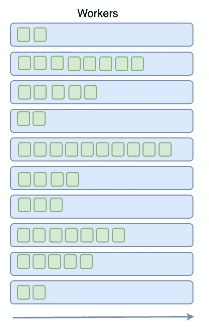

# 使用 GoLang 并发处理文件

> 原文：<https://betterprogramming.pub/file-processing-using-concurrency-with-golang-9e08920fab63>

## Go 中的主并发


GoLang 对并发程序有着令人难以置信的支持，在本文中，我们将看到如何优化一个处理 CSV 文件的程序，以便向其用户发送 SMS 通知。

如果您是使用 GoLang 的新手，并且想要更好地理解并发性是如何工作的，我建议您首先阅读这篇文章:[GoLang 中的并发性，Goroutines 和 Channels 解释](https://levelup.gitconnected.com/concurrency-in-golang-goroutines-and-channels-explained-55ddb5e1881?gi=18f0db78ea33)。

对于本文，我们将使用 CSV 文件，这个程序的目的是读取文件并处理其数据。文件内容表示 3，000 个用户的列表。

该程序应该读取这个文件，并向每个用户和他们的朋友发送通知。

你可以在这个 Github [资源库](https://github.com/YairFernando67/fileProcessing)中找到源代码，以供参考。

好了，我们开始吧。我们将首先创建一个 Go 模块、`main.go`文件和一个名为 CSV 的包。这个包将有一个名为`ProcessFile`的方法，它将从主包中被调用。让我们首先创建 Go 模块。

```
go mod init github.com/GithubHandle/fileProcessing
```

初始文件夹结构如下所示:



文件夹结构

如你所见，还有一个`students.csv`文件，你可以从存储库中获取这个文件。`main.go`和`csv.go`文件是这样的:

```
package mainimport "github.com/YairFernando67/fileProcessing/csv"func main() {
  csv.ProcessFile()
}
```

```
package csvfunc ProcessFile() {}
```

现在，让我们打开文件并阅读其内容:

在上面的代码中，我们首先使用`os`包打开`csv`文件。然后文件被传递给另一个名为`scanFile`的函数。该函数使用`bufio`包来初始化一个新的扫描仪，并扫描文件的每一行。对于每一行，我们提取关于用户的信息，并将其附加到一个用户切片中。扫描完成后，该函数将用户切片返回给调用者。

用户结构在`csv/user.go`中定义，看起来是这样的。

```
package csvtype User struct {
  Id, Name, LastName, Email, Phone string
  FriendIds                 []string
}
```

如果您运行该程序，您将看到用户的切片被打印到控制台。

很好，我们现在将文件的内容表示为一个用户切片，我们现在可以使用这个切片向每个用户和他们的朋友发送短信通知。

为此，我们将首先看看如何在不使用并发的情况下按顺序完成这项工作。然后我们将修改程序使它更快。

对于顺序处理，我们创建了一个函数并将用户传递给它。该功能覆盖所有用户，对于每个用户，它检查是否已经被访问过，如果没有被访问过，它将该用户标记为被访问过，并发送 SMS 通知。然后，它还搜索用户的朋友`id` s，找到每个用户，并执行相同的步骤，检查它是否被访问过，将他们标记为被访问过，并发送通知。

在`sendSmsNotification`函数中，我们使用`time.Sleep`函数来模拟发送通知的延迟。

让我们在这个版本的程序上运行一个基准测试，看看它有多快。代码如下:

让我们运行`go test -bench=. github.com/yaairfernando/fileProcessing/csv -benchtime=5x`



顺序处理基准

处理所有用户花费了`199.723`秒。让我们看看如何使用并发来提高程序的性能。为此，我们将添加另一个方法来并发处理用户。

对于这个并发实现，我们创建了两个通道，`usersCh`将保存初始用户列表，`unvisitedUsers`将保存单个未访问用户。

在第 35 行中，我们向第一个通道提供了用户的初始列表，这是作为这个函数的参数得到的。这在一个单独的 goroutine 中运行，因为我们不希望主 goroutine 被阻塞，这是我在这篇[文章](https://levelup.gitconnected.com/concurrency-in-golang-goroutines-and-channels-explained-55ddb5e1881)中谈到的一个概念，如果你仍然对阻塞概念感到困惑，你可以去看看。

然后我们叫`initializeWorkers`。这个函数实际上初始化了由常数`MAX_GOROUTINES`决定的 N 个 goroutines，在这个例子中，我们从 10 个开始。每个 worker 都是一个监听`unvisitedUsers`通道的函数，对于它接收到的每个用户，它向用户发送 SMS 通知，并通过在列表中找到每个用户来处理其朋友 id，然后将用户发送到`usersCh`通道。用户朋友`id`的处理在一个单独的 goroutine 中运行，因为我们不想在这里阻塞当前的 goroutine。

该功能将允许程序有 10 个 goroutines 等待用户被发送到`unvisitedUsers`通道。并且这些 goroutines 中的每一个都将并发运行，从而提高程序的性能。

这里需要注意的另一件重要的事情是，在第 57 行中，我们使用这个语法来检查`usersCh`通道是否仍然打开，这阻止了我们向关闭的通道发送数据。在本例中，这一点很重要，因为我们将关闭通道，我们不希望其他 goroutines 尝试向该通道发送数据。

然后在第 37 行，我们有覆盖`usersCh`通道的`processUsers`函数，对于它接收到的每个用户列表，它检查该用户是否已经被访问过，如果没有，那么它将其标记为已访问，并将该用户发送到`unvisitedUsers`通道。该函数还跟踪有多少用户使用了`count`变量，通过这样做，我们可以检查是否已经达到第 75 行的大小，并关闭`usersCh`通道，这将终止程序。

让我们对这个版本的程序进行基准测试，看看它改进了多少。



并发处理基准

如你所见，只用了`19.936`秒就完成了！！这是一个巨大的性能提升。我们还可以通过增加或减少`MAX_GOROUTINES`常量来控制我们希望程序拥有多少活动的 go routine/worker。

如果我们增加工人的数量，我们的程序将运行得更快，因为更多的任务将同时运行。



这是一个很好的例子，说明了如何使用通道和 goroutines 来提高程序的性能。通道是 go routine 之间的一种很好的通信方式，go routine 允许您并发地运行代码。

我希望你觉得这篇文章很有用，并且学到了一些新东西。感谢您的阅读。敬请关注。