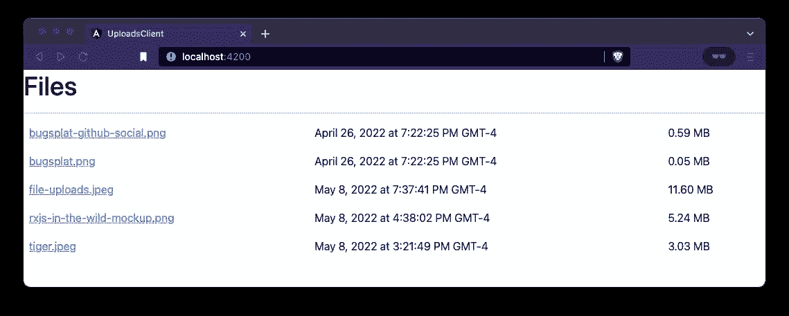
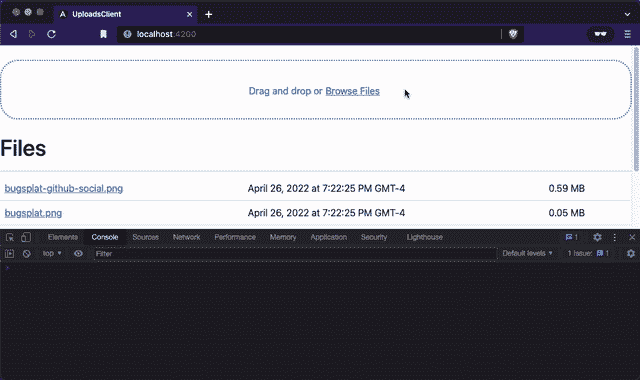
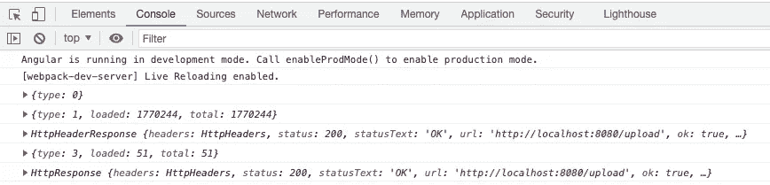
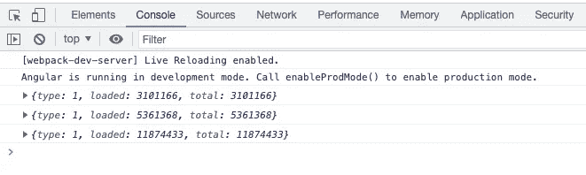
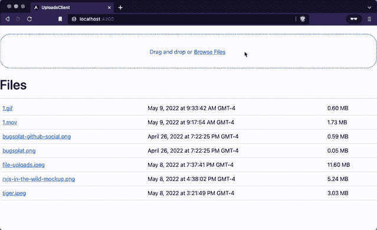
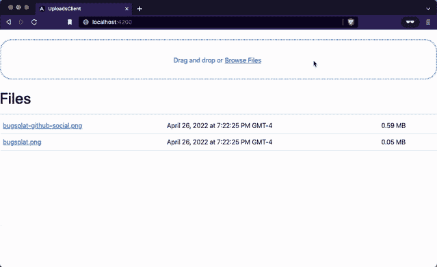
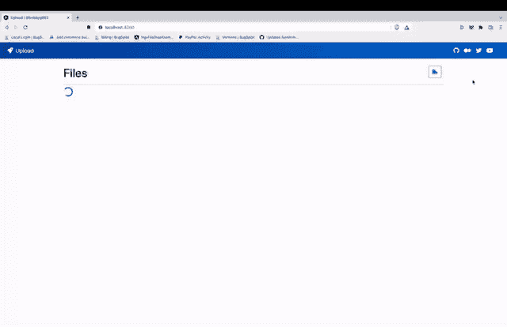

# 使用 Angular 和 RxJS 上传文件

> 原文：<https://betterprogramming.pub/file-uploads-with-angular-and-rxjs-34262b3450ae>

## 为您的 Angular 应用程序添加一个强大、优雅的文件上传控件


神奇的互联网人将文件传送到云端( [Khakimullin Aleksandr](https://www.shutterstock.com/image-photo/conceptual-image-successful-businessman-suit-flying-1052295092)

# 文件上传🧑‍💻

数据传输是软件应用程序中普遍存在的一部分。从 Apple 到 Zoom，文件上传控件渗透到整个技术生态系统中，是许多人每天都要交互的组件。本教程演示了如何用 RxJS、Angular 和 Bootstrap 构建一个文件上传客户端。

大多数 Angular 文件上传教程订阅 observables 并显式管理订阅。在这篇文章中，我们将探索如何使用 bindCallback、scan、mergeMap、takeWhile 和 AsyncPipe 来创建一个完全反应式的上传控件，包括进度条和订阅。

本文的配套回购可以在这里[找到。](https://github.com/bobbyg603/file-uploads-with-angular-and-rxjs)

# 服务器☁️

为了开发我们的 Angular 文件上传组件，我们需要一个能够处理文件上传、下载和返回已上传文件列表的后端。

要开始，请克隆服务器存储库:

```
git clone [https://github.com/bobbyg603/upload-server.git](https://github.com/bobbyg603/upload-server.git)
```

安装包的依赖项并启动服务器，这样我们就有了可以用来开发文件上传组件的东西:

```
npm i && npm start
```

这是一个真正的服务器，不使用时不应该让它运行！

# 客户💻

首先，让我们使用 [Angular CLI](https://angular.io/cli) 创建一个新的 Angular 应用程序，确保选择 scss 作为样式表格式:

```
ng new uploads-client && cd uploads-client
```

我们可以利用一些第三方库来大大简化真实世界文件上传组件的创建。让我们安装 [Bootstrap](https://www.npmjs.com/package/bootstrap) 、 [ng-bootstrap](https://www.npmjs.com/package/@ng-bootstrap/ng-bootstrap) 和 [ngx-file-drop](https://www.npmjs.com/package/@bugsplat/ngx-file-drop) 。我们还将安装 Bootstrap 的依赖关系 [@popperjs/core](https://www.npmjs.com/package/@popperjs/core) :

```
npm i bootstrap @popperjs/core @ng-bootstrap/ng-bootstrap @bugsplat/ngx-file-drop --legacy-peer-deps
```

通过运行以下终端命令，为引导添加[@ angular/localize](https://www.npmjs.com/package/@angular/localize)poly fill:

```
ng add [@angular/localize](http://twitter.com/angular/localize)
```

最后，将引导程序的 scss 导入到您的`styles.scss`文件中:

```
@import "~bootstrap/scss/bootstrap";
```

## 文件表

最容易的起点是从服务器获取文件列表，并在表格中显示它们。创建一个新的文件组件来显示我们的文件列表:

```
ng g c files
```

向您的`app.component.html`模板添加一个新的`FilesComponent`实例:

文件组件

让我们添加一个表示我们想要显示的数据的接口。创建新文件`files/files-table-entry.ts`:

文件表输入界面

在`files.component.html`中，添加一个显示文件集合的表格:

文件组件表

为了让 UI 更有趣，让我们在`files.component.ts`中提供一些占位符数据:

文件组件占位符数据

## 列出上传的文件

到目前为止，我们已经构建了一个用于显示文件的表，并用一些虚拟数据填充了它。让我们通过向服务器上的`/files`端点发出 GET 请求来显示真正的文件列表。

将`HttpClientModule`添加到`app.module.ts`中的导入数组:

将 HttpClient 模块添加到 App 模块

将`HttpClient`注入到`app.component.ts`的构造函数中。在构造函数中，将`files$`设置为对`/files`的 GET 请求的结果——如果 Express server 还没有运行，请确保启动它！

获取应用程序组件中的文件

使用 Angular 的[异步管道](https://angular.io/api/common/AsyncPipe)将`files$`作为输入传递给`FilesComponent`:

使用异步管道订阅

我们使用 AsyncPipe，因为它将自动管理对`files$`可观察对象的订阅和取消订阅。如果你发现自己在 Angular 中调用了一个可观察的`subscribe`,要小心了——忘记调用`unsubscribe`会导致[内存泄漏](https://en.wikipedia.org/wiki/Memory_leak)和应用程序性能下降！

如果你做的一切都正确，你的应用现在应该看起来像这样:



文件表检查点

## 文件选择

在我们上传文件之前，我们需要一种方法来允许用户指定他们想要上传的文件。首先，创建一个新的用于选择文件的`file-drop.component.ts`组件:

```
ng g c file-drop
```

我们的第三方`NgxFileDropComponent`允许我们的用户将文件拖放到我们的 web 应用程序中，或者通过系统文件选择器指定要上传的文件。要使用`NgxFileDropComponent`，我们首先需要将`NgxFileDropModule`添加到我们应用程序的`app.module.ts`中:

将 NgxFileDrop 模块添加到应用程序模块

将`ngx-file-drop`和一个基本的 ng 模板添加到`file-drop.component.html`，这样我们就可以将文件拖放到我们的应用程序中，或者通过系统文件选择器选择文件:

文件放置模板

在`file-drop.component.ts`中，创建一个`onFilesDropped`函数，作为`onFileDrop`事件的处理程序。让我们也创建一个`filesDropped`输出，我们将使用它将事件转发给我们的`AppComponent`:

文件删除组件

我们在这里使用一个`Output`，这样我们可以从`FileDropComponent`到`AppComponent`进行通信。关注点分离是基本的软件设计原则，鼓励干净、可读和可重用的代码。

现在我们已经在`FileDropComponent`中创建了`Output`，将`filesDropped`事件的处理程序添加到您的`app.component.html`模板中:

将 FileDrop 组件添加到 App 组件

向您的`AppComponent`添加一个`onFilesDropped`处理程序:

应用程序组件中的 OnFilesDropped 处理程序

此时，您应该已经构建了一个类似如下的应用程序:



文件丢弃检查点

## 获取文件对象

在开始文件上传之前，我们需要创建一个可观察的流，从`NgxFileDropEntry`数组中发出每个文件。从`NgxFileDropEntry`获取`File`对象有点棘手，因为它是作为参数传递给回调函数的。

幸运的是，RxJS 有`bindCallback`,我们可以用它将接受回调的函数转换成可观察的:

用 BindCallback 将文件回调转换为可观察的

在上面的`bindCallback`片段中发生了很多事情。

首先，`from`操作符用于获取一组`NgxFileDropEntry`项，并逐个发出它们，允许我们单独操作每一项。

接下来，项目通过管道传输到`mergeMap`，这允许我们将每个`NgxFileDropEntry`映射到一个新的可观察对象，而无需取消任何先前的内部订阅。每个`NgxFileDropEntry`最终将映射到一个上传操作，该操作会随着时间的推移发出多个进度事件。

当您想将一个可观察对象映射到另一个可观察对象时，`switchMap`是大多数情况下的首选操作符，因为它会自动取消内部订阅。然而，在这种情况下，我们希望维护内部订阅，以便它们继续对正在上传的每个文件进行流式处理。我们一会儿将回到这一点。

最后，我们使用`bindCallback`从一个将异步操作的结果传递给回调的函数中创建一个可观察对象。不幸的是，在 TypeScript 的 es5 lib 中有一个我不能完全理解的打字问题。为了解决这个问题，`bindCallback`的结果被转换为`any`。这很有效，但是感觉有点脏——如果有人知道更好的解决方案，我很乐意在评论中听到！

## 文件上传

既然我们已经将`File`对象从`NgxFileDropEntry`转换为可观察对象，那么让我们使用 Angular 的`HttpClient`来上传文件并返回进度事件。

下面是我们的应用程序组件的`onFilesDropped`功能应该是什么样子:

文件上传片段

请注意，我们现在将`file$`映射到`httpClient.post`的结果，这一次，用`switchMap`拉平可观察的流并取消内部订阅。我们使用`reportProgress: true`和`observe: 'events'`来指示`HttpClient`我们希望它在文件上传时发出进度值。

如果一切正常，您应该会看到开发人员控制台记录了几个进度事件:



上传进度事件

我们最感兴趣的事件具有类型`HttpEventType.UploadProgress`或`type: 1`。

## 过滤事件

现在，让我们创建一个类型保护。[类型保护](https://www.typescriptlang.org/docs/handbook/2/narrowing.html#using-type-predicates)将允许我们过滤掉不是进度事件的事件，并向类型脚本指示下一个操作符的输入类型将是`HttpUploadProgressEvent`:

HttpUploadProgressEvents 的类型 Guard

对`filter`操作符使用类型保护，以便从可观察的流中过滤掉其他事件:

仅接受 HttpProgress 事件

现在，当您将文件拖动到您的应用程序中或通过系统文件选择器选择它们时，您应该只看到显示在开发人员控制台中的`type: 1`事件:



过滤的上传进度事件

请注意，上传事件不多，因为你上传到的是本地机器上的服务器。当服务器通过互联网托管时，您将会看到更多的上传事件。

## 完成上传可观察流

在我们走得太远之前，我们需要对我们的可观察流做一个小的改变，以确保它在正确的时间完成。还记得`mergeMap`如何要求我们管理我们的内部订阅吗？ [RxJS 文档](https://www.learnrxjs.io/learn-rxjs/operators/transformation/mergemap#why-use-mergemap)推荐使用一个`take`操作符来管理内部订阅的完成。

当上传操作完成时，HttpClient 发出一个类型为`HttpEventType.Response`或`{ type: 4 }`的事件。让我们使用`takeWhile`操作符在上传操作发出响应时完成订阅:

持续到上传完成

现在，您应该能够将文件上传到您的服务器了——太好了！在最后一部分，我们将在文件上传中添加进度条。

## 上传进度累加器

现在我们正在上传文件并获得一系列上传事件，我们需要将这些事件整合到一个集合中，以便在 UI 中使用:

文件上传进度界面

`scan`操作符与`reduce`相似，但它不是操纵数组，而是减少从可观察流发送到数组或对象中的值。

我们希望保持一个运行的集合，将每个文件映射到它最近的进度值。对于大型集合，使用字符串值对集合进行索引要比在集合中搜索正确的索引快得多。

我们想给每个文件一个唯一的字符串作为`id`属性，我们可以用它来快速索引我们的文件集合并更新它们相关的进度。为此，我们将依靠 [uuid](https://www.npmjs.com/package/uuid) 包:

```
npm i uuid && npm i --save-dev @types/uuid
```

我们将使用别名将 uuid 导入到`app.component.ts`中，这样读起来更好一些:

将 V4 作为 UUID 导入

我们可以使用`loaded`和`total`值来生成我们的进度值。首先，我们将每个进度事件`map`到`FileUploadProgress`接口。接下来，我们将使用`scan`操作符和我们在祖先函数作用域中定义的`id`来将我们的进度值保存到一个累加器中。最后，我们将把累加器转换成一个值数组，以便在 UI 中显示:

上传进度累加器

唷！太多了，但我们快完成了。

## 上传进度条

我们将使用进度条向用户显示每次上传的进度。要开始，将`NgbProgressbarModule`添加到`app.module.ts`:

将 NgbProgressBar 模块添加到应用程序模块

添加一个`UploadsComponent`以便我们可以显示上传进度条:

```
ng g c uploads
```

将以下内容复制到`uploads.component.ts`:

上传组件

将以下代码片段添加到`uploads.component.html`:

上传进度条模板

`UploadComponent`使用 [*ngFor](https://angular.io/api/common/NgForOf) 为 uploads 集合中的每个上传创建一个包含模板的 div。当上传失败时，我们将`text-danger`类添加到包含上传名称的 span 中，将文本涂成红色。上传完成后，根据上传是否失败，我们会在文件名旁边添加一个复选标记或 x。最后，我们创建一个红色(危险)或绿色(成功)的进度条，并将`[value]`输入绑定到`upload.progress`，这样进度条的宽度会随着文件的上传而更新。

现在我们已经完成了`UploadsComponent`，让我们将其添加到`app.component.html`模板中:

将上传进度添加到应用程序组件

太棒了。如果一切都连接正确，您应该会看到如下内容:



上传进度条

**刷新列表**

最后一个难题是在上传完成后获取一个新的上传文件列表。这可以使用`BehaviorSubject`和`finalize`操作符来完成。

在`app.component.ts`中可以使用一个`BehaviorSubject`来指示`files$`可观察对象何时被刷新:

刷新文件表

当一个可观察的流完成时，调用`finalize`操作符。让`getFilesSubject`在由`finalize`调用的函数中发出一个事件，以便在上传完成时刷新文件列表:

完整的应用组件

# 恭喜你！🎉

感谢您的关注！如果您做的一切都正确，您的应用程序应该看起来像这样:



文件上传进度和刷新

在未来，我希望发布本教程的第 2 部分，解释如何添加模态对话框，将上传逻辑移入“智能”组件，将文件添加到正在进行的上传中，并使应用程序看起来更专业。

下面先睹为快，看看未来的教程会是什么样子:



未来文件上传

```
**Want to Connect?**If you found the information in this tutorial useful please follow me on [GitHub](https://github.com/bobbyg603), and subscribe to my [YouTube](https://www.youtube.com/c/bobbyg603) channel.
```