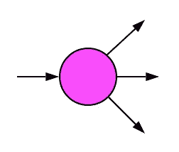
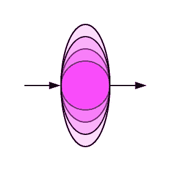
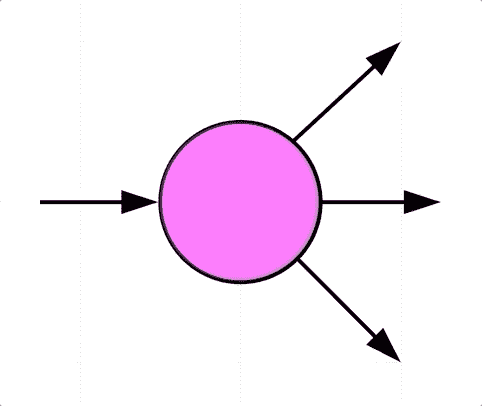
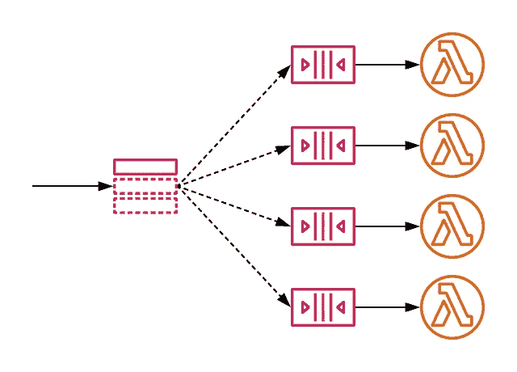
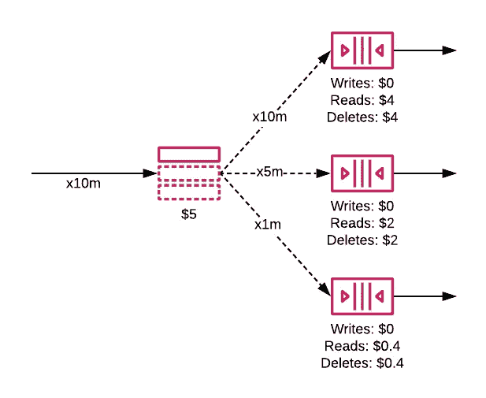
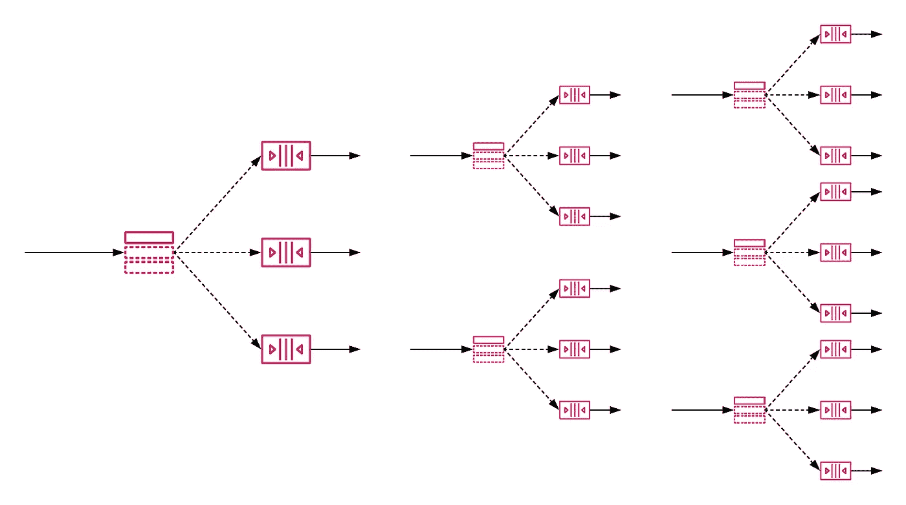

# 通过社交网络和 SQS 提供可过滤、可扩展的事件消息

> 原文：<https://betterprogramming.pub/filterable-scalable-event-messaging-with-sns-and-sqs-3a1d624eb5b5>

## 分离服务，同时实现巨大的可伸缩性和扇出

无服务器和微服务都是关于解耦服务的。

拥有合适的工具可以确保您的架构获得成功。将你的服务设计成真正独立、有弹性和可伸缩的，可以确保你的产品能够承受你要扔给它的一切。

格雷格·法罗摄影

# 解决方案架构中的解耦

当我们使用类似于*关注点分离*和*解耦*的短语时，我们指的是什么？

如果微服务或面向服务的架构(SOA)方法要取得成功，它必须容忍失败。如果架构的一部分出现问题，其他服务应该可以继续正常运行。每个服务都应该维护自己独立的数据源和接口。

微服务模式的衍生物是事件驱动架构。它以事件从一个服务到另一个服务的移动为中心。它特别适合无服务器技术。

因为无服务器技术通常是按使用付费的，所以最好只在需要的时候调用服务。因此，事件驱动架构和无服务器技术是完美的搭档。

AWS 提供了一系列服务来帮助实现事件驱动的无服务器设计。您可以在此了解更多选项:

 [## 在 AWS 中移动消息:比较 Kinesis、SQS 和 SNS

### 哪种技术最适合在 AWS 上传递您的信息？

medium.com](https://medium.com/better-programming/moving-messages-in-aws-comparing-kinesis-sqs-and-sns-32cb5d2f89d5) 

# 为什么是 SNS 和 SQS？

所以如果你读了[的另一篇文章](https://medium.com/better-programming/kinesis-vs-sqs-vs-sns-moving-messages-in-aws-32cb5d2f89d5)，你就会知道 Kinesis 是事件驱动系统的一个完美的选择。它有几个引人注目的优点。所以在我回答“为什么 SNS+SQS？”，为什么*不是*身势？

## 为什么不是 Kinesis？

Kinesis 是一个非常棒的服务，在适当的情况下，它是一个强大的工具。然而，有三个限制阻止我在更多的设计中使用它:

*   **扇出** —由于每个流最多有 20 个消费者，每秒读取 5 次，Kinesis 不是向多个消费者传递消息的好选择。
*   **规模** —管理 Kinesis 中的规模很简单。只要改变一个配置属性，就搞定了。然而，缩放可能很慢才会生效(特别是当您的迭代器年龄很大时)。[缩放也被限制为每 24 小时两个事件](https://docs.aws.amazon.com/kinesis/latest/APIReference/API_UpdateShardCount.html)。此外，它不是自动的，所以它对我来说是更多的工作。
*   **过滤** —任何消费 Lambdas 必须调用并解析消息，然后才能知道该消息是否应该被处理。如果消息内容满足特定的标准，就不可能只调用 Lambda。无缘无故地调用 Lambda 对我来说就像是无服务器的反模式。

# 那么为什么选择 SNS 呢？

## 扇出

扇出

在事件驱动的系统中，通常希望一个事件引起多个动作。在某些情况下，我希望由一个事件触发多个动作。

SNS 是扇出的完美选择。它允许每个主题有多达 1000 万订阅者。这比我需要的还要多。

## 规模

规模

我对我的团队以及我们设计和实现优秀软件的能力充满信心。但是和我们一样好，我认为 AWS 可以做得更好。如果 AWS 已经开发了解决问题的软件，最好使用他们的服务，而不是开发我们自己的。

我不想构建一个工具来监控和管理 Kinesis 流的碎片计数。

SNS 和 SQS 都从自动扩展中受益，AWS 为我管理这一切。缩放限制几乎是无限的。现有的限制是软限制，这意味着我可以要求 AWS 提高它们。更多的是我能承受多大规模的问题。

## 过滤

过滤

我最喜欢的 SNS 功能是在信息被处理之前过滤信息的能力*。在我看来，这就是无服务器的意义所在。你可以将消费者的调用减少到那些*需要*运行的人。处理不相关的消息不会浪费计算时间。*

# 如果 SNS 解决了这些问题，为什么还要用 SQS 呢？

SNS 是一个优秀的服务，基于上面的标准，非常适合事件驱动的架构。

那么，仅仅单独使用社交网络有什么错呢？你绝对可以。在正确的情况下，SNS 本身是理想的。但事实并非总是如此。

## SNS + SQS 什么时候才是正确的选择？

我经常需要在系统内移动事件，这依赖于难以置信的高可靠性。在这些系统中，丢失哪怕一条事件消息都是不可接受的。

SNS 是可靠的。[消息存储在多个可用性区域](https://aws.amazon.com/sns/faqs/#Reliability):

> 虽然这种情况很少发生，但如果一个区域发生故障，SNS 的运行和您的消息的持久性将会继续，不会中断。

在这些场景中，SNS 的可靠性不是我主要关心的。我担心我的一个消费者可能会行为不端。

如果使用者工作不正常，它可能无法对事件消息做出适当的反应。如果我只使用社交网络，我的消息将会丢失。

## 进入 SQS

SQS 让我有更多的时间来成功处理信息。根据我的 MessageRetentionPeriod 配置，消息将在队列中最多保留 14 天[。](https://docs.aws.amazon.com/AWSSimpleQueueService/latest/APIReference/API_SetQueueAttributes.html)

如果我的消费者开始行为不当，事件消息将重新出现在队列中。然后，消费者可以再次尝试处理该消息。这种保持能力让我有时间了解消费者的问题。然后我可以解决这个问题。问题解决后，消费者会自动处理任何未处理的消息。神奇！

可靠性！——照片由格雷格·法罗拍摄

## 顶端的樱桃

你会从[这个故事](https://medium.com/better-programming/moving-messages-in-aws-comparing-kinesis-sqs-and-sns-32cb5d2f89d5)中想起:

> 因为 SQS 是一种排队服务(不是流服务)，它不适合多个消费者。

正如我之前提到的，SNS 的一大好处是它允许扇出的能力。如果我使用只有一个 SQS 队列的 SNS 主题，我会失去这个邪恶的特性。这是设计中最好的部分；使用订阅过滤，我可以将一个 SNS 主题分散到多个 SQS 队列中。

SNS 和 SQS 是一起工作的。 [AWS 给出了如何实现这种模式的详细说明](https://docs.aws.amazon.com/sns/latest/dg/sns-sqs-as-subscriber.html)。

按照这种模式，我可以受益于 SNS 的所有我喜欢的特征:规模、扇出和过滤。我可以做到这一点，而不会有丢失数据的风险。

社交网络和 SQS:可过滤、可扩展、可靠

这可以通过[使用订阅过滤将事件消息从 SNS 移动到 SQS 队列](https://aws.amazon.com/blogs/compute/simplify-pubsub-messaging-with-amazon-sns-message-filtering/)来实现。

我可以使用这种技术来订阅许多不同的队列，每个队列对应一种类型的消费者。每个订阅都会过滤掉任何不相关的事件消息。因此，队列只接收相关的消息。瞧啊。

# 问题是

这种式样符合我的所有要求。不幸的是，这并不意味着我可以一直使用它。这可能是一个昂贵的选择。

## 好人

SNS 和 SQS 都是真正的无服务器，我的意思是，没有固定成本。如果我没有任何数据要处理，那么我什么也不付。正好是 0 美元。在一个无服务器、事件驱动的世界里，这正是我所期望的价格。

随着数据开始在体系结构中流动，成本开始增加。产生的成本也遵循一个可爱的无服务器模型。您只需为您使用的东西付费。除此之外，AWS 对从社交网站发送到 SQS 的信息不收取递送费。

到目前为止，一切顺利。

## 坏事

我对 SNS 和 SQS 的收费感到失望。依我拙见，它们很贵。

[社交网络](https://aws.amazon.com/sns/pricing/):亚马逊 100 万次社交网络请求收费 0.5 美元

[SQS](https://aws.amazon.com/sqs/pricing/) :每 100 万个请求 0.40 美元

## 一个例子

让我们看一个实际的例子。假设我们有一个 SNS 主题，订阅了三个 SQS 队列:

*   队列 1 使用所有邮件。
*   由于过滤，队列 2 消耗了 50%的邮件。
*   由于过滤，队列 3 消耗了 10%的邮件。

我们将通过系统发送 1000 万条消息，并计算成本。

1000 万条消息的成本分布

我们有它:5 美元(社交网站)和 12.80 美元(SQS)。假设我们单独通过系统传递每个事件，一千万条消息将花费我们 17.80 美元。

SQS 支持消息批处理。如果您使用 Lambda 函数来使用队列，那么您可以以 10 个为一批来处理消息。这样做将减少 90%的 SQS 成本:一个请求中每个`receive`10 条消息，随后在一个`DeleteMessageBatch`请求中删除 10 条消息。

新费用:5 美元(社交网络服务)+1.28 美元(SQS)= 6.28 美元。

## 愤怒地使用它

1000 万英镑的货是微不足道的。在 ResponseTap 的生产环境中，我预计要处理 5 亿或 10 亿条消息。在生产规模上，我预计成本为 314-628 美元。突然听起来有点贵了。

现在，考虑到我想在我的平台的多个地方使用这种模式。我的成本在上升。

为什么我认为这很贵？在这个平台上，我使用 Lambda 进行计算。我发现 SNS + SQS 的成本比我的 Lambda 成本高出 20–30%。

在许多用例中部署的模式

# 反正我用的是这种模式

描述的蓝图并不是最便宜的。用 Kinesis 替换它可能会减少我 20-40%的信息传输成本。那么，我为什么要坚持使用社交网站和 SQS 呢？

从一个纯粹的、无服务器的 fanboi 的角度来看，这种模式非常好。对我来说，这正是无服务器、事件驱动的架构应该有的样子。但这只是我的看法。

这种模式如此引人注目并在 ResponseTap 中如此广泛使用的原因是架构的简单性和透明性。我坚信，为了理解一个系统而进行代码遍历是非常糟糕的。能够通过图表雄辩地描述你的平台使它更容易理解。

这个模式演示了它在做什么，而不需要理解任何 Lambda 代码。透明度带来了更直接的交流。工程时间几乎总是比平台费用更昂贵，所以我们省钱。

总的来说，这种设计对我的许多用例都很适用。与任何架构决策一样，您需要确信模式适合您。希望这篇帖子能让你更容易评价。