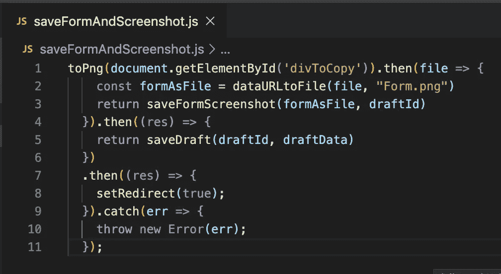

# 像专业人员一样通过分治法找到并修复错误

> 原文：<https://betterprogramming.pub/find-and-fix-bugs-like-a-pro-with-divide-and-conquer-d55f3cf91154>

## 如果我只能学到一件关于调试的事情，我会学会分而治之

调试就像玩捉迷藏。Artur Rutkowski 在 [Unsplash](https://unsplash.com/s/photos/hide-and-seek?utm_source=unsplash&utm_medium=referral&utm_content=creditCopyText) 上拍摄的照片。

# 各个击破

分而治之是一种算法设计类型。它的工作原理是递归地将一个问题分解成两个(或更多)性质相似的小问题。如果你能解决小问题，你也能解决更大的问题。分而治之主要用于排序或查找最近的一对点。

但是分而治之不止于此。你可以用这种心态来调试你的应用程序。

# 排除故障

对于许多开发人员来说，调试是一项累人的任务。你需要知道你想要的输入和输出。你需要了解应用程序的代码和流程。通常发现一个错误比改正它要困难得多。

无数程序员讨厌调试还有另一个原因。比起修理东西，我们更喜欢制造东西。创建新代码比花半天时间寻找一个错误并最终修改两行代码要令人满意得多。

寻找 bug 的简单方法是一行一行地检查代码，记录数据，或者设置断点。你可以在琐碎的应用程序中使用，或者如果你知道错误在哪里。

但是通常，您需要调试一个大的应用程序，通常是在您熟悉代码库之前。制作成吨的原木将会花费很长时间。你必须做得更好。

照片由 [Aron 视觉效果](https://unsplash.com/@aronvisuals?utm_source=unsplash&utm_medium=referral&utm_content=creditCopyText)在 [Unsplash](https://unsplash.com/collections/9826757/learning?utm_source=unsplash&utm_medium=referral&utm_content=creditCopyText) 上拍摄

# 基本的各个击破

在调试中直接使用分治法是将代码库分成两半，并在那里添加一个日志。如果日志工作并打印出正确的数据，我们可以假设到那时为止一切都正常；否则，错误出现在代码的前半部分。

接下来，我们取出可疑的那一半代码，在中间放入另一个日志。我们重复这个过程，直到发现问题。每次我们都将剩余的代码库减半，所以我们只需几个步骤就能找到错误。这比在所有代码中记录日志要好得多，但是我们可以更进一步。

# 有根据的猜测和分而治之

想象你的应用程序由数千行代码组成。很难找到中间的，你将需要几十个日志来发现罪魁祸首。现在是时候在添加日志之前退一步思考了。

先回答几个问题，做一些假设。

什么坏了？可能是某些字符串转换失败了；可能返回的数据不是您期望的类型，或者有其他问题？

*   有没有一些测试或者检查过的部分代码？如果是这样的话，这个 bug 可能不存在。
*   bug 是什么时候出现的？之前一切正常吗？什么变了？也许现在输入不同了，或者也许代码在两次提交后工作了。

当你回答了这些问题，你就准备好对 bug 的本质做出一个有根据的猜测了。

每一个假设都可能被证明是错误的，但是你的目标不是正确的。这是为了找到最有可能的罪魁祸首，这样你就可以精确定位代码中可疑的部分。

当你有几个假设时，放大最有可能的，然后分而治之。如果你找到了漏洞，那太好了。如果不是，进行下一个假设。

# 各个击破的例子

我将向您展示一个分而治之调试的真实例子。下面的代码获取一个 HTML 表单，并为其创建一个 PNG 图像。稍后，它将图像和表单数据发送到服务器，并重定向到另一个页面。

具体来说:

*   `toPng`获取 HTML 元素并返回图像(base64 编码的数据)
*   `dataUrltoFile`获取 base64 编码的数据并返回一个文件
*   `saveFormScreenshot`和`saveDraft`向服务器发送数据
*   `setRedirect`重定向到另一个页面

代码在 Chrome 上运行良好，但我在 Safari 上遇到了问题。程序没有返回任何东西——没有数据，没有错误。

## 我的(幼稚)方法

我在代码中间的第 4 行和第 5 行之间记录了一个响应。日志从来没有运行过，所以问题就在上面。

我的下一步是在第 2 行和第 3 行之间记录`formAsFile`。那个日志也没有运行。

现在我得到了我的答案 bug 隐藏在第一行。功能`toPng`从未完成。

## 有根据的猜测方法

首先，我应该分析为什么我没有得到一个错误。如果对服务器的请求有问题，我应该得到一个。所以最有可能失败的地方是在第 1 行或第 2 行。第二行中的一个简单日志就足以告诉我，我从未将图像从 HTML 中取出。

# 结论

分而治之是查找 bug 的一种简便方法。你的工具箱里需要它。

如果你想知道潜在的错误是什么 HTML 元素太大，Safari 无法转换成图像。