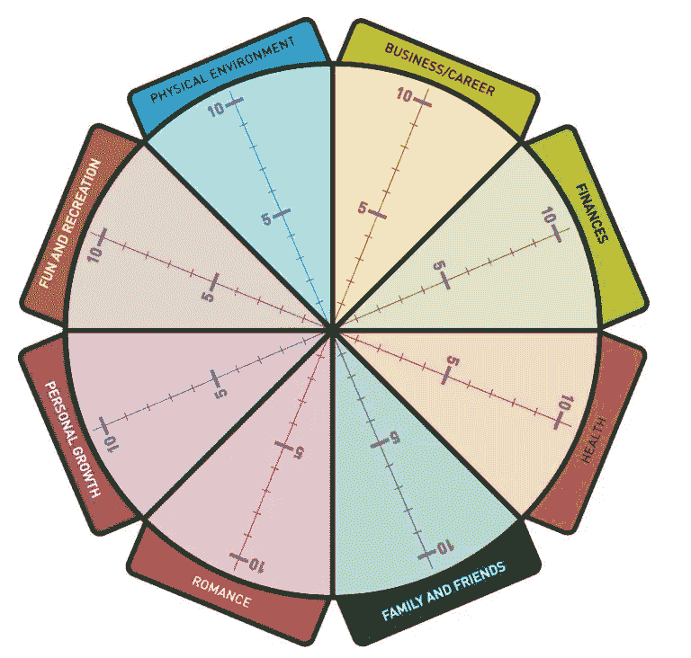
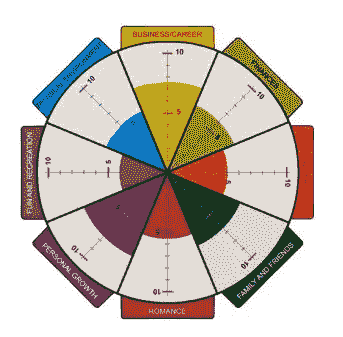

# 找到意义，给你的软件工程生涯带来快乐

> 原文：<https://betterprogramming.pub/find-meaning-and-bring-happiness-to-your-software-engineering-career-be7c249d2d1b>

## 改变你的视角，获得更好的满足感

[卡菲刘](https://unsplash.com/@kafailiu?utm_source=medium&utm_medium=referral)在 [Unsplash](https://unsplash.com?utm_source=medium&utm_medium=referral) 上的照片

如果你感到停滞不前、沮丧、没有动力或精疲力竭，这可能是你在工作中没有获得巨大成就感的征兆。

虽然与其他职业相比，软件开发人员的总体满意度较高，但我们中的许多人在职业生涯的某些阶段容易产生这种情绪，这种情绪只会因疫情及其随之而来的自身负担而加剧。

在这篇文章中，我将与你分享一个过程，它帮助我找到了更大的满足感，并改变了我对工作的看法。

# 生命之轮

生活之轮是一种练习和工具，广泛用于指导在生活的不同领域找到平衡和快乐，它对目标设定有很大的帮助。

它首先确定具体的领域，然后按照 1 到 10 的等级对满意度进行评级。之后，会绘制一个图表，这有助于鸟瞰您的情况

这使得发现缺乏满意度的领域变得容易；因此，人们可以通过计划和采取行动来改善这种情况。

下面是生命之轮的一个典型例子

需要注意的一点是，这些领域或领域在个人之间是不同的，你应该清楚每个领域需要什么。所以，慢慢来，在做练习之前做好心理准备，明确什么对你来说是重要的。

# 使用生命之轮

## 选择对你重要的东西

第一步是弄清楚哪些领域对你很重要，你的大脑应该会自动给你一些建议。你可以问自己一些问题来补充这些，比如。

我为什么去上班？

我做过什么值得骄傲的事？

我经历过哪些难忘的瞬间？

什么让我兴奋？

在我职业生涯的巅峰时期，发生了什么？

我在这份给我带来快乐的工作中做了什么？

你可以提出像(React、AWS、代码审查、FOSS)或(成长、关系、补偿、自由和影响)这样的领域

没有正确的答案，所以让你的直觉来引导你。

## 评价你的满意度

之后，你用 1-10 的尺度来评价你的满意度，1 是轮子的中心。它应该看起来像一个蜘蛛网或一个颠簸的圆圈。

花一些时间，看看你的车轮，心怀感激，欣赏你的现状。

现在请注意，如果你看到任何不期望的东西。视觉表现应该通过提供你满意度的鸟瞰图来帮助你实现新的认识。

# 滚动轮子

在定义了你想要改进的领域之后，是时候制定目标和行动计划来改变这种情况了。

> 没有目标和实现目标的计划，你就像一艘没有目的地的船—菲茨休·多德森

## **设定明智的目标。**

南 M.A.R.T 是一个缩写词，代表具体的、可衡量的、可实现的、相关的和基于时间的。这些要素共同创造了一个精心规划的、清晰的、可追踪的目标。

设定目标有助于提供方向、激励和帮助决策，并增加个人满足感和生活目标感；SMART 目标对此很有帮助。

你可以用这 5 W 个问题将一个广泛模糊的目标转化为一个清晰明确的 SMART 目标。

谁参与了这个目标？

我想完成什么？

这个目标在哪里实现？

我想什么时候实现这个目标？

我为什么要实现这个目标？

**例如**

我想在四周内在 medium 上发表一篇博文

具体来说:发表一篇博文的目标是明确的

**可衡量**:目标可以通过字数和出版状态来衡量

可实现的:互联网上有大量的文章

**相关**:写作是一种帮助自己和他人的创造性发泄方式。

**基于时间的**:目标应在 4 周内实现。

## 设置里程碑

将你的目标分解成短期目标或里程碑会带来更好的期限管理，给你机会识别可能的挑战，并让你在旅途中保持动力。基于同样的目标，您可以将里程碑定义如下

1.  在两周内创建一个草稿
2.  3 周后将文章发送给朋友进行校对
3.  在 4 周内发表文章

# 保持车轮转动

## 承认你的习惯

我们经常觉得我们每天做出的大多数选择都是精心制作的决定，但许多研究有不同的发现。

杜克大学的一名研究人员发现，人们每天做的 40%以上的事情并不是真正的决定，而是习惯。

在这篇[文章](https://jamesclear.com/habits)中，你可以学到更多关于习惯养成的知识，要点是有意识地审视一下，看看你现有的哪些习惯会帮助你达到这个目标，哪些习惯会成为障碍，创造常规是启动一系列新的健康习惯的好方法。

软件可以极大地帮助坚持养成习惯，我推荐一款基于游戏化你的生活的养成习惯的软件。

# 反思并享受这个过程

反思你的进步也是很重要的，就像我们在软件团队中做回顾一样，你也可以这样做，通过反思你的里程碑和朝着你的目标的进展，你可以问一些简单的问题，比如什么进展顺利，什么出错了，下次我可以做些什么来改进。

重要的是脱离目标，因为不断追逐新的目标永远不会带来满足感，除非是在有限的一小段时间内，然后你就会开始追逐另一个目标。

我们生活在当下，所以享受现在的你，写下你的感激，拥抱复合结果的力量。

# 资源

这里有更多我在阅读这个主题时发现有用的资源。如果你觉得它有帮助，请留下评论，与我们分享你的经验，并使用帖子来保持自己的责任感。

*   [https://www . startof happy . com/wheel-of-life-a-self-assessment-tool/](https://www.startofhappiness.com/wheel-of-life-a-self-assessment-tool/)
*   [https://www . thecoachingtoolscompany . com/wheel-of-life-complete-guide-everything-you-need-to-know/# how-to-fill-out-the-life-wheel](https://www.thecoachingtoolscompany.com/wheel-of-life-complete-guide-everything-you-need-to-know/#how-to-fill-out-the-life-wheel)
*   [https://www . indeed . com/career-advice/career-development/smart-goals](https://www.indeed.com/career-advice/career-development/smart-goals)
*   https://www . sikhnet . com/news/choice-or-habit-are-our-decisions-true-ours
*   [https://www . money control . com/news/opinion/investing-our-habits-as-do-our-brains-drive-investment-decisions-3895241 . html](https://www.moneycontrol.com/news/opinion/investing-our-habits-as-much-as-our-brains-drive-investment-decisions-3895241.html)