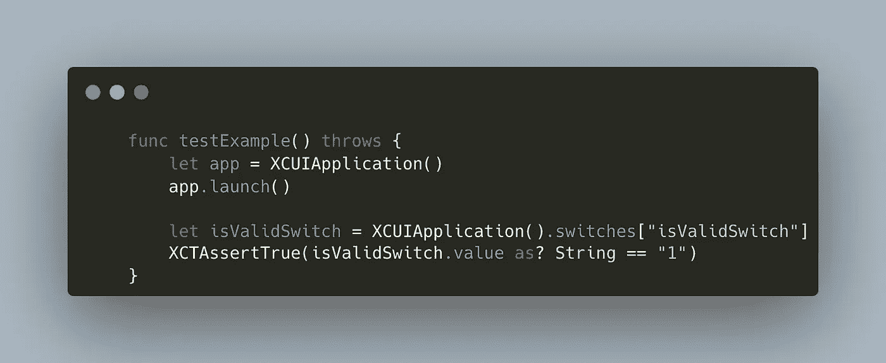

# 用 Git 二分查找 iOS 应用程序中的恶意提交

> 原文：<https://betterprogramming.pub/find-the-evil-commit-in-your-ios-application-with-git-bisect-488b1f414d98>

## 使用这个奇妙的功能节省时间


[JESHOOTS.COM](https://unsplash.com/@jeshoots?utm_source=medium&utm_medium=referral)在 [Unsplash](https://unsplash.com?utm_source=medium&utm_medium=referral) 上的照片

# 动机

了解如何轻松找到在 iOS 应用程序中引入错误的提交。

如果您与许多开发人员一起在一个大型存储库上工作，并且每天都有复杂的提交，下面的技术会很有帮助。一旦找到提交，您就可以分析文件更改以确定 bug 的根本原因。

# 技术

Git 是一个源代码控制管理(SCM)系统，它提供了一个叫做`git bisect`的有用命令。

> *这个命令使用二分搜索法算法来查找项目历史中哪个提交引入了 bug。首先告诉它一个已知包含 bug 的“坏”提交，以及一个已知在引入 bug 之前的“好”提交。*
> 
> 然后 git 二等分在这两个端点之间选择一个提交，并询问您所选择的提交是“好”还是“坏”它继续缩小范围，直到找到引入更改的确切提交。

您可以执行一个手动测试来检查它对于每个迭代是“好”还是“坏”的提交，但是这是非常乏味的。相反，你能写一个测试或者脚本来检测这个错误吗？通常，即使您不知道是什么代码导致了问题，这也是可能的。

> *如果你有一个可以判断当前源代码好坏的脚本，你可以通过发出* `*$ git bisect run my_script arguments*`命令来对分

一旦您增强了现有的`XCTestCase`，您就可以使用`git bisect run xcodebuild test ...`通过 UI 测试来检测 bug。然后 Git 可以自动执行每一次迭代，并会溢出第一次“坏”提交的信息。

为了可读性，我建议将`xcodebuild`命令外包到`Makefile`中。

下面是一个`Makefile`的例子:

```
uitest:
    xcodebuild test \
      -project FlakyApp.xcodeproj \
      -scheme FlakyAppUITests \
      -sdk iphonesimulator \
      -destination 'platform=iOS Simulator,name=iPhone 13'
```

现在可以调用`git bisect run make uitest`:)。

外包的另一个好处是，你可以调整`xcodebuild`命令，仍然可以稳定地触发`git bisect run`。例如，让我们通过指定`-only-testing`选项，只运行一个测试来检测 bug。

```
uitest:
    xcodebuild test \
      -project FlakyApp.xcodeproj \
      -scheme FlakyAppUITests \
      -sdk iphonesimulator \
      -destination 'platform=iOS Simulator,name=iPhone 13' \
      -only-testing "FlakyAppUITests/FlakyAppUITests/testExample"
```

这个改动会让对分执行更快，你还是可以用`git bisect run make uitest`触发。

# 例子

以下简化的存储库包含一个 iOS 应用程序，在某个时候引入了一个 bug。

[](https://github.com/MarcoEidinger/GitBisectXcodebuild) [## GitHub——MarcoEidinger/gitbictionXcodebuild:演示如何使用 git 二分法进行 xcodebuild 测试

### 此时您不能执行该操作。您已使用另一个标签页或窗口登录。您已在另一个选项卡中注销，或者…

github.com](https://github.com/MarcoEidinger/GitBisectXcodebuild) 

我们只知道最后一个“好的”提交(`2de359e`)和一个“坏的”提交，应用程序无法按预期工作(`6e02ff9`)。

在这个例子中，bug 是 SwiftUI Toggle 的值不再是`true`。我们可以更新`FlakyAppUITests.swift`中的 UI 测试来检查这一点。



现在，让我们开始平分提交。

```
git bisect start 6e02ff9f1e319fe095a9dcfec092f76c3005355c 2de359e2ce524d9d4e8276595cc3c70ae9311996
```

Git 告诉我们，要找到罪魁祸首，大致需要两步。

```
Bisecting: 3 revisions left to test after this (roughly 2 steps)
[7e68c4102f3d68310285fe58acbcf9d21503ff51] maybe
```

然后，我们告诉 Git 为每次迭代运行`make uitest`。

```
git bisect run make uitest
```

Git 开始处理…

```
** TEST SUCCEEDED ** [9.950 sec]Bisecting: 1 revision left to test after this (roughly 1 step)
[65c0d1ac4489241306692be4a7addbb38703aff3] maybe !...** TEST FAILED **make: *** [uitest] Error 65
Bisecting: 0 revisions left to test after this (roughly 0 steps)
[c8da8ee9fa48736b63bdbec0e1e1a179612396b3] maybe...65c0d1ac4489241306692be4a7addbb38703aff3 is the first bad commit
commit 65c0d1ac4489241306692be4a7addbb38703aff3
Author: Marco Eidinger <[eidingermarco@gmail.com](mailto:eidingermarco@gmail.com)>
Date:   Wed Apr 20 08:45:34 2022 +0200maybe !FlakyApp/ContentView.swift | 2 +-
 1 file changed, 1 insertion(+), 1 deletion(-)
```

瞧，我们知道第一个错误提交是`65c0d1a`！

现在我们知道了哪个提交是罪魁祸首，我们调用下面的提交来返回到最初的`HEAD`。

```
git bisect reset
```

注意:在这个简化的例子中，我们可以使用`git blame`来识别提交和根本原因，因为提交很少，而且提交非常小。但是想象一下，有 50 次提交，每一次都有 10 次以上的文件更改，每次都有 100 行！

*   当您不知道是什么代码导致了问题，并且正在处理一个大型且频繁更新的项目时,`git bisect`是完美的选择。
*   利用测试来自动化`git bisect`。
*   对于 iOS 应用程序，使用`xcodebuild test`。
*   对于 Swift 包，您也可以使用`xcodebuild`或`swift test`。

*最初发布于*[*https://blog . ei dinger . info*](https://blog.eidinger.info/git-bisect-run-xcodebuild)*。*