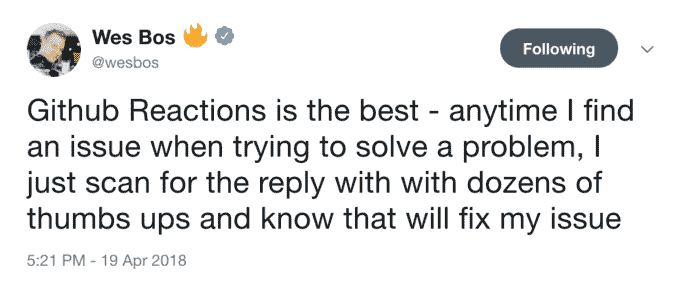

# 找到关于这个 Chrome 扩展的 GitHub 问题的最有用的评论

> 原文：<https://betterprogramming.pub/find-the-most-helpful-comments-on-github-issues-with-this-chrome-extension-c1a03e968e2>

## 快速导航并跳转到 GitHub 显著的评论

GitHub 的一个很棒的地方是问题部分，在这里你可以看到与特定项目相关的建议或帮助请求。

您可以找到许多评论，在这些评论中，开发人员抱怨一个 bug，提供一个解决方案，或者简单地指出他们希望在项目中包含的一些东西。

如果你想快速浏览这些评论，并直接进入那些有相当大反应的评论，你可以尝试安装这个 Chrome 扩展。

每个项目可能会有很多评论，所以如果你想去看已经收到反馈的评论， [GitHub 显著评论](https://chrome.google.com/webstore/detail/github-notable-comments/jcppcdjgdbnibjdeeihllbefhpibmajf)可能会有用。它简单、轻便，在 Chrome 网上商店几秒钟内就可以安装完毕。

一旦你安装了它，你就可以去一个项目的问题，并在那里看到它们。

让我们来看看[这一期](https://github.com/rails/rails/issues/31419)上的 Rails 项目。它包含 66 条评论，但是您只对阅读最有帮助的评论感兴趣。

你可以简单地使用这个漂亮的小侧边栏，并立即导航到在这类评论中收到最多反应的评论。

是的，就这么简单。

它是开源的，由另一个名为[GitHub 的 Chrome 扩展开发者开发。](https://medium.com/p/githunt-trending-github-projects-in-your-chrome-new-tab-screen-d57168922918)