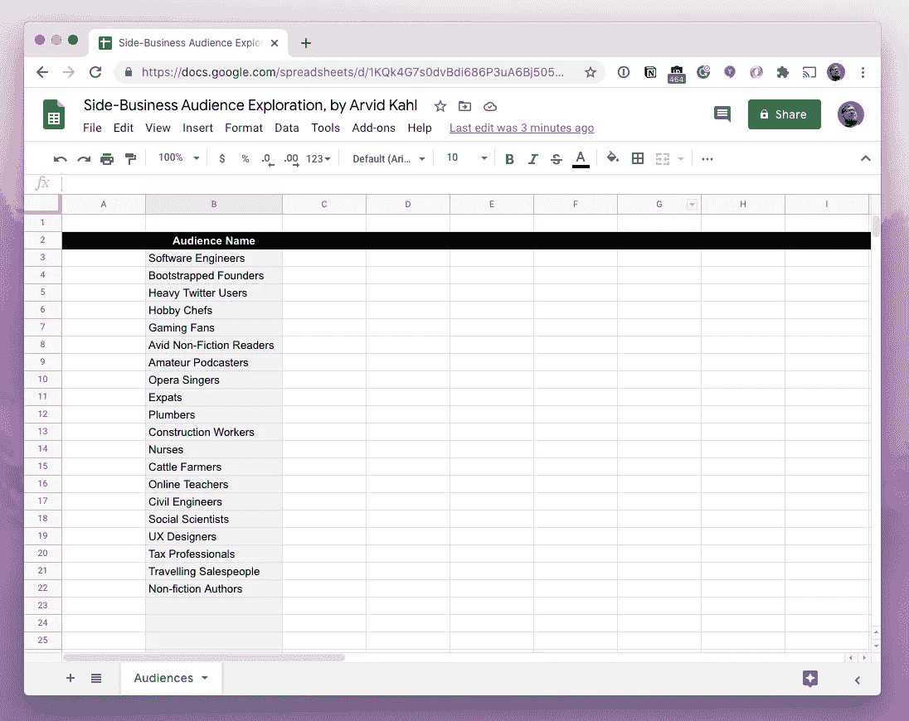
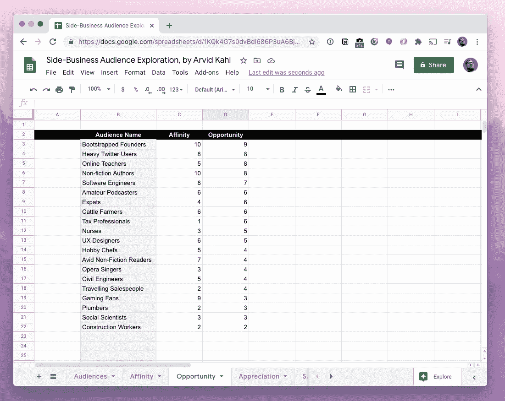
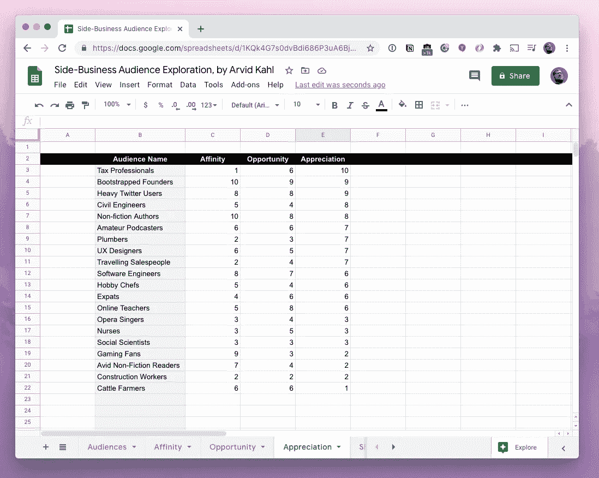
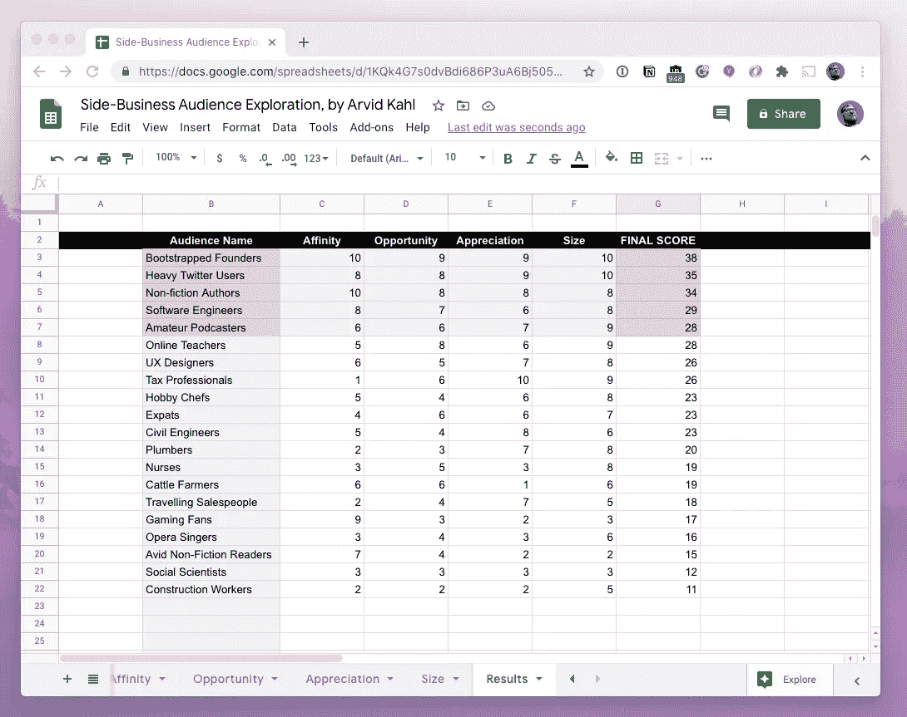

# 为你的副业寻找观众

> 原文：<https://betterprogramming.pub/finding-an-audience-for-your-side-business-66ecd59d9c9c>

## 构建你的第一个产品“观众至上”的分步指南

(几乎)就这么简单！

在本文中，您将学习如何使用数据驱动的方法为您的副业寻找受众。我见过这种方法对几位创始人奏效，让他们发现了不仅能维持企业多年，还能让它成为一次愉快旅程的受众。

在我们开始逐步指南之前，我想解决许多新晋企业家面临的一个特殊问题，尤其是当他们来自工程背景时:他们严重低估了观众的重要性——这带来了灾难性的后果。

你有没有去过博物馆，但在出去的时候却被推进了礼品店？礼品店并不是主要的吸引人之处，但是它们对这些机构的盈利做出了巨大的贡献。但没有哪个头脑正常的企业家会在自家车库里开一家博物馆礼品店，还指望它能盈利。一个存放艺术印刷品和室内设计书籍的商店需要一个非常特定的读者群。博物馆已经明白，要向人们出售与艺术相关的书籍，他们需要把书店放在他们的艺术观众已经在的地方:在他们离开展览的路上。博物馆明白一个成功企业的核心规则:首先找到你的观众，然后卖给他们他们需要的东西。他们认为“观众至上”

如果博物馆已经明白这一点，为什么我们仍然看到这么多的创始人创造解决方案寻找一个问题？为什么如此多的企业家绞尽脑汁去寻找一个“好的商业想法”，然后投入到产品的开发中，然后奇怪为什么他们似乎找不到任何人来购买他们的解决方案？在建立自己的企业时，你如何避免犯同样的错误？

它始于治愈所有偏见的方法:内省。主要是，如果你来自工程背景，你的视角会偏向于创造产品。对于工程师来说，一切都是潜在的产品。我们被训练去创造产品；我们被教导要以产品为先。我们使用产品。我们制造产品，我们了解产品。

可悲的是，这经常会导致我们产生一个逻辑谬误:我们假设既然*我们*觉得某样东西需要存在，*其他人*也会有同样的需要。我们想要它，所以其他人也会想要它。即使很明显他们不知道，我们也让自己相信，如果我们卖得足够努力，有人会买我们提供的东西。

这种方法是本末倒置的。这是错误的方式。如果我们先生产产品，然后询问谁可能想买，我们就太冒险了。这就像“*生产中的测试*”在将代码部署给客户之前，您希望检查代码是否运行良好。为什么不为你的企业做同样的事情呢？

最大限度减少猜测的最好方法是“T2”阶段验证“T3”方法。我推荐以下步骤，而不是从一个想法开始，构建一个产品，然后检查这个产品是否为其他人解决了问题。

*   首先，*探索你想帮助哪些受众*。选择你认为最有可能支持你的商业努力的受众。验证:确保观众对你感兴趣，人数众多，有令人兴奋的问题，并愿意为解决方案付费。
*   然后，观察观众并*发现他们最关键的问题*。选择其中最关键的问题。验证:确保问题是真正关键的，人们已经在寻找解决方案，并且不能轻易忽视或委派。
*   然后，*设想一个解决方案，在你的观众的工作流程中解决这个问题*。验证:确保你的解决方案没有意想不到的副作用，并在不增加额外工作的情况下解决他们的问题。
*   最后，也只有现在，*想到产品*。你需要用哪种媒介来提供你的解决方案？会是手机 app 吗？SaaS 的申请？一个平台？现在是“想法”和“产品”的时候了

如果你遵循这些步骤，你会发现你的“想法”必须等待。这不是突然冒出来的天才之举，而是三个不同验证步骤的深思熟虑的结果。如果你先了解谁在那里，他们真正的挣扎是什么，以及你如何最好地帮助他们，那将是最好的。这样，你的产品成功的机会比采用一个完全未经验证的“想法”要高得多。

# 观众探索的实用方法

本文的目标是帮助您找到最初的受众。让我们从探索哪种受众最适合你开始，并确保它有能力支持一项业务。在我的指导工作中，我发现了一个产生显著效果的五步法。它会让你找到一个你可以长期服务的观众——并且同样长时间地为你服务。

我会建议你采取务实的步骤来找到你的最佳听众。不要盲目遵循这些步骤，因为它们对你的效果可能不如对我或我的学员的效果好。找到适合你的方法，并以此作为你个人框架的基础来解决这些问题。这五个步骤会给你数据:你可以检查、衡量并从中得出结论的数字。虽然这些结论对每个创始人来说都是独一无二的，但收集信息非常简单。这会让你对自己有更深刻的认识，这对你决定一些重要的事情非常有价值，比如选择你需要与之共事多年的听众。

本练习的结果将是一个受众列表，您可以通过构建解决他们关键问题的产品来帮助他们，从而创造建立可持续业务的机会。这将是一个排名列表，最有可能的候选观众在顶部，不太感兴趣的在底部。

在这个过程中，你需要做一些笔记。从一个空的电子表格开始，将“观众姓名”放在第一列。

为观众探索搭建舞台。

## 第一步:意识——考虑可能的受众

要找到一个能让你建立伟大事业的利基受众，你首先需要意识到这一点。有些壁龛清晰可见，有些有些隐蔽。这一步与找到它们有关。

这一步的目标是找到一群你想帮助的人。它应该是一个定义明确的团体，最好以共同的兴趣或活动为中心。

一个部落会工作得最好。部落由拥有共同兴趣的人组成，他们之间有着高度的联系，并追随相同的领袖。他们造就了优秀的小众观众。此时此刻，你可能是几个部落的一员。

从你自己开始，然后从你的小圈子向你认识的人的外围扩展。

问问你自己:

*   你属于哪个部落？你有意识地(因为你参与，就像是象棋俱乐部成员)和无意识地(因为隶属关系，就像是体育迷)属于哪个社团？它可以包括虚拟社区和现实世界的团体。
*   **你有什么爱好？**你喜欢什么东西，即使它不是必需品，你也愿意花钱去买？这里的例子有精酿啤酒或修理旧车。找到你有预算的活动。
*   **你从事什么职业？**你一生中做过哪些工作？你参加过什么类型的专业团体？
*   你的另一半在做什么？他们属于哪些与你的群体不同的群体？你们认识之前他们属于哪个团体？当他们还是孩子的时候，他们参加了哪些俱乐部和协会？
*   你的父母和兄弟姐妹属于哪个群体？他们在做什么工作，和什么团体一起出去玩？你在家庭聚会上谈论的事情是什么，他们对此有着惊人的洞察力？
*   **你经常去哪些社交圈？**你和哪种人交往？想一想你最近参加过的聚会或其他社交聚会。谁是你最常点击的人，他们做什么？

您从本练习中得出的列表应该包含几十个受众。让我给你一个我的个人清单的例子:

对于这份名单上的每一位观众，我要么是专家，要么在我的朋友和家人的圈子里直接接触到专家。我在过去几年中收集的完整列表包含至少 300 个不同的受众。我打赌你能在几个小时内想出至少 100 种不同的人群。

寻找你可能还没有意识到的观众的另一种方法是通过观察你周围的事物。对于你看到的每一件物品，想想 1) *谁*制造了它，2) *他们如何*制造它，3)*代表*是谁，以及 4)它是如何*使用的*。虽然 1 和 4 可以立即让您了解对象，但 2 和 3 可以让您思考对象在制作时(想想像一张纸这样的东西的生产链中涉及的所有许多业务和活动:林业、伐木、造纸厂、分销、销售、营销)或在使用时(让我们坚持纸:制笔商、印刷厂、出版商、编辑、图书俱乐部组织者、婚礼表卡印刷商)所经历的互动。大多数物体，当被这样审视时，会让几十个观众想起。

当你有几十个，最好是一百个或更多的观众时，你就完成了这一步。你试图找到这么多的人来打开你的思维，看看人们做了什么不同的事情，然后聚集在一起。重要的是走出你的舒适区，扩大你的工作视野。可转移技能的真正影响在于它们尚未转移到的地方。你试图在这里找到那些地方。

## 第二步:亲和力——发现你有多在乎他们

有了一份潜在受众和利基市场的清单，你现在需要剔除你不关心的市场。没有一家企业是由不关心产品销售对象的创始人成功创建的。你需要真心实意地帮助你的客户，否则你会在某个时候失去为他们提供价值的兴趣。

这是过程中非常主观的一步。你需要花几分钟思考一下，你希望在每个行业中工作的人是什么样的。最好的方法是问自己几个问题给每个观众，并给每个观众打分。

在电子表格中添加一个新栏，称为“亲和力”对于电子表格中的每一行，您需要给出一个介于 0 到 10 之间的评分。零表示你根本不在乎为这个受众服务，十表示你想把一生都奉献给为那个小众的人服务。

为了找出你对观众的亲和力，问自己这些问题，并迅速记下每个问题的 0-10 分。

*   你认为观众需要过去没有给予他们的帮助吗？
*   你认为这些观众应该比现在更成功吗？
*   你认为与这些人的谈话有趣、富有成效、令人愉快吗？
*   你是否看到了一个更深刻的原因，一种驱使这些观众去做他们所做的事情的激情？
*   观众在做有意义的事情吗？
*   这个利基市场的人们能做些更有意义的事情吗？
*   你认为你会从学习这个领域的工作中受益吗？

当您回答完所有这些问题后，将您给出的分值相加，然后除以您问自己的问题数，得出平均值。这个数字是你有多在乎观众的一个指标。

一旦你做到了这一点，按照亲和力平均值降序排列你的列表。光是这一点就足以让人大开眼界，因为你会看到星团的出现。会有一群你关心的事情，因为你是这些观众的一部分。这是潜在业务的巨大来源，因为你将解决自己的问题。另一个令人兴奋的群体是你真正感兴趣的一群观众，因为一种特殊的热情或使命驱使着他们。在这里，你会发现热切的观众，愿意尝试任何使他们的工作更容易的事情，因为他们相信这是一项重要的工作。

这一步会让你清楚地看到你最关心的人。

在这个阶段当心偏见。我建议和你的“常驻专家”谈谈，从内部了解一下观众的感受。只有这样，你才应该逐步完成这些问题。

将亲和力为 5 或更低的受众移至电子表格的另一张表单。他们现在不是首要目标，但你以后可能会改变主意。此时，我们只对您关心的受众感兴趣，因为这需要花费大量时间和精力进行探索和验证。

## 第三步:机会——了解他们是否有有趣的问题

有了一份精简的清单，你就可以开始下一步了。对于每一位观众，你会想知道他们是否有什么有趣的问题。你还没有找到他们的关键问题，因为此时你只会粗略地看一眼你的观众，但还是要保持警惕。如果你看到他们真正需要帮助的事情，这是一个好迹象。

针对每一位听众，做以下事情，了解他们是否有有趣的问题。

*   在他们的空间里找到一些 SaaS 的产品，看看它们能解决什么问题。这些是真正令人兴奋的问题吗？解决这些问题是好的方式吗？
*   **找一个社区论坛或社交媒体群，你的小众读者可以在那里闲逛，浏览他们最近的帖子。**人们是否在为你觉得有兴趣帮助他们的事情而苦苦挣扎？

以下是开始查找此信息的几个地方，并提供了面向示例受众(管道工)的示例:

*   **水坑。**这些是你所在领域的非正式群体。这是他们不被要求就聚集在一起的地方，在这里他们自由地交换信息，没有监督。
*   **脸书群组**，例如“管道黑客和管道专业讨论”你可能需要花点功夫才能加入这些团体，但是解释你对帮助他人感兴趣并承诺不张贴广告通常会奏效。
*   **Reddit** ，例如“管道工程”、“暖通空调”和“建筑”子编辑。人们在 Reddit 上问了很多问题，他们非常公开地谈论他们不喜欢的事情。
*   **Twitter** ，探索#plumbing 标签，关注并接触使用它的专家。
*   **自我托管的社区**，如 PlumbingZone.com(拥有超过 30，000 名专业会员的论坛)或 PlumbersForums.net。花几个小时阅读这些帖子，跟随所有链接到更多的社区和博客，找到专家和思想领袖，然后在社交媒体上关注他们。社区越像 90 年代的网站越好。老社区吸引并容纳了许多行业老手。
*   **萧条的社区。**许多行业都有专家每天互动的松散团队。使用 slow 社区发现平台，如 Slofile 或 T21，来寻找潜在的候选人。
*   **正式社区**。大多数行业都有一些组织机构，如协会和行会，形成某种虚拟社区。对于我们的例子，“美国和加拿大管道和管件行业熟练工和学徒联合协会”有一个包含社区和子章节列表的网站。仅仅给社区代表发一封电子邮件或打一个电话就能让你接触到合适的人。
*   **活动资源。**找到你的观众参加的商展和会议，查看他们的网站。哪些供应商出席了会议？讨论了哪些话题？通常，主题演讲人和他们的演讲会被列出来，即使没有录音。
*   **文学。每个行业都有发表论文、书籍、文章或评论的作家。在利基中找到[的流行书籍，阅读它们，或者找到摘要来快速浏览它们涵盖的主题。](https://www.amazon.com/s?k=plumbing)**

我建议为你名单上的每个观众花一个小时。尽可能深入这个行业，看看你能提出哪些问题和抱怨。记下什么存在，什么不存在，特别是你以为会存在但没有的东西。这是你可能促成的潜在知识转移的一个标志。

对于受众列表中的每一行，记下您遇到的问题(最好在电子表格之外，在谷歌文档或概念文档中完成)，并添加另一个 0-10 值列，表明这些问题在您看来有多有趣。将没有令人兴奋的问题的行移到另一个表中，就像您对低关联性行所做的那样。

根据机会对列表进行排序是很有见地的:很明显，有很多观众有有趣的问题，但你并不真的太关心他们。

## 第四步:欣赏——了解他们是否愿意付钱

在这一步，你要试着弄清楚你的听众是否有预算来解决他们的问题。这种情况在某些受众中比在其他受众中更有可能发生:拥有数百名员工的护发产品供应商购买客户关系管理软件不会有任何问题。相比之下，发型师，虽然他们也在美容行业工作，必须与客户建立关系，但可能没有任何预算或根本不会支付这笔费用。

对于列表中的每个受众，寻找以下迹象:

*   购买代理:在购买专业工具时，你的销售对象能自己做决定吗？你必须进行经典销售吗，或者你能以一种更低接触、高度自动化的方式销售吗？工作越少，参与的人越少越好。
*   **预算范围:**在这个细分市场中，你的潜在客户通常可以在产品和服务上花费什么样的预算？研究一下迎合你的潜在客户的其他服务，看看它们是如何定价的。想想人们是否意识到他们有购买专业工具的预算。

当我们把 FeedbackPanda 卖给在线老师的时候，他们往往连自己是个体户商人都不明白。有时，你需要在你的领域内建立意识，让他们意识到可以通过节税的方式来改善他们的生活方式。

你在观众中找到的代理和可靠的预算越多，就越好。如果你看到有人抱怨解决方案太贵或者应该免费，你通常可以不予理会，因为这些声音出现在每个行业。然而，如果这是你发现的社区内的共识，要小心了。你可能会碰壁，试图说服人们用金钱来换取这里的服务。

对于每一个你认为可能会付费或被说服开始为解决他们的问题而预算的受众，在你的列表中他们的那一行再加上 0-10 的值。将没有明确购买意向指标的受众移至另一页。

有趣的是，一些你可能不太关心的观众可能非常愿意为他们关键问题的解决方案付费。

## 第五步:规模——了解这个市场能否支撑一项业务

为你的可持续自举业务找到一个好的受众的最后一步将确保你的业务实际上是可行的。一旦你完成了这一步，你将会得到一个企业列表，你可以为这些企业建立解决方案，并且很有可能将这些方案转化为业务。

对于创业者来说，一个市场既要足够大以维持你的业务，又要足够小以不吸引巨大的竞争对手。为了找到这个“金发区”，你需要知道你的企业要有多大才能支撑你。对于一些创始人来说，这将是每月 10，000 美元的税后收入，而其他人则需要更多或更少。

把这个数字翻倍，然后除以你认为你的观众会为一个软件产品支付的价格。这将是你至少需要拥有的客户数量，以达到你想要的收入水平。

让我们看一个例子。比方说，你需要 15，000 美元/月从你的 SaaS 养活你自己和你的家人。翻倍，也就是 3 万美元。你已经发现，在“新泽西的手工养蜂人”这一小众受众中，追踪蜜蜂的 SaaS 的平均预算最多是 15 美元/月。你需要 2000 个顾客。新泽西需要 2000 名手工养蜂人。如果你查一下新泽西养蜂人协会(是的，确实存在)，你会发现他们有八个分会，网站上有很多电子邮件和电话号码。给他们中的一些人打电话，告诉他们你喜欢养蜂，愿意帮助当地的蜂蜜生产商。电话另一端的人会马上告诉你是否有 2000 多名观众。

我在很多行业都做过多次这样的工作。它总是很有洞察力，一旦你知道了一个市场的规模，你就有了有价值的信息，即使你没有进入那个特定的行业。

快速确定市场规模的其他来源包括社交媒体群体用户数、贸易展传单、行业报告以及向利基行业的播客主持人发送电子邮件。

花尽可能多的时间去弄清楚你的业务是否有足够多的受众。然后，确保你的利基市场中没有数百万的潜在客户。如果你拥有一个小型的、自举的、可持续发展的企业，你将没有资源去对抗财大气粗的巨大竞争对手。你的利基不应该对那些企业有足够的吸引力。

回头看看养蜂人的例子，如果你的读者是 2000 到 40000 名养蜂人，那就太好了。任何更大的东西都可能意味着来自更大企业的竞争，这些企业意识到有机会完全接管你的利基市场，并为各地的所有养蜂人服务。

对于你名单上的每一个受众，再加一个 0-10 的值，表明这个利基市场的规模是否正好适合你的创业抱负。十应该是一个完美的市场。零是一个要么太小要么太大的市场。将不适合的观众移到另一张纸上。

尤其是在电子表格的底部，你会发现，不管你有多喜欢做生意，你都很难找到这样的受众。

# 统计结果

现在，您将会看到许多观众已经通过了以下检查点:

*   你*知道*这个利基市场
*   你*对利基市场*感兴趣
*   你在利基市场发现了*有趣的问题*
*   你已经看到了为利基解决方案支付的*兴趣的迹象*
*   你已经发现这个利基市场对你的企业来说足够大

在电子表格中，创建最后一列，为每行添加点值。然后，对整个表格进行排序，使最高的总分值显示在顶部。

> 快速补充:这只是一个框架，您可以根据自己的需要进行定制。您可以添加更多具有其他考虑因素的列，或者更改每列的值范围，以反映该特殊考虑因素对您的重要性。最基本的是，这个电子表格会给你一个提示，哪个受众最有可能让你建立一个成功和令人满意的企业。我不会把这个过程搞得太复杂——我是作为一名软件工程师这么说的。

看来我找到了几个真正有趣的观众。有趣的是这篇文章至少对他们中的两个人有用。

有了这个列表，你就可以选择你的听众了。一旦你选择了清单上的一项，我建议你再深入研究一下这个行业。仔细阅读这个行业的历史，看看谁已经进入了这个行业，以及他们如何与他们的客户沟通。

在这一点上，你将坚持与你的观众，并专注于帮助他们解决他们的问题。找到并确认他们的关键问题是你的下一个目标。一旦你做到了这一点，你就可以处理你的解决方案并实现你的产品——因为你知道你是在为经验证的受众构建。

这个练习的伟大之处在于，你不仅仅会有几个真正感兴趣的观众可以马上开始，而且你还会有所有那些在这个过程的某些步骤中被排除在外的观众。在未来，当你出售你的企业，或者当世界发生重大变化时，你已经有了新的观众等待你用新的眼光去发掘。这是一个你知道你可以服务的预先验证的受众的积压。说到安全垫。

但是现在，坚持和数据显示是最佳选择的观众在一起。深入社区和部落，找出那些人需要什么帮助。从那里，你可以建立一个可持续的业务，以一种有效的方式解决他们的问题，没有任何猜测。