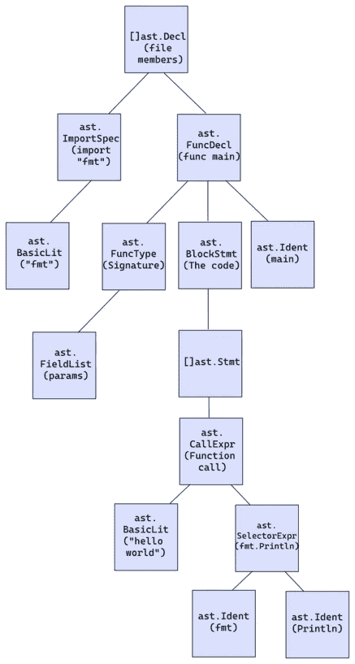

# 使用 Go 以编程方式查找代码中的 bug

> 原文：<https://betterprogramming.pub/finding-bugs-in-code-programmatically-using-go-c5599796e89e>

## 编写一个静态代码分析器来发现代码中的错误


照片由 [Pixabay](https://www.pexels.com/@pixabay?utm_content=attributionCopyText&utm_medium=referral&utm_source=pexels) 从[像素](https://www.pexels.com/photo/antique-book-hand-knowledge-207681/?utm_content=attributionCopyText&utm_medium=referral&utm_source=pexels)拍摄

这是一篇基于一年前我在 gopherCon 举办的关于 Go 中静态分析的研讨会的博文。研讨会的内容远远超出了我在本文中所能涵盖的范围，因此您可以在这里查看研讨会。

# 动机

根据维基百科，静态代码分析是在不执行计算机程序的情况下对它们进行的分析。您可能已经熟悉了进行静态分析的工具:

*   用于检测样式错误并修复它们的棉绒。
*   内置的 IDE 分析器，用于检测不同的问题，如无限循环、不可达代码和声明冗余。
*   go 分析器 [staticcheck](https://github.com/dominikh/go-tools) 和开源平台 [SonarQube](https://www.sonarqube.org/) 。

你为什么要在乎？当在有许多开发人员的团队中工作时，代码分析器是必不可少的。它们被用在 CI/CD 过程中，以确保没有坏的实践、错误和反模式被推送到主 repo。

Go 语言提供了用于创建静态代码分析器的 [go/analysis](https://pkg.go.dev/golang.org/x/tools/go/analysis) 包。在讨论如何编写这些工具之前，我们需要介绍一些理论。

# 大西洋时间

抽象语法树(AST)是一种将编程语言的语法表示为分层树状结构的方式。让我们来看看下面的程序:

这是程序的 AST。



`[]ast.Decl`包含文件中所有的顶级声明——imports 和 main 函数。在`[ast.FuncDecl](http://ast.FuncDecl)`内部，也就是`main`函数声明，我们有一个`[ast.blockStmt](https://golang.org/pkg/go/ast/#BlockStmt)`。它是函数语句的列表——主函数的实际代码。我们可以继续沿着树往下走，但是您可以很容易地将树节点与实际代码匹配起来。(为了简洁起见，我删除了树中的一些节点)。

Go 提供了`[go/ast](https://pkg.go.dev/go/ast)`包。AST 包包含了用来表示 Go 中语法树的类型，就像上面的树一样。我们来看看`[ast.AssignStmt](https://pkg.go.dev/go/ast#AssignStmt)`。以下代码来自`[go/ast](https://pkg.go.dev/go/ast)`包:

表达式`a := 5`是一个赋值，所以它在 AST 中被表示为一个`[ast.AssignStmt](https://pkg.go.dev/go/ast#AssignStmt)`，如下所示:

*   `Lhs`是【a】
*   `TokPos` [2](字符“:”的位置)
*   `Tok` [:=]
*   `Rhs`是【5】

包中所有类型的列表有[长](https://pkg.go.dev/go/ast#pkg-index)，但是它符合您的实际期望。您还可以使用这个[站点](http://goast.yuroyoro.net/)查看代码的 AST 树。

# 编写分析器

在这一部分，我们将编写一个静态分析器来检测函数参数是否被覆盖。这被认为是一种代码味道，因为它使得在调试过程中很难知道什么参数被传递给了一个函数。你可以在这里查看分析器[的全部代码。](https://github.com/amit-davidson/ArgOverwritten)

首先，让我们来看一个分析器的典型结构。我们为每一遍创建一个名为`passes`的目录。每一遍都是对我们代码的检查。它们中的每一个都生活在自己的包中，包括它的逻辑和测试。然后我们创建一个`main`文件，该文件执行模块拥有的通道。

```
│── README.md
│── cmd
│   └── analyzerName
│       └── main.go
│── go.mod
│── go.sum
└── passes
    └── passName
        │── analyzer.go
        │── analyzer_test.go
        └── testdata
```

`[go/analysis](https://pkg.go.dev/golang.org/x/tools/go/analysis)`包为模块化静态分析工具定义了一个 API。首先，所有的通道都应该创建一个`[analysis.Analyzer](https://pkg.go.dev/golang.org/x/tools/go/analysis#hdr-Analyzer)`的实例。它描述了一个分析函数:它的名称、文档、标志、与其他分析器的关系，当然还有它的逻辑。

我们将从向`[analyzer.go](https://github.com/amit-davidson/ArgOverwritten/blob/master/passes/ArgOverwritten/analyzer.go)`添加分析器开始。我们还将添加它的名称和文档。

下面是`[analyzer.go](https://github.com/amit-davidson/ArgOverwritten/blob/master/passes/ArgOverwritten/analyzer.go)`文件中的`run`函数。它包含分析器的实际逻辑。它接收类型为`*[analysis.Pass](https://pkg.go.dev/golang.org/x/tools/go/analysis#hdr-Pass)`的参数。`*[analysis.Pass](https://pkg.go.dev/golang.org/x/tools/go/analysis#hdr-Pass)`提供信息和操作，用于向分析仪的`Run`功能报告有关被分析包的诊断。

让我们看看下面代码中的第 51–53 行。我们遍历所有文件，并对每个文件运行`[ast.Inspect](https://pkg.go.dev/go/ast#Inspect)`函数。这个函数以深度优先的顺序遍历给定文件的 AST 树。该函数还被赋予了 visitor 函数，它接收一个 AST 节点，这就是逻辑发生的地方。

在第 3–18 行，我们验证给定的节点与我们的条件匹配:

*   第 3–15 行确保节点类型是函数——常规函数或 lambda 函数。此外，在第 13–15 行，我们排除了没有主体的函数，比如汇编例程。
*   在第 16–18 行，没有参数的函数被排除在外。

我们迭代第 20-25 行的每个参数，并从中构造一个集合。第 27-47 行是奇迹发生的地方。

我们从作为根节点的函数体开始遍历树。然后在函数体中搜索修改了变量的语句- `AssignStmt`(例如 a = 5)和`IncDecStmt`(例如 i++)。

然后我们检查参与语句的标识符，如果它是集合中的一个参数(arguments)，那么它被认为是一个错误，我们调用 report 函数。这是我写的一个辅助函数，下面可以看到它的代码。它所做的只是包装对`pass.Report`的调用，该调用实际上通知用户一个错误。

最后，我们将添加一个新的`main`文件和一个使用我们刚刚编写的分析器的`main`函数。要运行分析仪，您必须使用单次/多次检查器进行单次/多次检查。

# 运行我们的分析仪

既然我们的分析器已经准备好了，我们想在一个实际的文件上运行它。我们可以使用以下命令运行它:

```
go install path/to/analyzer
go vet -vettool=$(which analyzername) path/to/files
```

第一个命令将分析器作为二进制文件安装，第二个命令使用`go vet`运行它。这样，您可以轻松地将其集成到您的 IDE 或 CI/CD 环境中。

我们也可以使用`[analysistest](https://pkg.go.dev/golang.org/x/tools/go/analysis/analysistest)`包测试我们的代码。使用`analysistest.Run`，可以对带有测试文件的名为`testdata`的包运行分析器，并检查它是否报告了所有预期的诊断。期望用“//想要...”来表达输入代码中的注释，如下所示:

最后，我们必须从下面的测试文件中调用`[analysistest.Run](https://pkg.go.dev/golang.org/x/tools/go/analysis/analysistest#Run)`。

```
analysistest.Run(t, analysistest.TestData(), Analyzer)
```

第一个参数是`*testing.T`，第二个是测试文件的路径，很容易由`[analysistest.TestData()](https://pkg.go.dev/golang.org/x/tools/go/analysis/analysistest#pkg-variables)`提供给我们，第三个是实际的分析器本身。