# “查找资料”——打造卓越的搜索体验

> 原文：<https://betterprogramming.pub/finding-stuff-building-a-great-search-experience-e001d994d7db>

## 改善您在 Elasticsearch 中的搜索结果

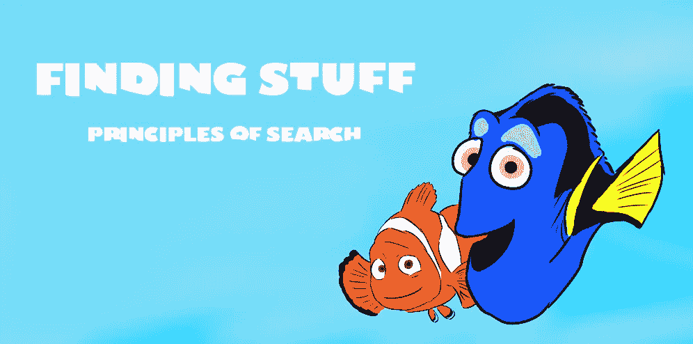

图片来源:作者

搜索无处不在。没有它你一天怎么活下去！？每个网站和每个产品的一部分都有。无论你是在购买内衣，还是在网飞看周五晚上的电影，甚至是领导一个尖端的研究团队，只需按几个键就能找到你需要的东西，这可以说是一个现代奇迹。

尽管无处不在，为什么搜索经常如此可怕？它经常被视为二等品，是额外的奖励。它插上电源，开箱即可使用。打造一个平衡的搜索体验需要时间、思想和努力。

# 在开始之前

谈论概念而没有一个实际的例子来看往往会成为一个挑战。在这篇文章中，我们将使用来自 [Goodreads](https://www.goodreads.com/) 网站的大约 10，000 本书的样本。数据集本身以及将其加载到 [Elasticsearch](https://www.elastic.co/elasticsearch/) 的脚本可以在这里找到:

【https://github.com/lucas-matt/search_playground 

# 原则 1。搜索引擎是愚蠢的，你不是

搜索引擎通常被视为另一个数据库。它们在许多方面看起来和行为都很相似，但是一旦触及表面，就会发现大量奇特的算法和高度优化的数据结构，它们与标准数据存储截然不同。

任何搜索工具都有许多我们需要理解的部分，以便我们可以在它们的基础上进行构建:

*   **分析**(将一大块文本分解成片段)
*   **倒排索引**(标记到出现它们的文档的快速映射)
*   **排名算法**(基于信息与查询的相关性对信息进行识别和排序)

## 分析

当我们将文档推入搜索引擎时，它们会被切成许多小块。这些块，或者说令牌(从现在开始我们应该这样称呼它们)，是搜索引擎的核心货币。

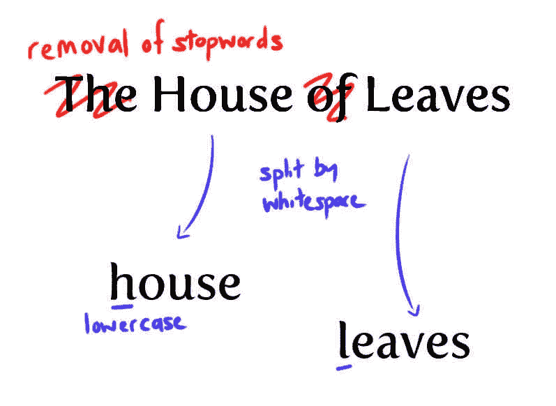

图片来源:作者

我们通过索引的模式定义来控制令牌的生成方式。我们如何利用这种力量对搜索引擎的行为有着巨大的影响——这是我们能够掌握它的主要手段之一。选择范围很广，包括转换，如令牌大小(n-grams)，删除有问题的停用词(例如，*、*和*、 *this* ，以及词干(例如，*书*到*书*)。我们一会儿会看看其中的一些。*

## *索引*

*拿起任何一本非小说类的教科书，翻到后面几页。这里我们有一个数据结构，它将主题的关键术语映射到它们最重要的段落。*

*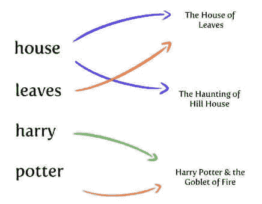*

*图片来源:作者*

*搜索引擎的*倒排索引*的行为非常类似。简单地说，它将文档中出现的标记映射到它出现的文档。*

## *等级*

*当您搜索某个内容时，该引擎会将您的标记化查询与索引进行匹配，并使用排名算法对每个结果进行评分。传统上，使用诸如 [TF-IDF](https://en.wikipedia.org/wiki/Tf%E2%80%93idf) 的算法。文档与某个术语的匹配频率(TF，术语频率)越高，它对该文档的评级就越高，偏移量是该术语的常见程度(IDF，逆文档频率)。*

*所有记录都有一个分数，并相互竞争以确定获胜者:你的搜索结果。*

## *所以搜索引擎是聪明的，对吗？*

*不完全是。尽管这一切背后的工程学是计算机科学家的梦想，但搜索引擎是彻头彻尾的白痴！如果查询生成的标记与索引中的任何标记都不完全匹配，那么您就不走运了。例如，如果您的索引有*匹马*，但是查询分析器生成了*匹马*，那就太糟糕了。*

*垃圾进，垃圾出！策划是你的工作。*

*不要盲目地向搜索引擎添加大量数据。你有责任把大量的文本转化成有用的东西。*

# *原则二。不仅仅是令牌，还有特性*

*从文档中生成的标记不仅仅是索引中的项目。它们代表了关于它的核心思想。*

*什么是特性？让我们以数据集中的经典标题《德古拉》为例。*

*在这里，我们只看到了与这部小说相关的几个特征——这是一部哥特经典，由作者布莱姆·斯托克于 1897 年出版，平均评分为 3.98/5。*

*原始资料通常会包含大量的特征，就放在那里等着被采摘，但通常最有价值的特征需要从地表下挖掘出来。您需要对特征进行建模，以帮助传达文档中的思想。这项技术被命名为*特征提取*。在这里，你可以扮演疯狂的科学家，将文本提取到最基本的内容，去除其中所有的混乱和模糊。*

*特征工程发生在索引的分析阶段。搜索引擎有几个工具可以帮助我们有效地做到这一点。让我们回顾其中的几个。*

## ***n-grams***

*任何搜索引擎的默认标记化策略通常是(a)删除所有标点符号和特殊字符，然后(b)拆分任何空白。这可以作为一个很好的初始策略，因为搜索一个特定的单词会给你一个成功的匹配。然而，对于那些我们拼写有困难的长单词，这不是一个很好的方法。*

*想象一下搜索 Cryptonomicon 这本书。一半的用户会输入“Crypton”并点击回车键。使用标准分析仪，这不会走得太远。请记住，搜索引擎是愚蠢的，开箱即用的策略只会产生单个令牌 *Cryptonomicon* ，它不会匹配我们的搜索请求。*

*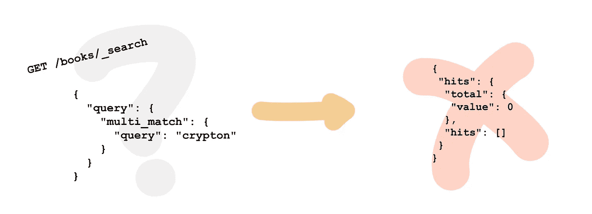*

*图片来源:作者*

*n-gram，尤其是边 n-gram，对于那些你想要部分匹配的领域是非常有用的。看看通过对“密码图标”进行 n 次编程所产生的大量代币。*

*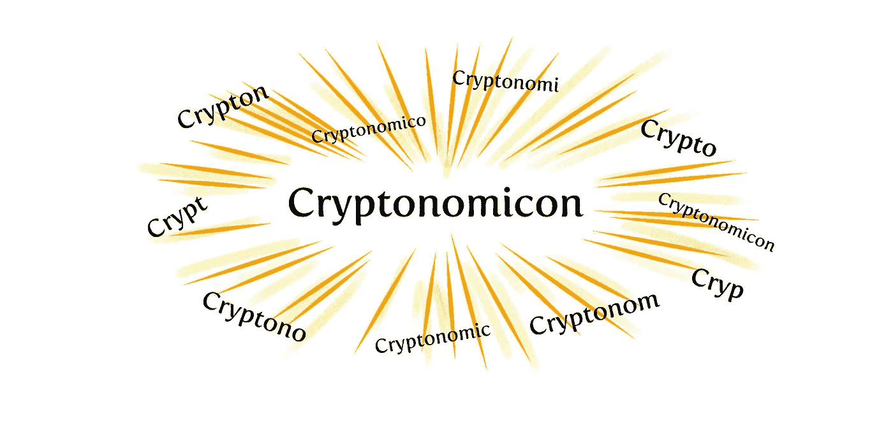*

*图片来源:作者*

*使用这种策略，因为 *crypto* 是 n-gram 分析器生成的令牌之一，所以我们得到了匹配。*

**

*图片来源:作者*

## *堵塞物*

*词干包括找到单词的词根。许多术语都有相同的核心含义:*快*、*快*、*快*都来自同一个地方，同样的还有*快乐*、*更快乐*、*最快乐、*和*快乐*。*

*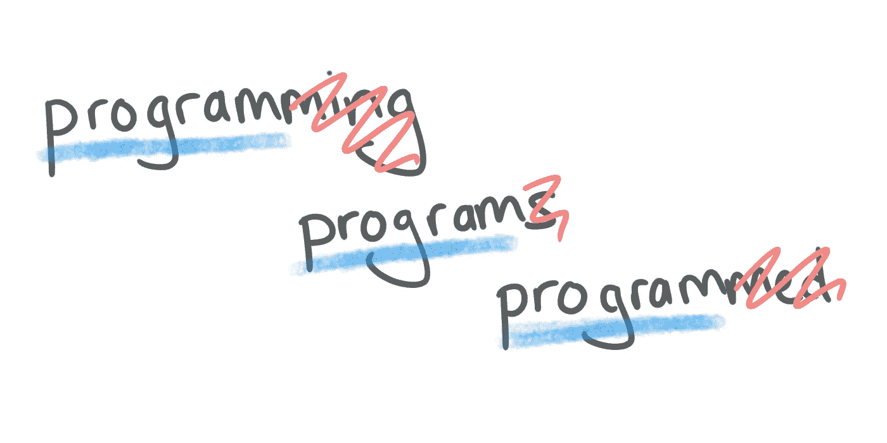*

*图片来源:作者*

*通过把一个术语缩减到它的词干，你就把它提炼到了它的核心本质。利用这种方法，您可以将用户头脑中的想法转化为成功的搜索结果。你允许他们在思想的层面上交流，而不是担心语法。*

*要更详细地探究词干，请查看 Elasticsearch 的文档中的以下[部分。](https://www.elastic.co/guide/en/elasticsearch/reference/current/stemming.html)*

# *原则 3。收听信号*

*特征提取对于构建良好的搜索体验至关重要，但是在处理这个问题时，你必须始终把最终用户放在心上。搜索的用例有哪些？用户可能会追踪哪些类型的项目？哪些属性最有助于识别或暗示这一点？我们如何操纵功能以获得最大效果？*

*我们必须理解用户并预测他们的意图。思考这个问题的一种方法(如《T21》一书中所述)是信号的强度。*

## *信号*

*当有人提出搜索请求时，他们正在寻找与他们的需求最有共鸣的文档。他们给了我们一些线索来帮助我们:作者、流派、书名、年份等等。与概念最匹配的文档响应最强的信号(由相关性分数测量)。*

**

*图片来源:作者*

*不是所有的信号都像其他信号一样清晰，有些可能会积极地与你作对。虽然一个特征可能允许完全匹配，但其他特征可能会产生噪声，导致误报并降低搜索结果的整体质量。然而，我们有工具来放大那些非常清晰的信号，并压制那些偶尔有用但往往碍事的信号。*

## *助推*

*通常情况下，对一个属性(例如标题)的点击比对另一个属性(例如描述)的点击更有价值。我们可以影响搜索引擎来考虑我们的偏好。*

*通过将一个字段提升到另一个字段之上，它增加了其匹配项相对于对等项的重要性。那些与你的查询有共鸣的会做得更清楚，那些假阳性会变得无足轻重。将一个字段提升到另一个字段之上就像给它分配一个正数一样简单。*

*假设我们喜欢一本经典的查尔斯·狄更斯的书，我们用术语*狄更斯*来填充我们的搜索算法。*

*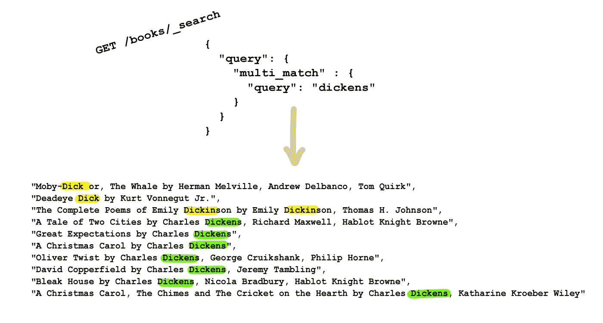*

*结果好坏参半。当然，有些是查尔斯·狄更斯的书，但是被其他一些书打败了。你的用户可能会觉得莫比-迪克赢得这场比赛很奇怪！我们可以通过创造公平的竞争环境和增加作者的领域来改变这种结果。*

*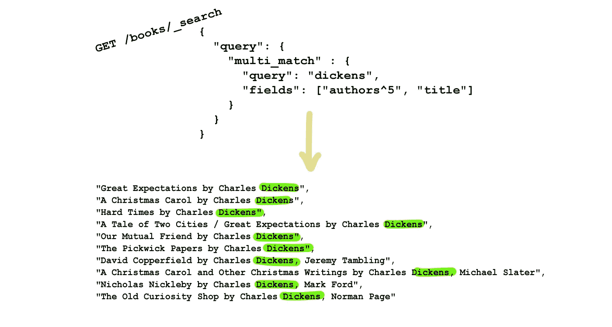*

*与标题或描述中的内容相比，名字通常是更精确的匹配，尤其是全名，但我们稍后会看到这一点。通过增加作者字段，我们强调这些记录与我们的搜索更相关。*

*不过，给你个警告。这有点像权衡和平衡领域的艺术。过度推广，你可能最终解决了一个问题(例如，搜索标题)，但引入了另一个问题(例如，通过出版商搜索的能力)。*

## *匹配难度和提升*

*平衡问题的一个解决方案是将重量的大小与在赛场上赢得比赛的难度联系起来。*

*为我们提供清晰信号的特性包括:*

*   *身份证明*
*   *全名*
*   *国际标准图书编号*

*偶然发现其中一个，你就是赢家。但是，与描述字段进行匹配，由于内容的广度，您永远无法完全确定。*

*提升一个几乎类似于二进制信号的特征可以让你睡得更安稳:要么匹配，要么不匹配。*

## *同样的文字，不同的分析*

*考虑作者的名字。这里你至少可以看到两种不同的信号:*

*   *部分匹配，例如，姓氏:国王*
*   *完全匹配，例如，全名:斯蒂芬·金*

*后一个信号显然比前者更重要。对我们来说，更有价值的是知道用户正在通过他们的全名寻找作者。然而，这并不意味着部分匹配毫无价值，即使只是巧合——你并不总是知道作者全名的确切拼写。*

*当我们只有一个名称字段时，如何处理这两种情况呢？我们可以在这里使用特征建模将它分成两个独立的领域。每个特性都可以独立地进行调整，更彻底的匹配具有更高的优先级，但允许较弱的匹配在适当的时候增加价值。*

## *多重匹配*

*您并不总是只寻找一个特征，而是经常将大量不同的线索混合到一个搜索字符串中。您不仅可以搜索某个作者，还可以搜索该作者的特定主题，例如查尔斯·狄更斯的圣诞小说。*

*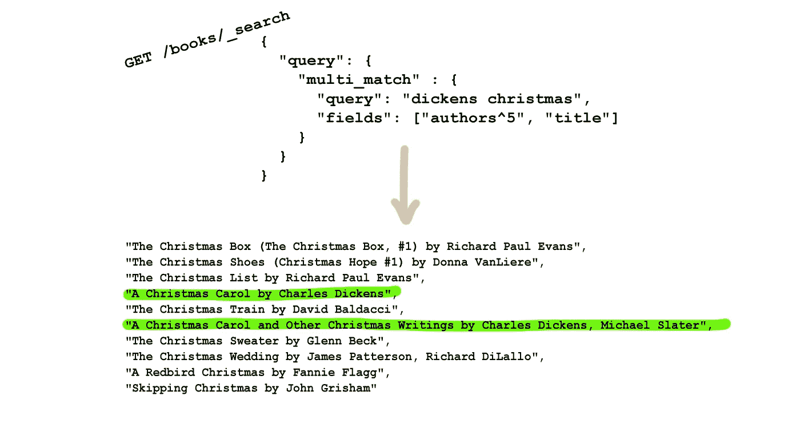*

*通过使用[最佳场](https://www.elastic.co/guide/en/elasticsearch/reference/current/query-dsl-multi-match-query.html)方法，Elasticsearch 将挑选出最佳匹配:给我们最强反应的信号。这种方法可能会与我们刚刚看到的跨特征查询有些混淆。我们想要的是主要匹配最强的信号，*圣诞节*，然后用第二个字段来增强它的重要性。*

*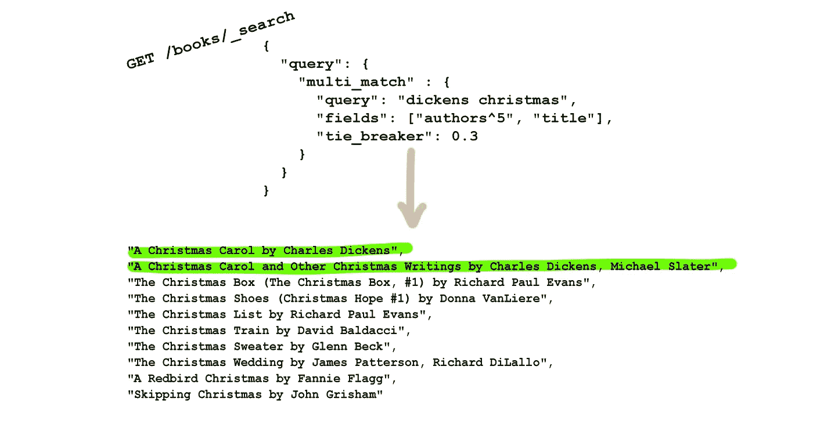*

*通过设置一个 0 到 1 之间的值，搜索引擎仍将继续匹配最佳字段，但随后它将更进一步，并使用其他信号来进一步细化结果。在我们的例子中，*圣诞节*可能是我们的主要热门，随着*狄更斯*增加足够的额外重量将这些小说提升到第一位。*

# *原则 4。反馈反馈反馈*

*搜索不是单行道。不仅仅是*处理一个搜索请求，盲目为用户服务；与他们进行对话至关重要。**

*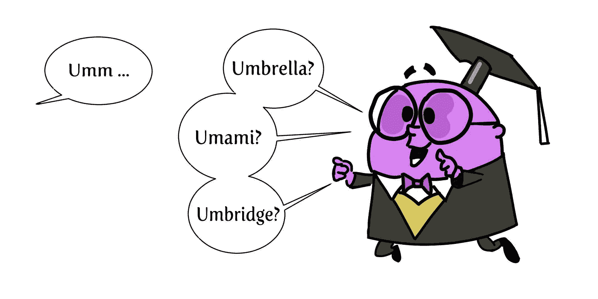*

*图片来源:作者*

## *建议*

*用户通常不太清楚他们在寻找什么。他们在键盘上敲出他们想要的东西的模糊概念，然后看看什么会反弹回来。没有一点帮助，这可能有点像瞎猜。他们尝试，失败，再尝试，直到他们挣扎着找到有用的东西或者放弃。*

*通过提出自动完成的建议，你可以对可用的事物种类给出即时的反馈，并且不需要完美的回忆或拼写能力。*

*大多数(如果不是全部的话)搜索引擎都支持现成的建议。在 Elasticsearch 中，它只是另一个(尽管很特殊)字段，你可以在其中复制你的标题、作者姓名、流派等等。*

*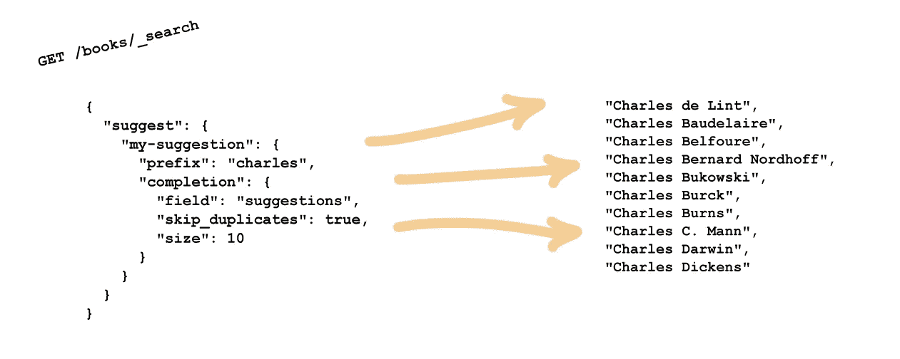*

## *突出*

*你是否曾经搜索过某样东西，想知道你到底是怎么得到结果的？如果你的文档是数据丰富的，当你搜索时，有时会不清楚你找到了什么。*

*通过突出显示匹配的术语来提供反馈可能是非常宝贵的，允许用户将他们的请求调整得更具体或过滤掉不想要的结果。*

*欲了解更多信息，请阅读如何在 Elasticsearch 文档中突出显示[。](https://www.elastic.co/guide/en/elasticsearch/reference/current/highlighting.html)*

## *监控和迭代*

> *“被测量的得到管理”——*彼得·德鲁克**

*建立一个真正有用的搜索体验需要向你的用户学习。领域专业知识显然很重要，但是实际上看到你的用户提出了什么可以揭示一些关键的见解。*

***蹦来蹦去？**一次又一次的搜索，仍然没有找到任何一个结果。这是为什么呢？正在寻找什么术语？*

***没有结果？许多不同的用户都在寻找不返回任何有用信息的东西吗？是你的搜索引擎调谐不良，还是有机会被抓住。***

***圆满的结局？会议取得成功了吗？有人买了什么，看了什么，看了什么吗？***

*收集和分析这些信息，以不断改进您的解决方案。*

# *最后一句话*

*我们已经谈到了一些不同的方面，在构建一个引人入胜的搜索体验时，需要考虑这些方面。我们在这里仅仅触及了皮毛，我建议查看下面的参考资料以获得更多信息。*

*搜索本身是一个完整的主题领域，在更前沿的领域分支到相关的主题，包括推荐和机器学习。与大多数工程项目一样，通过一小步一小步地接近它，可以获得成功的结果。确保你从简单开始，收集反馈，迭代，并根据需要发展。*

*感谢阅读！*

# *资源*

*   *[相关搜索](https://www.manning.com/books/relevant-search)*
*   *[行动中的弹性搜索](https://www.manning.com/books/elasticsearch-in-action)*
*   *[https://github.com/lucas-matt/search_playground](https://github.com/lucas-matt/search_playground)*