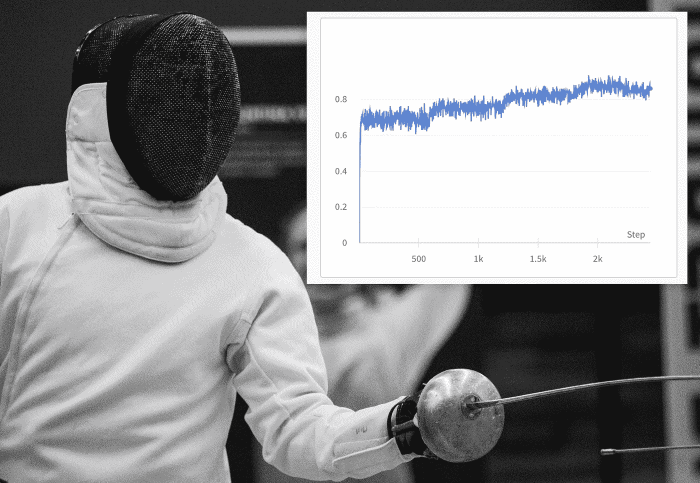
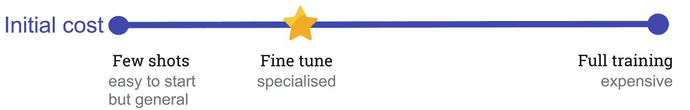
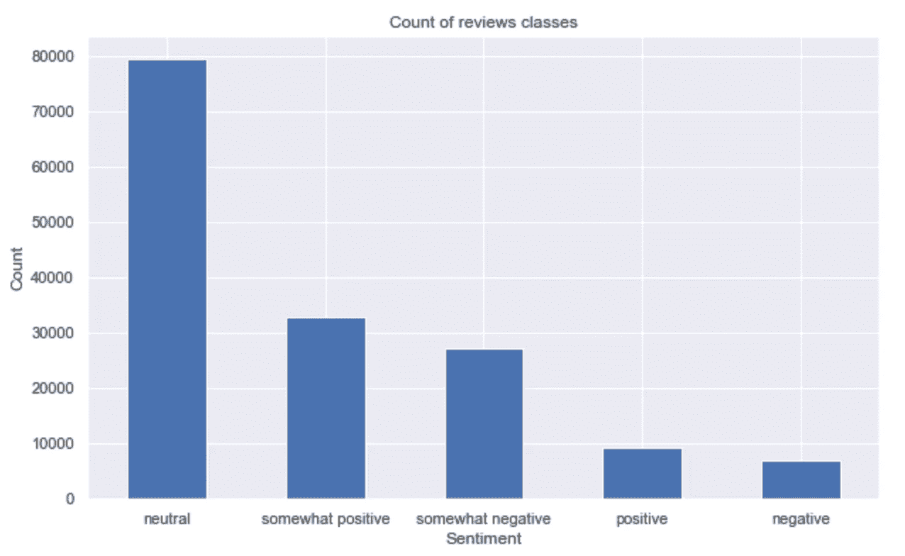
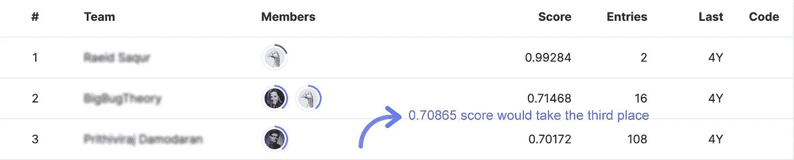
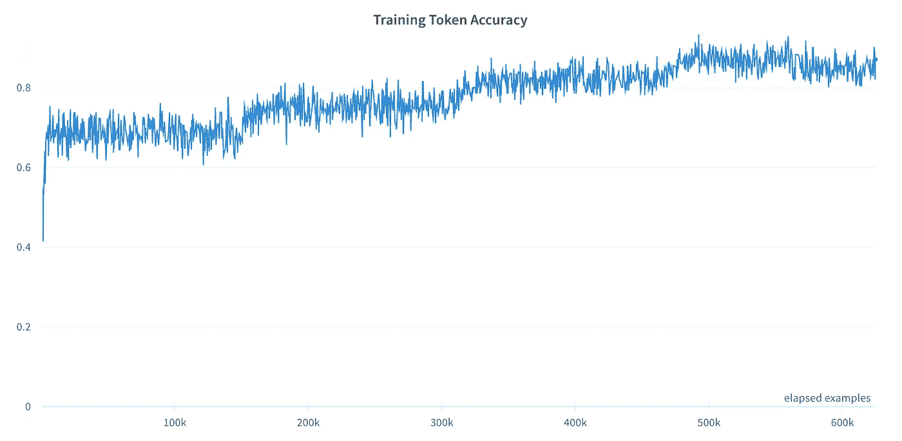

# 微调 GPT-3 以获得高质量的结果

> 原文：<https://betterprogramming.pub/fine-tune-gpt3-for-quality-results-3f91f1ab44ea>

## 在特定任务上微调 OpenAI API 会给你带来竞争优势



照片由[nathanal Desmeules](https://unsplash.com/@nathanael240606)在 unsplash 上拍摄——由作者编辑以添加图表

GPT3 是一个语言模型，有数十亿个参数在广泛的互联网数据上训练，在许多基准测试中超过了其继任者的表现。它是强大的，因为它解决了使用“少量”学习者获得满意结果的许多训练数据的需要。

微调是另一种与模型交互的方式，它使用更多的数据来训练模型；它有助于提高结果的质量并减少延迟，因为您不必在每次通话时都发送示例。

你可以像穿着合适衣服的运动员一样进行微调。运动员将处于特定活动的模式中，手持正确的工具。



初始成本—按作者分类的图像

像 GPT3 这样的语言模型需要大量的数据进行预训练，以便为任何任务做好准备。然而，最好的结果来自于提供特定任务的例子，一些镜头，或者在特定领域或技术主题上微调模型权重。

**数据为王**:

该模型可通过公共 API 获得，任何使用适当的参数和示例调用它的人都将获得相同的结果！如果您的企业拥有大量数据，不微调模型以实现更高质量和更快的结果将是一种浪费，这将为您带来竞争优势。

# 验证模型结果


情感分析—作者提供的图片，图标来自 Jim Lears、Romica 和 Michele Zamparo 的名词项目

我为“*电影评论情感分析*”ka ggle 比赛创建了一个分类微调的 GPT3 模型，并将结果提交给 leader board 以验证微调的影响。

训练数据包含大约 156，000 行，分布在如下五种情绪中:



情感类栏视觉-按作者分类的图像

这些分类即使对人类来说也是具有挑战性的，因为它们包含了类似的意思，比如“消极”和“有点消极”。此外，kaggle 是一个竞争激烈的地方，通常需要数周的奉献才能确保进入前十名。

通过 GPT3，我设法获得了 0.70865 的延迟提交分数，这使我的模型在周末实施中获得了第三名**:**

****

**模型得分排行榜的位置—来源 kaggle.com**

**模型的训练精度跟踪器可以分为三个区域:**

*   **在前 6K 个示例中，精度显著提高。**
*   **逐渐增强，直到 500K 的例子。**
*   **然后饱和，几乎没有增强。**

****

**GPT3 训练微调跟踪器—图片由作者提供**

**模型使用巴贝奇发动机；出于成本原因，我没有使用最重要的 OpenAI 引擎 Davinci，也没有应用许多预处理技术，因为我的重点是 GPT3 评估。在适当的时间和成本投入下，该模型可以获得更高的分数。**

**开始编码吧。**

# **使用开放 AI API 的微调步骤**

**第一步，去 OpenAI 网站创建账号，然后获取 API key:**

**[](https://openai.com/api/) [## OpenAI API

### OpenAI 的 API 提供了对 GPT-3 和 Codex 的访问，前者执行各种各样的自然语言任务，后者…

openai.com](https://openai.com/api/) 

安装 python 库:

```
pip install openai
```

导入 openai 并设置密钥:

```
import openai
openai.api_key = 'enter_your_key'
```

**训练档案:**

微调依赖于 JSON 文件来训练模型；这是一种 JSON 格式，每个例子都在单独的一行中。该文件应该包括两个值:

*   `prompt`是输入文本。
*   `completion`是模型输出；您为分类设置类别值。

jsonl 文件格式示例—由 github 编码

在训练和测试的每条提示消息的结尾都要有一个唯一的值来表示输入的结束，如“->”或“/n/n###/n/n”，这一点很重要。

要上传培训文件:

将文件上传到 openai api —由 github 编码

**微调和预测:**

使用训练文件 id 和引擎名称调用 FineTune 函数:

创建微调模型—由 github 编码

根据数据大小，上述语句可能需要较长的后台处理时间。为了跟踪训练的状态，复制打印的" *id* "值并调用检索函数，直到"*状态*变为"*成功*":

模型部署成功后，您可以复制" *fine_tuned_model* "值，并在每个推理调用中使用它:

调用推理函数——由 github 编码

调用分类器函数的示例:

```
# this character --> used in the training to indicate end of inputresponse = gpt3_classifier(input_text + ' -->', fine_tuned_model)
print(response)
```

# 结论

GPT 3 是自然语言处理任务的最先进的模型，它为许多商业用例增加了价值。您可以通过 OpenAI API 以最小的投资开始与模型进行交互。但是，增加微调模型的工作量有助于获得实质性的结果并提高模型质量。以下帖子将重点关注 GPT3 模型性能跟踪和操纵超参数。

> 本文涵盖了微调 GPT3 的所有步骤，假设之前没有任何知识。但是，如果您是 OpenAI API 的新手，请按照介绍教程了解深入的细节:[几行代码构建高级 OpenAI 模型](/break-into-advanced-machine-learning-with-openai-api-fd9307bc9403)

# 参考

*   Kaggle 数据[ [链接](https://www.kaggle.com/competitions/movie-review-sentiment-analysis-kernels-only) ]。
*   语言模型是很少的学习者[ [链接](https://arxiv.org/abs/2005.14165) ]。
*   OpenAI 微调文档[ [链接](https://beta.openai.com/docs/guides/fine-tuning)。**