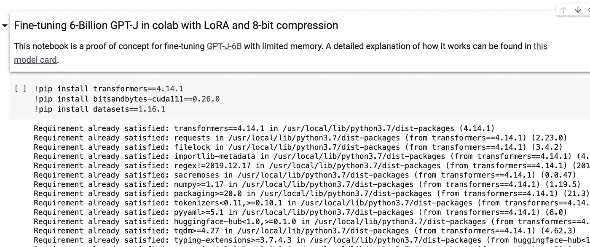
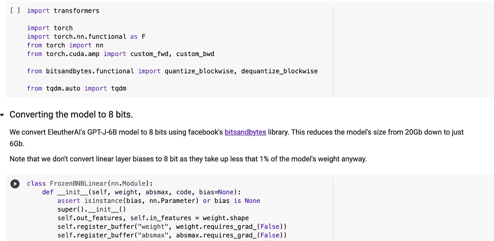
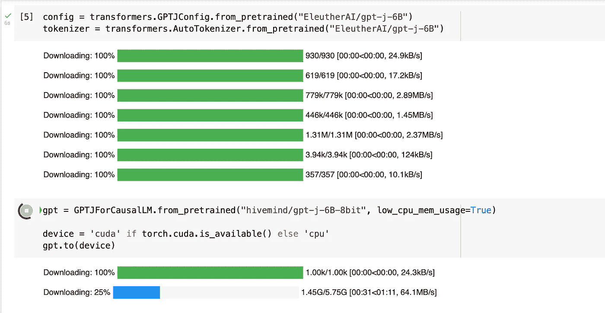
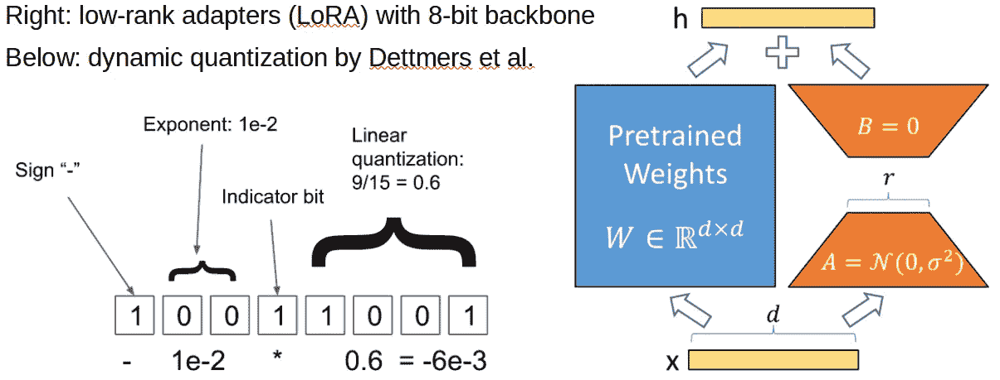
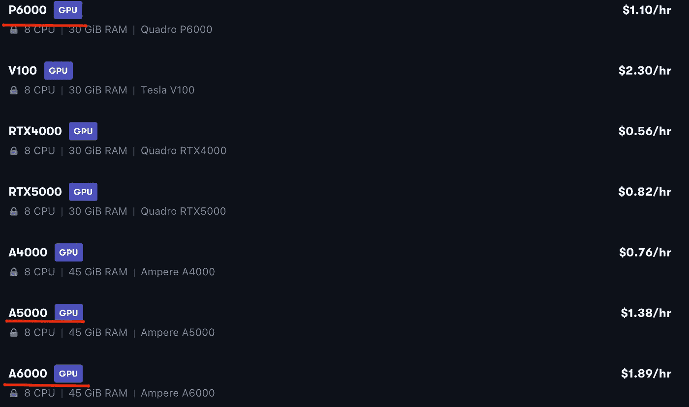
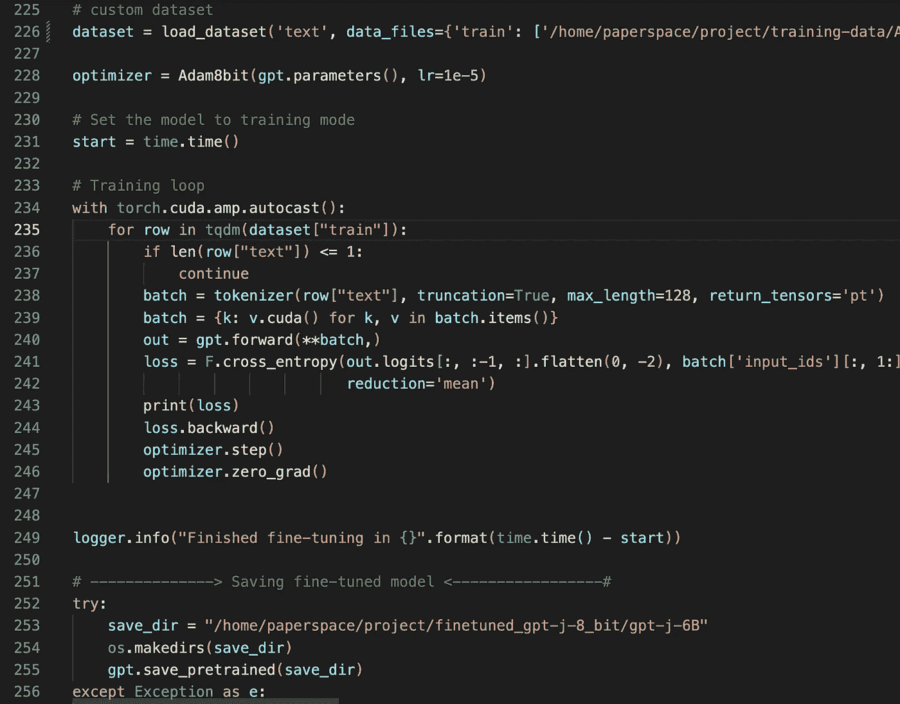
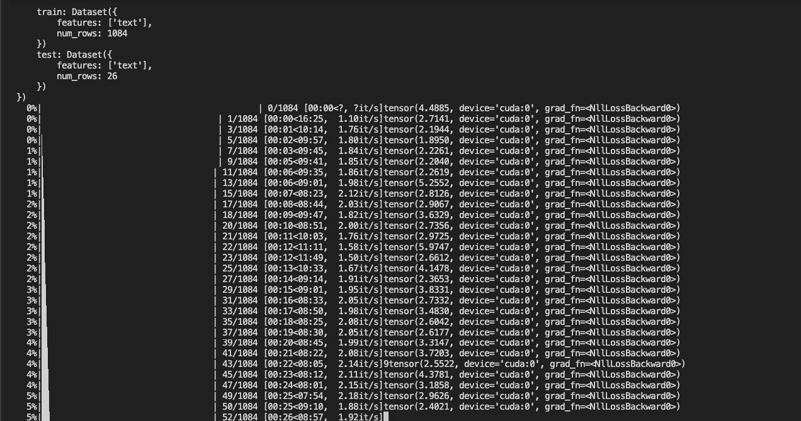
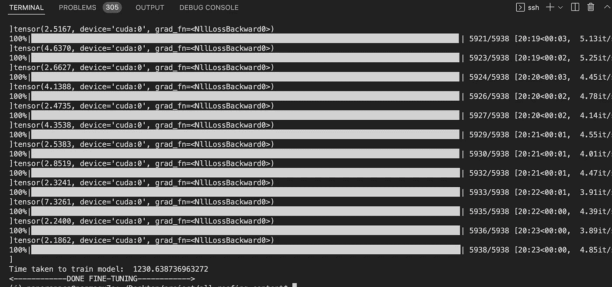

# 在 Google Colab 或同等的桌面或服务器 GPU 上微调 GPT-J 6B

> 原文：<https://betterprogramming.pub/fine-tuning-gpt-j-6b-on-google-colab-or-equivalent-desktop-or-server-gpu-b6dc849cb205>

## 微调艾路瑟·艾的模型


自然语言处理(NLP)已经通过最近的研究和来自 OpenAI(GPT-2 和 GPT-3)、Eleuther AI (GPT-NEO 和 GPT-J)和谷歌(BERT，T5，PaLM)等公司的新的基于转换器的大型语言模型(LLM)的发布而发生了革命性的变化。

大型语言模型是基于 transformer 架构的生成式深度学习模型。它们似乎主导了绝大多数常见的 NLP 任务，如摘要、文本生成、关键字和命名实体提取、对话聊天机器人、语言翻译、文章或博客文章写作、生成计算机代码、编写智能合同等等。

值得注意的是，他们可以执行传统 NLP 模型所做的所有这些任务，但只需一个模型，无需任何特定任务或监督培训。

他们通常只需要很少甚至不需要例子就能理解给定的任务(包括他们从未接受过训练的任务),并且表现优于以监督方式训练的最先进的模型。

GPT-3 和 GPT-J 是当今最流行和最容易访问的大型语言模型。

# 什么是 GPT-3 和 GPT-J？

## GPT-3

根据维基百科的说法， **GPT-3** 是一个[自回归](https://en.wikipedia.org/wiki/Autoregressive_model) [语言模型](https://en.wikipedia.org/wiki/Language_model)，它使用[深度学习](https://en.wikipedia.org/wiki/Deep_learning)产生类似人类的文本。它是一个通用的学习者，这意味着它没有被专门训练来做任何一件事。但是，它非常擅长翻译文本、回答问题、总结段落和生成文本输出。

基本上，你可以通过以提示的形式提供一些任务的例子来指示 GPT-3 执行任何基于文本的任务，然后它可以学习出色地执行该任务，以便当给定输入时，它将生成适当或正确的输出。GPT 三号拥有 1750 亿个参数，将于 2020 年向公众展示。尽管它的源代码从未向公众公开，但对 [GPT-3](https://en.wikipedia.org/wiki/GPT-3) 的访问是通过[微软](https://en.wikipedia.org/wiki/Microsoft)提供的 [API](https://en.wikipedia.org/wiki/Application_programming_interface) 独家提供的。
它是 GPT-2(最大的模型有 15 亿个参数)的继任者，后者也是由 OpenAI 在 2019 年 2 月创建的，GPT-2 则是 open ai 2018 年 GPT 模型的“直接放大”和继任者。

GPT-3 有一些限制:

*   非常大的模型无法装入高端 PC 甚至昂贵的 GPU 服务器。
*   它非常昂贵，只能通过 [OpenAI API](https://openai.com/api/) 访问。
*   缺乏透明度

## GPT J

GPT-J 6B 是由一个名为 Eleuther AI 的非营利研究组织(成立于 2020 年 7 月)发布的 60 亿参数模型。Eleuther AI 是一个分散的志愿者研究人员、工程师和开发人员的集体，专注于人工智能对齐、缩放和开源人工智能研究。
GPT-J 在[桩数据集](https://pile.eleuther.ai)上接受训练。

该组织的目标是民主化，建立和开源大型语言模型。因此，他们发布了 GPT-J 6B 和其他型号([GPT-尼奥](https://github.com/EleutherAI/gpt-neo))目前公开发售。另一方面，由 OpenAI 发布的 GPT3 具有 1750 亿个参数，并且不向公众公开。
尽管在参数数量上存在巨大差距，但事实证明，GPT-J 在代码生成任务和聊天机器人对话等一些领域的表现优于 GPT3。有关它们的比较信息，请查看此处的[和](https://www.ankursnewsletter.com/p/openais-gpt-3-vs-open-source-alternatives?s=r)

GPT-J 通常比 OpenAI 的 GPT-3 模型(Ada 和 Babbage)的较小版本性能更好，但不如达芬奇(GPT-3 最强大和最昂贵的模型)。

任何人都可以在服务器上免费使用和部署来自 Eleuther AI 的 GPT-J、GPT-NeoX 20B(最近发布)和其他大型语言模型。

## 微调

虽然很明显，一个模型的参数越多，它的性能通常就越好，但在探索微调时，这个规则有一个例外。微调是指针对特定任务或用例，在数据集上进一步训练基于 transformer 的语言模型的实践。

使用这种强大的技术，GPT-J 可以在一些特定的任务上轻松超越甚至是最强大的 GPT-3 型达芬奇。事实上，微调是一种强大而宝贵的技术，不仅用于提高语言模型或 NLP 的性能，还用于深度学习和机器学习的其他领域，如计算机视觉、文本到语音(TTS)、语音到文本(STT)、GANs、图像字幕等。

然而，在这篇文章中，我们将专注于微调 Eleuther AI 的 GPT-J 6B 模型的一个特殊版本，它被称为**量子化的 EleutherAI/gpt-j-6b，具有 8 位权重。**它是由 [Hivemind](https://huggingface.co/hivemind) 修改和开发的，这篇文章改编了大部分代码。

关于微调原始或普通 GPT-J 6B 的教程，[查看伊柳瑟的指南。](https://github.com/kingoflolz/mesh-transformer-jax/blob/master/howto_finetune.md)

# 使用您的自定义数据集在 google colab 上微调 GPT-J-6B:使用低秩适配器的 8 位权重(LoRA)

用于微调的概念验证笔记本在此处[可用](https://colab.research.google.com/drive/1ft6wQU0BhqG5PRlwgaZJv2VukKKjU4Es)，用于推理的笔记本也在此处[可用](https://colab.research.google.com/drive/1m3KQYva980cQnRoycCMAMEEcAyeallZJ)。

如果你想关注 GitHub 上的讨论，你可以查看这里的



在 colab 上安装依赖项



在 colab 上微调 60 亿 GPT J



在 colab 上微调 60 亿 GPT J

如果你很好奇，想深入了解内部工作原理和细节，你应该看看[模型卡](https://huggingface.co/hivemind/gpt-j-6B-8bit)，它有更详细的解释和辅助笔记本(如模型转换和困惑检查)。

# 模型描述



信用[https://huggingface.co/hivemind/gpt-j-6B-8bit](https://huggingface.co/hivemind/gpt-j-6B-8bit)

这个修改后的版本使你能够在 google colab 或者一台配有高端 GPU ( **例如 single 1080Ti)的 PC 上生成并微调模型。**

**[**原厂 GPT-J**](https://huggingface.co/EleutherAI/gpt-j-6B/tree/main) 光是 float32 参数就超过 22+ GB 内存，再加上渐变，和优化器。即使你将整个模型转换为 16 位，它仍然不适合大多数单 GPU 设置，如 V100、A6000、英伟达 GTX 1080-Ti 和A100。你也许可以用它在 CPU 或 TPU 上进行推理，但是微调在计算上要昂贵得多。**

**应用了几项巧妙的技术，使 GPT-J 6B 可以在一个大约 11 GB 内存的 GPU 上使用和微调:**

*   **将模型转换为 8 位:这是使用 facebook 的`[bitsandbytes](https://github.com/facebookresearch/bitsandbytes)`库完成的。这将模型的大小从 20Gb 减少到 6Gb。大权重张量使用动态 8 位量化进行量化，并在乘法运算时及时解量化。(线性图层偏差未转换为 8 位，因为它们只占模型权重的不到 1%)**
*   **使用梯度检查点来存储每层仅一个激活:使用显著更少的内存，代价是训练速度慢 30%。**
*   **利用 [LoRA](https://arxiv.org/abs/2106.09685) 和 [8 位 Adam](https://arxiv.org/abs/2110.02861) 进行可扩展微调**

**换句话说，所有大的权重矩阵都被冻结在 8 位，你只训练小的适配器和可选的一维张量(层标，偏差)。**

**我敢肯定，此时您的脑海中一定会有这样一个问题，**8 位模型会影响模型质量吗？**技术上可以，但实际上效果可以忽略不计，量化模型甚至稍好，但没有定性意义。一些研究和调查证实了这一点，你可以在这里看一看[。](https://nbviewer.org/urls/huggingface.co/hivemind/gpt-j-6B-8bit/raw/main/check_perplexity.ipynb)**

**此外，在性能方面，根据使用的 GPU 和批量大小，量化模型比原始模型慢 1-10%左右。**

**然而，去量化权重的开销并不取决于批量大小，因此，你能适应的批量越大，你训练的效率就越高。**

## **开源状态**

*   **此处提供了模型实现**
*   **模型重量可用[此处](https://huggingface.co/hivemind/gpt-j-6B-8bit)**

## **作者:**

*   **最初的 J-6B 由[艾](https://www.eleuther.ai/)训练(引用:王贲和小松崎阿然)**
*   **由 [Tim Dettmers](https://github.com/TimDettmers) 从[位和字节](https://github.com/facebookresearch/bitsandbytes)进行快速量化**
*   **胡等人[(2021)](https://arxiv.org/abs/2106.09685)提出了类模型的低阶适配器**
*   **这个笔记本是我( [@deniskamazur](https://github.com/deniskamazur) )在 Yozh ( [@justheuristic](https://github.com/justheuristic) )的帮助下完成的**

**你可以在 colab 和其他免费的 GPU 提供商上进行微调: [kaggle](https://towardsdatascience.com/amazon-sagemaker-studio-lab-a-great-alternative-to-google-colab-7194de6ef69a) 、 [aws sagemaker](https://towardsdatascience.com/amazon-sagemaker-studio-lab-a-great-alternative-to-google-colab-7194de6ef69a) ，或者 [paperspace](https://docs.paperspace.com/gradient/more/instance-types/free-instances) 。**

# **使用您的自定义数据集在 Paperspace 上微调 GPT-J-6B:使用低秩适配器(LoRA)的 8 位权重**

**我能够在 [paperspace](https://docs.paperspace.com/gradient/more/instance-types/free-instances) 上微调 GPT-J 6B 8 位。我用几个支持 GPU 的服务器进行了实验。我能够用 5000 在 50 分钟内微调一个大约 2MB 的数据集(由 10k 个单词的文章组成),用 A6000 在 20 分钟内微调。**

****

**要优化 8 位 GPT-J-6B，您所需要的只是一组训练和测试示例，这些示例格式化为多个文本文件，每个示例通常由单个输入示例及其相关输出组成。格式化数据集的最佳方式将取决于您的特定用例。**

****

**微调代码**

****

**图纸空间的微调**

****

**图纸空间的微调**

**这里有一个[链接](https://github.com/sleekmike/Finetune_GPT-J_6B_8-bit)来访问我用来在纸上微调 GPT-J 6B 8 位的代码。 [GitHub repo](https://github.com/sleekmike/Finetune_GPT-J_6B_8-bit) 还包含一个简单 API 的代码，该 API 是用 FastAPI 构建的，用于执行模型推理。**

**我希望你喜欢这篇文章，并发现它很有用。**

**特别感谢[艾](https://www.eleuther.ai/)和 [Hivemind](https://huggingface.co/hivemind) 。**

```
Connect with me on [Linkedin](https://www.linkedin.com/in/michael-ohanu-b69481a8/) , [Twitter](https://twitter.com/sleekmyk) and [Github](https://github.com/sleekmike/), [website](https://www.alphasofttechnologies.ai/). 
```

**您是否希望通过尖端的人工智能和机器学习解决方案推动您的业务向前发展？只需看看我们的咨询和开发服务！访问我们的[网站](https://www.alphasofttechnologies.ai)**

**我们由经验丰富的设计师、软件开发人员、数据科学家和机器学习专家组成的团队可以帮助您利用数据的力量获得宝贵的见解，做出数据驱动的决策，并提供定制的解决方案。**

**无论您是希望构建或微调定制模型，还是优化现有算法，或者在 GPT-4、GPT-3、ChatGPT-3、Dalle-3、GPT-J、GPT-NEO、BERT、T5、Stable Diffusion 等前沿模型和 API 的基础上开发全新的应用程序，我们都有专业知识来帮助您实现目标！**

**我们全面的开发服务包括从设计、数据科学、人工智能、ML 和建模到软件开发和云部署的一切。我们将与您密切合作，了解您独特的业务需求，并开发可交付可衡量结果的定制解决方案。**

**不要让你的数据未被开发或你的想法消失！
[立即联系我们](https://www.alphasofttechnologies.ai/)了解有关我们的咨询和开发服务的更多信息，并将您的业务推向下一步！

# data science # machine learning # consulting services，# deep learning**# chat GPT # GPT-3 # GPT-4 # LLM # generative ai # cloud # chat bots # NLP****