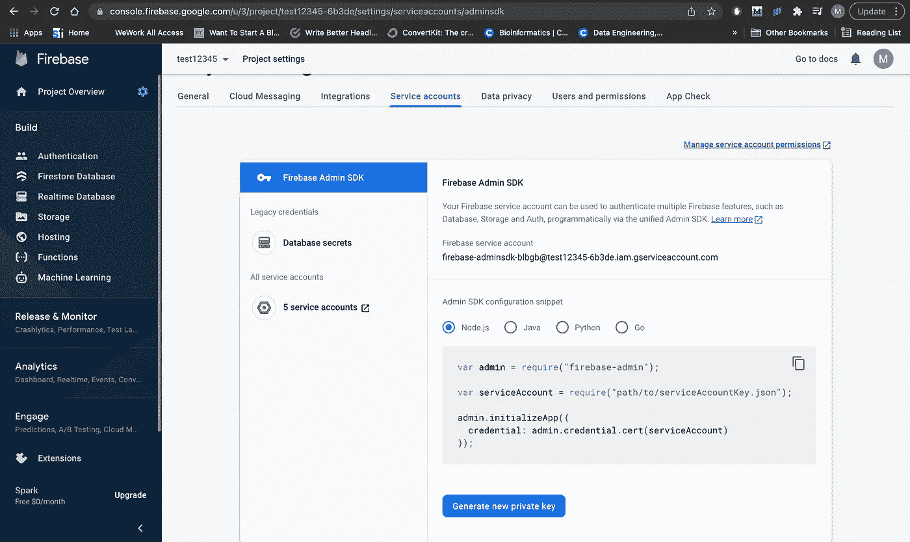
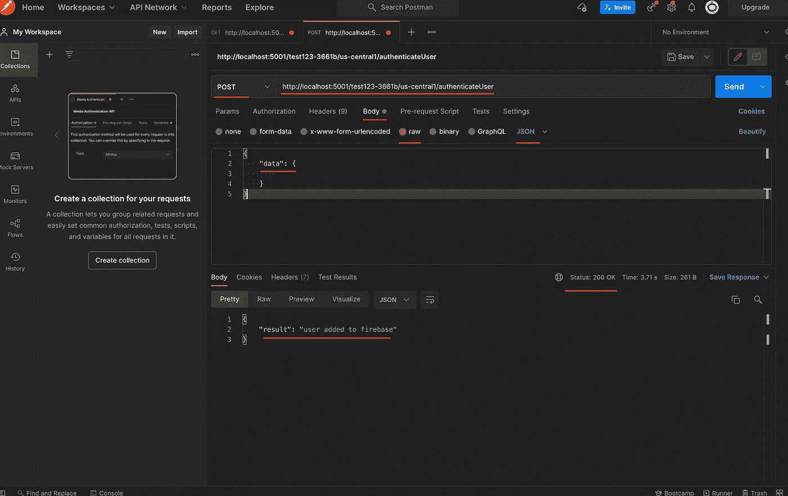
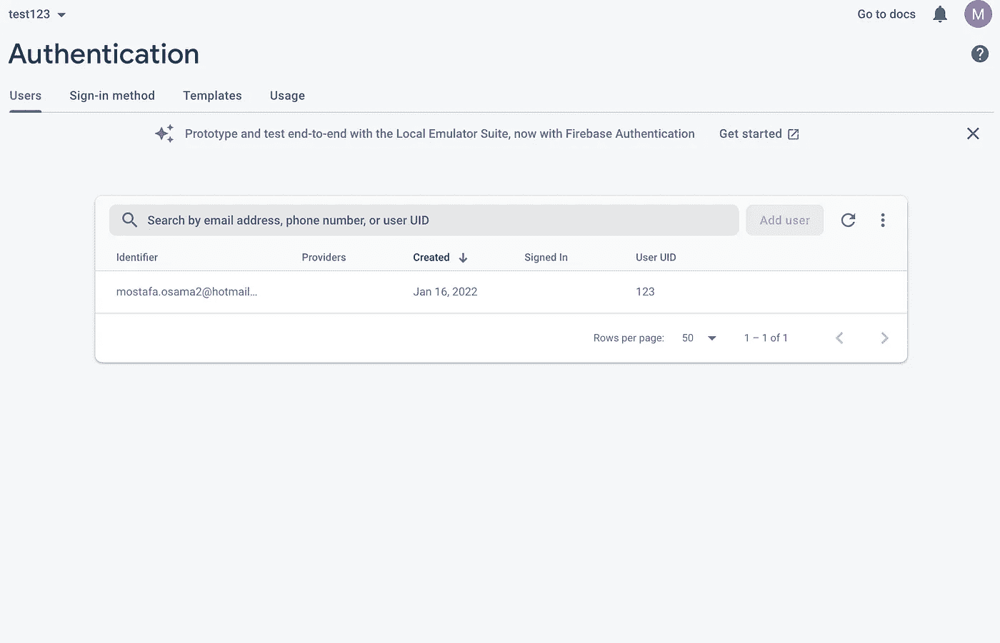
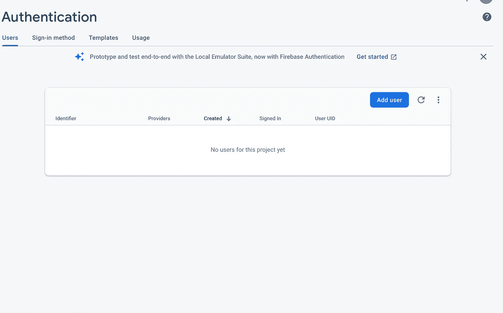
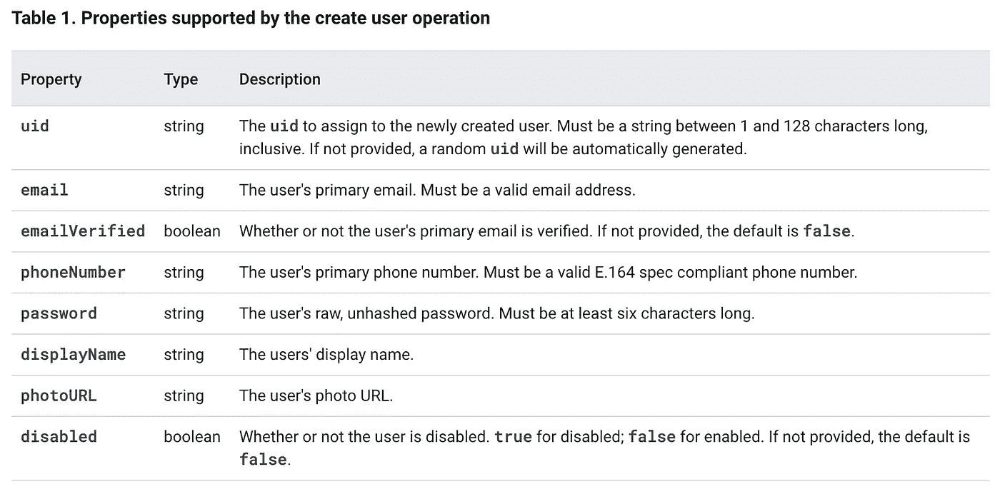

# 使用类型脚本的 Firebase 身份验证

> 原文：<https://betterprogramming.pub/firebase-authenticating-with-typescript-a345a4cd1af3>

## 使用自定义令牌、电子邮件/密码和/或外部第三方服务进行身份验证

照片由 [Chirag Nayak](https://unsplash.com/@photografi_chi?utm_source=medium&utm_medium=referral) 在 [Unsplash](https://unsplash.com?utm_source=medium&utm_medium=referral) 上拍摄

在[谷歌云](/getting-started-with-firebase-cloud-functions-and-firestore-with-typescript-95f810073ef7#:~:text=A%20service%20account%20is%20a,used%20in%20scenarios%20such%20as%3A&text=Running%20workloads%20which%20are%20not,lifecycle%20of%20a%20human%20user.)

这里列出了 3 种方法。我们要用的是这个:

> [使用服务帐户 JSON 文件](https://firebase.google.com/docs/auth/admin/create-custom-tokens#using_a_service_account_json_file) —这种方法可以在任何环境中使用，但是要求您将服务帐户 JSON 文件与代码打包在一起。必须特别注意确保服务帐户 JSON 文件不会暴露给外部方。

来源: [Firebase 文档](https://firebase.google.com/docs/auth/admin/create-custom-tokens)

现在只需进入 firebase 控制台->项目设置->服务帐户，然后点击生成新的私钥:

来源:作者

这将提示您下载所需的`serviceAccountKey`，我们将完全按照上面的代码片段使用它。现在让我们将`serviceAccountKey.json`放在我们的项目目录中，导入并使用它。

让我们用 Postman 测试一下。注意，所有 firebase `OnCall`函数都是 POST 请求，它们有一个非常具体的协议规范，你可以在这里找到。

此外，请注意，这里一个非常常见的错误是放错了您的`serviceAccountKey.json`。你必须明白 Firebase 的云函数被编译成 JavaScript 代码，一旦你运行`npm run start`，你可以在 functions/lib 下找到这些代码。

所以正确的目录必须相对于 JS 代码，而不是运行的 Typescript 代码。如果您将`serviceAccountKey.json`放在最外层的目录中，上面的相对路径将会起作用。

来源:作者

这里需要注意的几点是:

*   我们正在发送一个 POST 请求
*   你必须将它发送到与云功能匹配的正确 URL
*   根据`onCall`协议规范，您必须包含一个带有`data`字段的 JSON 类型的原始主体

如果请求成功，您应该能够看到用户添加到数据库中，如下所示:

来源:作者

现在，我们已经用我们的服务帐户签署了一个 JWT 令牌，并将其作为成功的自定义身份验证的响应发送回去，最后一步是在客户端使用`signInWithCustomToken()`。这在 react-native 或 default 上的任何 firebase 身份验证库上都可用。

## 默认身份验证

让我们假设您不希望自定义身份验证，而只是希望使用电子邮件和密码进行身份验证。进入 firebase 控制台->认证->开始->点击电子邮件/密码并启用它。现在，如果您单击 Authentication(在左侧面板上)，您可以看到一个空的 users 表。

来源:Firebase 控制台

我们还可以了解 firebase 身份验证表支持的默认属性，它们是:

来源: [Firebase 文档](https://firebase.google.com/docs/auth/admin/manage-users)

遗憾的是，您不能再向身份验证表中添加任何字段。

# 结论

我希望您已经学会了如何使用 Firebase 对您的用户进行身份验证。根据提供商的不同，有很多方法可以做到这一点。我选择演示自定义身份验证，因为这是最难的，其他的应该简单得多。

但是注意不要将`serviceAccountKey.json`包含在您的生产环境中，因为它包含敏感信息。在下一个教程中，我们将讨论热重装、firestore 实用程序、事务等等。