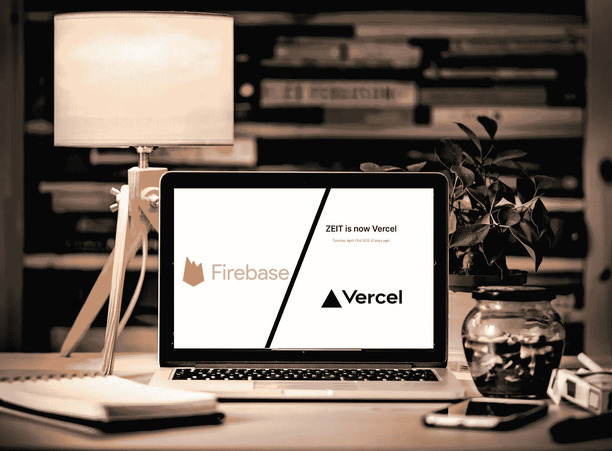
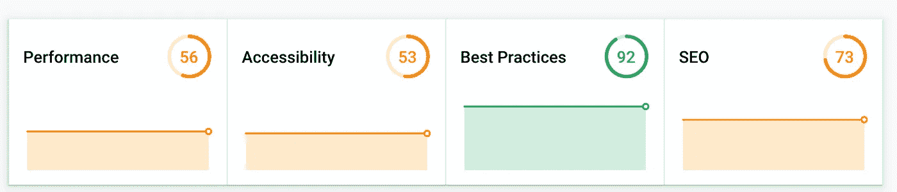
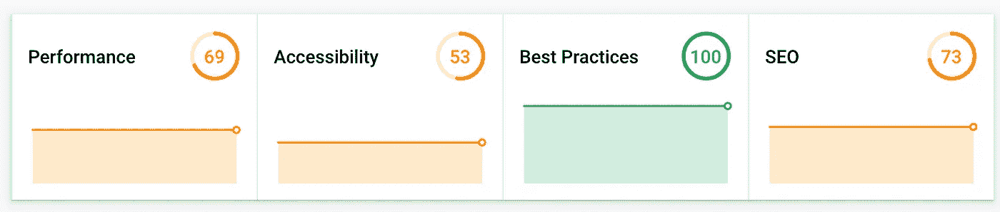
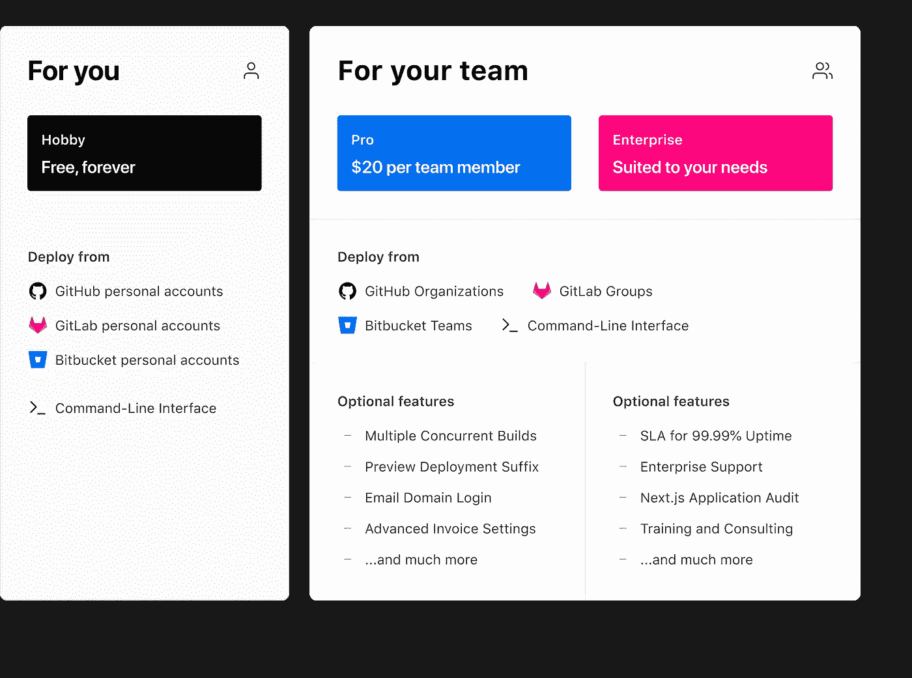

# Firebase vs. Vercel(又名 Zeit)

> 原文：<https://betterprogramming.pub/firebase-vs-vercel-aka-zeit-now-2020-7f5ab18d865f>

## 2020 年 Next.js 类 app 的托管方案哪个更好？

基于 [Radek Grzybowski](https://unsplash.com/@rgrzybowski) 在 [Unsplash](https://unsplash.com/photos/eBRTYyjwpRY) 拍摄的照片

如果你最近试图为你的网络应用程序设置主机，你可能会注意到一些事情。2020 年托管 web 应用程序比几年前更容易也更难。

这更容易，因为工具和托管解决方案都有了显著的改进。像`create-react-app`、Next.js 和 Gatsby 这样的工具已经成熟，并且每天都有工具推出来帮助减少它们的任何缺点。设置主机也变得容易多了。Vercel ( [原名 Zeit](https://vercel.com/blog/zeit-is-now-vercel) )已经获得了很多支持和欢迎，而 Firebase 凭借丰富的基于 GCP(谷歌云平台)的服务继续增长。当然，Heroku，GCP 应用引擎，各种各样的无服务器解决方案，还有其他的也仍然存在。最重要的是，我们现在有更多的服务来满足前端开发者的需求，比如 Netlify。从在服务器实例上从头开始设置一切，我们已经走过了漫长的道路。

然而，由于有太多的选择，现在寻找虚拟主机也变得越来越难。如前一段所述，很容易就有十几个选项，每个选项都有不同的好处和注意事项。每一种都有不同的方式将它们合并到您的项目中。那就更不用说定价模式的差异了。

在本文中，我将根据我最近使用 Firebase 和 Vercel 托管 Next.js 项目的经验，对它们进行比较。(注意:本文不是由这些产品背后的任何一家公司赞助的)。

## 内容

*   [对比技术](#4145)
*   [比较性能](#dff8)
*   [比较易用性](#de25)
*   [比较定价](#28db)
*   [结论](#56ff)

# 比较技术

## 重火力点

Firebase 提供了两种解决方案，您可以根据自己的需求进行选择。它的托管解决方案基本上是 Google Cloud Storage (GCS)加上一些额外的工具。这对于静态网站很有用，例如导出的 Next.js 网站。多年来，GCS 一直在满足科技公司的需求。结合谷歌的云 CDN，它的性能很好，如果你的文件不是很大，价格也很合理。

Firebase 提供的第二个解决方案是 Firebase Functions，它迎合了更动态的 web 应用程序。Firebase Functions 是建立在 GCP 的云功能基础上的，通过额外的工具将其与 Firebase 的其他功能绑定在一起。你可以清楚地看到一个模式。Firebase 添加新功能的方法是使用 GCP 现有的功能，并将其与 Firebase 的其他功能合并。在我看来，重用已经稳定的技术并关注它们的可用性是一个好策略。它还允许 Firebase 快速添加功能。

云功能已经存在多年了。我已经关注它很长时间了，并且已经看到了它的文档和工具的显著改进。它是无服务器的，因此具有可伸缩性和成本效益的一般优势。然而，它也伴随着无服务器技术的负面:它有冷启动。这意味着，如果该功能在一定时间内(可以是十分钟，也可以是一分钟)没有使用，谷歌会将其缩小到 0。当一个新的请求到达这个函数时，这会导致启动。这种启动被称为冷启动。如果您的函数收到大量请求，比如说每分钟几个请求，这对您来说应该不是问题。但是如果你刚刚开始，这可能会让你头疼。现在，有许多策略可以改善这种冷启动期——有些是常识，有些更像是变通方法。根据我的经验，减少冷启动时间并不是一件容易的事情。各种变通办法是可能的，但它们仅仅是变通办法。这都是你需要付出额外努力来弥补无服务器技术缺点的一部分！

云函数的另一个问题是它对 Node.js 的支持。出于某种原因，谷歌云函数只支持 Node.js 的古老版本。在撰写本文时，云函数官方只支持 Node.js 版本 8，OpenJS 基金会不再支持该版本——甚至不支持安全更新。云函数也[支持 Node.js 版本 10](https://cloud.google.com/functions/docs/concepts/nodejs-10-runtime) 为 beta。这表明这种支持是不稳定的。请注意，OpenJS 基金会(Node.js 背后的基金会)将版本 10 置于维护阶段——只有重要的更新才可用。我想说的是，云功能在技术上落后好几年。

关于 Firebase 函数，最后要提到的重要一点是，如果您将它用作 Next.js 后端或类似的东西，您将需要 Firebase 托管和 Firebase 函数来正确代理您的网站。你需要配置一个叫做[重写](https://firebase.google.com/docs/hosting/full-config)的东西来重定向你的 Firebase 域到你的 Firebase 函数。这个操作很容易实现，但是有一个关键的权衡。它仅在`us-central1`地区受支持。所以你需要在美国地区设置你的 Firebase 函数。如果你的目标观众不在美国，那就等着付出高昂的演出成本吧。

## 韦尔塞尔

Vercel(又名 Zeit)的技术已经开发了好几年了。它是基于 AWS Lambdas 构建的，因此也是无服务器的。您将体验到无服务器技术的优点和缺点。然而，有几个关键的区别。

AWS Lambdas 有更好的 Node.js 支持。这也让 Vercel 增加了对它的支持。官方[支持版本 12](https://vercel.com/docs/runtimes#official-runtimes/node-js/node-js-version) ，这是 Node.js 的最新 LTS(长期支持)版本。Vercel 也毫不费力地支持多个地区，所以少了一件需要担心的事情。

公平地说，Vercel 只能用于托管。它缺少 Firebase 拥有的许多功能。最值得注意的是数据库和云存储，这两者对于任何现代 web 应用程序都是至关重要的。然而，这并不是交易的破坏者。在使用 Vercel 的主机时，可以利用 Firebase 的数据库和存储。由于数据库请求将离开 AWS 数据中心，并一直到达 Google 的数据中心，这将会有性能成本，因此这并不理想。数据库请求不应离开本地网络。

Vercel 的一个主要优势是它专注于类似 Next.js 的前端应用程序。它的 CI(持续集成)管道、特性和优化都围绕着它们。Vercel 的部署速度相当快，见效也快。它还允许您轻松部署应用程序的多个版本，允许您在不同的子域下部署功能分支。Vercel 还应用了一些神奇的优化，但我将在性能部分介绍它们。

# 比较性能

这部分对我来说是最重要的部分。我愿意忽略许多差异——毕竟，通常有许多方法可以弥补各种缺点——但没有任何方法可以弥补糟糕的表现。

Firebase 最显著的性能项目是:

*   冷启动。
*   必须使用美国地区的消防基地功能。
*   需要手动实现的各种优化。

Vercel 最显著的绩效项目是:

*   冷启动。
*   Vercel 边缘网络(CDN)。
*   对 Next.js 项目进行自动优化。

先来对比一下冷启动。

## 冷启动

下面是我使用 [web.dev](https://web.dev/) 为相同的代码库生成的两份性能报告。我已经确保它们在一定时间内不会被使用，并且它们已经过冷启动测试。

Firebase 功能:

火基函数

韦尔塞尔:

韦尔塞尔

## 热身的

不久之后，我再次运行了相同的测试，以比较预热后的版本。

Firebase 功能:

火基函数

韦尔塞尔:

韦尔塞尔

在这两个图中，可以清楚地看到，在默认设置下，Vercel 的性能优于 Firebase 函数。这种差异有几个原因。例如，Vercel 根据项目的`pages`将 Next.js 项目分成多个 AWS Lambdas。这减少了为每个请求加载的代码量；这使得冷启动更短，并且减少了每个响应有效载荷的开销。

Vercel 更快的另一个原因是它的智能 CDN 可以缓存静态资源，并为来自更近的数据中心的所有请求提供服务。当然，你可以在 Firebase 上配置相同的功能，利用谷歌的许多 cdn 和数据中心。然而，它是现成可用的，这意味着您必须做更多的 DevOps 工作。

Vercel 的缓存时间也可以使用`Cache-Control`头来配置。可以根据请求路径来配置它。如果你对它的实现感兴趣，[在这里查看他们的文档](https://vercel.com/docs/configuration#routes/headers)。

对我来说，另一个重要的项目当然是他们支持的地区。我在德国工作，所以只有在美国才有的主机服务远非理想。

# 比较易用性

Firebase 的本地开发工具在过去几年中有了显著的改进。作为一名过去使用过 Firebase 的开发人员，我惊喜地发现它的特性集成得如此之多。同样令人印象深刻的是，他们为本地开发提供了各种特性的模拟器。它并不完美，但足以在类似生产的环境中测试你的应用。我还是花了一些时间来设置好一切，让它工作起来。你需要阅读各种文档，使它们能够很好地相互配合。然而，使用 Firebase 和 GCP 的命令行工具可以完成大多数与 Firebase 相关的操作。

Firebase 缺少的一个特性是持续集成——这仍然是你需要自己弄清楚的事情，至少现在是这样。一旦您对配置项进行了排序，让它与 Firebase 一起工作就非常简单了。您只需要生成一个令牌，就可以对 CI 执行许多操作。我已经为我的项目使用了 Gitlab 的 CI，我不能抱怨！

Vercel 的 CLI 也挺好用的。Vercel 的人们尽最大努力保持一切简单，就像在您的终端中运行`now`命令一样。初始设置非常简单，使用相同的`now`命令即可完成。它们还允许您将项目链接到您正在使用的任何 Git 服务。链接后，每当您推送至`master`分支时，Vercel 会在其自己的配置项中自动触发部署。当然，这个操作也是可配置的——它还允许用户指定他们想要的`build`命令，这允许我们在构建过程中插入额外的命令。例如，您可以插入一个`npm test`,以确保在部署之前对变更进行测试。

Vercel 的本地开发工具相对年轻，仍处于测试阶段。它确实可以工作，但是没有 Firebase 提供的那么全面。下面是 [Vercel 关于](http://vercel.com/docs/v2/serverless-functions/introduction#local-development) `[vercel dev](http://vercel.com/docs/v2/serverless-functions/introduction#local-development)`的简短文档。

# 比较定价

Firebase 有一个非常详细的定价模型。估算 Firebase 的成本就像计算税收一样简单。它确实有一个慷慨的免费层，但超过免费层会很快变得复杂。托管、存储、数据库和各种其他功能都是单独收费的，每个功能都有多个变量。对你来说，自己检查一下会更容易些。

Firebase 定价

Vercel 过去也有类似的定价模式，因为它也基于云技术。不过他们最近简化了很多，正如他们最近的博客文章所描述的。似乎他们选择了 Github 的定价策略——他们现在永远免费支持爱好者，转而专注于向公司收费。

韦尔塞尔定价

# 结论

我通过试验这些技术得出的主观结论是，我将 Firebase 的存储和数据库与 Vercel 的托管结合起来使用。

我很想使用 Firebase 函数，因为我将只处理一个服务和一套工具。有一段时间我确实是这么做的。不幸的是，我最终对 Firebase 函数的性能感到失望。当我向第三方展示我的项目时，冷启动成了一个负担，并且各种改进性能的变通办法变得非常耗时。

我以前用过 Vercel，但这不是最近的经历。所以我决定再试一次，看看他们如何比较。我最终使用 Vercel 作为后端，Firebase 作为数据库和存储。

我建议你两样都试试，然后自己决定。我希望我这里的笔记能节省你一些时间。

请告诉我您的想法以及您对这些技术的体验。

— [奥赞通卡](https://medium.com/@ozantunca)

## 订阅更多

如果你喜欢这篇文章，并希望得到其他类似文章的通知，[你可以在这里订阅我](https://ozantunca.org/subscribe)。我还会不时地给你发送免费的课程和电子书。我保证永远不会给你发垃圾邮件👍。