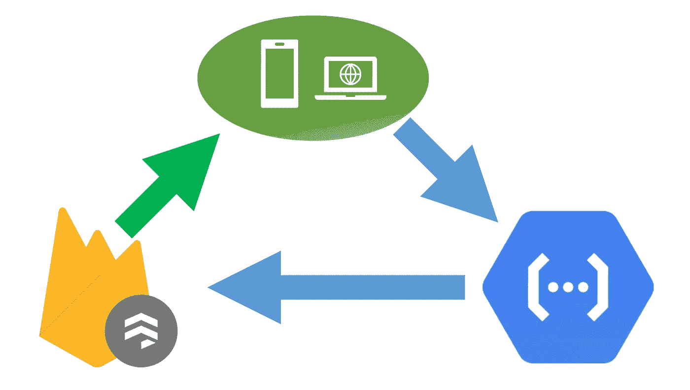

# Firestore 读取，函数写入

> 原文：<https://betterprogramming.pub/firestore-read-functions-write-a-sane-way-of-using-firebase-2b0c296b069c>

## 使用 Firebase 的合理方法

我第一次尝试完全在 Firebase 上构建应用程序时，我无法理解这一点——后端开发人员需要应用复杂的安全规则，这些规则甚至会让 JavaEE 配置相形见绌。

常规的后端编程始于一个假设，即客户机不允许做任何事情。您逐渐添加允许用户执行的操作。

对于 Firebase，情况正好相反。如果一个用户可以阅读一个文档，他就可以阅读整个文档，如果他可以写文档，默认情况下，他可以对文档做任何事情。Firebase 中的编程是一个为用户能做的事情慢慢添加异常的过程。

本质上，Firebase 是将用户*不能*做的事情列入黑名单，而服务器编程是将用户*能*做的事情列入白名单。

我不喜欢这种模式，而且安全性也很差。

但是有一种明智的方法可以使用 Firestore(或者 Firebase 的旧数据库),这种方法很少被提及，而且不会让你在每个角落都揪着自己的头发。

*直接从 Firestore 读取，用函数写入。*

解决办法很简单——永远不要直接给 Firestore 写信。相反，使用函数以您想要的任意规则写入存储。保持你的安全规则只是关于阅读。

# 不直接写信给 Firestore 的缺点

## **无离线写入**

Firebase 的最大优势之一是它可以帮你同步数据，并且可以离线工作。如果你不直接写数据库，Firebase SDK 不能为你处理离线。

然而，这可能没那么重要，因为交易也不能离线完成，即使是简单的工作流，它们也可能成为大多数操作。

## **没有立即更新**

如果使用 Firebase SDKs 直接写入数据存储，客户机不必等待服务器接收或确认请求，更改会立即发生。使用函数时，您必须等待数据从服务器传播回客户端。

与脱机一样，这不适用于事务，而且在许多情况下，正确的行为应该是等待确认。

## **使用功能的额外费用**

由于我们现在为我们想要做的每个写操作添加了一个函数 API 调用，Firebase 将对函数访问以及数据库/Firestore 访问收费。这种费用可能是写操作成本的两倍(如果每次调用函数时只写一个文档),也可能是不合理的(如果很少写，即使写也要读写多个文档)。

# 一些陷阱和食谱

## *函数调用后显示更新*

当使用函数更新数据和使用快照侦听器时，函数调用可以在数据传播回客户端之前成功完成并返回。这可能会导致 UI 延迟，此时操作成功完成，但其对 UI 的影响需要一段时间才能显现。

有两种方法可以解决这个问题:

*   在 UI 上显示成功之前，您可以等待数据传播到客户端，而不是等待函数调用成功完成。
*   当一个函数完成时，它应该返回已更改的文档，然后这些更改可以手动应用到 UI。当更改通过侦听器传播时，不会发生任何事情，因为数据是相同的。

## 对权限使用自定义声明

由于我们在所有的更新中使用函数，我们还可以向用户添加自定义声明([参见 how here](https://firebase.google.com/docs/auth/admin/custom-claims) )并在安全规则中使用这些声明。这对于向用户(如管理员)添加权限或加入一个组非常有用(注意，自定义声明被限制为 1000 字节)。