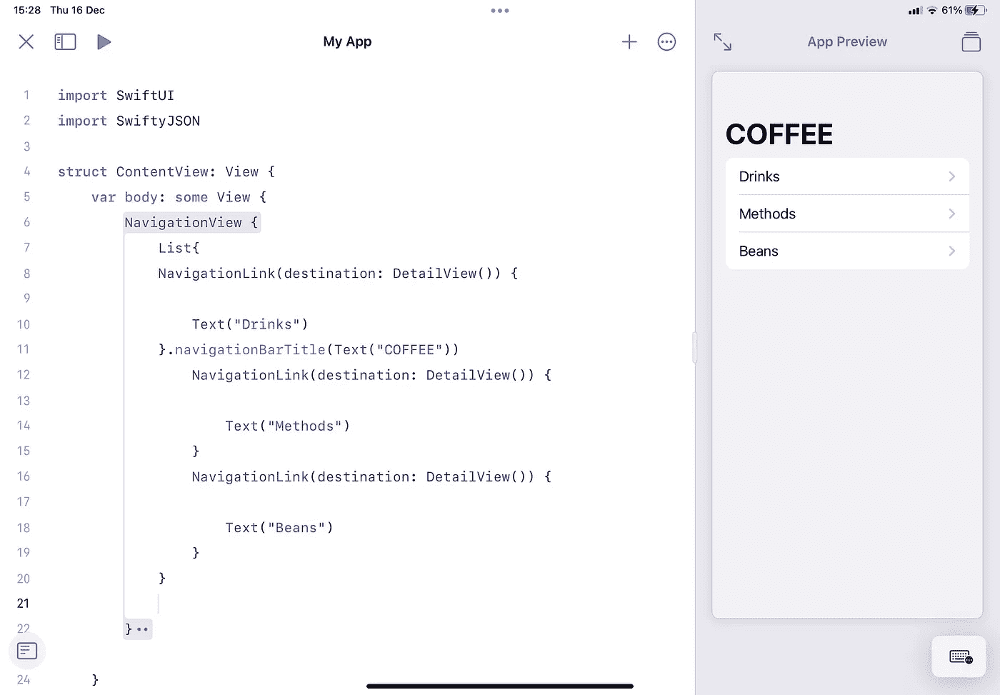
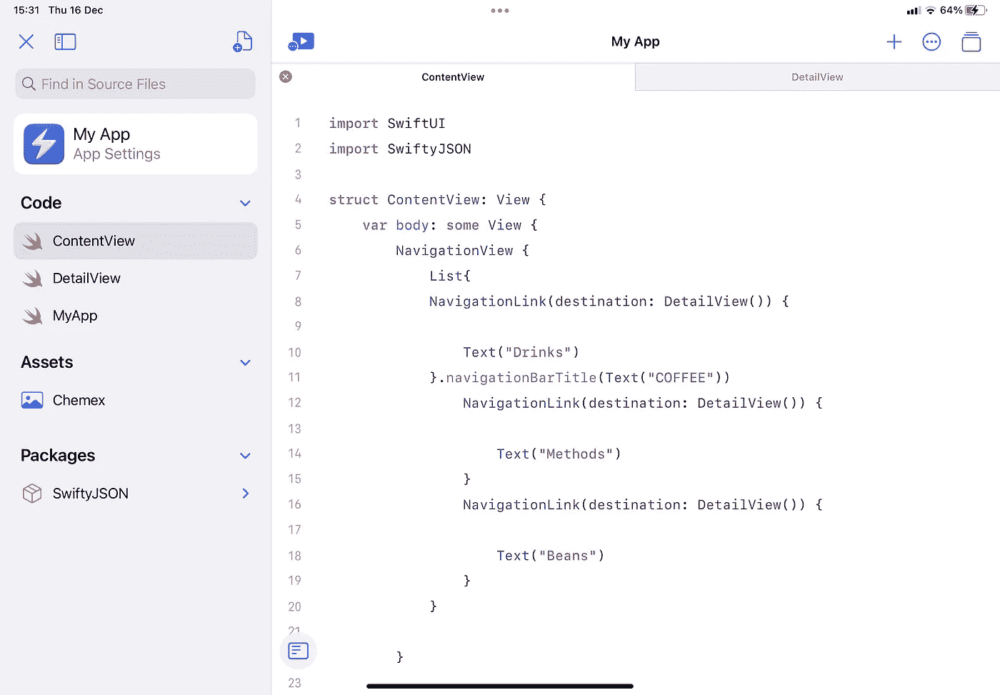
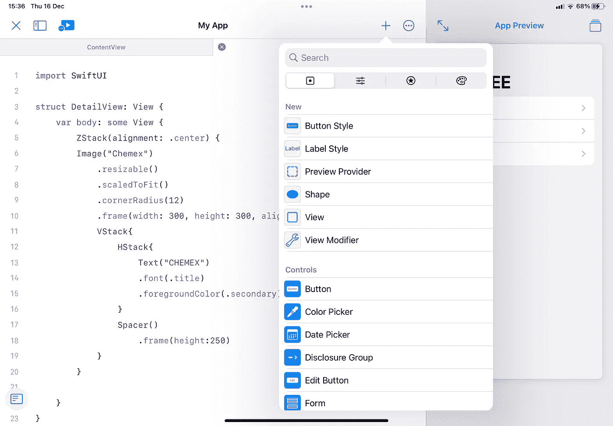
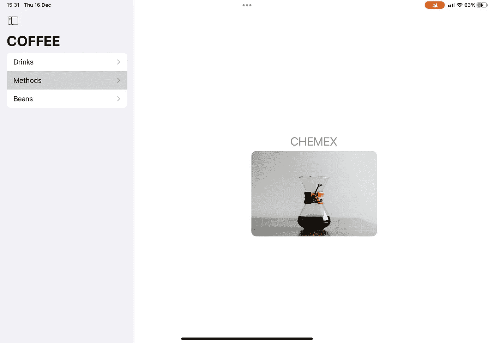
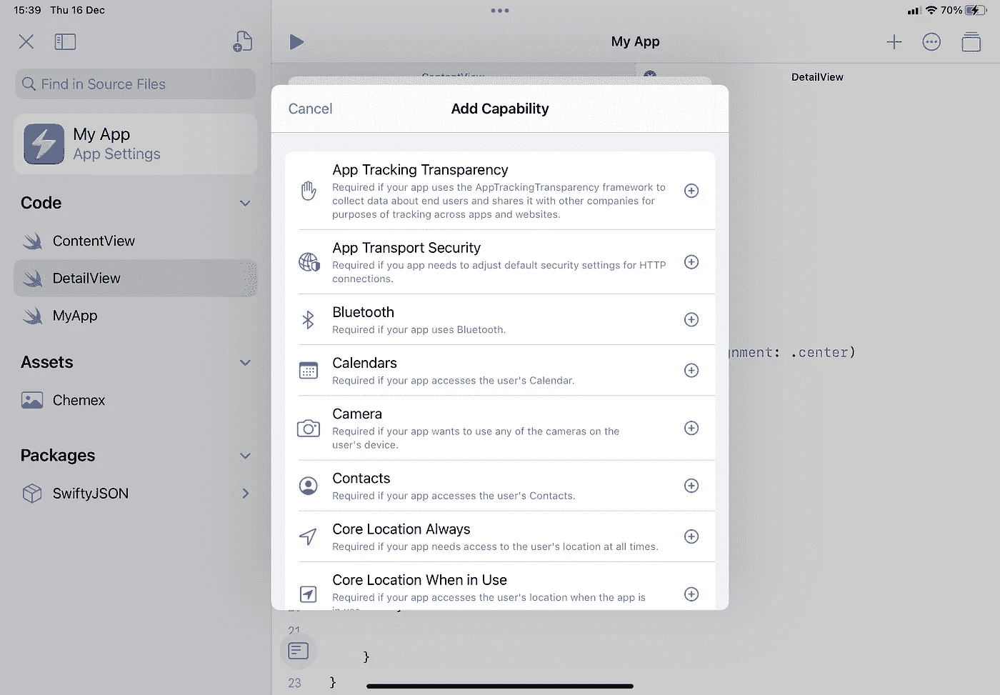

# iPad 版 Swift Playgrounds 4 的第一印象

> 原文：<https://betterprogramming.pub/first-impressions-of-swift-playgrounds-4-for-ipad-b2a576bc9c8f>

## 搭建一个定制的 app 就足够好了吗？

自从苹果发布了 Swift playgrounds 4 的下一个更新后，我就迫不及待地检查 iOS 15 的每个更新和测试版，等待这款产品的任何消息。让我能够在 iPad 上编写简单的应用程序。

苹果昨天终于发布了这个更新，我很高兴分享我的经验。简单给我留下了深刻的印象。当第一次启动应用程序并选择要处理的项目时，我可以看到一个名为“应用程序”的新磁贴。点击这个启动一个新的应用程序项目，带有 hello world 视图。

最棒的是，对于第一次开发或开发简单应用程序的人来说，我们从 Xcode 获得的所有专业控件和功能都被移除了。

它可以让你专注于你正在写的代码，而不用看其他任何东西。您可以实时显示预览，因此很容易设计 SwiftUI 元素。

一个很好的功能是能够看到一个更小的“iPhone 预览”,或者我们可以扩展这个预览来显示一个 iPad 预览。因此，如果这是一个通用应用程序，我们可以很快看出差异。

这个预览看起来是交互式的，可以改变视图和选择导航链接。

添加文件也很容易。点击左上角显示和隐藏侧边栏。这给出了我们的应用程序中所有文件的列表。

我们可以快速添加新的 Swift 文件，或者导入图像等文件。再次关闭侧边栏，我们可以在屏幕顶部打开的文件之间进行切换，这样就可以快速地在文件之间进行引用。

最大的改变之一是使用 Swift 软件包的能力。我用`SwiftJSON`测试过这个。就像添加一个新文件一样简单。

当您点击添加新的 Swift 包时，您只需输入包的 URL，然后点击“添加到项目”。

这现在可以直接在我们的 Swift 文件中使用，就像我们通常使用 Xcode 一样。我还没有看到软件包工作的程度，但是，我发现很多人在试图从 URL 获取版本时会遇到错误。firebase 之类的包不会导入。希望这种情况会有所改变。

探索可能性的另一个好东西是视觉元素。在屏幕的右上角，我们可以单击添加一个元素，并通过 UI 元素、参数、SF 符号或颜色进行过滤。

这意味着如果我们知道我们想要实现什么，比如添加一个特定的元素，或者更改一个特定的参数，但是找不到正确的关键字，我们可以从这个列表中浏览并选择它，或者手动搜索。虽然对于更有经验的程序员来说没什么用，但这无疑有助于为新人打开机会之门。

最后，我们有能力将应用程序作为全屏应用程序运行，而不仅仅是预览。这将在您的设备上以原生分辨率运行应用程序。有助于评估最终产品。我还没有制作一个应用程序来上传到应用程序商店，但当我在那里时会更新完整的体验。

总的来说，这是一个非常棒的工具，将会让更多的人利用它来制作自己的定制应用。

如前所述，我将花一些时间来玩一些额外的功能，因为这实际上似乎是一个很好的编程入门，但也有很多功能。我们可以在应用程序设置中添加一些功能。

