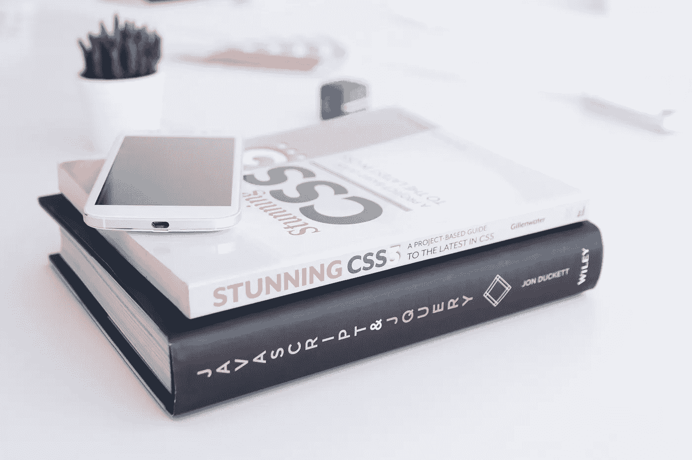

# 样式化组件指南—为 React 编写 CSS 代码

> 原文：<https://betterprogramming.pub/first-steps-in-styled-components-1b1703ce16c1>



由 [Kobu 机构](https://unsplash.com/@kobuagency?utm_source=unsplash&utm_medium=referral&utm_content=creditCopyText)在 [Unsplash](https://unsplash.com/search/photos/css?utm_source=unsplash&utm_medium=referral&utm_content=creditCopyText) 拍摄的照片

我不知道你怎么想，但是我从来不喜欢发明 CSS 类名。不幸的是，无论喜欢与否，每个人都必须这样做。

您可能会遇到类名错误。有时是重复、重叠或拼写错误的问题。很烦人。

此外，我在项目的不同部分对重复的特性使用了相同的组件。然而，有一天，我碰到了样式组件。它改变了我的发展生活。

样式化组件允许你为你的[反应](https://reactjs.org/)组件编写 CSS 代码。你可以阅读[样式组件文档。](https://www.styled-components.com/docs/basics)

# 样式组件的主要概念

*   样式化组件自动呈现我们在页面上使用的组件及其样式。因此，我们加载最少的必要代码。
*   styled-组件为您的样式使用唯一的散列类名，您将不会有重复、重叠或拼写错误的问题。
*   如果组件未使用并被删除，其所有样式都将随之删除。
*   你的代码库很容易工作，维护起来不会有问题。

基本上，它在网络和移动上都是一样的。

风格化组件使 React 和 React 本地学习体验变得容易，因为你感觉你在使用 JavaScript，而不是另一种语言(CSS， [Sass](https://sass-lang.com/) )。

我将向你展示最有用的技巧，这样你就知道和它一起工作很棒。

# 安装

首先，你应该安装它。这很简单，只需要一个命令:

```
npm install --save styled-components
```

# **1。创建组件**

让我们创建一个带有附加样式的普通 React 组件。

我们创建了`Title` React 组件，它基于`h1`并附加了样式。

此外，样式组件有自动前缀，这是伟大的。样式化组件用前缀实现我们的样式。

```
display: flex;
```

它将是:

```
-ms-flex: 1;
flex: 1 1;
display: -ms-flexbox;
display: flex;
```

# **2。道具改编**

如果我们想要操作按钮的颜色或样式，我们可以将属性传递给样式化的组件。

当你设置`primary`道具为`true`时，我们使用绿色背景和白色文本颜色。

# **3。带道具的魔术**

上面，我向你展示了我们如何传递道具。

如果将标准的 HTML 属性作为道具传递会怎么样？

在这个例子中，我传递了 HTML 属性(`type`和`defaultValue`)和`inputColor`属性:

注意`inputColor` 道具不会传递给 DOM，但是`type`和`defaultValue`会。

这就是风格——组件为你工作；它足够智能，可以自动为你过滤非标准属性。

所以我们有十几个组件:

# **4。扩展样式**

有时，我们想使用一个组件，但稍微改变它。

创建一个继承其样式的新组件，将其包装在`styled()`构造函数中。

这里，我们使用上一节中的按钮，并创建一个带有一些颜色相关样式的扩展按钮:

我们用特殊的风格实现了`Button`和`ExtendedButton`。

# **5。对任何组件进行造型**

风格化组件可以在你自己或第三方的组件上完美地工作。

它将`className`属性传递给一个 DOM 元素:

# **6。伪元素和嵌套**

我们可以像标准 CSS 一样工作:

# 7.用更高的特异性覆盖样式

有时，您需要用高特异性来覆盖样式。

这可以使用`!important`来完成，但是这很容易出错，通常不是一个好主意。

推荐的方式是:重复的`&`会为每个`&`生成`className`；

最后，我们的例子:

我希望这篇文章对你有用。

# 资源

*   [什么是风格化组件？](https://www.styled-components.com)
*   [风格化组件的 10 个有用提示](https://medium.com/@pitipatdop/10-useful-tips-for-styled-components-b7710b021e6a)
*   [宣布样式组件 v5:最佳模式](https://medium.com/styled-components/announcing-styled-components-v5-beast-mode-389747abd987)