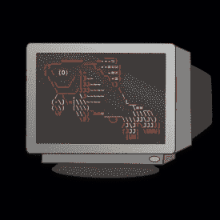
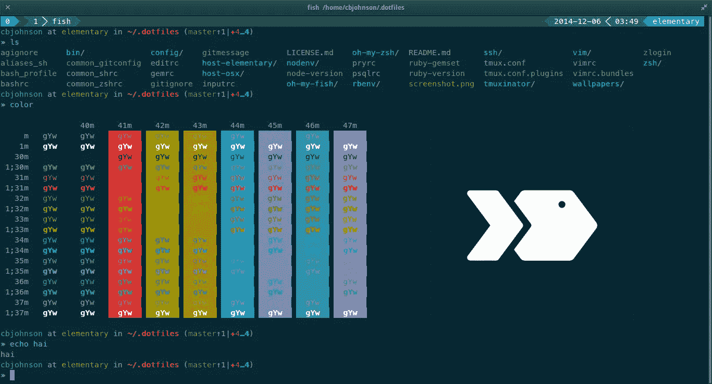
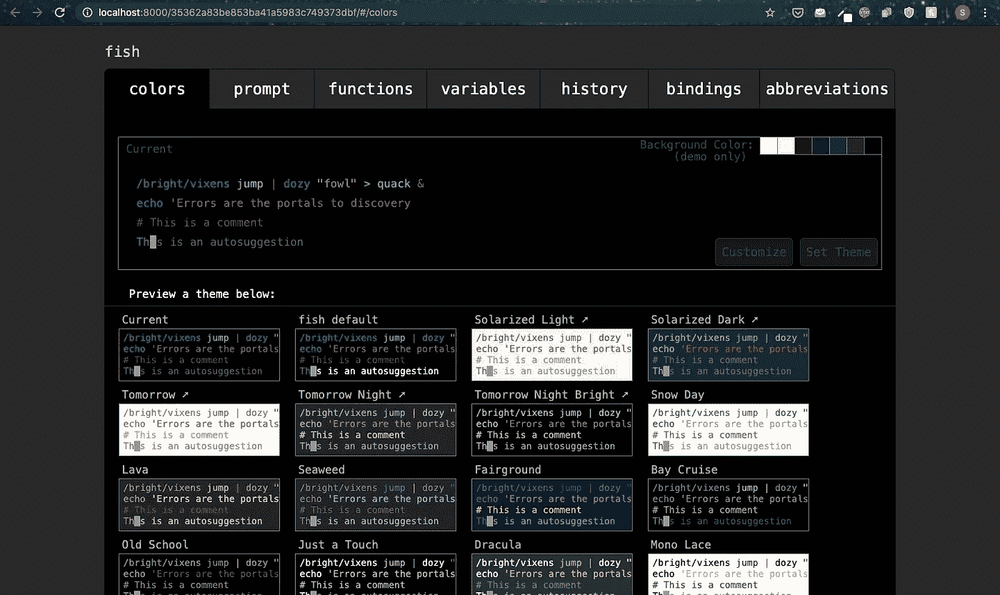
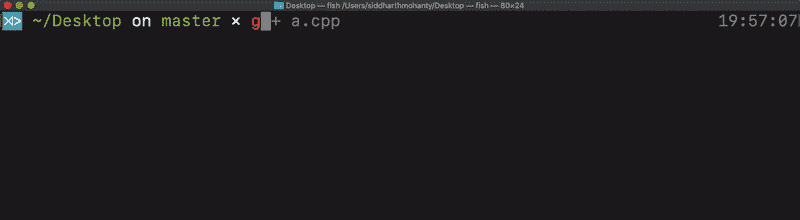
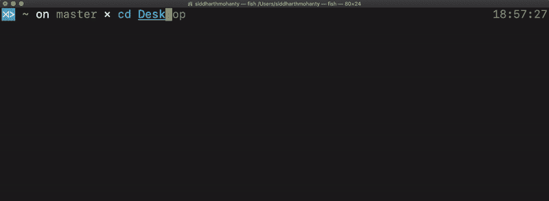

# Fish vs. Zsh vs. Bash 以及为什么您应该转向 Fish

> 原文：<https://betterprogramming.pub/fish-vs-zsh-vs-bash-reasons-why-you-need-to-switch-to-fish-4e63a66687eb>

## 有两种用户:谨慎的和喜欢冒险的


在 [Unsplash](https://unsplash.com?utm_source=medium&utm_medium=referral) 上由 [James Wainscoat](https://unsplash.com/@tumbao1949?utm_source=medium&utm_medium=referral) 拍摄

这里有一个事实，大部分开发者热爱 Unix 和类 Unix(基于 Linux)的操作系统，如 macOS、Ubuntu 等。它们稳定、强大、高度可定制，并且拥有强大的 Unix 外壳。

# 什么是 UNIX Shell？

外壳是底层操作系统的接口。它允许您使用文本和命令执行操作，并且它为用户提供了高级功能，例如能够创建脚本。

Unix Shell 是一个强大的工具，它允许程序员只用几个字就能完成复杂的任务。有很多广泛可用的 Shell，如 Bourne Shell、C Shell 等。

我特别使用过 [Bash](https://www.gnu.org/software/bash/) 、 [Zsh](https://ohmyz.sh/) 和[fish](https://fishshell.com/)shell，下面是我对为什么改用 fish、甚至 Zsh 是让您的编程体验更愉快的最佳方式之一的想法。

# Bash、Zsh 和 fish 的一分钟介绍

## **痛击**

Bash 是最常见的 Linux shell。如果你在 Mac 上打开一个终端(直到 macOS Mojave)，或者如果你以前用过 Linux，你就见过 Bash。

它可以创建别名、创建函数、导出变量和运行命令，就像任何其他 shell 一样。尽管可配置的选项有限，但它被广泛使用，并且有大量用户习惯了它的用法和特性。

## **Zsh**

Zsh 类似于 Bash，是另一个很棒的 shell。它比 Bash 更快，可定制性更强。

Zsh 最酷的一点就是颜色定制。你可以通过使用一个叫做 [Oh My Zsh](https://ohmyz.sh/) 的框架来改变你的外壳的主题和颜色。

Zsh 还有很多其他有用的特性，包括拼写纠正、跨多个终端共享您的命令历史、命名目录快捷方式等。

## **鱼**

在我看来，Fish 或“友好的交互式 shell”是最用户友好的交互式 Shell。

它比 Zsh 和 Bash 更具可定制性。它有很多很酷的特性，比如一致的语法、漂亮的制表符补全和语法高亮，易于学习和使用，并且有很好的运行时帮助。

你可以通过使用一个叫做 [Oh My Fish](https://github.com/oh-my-fish/oh-my-fish) 的框架来改变你的外壳的主题和颜色。与前面提到的 shells 不同， [fish 不符合 POSIX，但它也不打算这么做。](https://stackoverflow.com/questions/48732986/why-how-fish-does-not-support-posix)

通过在 Bash 文件的第一行添加以下 shebang 行，您可以在 Zsh 和 fish 中运行 Bash 脚本。

```
#!/usr/bin/env bash
```

# 鱼有什么特别的？



鱼壳标志

## 易于理解和使用

与其他需要大量设置才能按照您希望的方式工作的 shells 不同，fish 开箱即可完美工作。

它附带了已经包含的最广泛使用的特性，当你开始使用它时，不需要安装任何额外的插件或调整任何配置文件，除非你想。它的语法简单、清晰、一致。

## 语法突出显示

语法突出显示是我们都希望我们的 CLI 能够执行的功能。省了很多时间和挫败感。鱼做到了，而且做得很好。

它会在您按 enter 键之前显示您的命令或要搜索的目录是否存在。在你按下回车键之前，你会知道你是否打错了。这使得人们更容易解析命令和发现错误。

它用红色突出显示(大多数)错误，例如拼错的命令、拼错的选项、从不存在的文件读取、不匹配的括号和引号，以及许多其他常见错误。

它还突出显示了匹配的引号和括号。哦，它很漂亮，色彩鲜艳。

## 鱼壳的结构

fish 社区维护了 Oh My Fish，这是一个 shell 框架，灵感来自 Oh My Zsh。它提供了许多漂亮的提示主题和令人敬畏的插件，是轻量级的，令人敬畏的，并且易于使用。



它还提供了基于 web 的配置功能。只需键入:

```
fish_config
```

你将登陆一个网站，在那里你可以定制你的外壳的皮肤。



fish 的 web_config 页面

## 嵌入式可搜索历史记录

这是这个外壳的一个交互功能。您开始键入一个命令，并按下 *up* 键来查看 Shell 历史中您以前使用该命令的所有时间。

要搜索历史记录，只需输入搜索查询，然后按下*向上*键。通过使用*向上*和*向下*箭头，您可以搜索旧的和新的匹配。fish history 会自动删除重复的匹配项，匹配的子字符串会突出显示。

这些功能使得搜索和重用以前的命令更快。

## 内嵌自动建议

Fish 会在您键入时建议命令，并在光标右侧以灰色显示建议。如果您输入了错误的命令，它将以红色显示，表明这是一个无效的命令。

它还会根据您的历史记录和可用的有效文件，建议您键入时最常用的命令和自动补全功能。



在线自动建议演示

## 使用手册页数据完成选项卡

Fish 可以解析各种格式的 CLI 工具手册页。键入一个命令，然后“tab”键浏览所有建议的自动完成功能。


# 鱼在行动

在下面的视频中，我在 fish Shell 中完成了以下任务:



鱼在行动

1.  打开桌面目录
2.  我运行了下面的 Bash Shell 脚本:`demo.sh` *，*，它打印前十个自然数。

3.然后我试图访问一个无效的目录`invalid_folder`(注意文件夹名称是红色的，这表示该文件夹不存在)。

4.然后我试图访问一个有效的目录`Folders`。

# 使用鱼的缺点

嗯，没有什么是完美的，也永远不会完美。

## 不支持历史扩展(！!")

Fish 不支持`!!`，但是你可以使用我的鱼壳框架，安装`bang-bang`插件，在鱼壳中安装这个快捷方式。

## 比 Bash 慢

大多数 fish 功能都将便利性置于速度之上。这就是 Bash 更适合编写 Shell 脚本的原因之一。

# 最后

Fish 充满了令人敬畏的特性，可以将你的生产力提升到一个完全不同的水平。这是[非常好的证明](https://fishshell.com/docs/current/index.html)和它的[很容易安装](https://fishshell.com)。

如果不是所有方面都是最好的，它也有遵循基本 UNIX 理念的功能:

> “做一件事，而且要做好。”

如果你是一个经常使用终端来完成工作的程序员，你需要跳出当前的外壳，现在就开始使用 fish。

# 钓鱼入门资源

1.  [以下是安装 fish 的方法。](https://fishshell.com/docs/current/tutorial.html)
2.  [方便的单页文档](https://fishshell.com/docs/current/index.html)。
3.  [安装并开始使用“我的鱼”](https://github.com/oh-my-fish/oh-my-fish)
4.  几乎所有你需要知道的关于鱼的信息都在一个页面上。