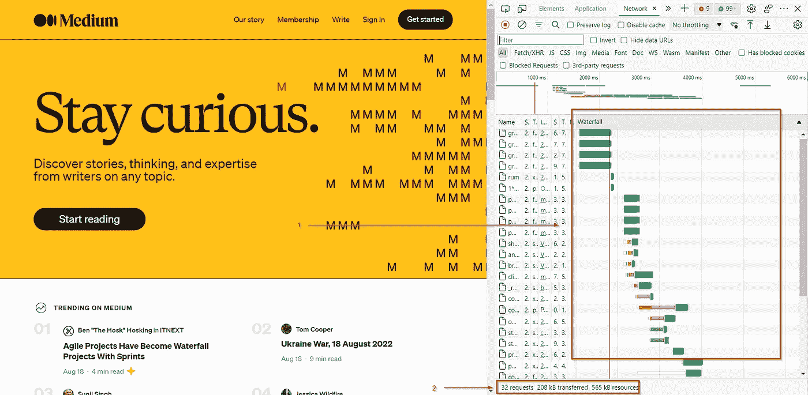
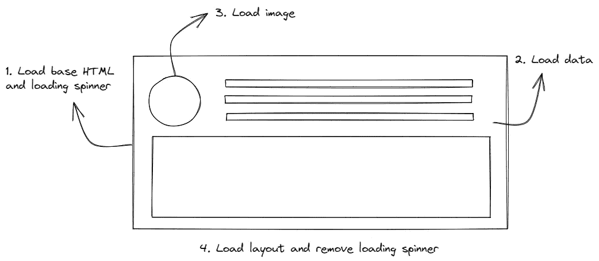
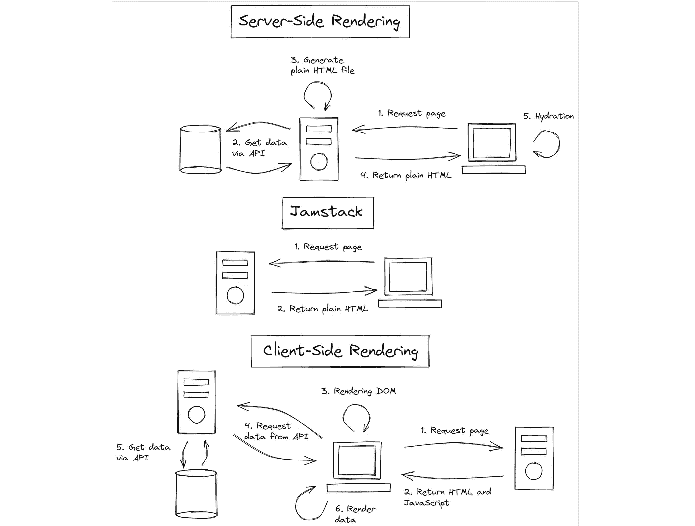
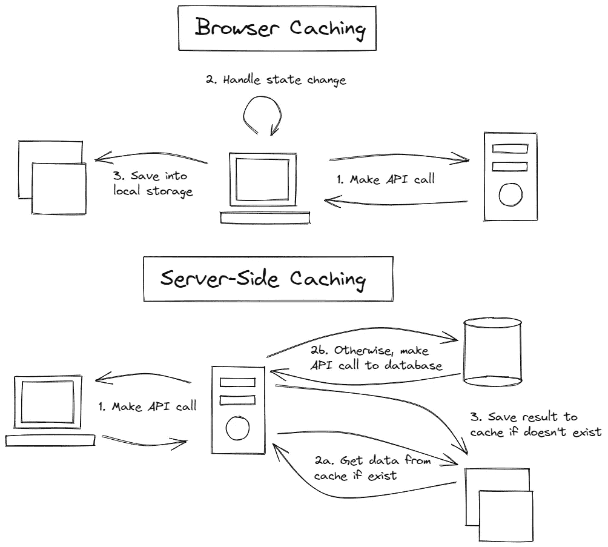
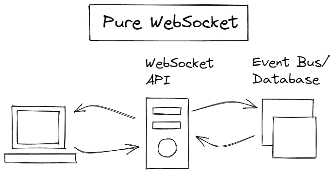
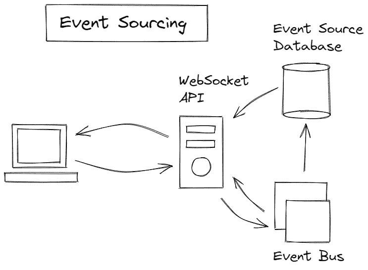
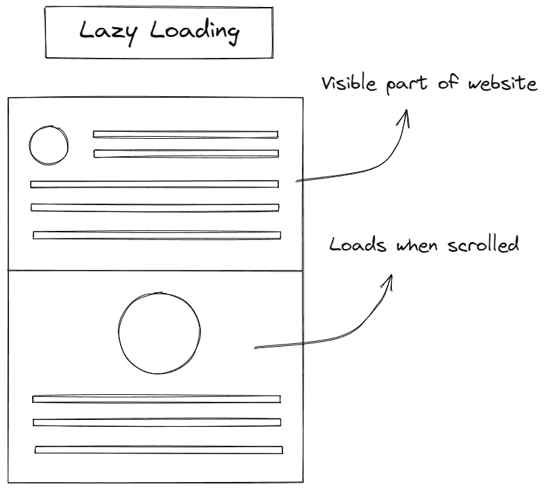
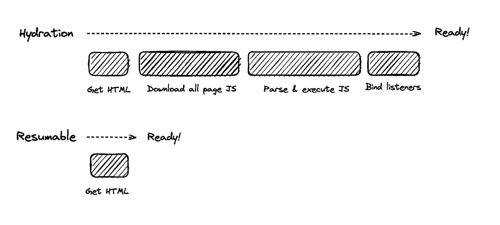

# 提高 Web 性能的五种数据加载模式

> 原文：<https://betterprogramming.pub/five-data-loading-patterns-to-improve-web-performance-57d4f288ef13>

## 前端数据加载模式介绍


照片由 [Unsplash](https://unsplash.com?utm_source=medium&utm_medium=referral) 上的 [Clément Hélardot](https://unsplash.com/@clemhlrdt?utm_source=medium&utm_medium=referral) 拍摄

你不需要为每件事都使用一个框架，但是如果你使用一个框架，这篇文章将帮助你以最有效的方式使用它。

说到性能，你不应该吝啬。有数以百万计的网站，你在和每一个谷歌搜索结果进行激烈的竞争。研究表明，用户[会放弃加载时间超过三秒的网站](https://www.marketingdive.com/news/google-53-of-mobile-users-abandon-sites-that-take-over-3-seconds-to-load/426070/)。三秒钟是很短的时间。虽然现在许多网站的加载时间不到一秒钟，但是没有一个放之四海而皆准的解决方案，第一个请求可能是你的应用程序成败的关键。

现代前端应用程序越来越大。难怪业界越来越关注优化。框架为应用程序创建了不合理的构建规模，这可能决定应用程序的成败。您打包和提供的每一点不必要的 JavaScript 代码都会增加客户端需要加载和处理的代码。经验法则是越少越好。

数据加载模式是应用程序的重要组成部分，因为它们将决定访问者可以直接使用哪些部分。不要因为他们在应用程序的主页上下载了一个 5MB 的图像，就让他们的整个网站变慢，并且更好地理解这个问题。您需要了解资源加载瀑布。

# 加载 Spinner Hell 和数据瀑布

资源加载瀑布是从网络服务器下载到客户端的文件的级联，从头到尾加载你的网站。它本质上描述了从网络上下载并加载页面的每个文件的生命周期。

您可以通过打开浏览器查看网络选项卡来了解这一点。



中等主页。作者图片

你在那里看到了什么？您应该看到两个基本组件:

1.  该图表显示了请求和加载的每个文件的时间表。您可以查看哪些文件先加载，并跟踪每个连续的请求，直到某个文件需要很长时间才能加载。您可以检查它，看看是否可以优化它。
2.  在页面底部，您可以检查您的客户端消耗了多少 kB 的资源。注意客户端需要下载多少数据是很重要的。第一次尝试时，您可以将其用作以后优化的基准。

没有人喜欢空白的白屏，尤其是你的用户。滞后的资源加载瀑布需要一个基本的占位符，然后才能开始在客户端构建布局。通常，您会使用旋转器或骨骼加载器。随着数据一个接一个地加载，页面将显示一个加载器，直到所有组件都准备好。

虽然添加加载器作为占位符是一种改进，但是让它持续太久会导致“旋转地狱”本质上，你的应用程序在加载时停滞不前，虽然它比一个空白的 HTML 页面好，但它可能会变得令人讨厌，访问者会选择退出你的网站。

但是等待数据不是重点吗？

是的，但是你可以装得更快。



作者图片

假设您想要加载一个社交媒体布局，您可以添加一个加载微调器或一个骨架加载器来确保您不会加载一个不完整的站点。骨架加载程序通常会等待以下情况:

*   来自后端 API 的数据
*   根据数据构建布局

您对 API 进行异步调用，然后获取 CDN 上资产的 URL。只有这样，您才能开始在客户端构建布局。第一次尝试展示你的脸、名字、状态和 Instagram 帖子需要做很多工作。

# 您需要知道的五种数据加载模式

随着 React、Vue 或 Angular 等框架成为创建最简单应用程序的首选解决方案，开发软件变得越来越容易。但是使用这些庞大的框架，其中充满了大量你甚至不使用的神奇功能，这不是你应该去做的。

你是来优化的。记住，越少越好。

但是如果不能少做呢？那么，你将如何提供速度惊人的代码呢？很好，你将要学习五种数据加载模式，你可以用它们来让你的站点快速加载，或者像你说的那样，快得惊人。

# 服务器端渲染和 Jamstack

现代 JavaScript 框架经常使用客户端渲染(CSR)来渲染网页。浏览器[在一个有效负载中接收一个 JavaScript 包](https://web.dev/rendering-on-the-web/)和静态 HTML，然后它将呈现 DOM 并添加监听器和事件触发器以实现反应性。当一个 CSR 应用程序在 DOM 中呈现时，[页面将被阻塞](https://web.dev/rendering-on-the-web/)，直到所有组件都被成功呈现。渲染使应用程序具有反应性。要运行它，您必须对服务器进行另一个 API 调用，并检索您想要加载的任何数据。

服务器端呈现(SSR)是指应用程序向客户端提供普通的 HTML。SSR 分为两种:有水合作用的 SSR 和没有水合作用的 SSR。SSR 是老框架使用的老技术，比如 WordPress、Ruby on Rails 和 ASP.NET。SSR 的主要目标是给用户一个静态 HTML，其中包含先决条件数据。与 CSR 不同，SSR 不需要对后端进行另一个 API 调用，因为服务器会生成一个 HTML 模板并加载任何数据。

像 Next.js 这样的新解决方案使用了 hydration，其中静态 HTML 将在客户端使用 JavaScript 进行水合。把它想象成速溶咖啡:咖啡粉是 HTML，水是 JavaScript。将速溶咖啡粉和水混合会发生什么？你得到了——等着瞧——咖啡。

但是什么是 Jamstack 呢？Jamstack 类似于 SSR，因为客户端检索的是普通的 HTML。但是在 SSR 期间，客户机从服务器检索 HTML。然而，Jamstack 应用程序直接从 CDN 提供预先生成的 HTML。正因为如此，Jamstack 应用程序通常加载更快，但开发者更难制作动态内容。Jamstack 应用程序适合为客户端预先生成 HTML。但是，当您在客户端使用大量 JavaScript 时，与客户端呈现(CSR)相比，使用 Jamstack 变得越来越不合理。

SSR 和 Jamstack 各有不同。它们的共同之处在于，它们不会让客户机负担使用 JavaScript 从头开始呈现整个页面。



Jamstack vs. SSR vs. CSR。作者图片

当你优化你的站点的 SEO 时，推荐使用 SSR 和 Jamstack，因为与 CSR 相比，两者都返回搜索机器人可以轻易遍历的 HTML 文件。但是搜索机器人仍然可以遍历和编译 CSR 的 JavaScript 文件。然而，在 CSR 应用程序中渲染每个 JavaScript 文件可能很耗时，并且会降低站点的 SEO 效率。

SSR 和 Jamstack 非常受欢迎，与它们的普通 CSR 同行 React 和 Vue 相比，更多的项目正在转向像 Next.js 和 Nuxt.js 这样的 SSR 框架，主要是因为 SSR 框架在 SEO 方面提供了更好的灵活性。Next.js 有[一整节谈论他们框架上的 SEO](https://nextjs.org/learn/seo/introduction-to-seo) 优化。

SSR 应用程序通常会有模板引擎，当提供给客户端时，这些引擎会将变量注入到 HTML 中。例如，在 Next.js 中，您可以加载一个学生列表:

```
export default function Home({ studentList }) {
  return (
    <Layout home>
        <ul>
          {studentList.map(({ id, name, age }) => (
            <li key={id}>
              {name}
              <br />
              {age}
            </li>
          ))}
        </ul>
    </Layout>
  );
}
```

Jamstack 在文档网站中很受欢迎，这些网站通常将代码编译成 HTML 文件并将其托管在 CDN 上。Jamstack 文件通常在编译成 HTML 之前使用 Markdown，例如:

```
---
author: Agustinus Theodorus
title: 'Title'
description: Description
---
Hello World
```

# 主动内存缓存

当您想要快速获取已经拥有的数据时，您需要进行缓存—缓存存储用户最近检索到的数据。可以通过两种方式实现缓存:使用 Redis 这样的超快速键-值存储来保存数据键和值，以及使用简单的浏览器缓存来本地存储数据。

缓存部分存储您的数据，而不是用作永久存储。将缓存用作永久存储是一种反模式。强烈建议生产应用程序使用缓存；随着新应用的逐渐成熟，它们将开始使用缓存。

但是什么时候应该在 Redis 缓存(服务器缓存)和浏览器缓存(本地缓存)之间做出选择呢？两者都可以同时使用，但最终将服务于不同的目的。



缓存方案。作者图片

服务器缓存有助于降低前端和后端之间的延迟。由于键值数据库比传统的关系 SQL 数据库更快，这将显著增加 API 的响应时间。然而，本地缓存有助于改善应用程序状态管理，使应用程序能够在页面刷新后保持状态，并有助于未来的访问。

总之，如果你想提高你的应用程序的性能，你可以使用服务器缓存来加速你的 API，但是如果你想保持你的应用程序状态，你应该使用本地存储缓存。虽然本地缓存可能看起来一点帮助都没有，但是它确实有助于通过持久化不经常改变的状态来减少对后端的 API 调用的数量。然而，当与实时数据结合时，本地缓存会更好。

# 数据事件来源

您可以通过 WebSockets 在前端和后端之间建立实时连接。WebSockets 是一种依赖于事件的双向通信机制。



通用 Websocket 架构。作者图片

在常见的 WebSocket 架构中，前端应用程序将连接到 WebSocket API、事件总线或数据库。大多数 WebSocket 架构利用它作为 REST 的替代品，尤其是在像聊天应用程序这样的用例中；每隔几秒钟轮询一次后端服务会变得低效。WebSockets 允许您从另一端接收更新，而无需通过双向连接创建新的请求。

与普通的 HTTP 请求相比，WebSockets 建立了一个微小的、保持活动的连接。将 WebSockets 与本地浏览器缓存结合起来创建了一个实时应用程序。您可以根据从 WebSocket 接收的事件更新应用程序的状态。然而，[存在一些关于性能、可伸缩性和潜在数据冲突的警告](https://blog.bitsrc.io/event-sourcing-pattern-for-real-time-frontends-42359e6dd957)。



事件源架构。作者图片

一个纯 WebSocket 实现还是有很多缺点的。使用 WebSockets 而不是常规的 HTTP 调用会改变整个应用程序的行为方式。仅仅一个轻微的连接问题就能影响你的整体 UX。例如，当 WebSocket 需要在每次有 get 请求时查询数据库时，它就不能具有实时性能。后端存在瓶颈，需要优化以获得更好的实时结果，从而使 WebSockets 变得可行，成为更合理的答案。

需要有一个底层的架构模式来支持它。[事件源是一种流行的数据模式](https://blog.bitsrc.io/event-sourcing-pattern-for-real-time-frontends-42359e6dd957)您可以用它来创建可靠的实时应用程序。虽然它不能保证应用程序的整体性能，但通过拥有实时用户界面，它将为您的客户提供更好的 UX。

现代 JavaScript 有 WebSocket 提供者，您可以使用。`WebSocket`类打开到远程服务器的连接，并使您能够在 WebSocket 打开连接、关闭连接、返回错误或返回事件时进行监听。

```
const ws = new WebSocket('ws://localhost');ws.addEventListener('message', (event) => {
    console.log('Message from server ', event.data);
});
```

您想对服务器事件做出反应吗？添加一个`addEventListener`函数并插入一个它将使用的回调函数。

```
ws.send('Hello World');
```

想传递信息吗？WebSockets 抓住了你。使用`send`函数向服务器发送消息。这就像打印“你好，世界”一样简单这些示例来自[MDN 文档](https://developer.mozilla.org/en-US/docs/Web/API/WebSocket?retiredLocale=id)。

# 预取和延迟加载

预取和延迟加载已经成为前端开发人员的常识。有效利用客户机的资源和带宽可以大大提高应用程序的性能。

## 预取

预取使开发人员能够更精确地控制客户端的空闲带宽、加载资源以及客户端接下来可能需要的页面。当一个网站有一个预取链接时，浏览器会[悄悄地下载](https://developer.mozilla.org/en-US/docs/Web/HTTP/Link_prefetching_FAQ)内容并将其存储在其缓存中。当用户点击预取链接时，它们的加载速度会明显加快。

```
<link rel="prefetch" href="https://example.com/example.html">
```

您在`link` HTML 元素中指定预取 URL，更具体地说，是在`rel`属性中。预取有一些优点和缺点:

1.  优点:预取会等到浏览器的网络空闲并且不再被使用，并且当您通过单击链接或触发延迟加载功能来触发使用时会停止。
2.  优点:预取在浏览器中缓存数据，当重定向到一个链接时，使页面转换更快。
3.  缺点:它可以用来下载追踪器，危及用户隐私。

## 惰性装载

惰性加载是一种常见的数据加载模式，它让客户端按菜单加载结果，直到客户端需要时才加载所有内容。延迟加载将使客户端在滚动到视图中后获取网站的后面部分。



懒加载。作者图片

延迟加载通过让浏览器专注于更重要的屏幕资源，使你的网站加载更快。当你看不到的时候，你不需要在一个给定的网站上加载所有的图片/文本。但是延迟加载只能帮助你延迟下载资源，并不能让你的资源变得更小更划算。

然而，如果你正在寻找一个类似于延迟加载的更具成本效益的解决方案，尝试寻找可恢复性。

# 可再生性

许多开发者以前从未听说过可再生性的概念。可恢复性[在服务器](https://github.com/BuilderIO/qwik/blob/main/packages/docs/src/routes/docs/concepts/resumable/index.mdx#introducing-resumability)中部分呈现 JavaScript，呈现的最终状态将被序列化，并与相应的 HTML 有效负载一起发送到客户端。然后客户端将完成渲染，节省客户端的时间和资源。本质上，可恢复性使用服务器来完成繁重的工作，然后通过序列化给客户端最少的 JavaScript 来执行。

可重用性的主要思想是将应用程序状态从服务器序列化到客户端。Resumability 不是在前端加载所有内容(HTML、JS)并进行水化，而是分阶段序列化 JavaScript 解析，并以 HTML 格式发送给客户端。



可恢复性与水合作用。图片来自 [Qwik](https://github.com/BuilderIO/qwik/blob/main/packages/docs/src/routes/docs/concepts/resumable/index.mdx)

页面启动将是即时的，因为客户端不能重新加载任何东西，并且可以反序列化注入 HTML 的状态。可持续性是一个非常陌生的概念，在许多项目中并不常见。它是由 Qwik 的创始人 Misko Hevery 创造的。

[Qwik 是一个 JavaScript 框架](https://github.com/BuilderIO/qwik)，它依赖于底层的可重用性。与其他框架不同，Qwik 是在考虑可重用性的基础上从头开始构建的。像 [React 和 Vue 这样的框架不可能在不牺牲向后兼容性的情况下利用可重用性](https://github.com/BuilderIO/qwik/blob/main/packages/docs/src/routes/docs/think-qwik/index.mdx#why-not-fix-existing-frameworkstools)。这是因为与大多数 JavaScript 框架的同步性质相比，Qwik 的惰性加载组件使用异步惰性加载。

Qwik 的[目标是加载尽可能少的 JavaScript。延迟加载 JavaScript 很难，而且在某些情况下是不可能的。越不需要越好。可重用性允许开发人员进行细粒度的延迟加载，并减少移动应用程序的内存使用，从而为移动 web 优化您的站点。](https://github.com/BuilderIO/qwik)

使用 Qwik 在某些方面是相似的——特别是它的语法。这里有一个关于 Qwik 如何在代码中工作的[代码片段示例](https://qwik.builder.io/examples/introduction/hello-world/)。应用程序的根将以 HTML 的形式出现:

```
import { App } from './app';export const Root = () => {
  return (
    <html>
      <head>
        <title>Hello Qwik</title>
      </head>
      <body>
        <App />
      </body>
    </html>
  );
};
```

根对`App`有依赖性。它将是延迟加载的 Qwik 组件:

```
import { component$ } from '@builder.io/qwik';export const App = component$(() => {
  return <p>Hello Qwik</p>;
});
```

Qwik 和 React 在组件级别有相似之处。但是当你进入服务器端的时候就不一样了。

```
import { renderToString, RenderOptions } from '@builder.io/qwik/server';
import { Root } from './root';export default function (opts: RenderOptions) {
  return renderToString(<Root />, opts);
}
```

上面的代码片段向您展示了 Qwik 的服务器端如何使用`renderToString`方法序列化根组件。然后，客户端只需要解析纯 HTML 并反序列化 JavaScript 状态，而不需要重新加载它们。

# 摘要

应用程序性能对客户端至关重要。启动时你需要加载的资源越多，你的应用程序需要启动的时间就越长。装载时间期望值越来越低。你需要加载一个站点的时间越少越好。

但是，如果您正在开发大型企业应用程序，如何优化您的应用程序并不明显。数据加载模式是优化应用程序速度的一种方式。在本文中，您回顾了可能有用的五种数据加载模式:

1.  服务器端渲染(SSR)和 Jamstack
2.  主动内存缓存
3.  数据事件来源
4.  预取和延迟加载
5.  可再生性

所有这五个在他们自己的环境中都是有用的。

对于不太需要客户端状态管理的应用程序，SSR 和 Jamstack 通常是不错的选择。随着 React 等现代 JavaScript 框架的出现，越来越多的人开始尝试客户端渲染(CSR)，社区似乎又回到了 SSR。SSR 是旧的 MVC web 框架使用的技术，它使用模板引擎根据后端的数据生成 HTML。Jamstack 是对原始网络的一种更古老的描述，在那里一切都只使用 HTML。

主动内存缓存帮助用户更快地从 API 加载数据。主动内存缓存通过在远程缓存服务器(Redis)或本地浏览器缓存上缓存结果，解决了数据加载的重要问题。另一种数据加载模式甚至使用它，预取。

接下来，事件源是一种架构模式，它补充了实时的基于事件的 WebSocket APIs。普通的旧 WebSocket 不足以变得完全高效，因为即使 web socket 本身是实时的，对数据库的重复 API 调用也会导致瓶颈。事件源通过创建一个单独的数据库来检索数据，从而解决了这个问题。

预取和延迟加载是最容易实现的解决方案。预取的目标是在网络空闲时静默加载数据。客户端会将预取的链接保存在浏览器缓存中，使其在接触时立即生效。

延迟加载减少了第一次点击时需要加载的资源数量。您只需要在页面加载后直接看到的资源。然而，可恢复性将延迟加载发挥到了极致。可恢复性是一种延迟加载 JavaScript 组件的方法，方法是在服务器中呈现组件，然后序列化状态以通过 HTML 在客户端继续呈现。

# 从这里去哪里？

学习优化你的前端应用程序是一个持续的过程；你需要积极主动地对待你每天要做的事情。数据加载模式只是提高应用程序性能的几种方法之一。

但是，在对应用程序的结构、使用和加载数据的方式做出任何重大改变之前，最好考虑一下常见的缺陷。

如果您有兴趣了解这些参考资料，可以查看以下内容:

*   Qwik [概述](https://qwik.builder.io/docs/overview/)
*   [提高前端性能的八个技巧](https://medium.com/@inverita/frontend-optimization-8-tips-to-improve-web-performance-29af4b00efe7)
*   实时[事件源模式](https://blog.bitsrc.io/event-sourcing-pattern-for-real-time-frontends-42359e6dd957)
*   12 前端性能[优化技术](https://medium.com/geekculture/12-front-end-performance-patterns-you-need-to-know-def550620464)
*   23 web 性能[要避免的错误](https://blog.speedvitals.com/web-performance-mistakes/#Over_Utilizing_Preloading)

我希望这篇文章对你有所帮助。如果您有任何问题或意见，请加入下面的论坛讨论。

*原载于 2022 年 9 月 27 日*[*【https://www.smashingmagazine.com】*](https://www.smashingmagazine.com/2022/09/data-loading-patterns-improve-frontend-performance/)*。*