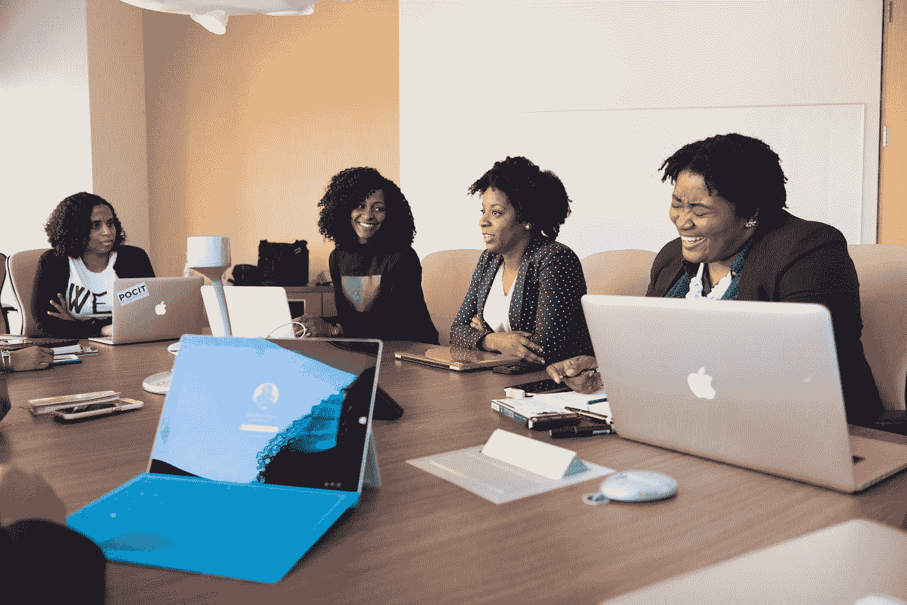
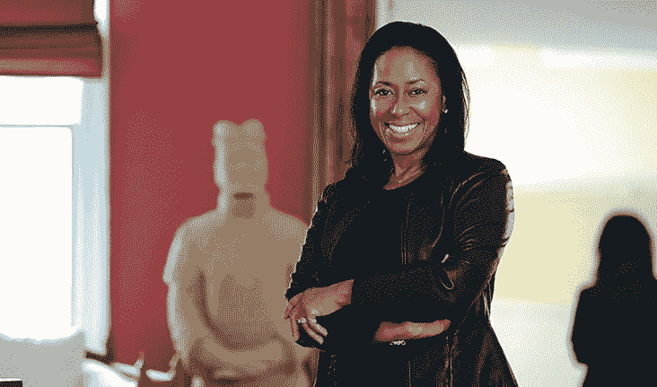
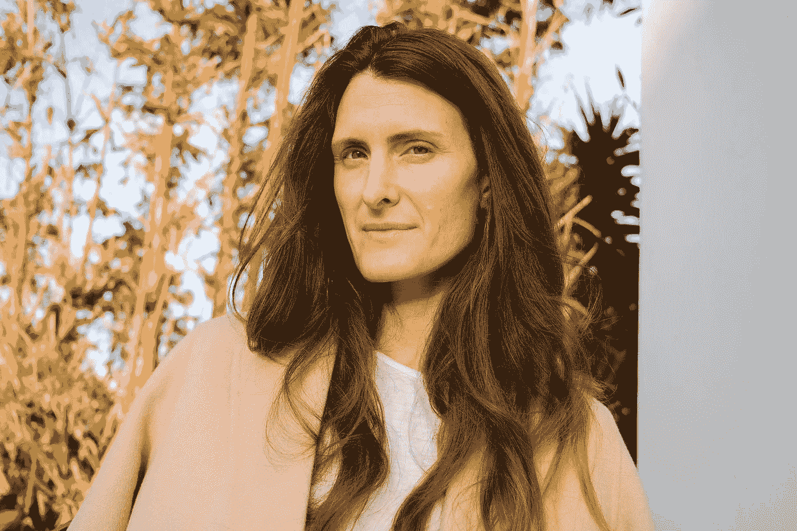
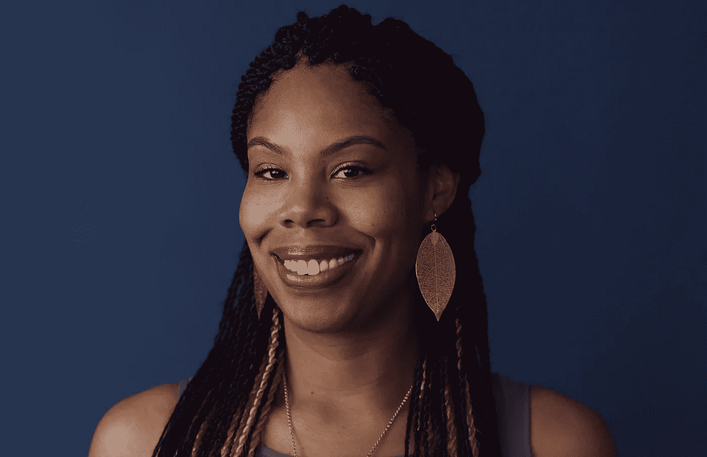

# 5 位鼓舞人心的女性领导着科技行业

> 原文：<https://betterprogramming.pub/five-inspiring-women-leading-the-tech-industry-2114a53b2316>

## 我们钦佩的女性

克里斯蒂娜@ wocintechchat.com 在 [Unsplash](https://unsplash.com?utm_source=medium&utm_medium=referral) 上的照片

即使在 2020 年，科技行业仍然是男性主导的，最明显的是高层缺乏多样性。在最近的一项研究中，美国所有工作领域的就业女性比例已上升至 47%；然而，在这个星球上最大的五家科技公司(亚马逊、苹果、脸书、谷歌和微软)，员工中只有 [34.4%是女性](https://www.statista.com/chart/4467/female-employees-at-tech-companies/)。

国家妇女信息技术中心最近做了一项关于工作场所多样性的研究，描述了工作场所女性令人生畏的统计数据。根据这项研究，2019 年有色女性仅占计算和数学劳动力的 11%左右，黑人女性占总数的 3%。

尽管这些数字有所提高，但更多的代表性是必要的。为了揭示一些激发这一必要的技术变革的女性，Vantage Point 编辑了一份我们钦佩的五位女性的名单。

# 丽莎·斯基特·塔图姆

丽莎·斯基特·塔图姆是 Landit 的创始人兼首席执行官，这是一个旨在提高女性在职场中的成功和参与度的技术平台。Landit 平台是一个解决方案，使公司能够吸引、发展和保留多样化的高潜力人才，特别是迎合女性。在创建 Landit 之前，Lisa 是 Cardinal Partners 的普通合伙人，该公司拥有 3 . 5 亿多美元的早期医疗保健风险投资公司。她之前还在宝洁公司、通用电气资本公司工作过，并创立了自己的咨询公司。

丽莎的[推特](https://twitter.com/lisaskeetetatum?lang=en)

丽莎的 [Linkedin](https://www.linkedin.com/in/lisa-skeete-tatum/)

# **阿拉卡兹**

Ara Katz 是 [Seed](https://seed.com/) 的联合创始人兼联合首席执行官，该组织以其对微生物组的数据驱动和科学方法而闻名。Seed 也是众所周知的令人垂涎的每日合生素的创造者。Ara 的灵感来自于她个人的引导任务，探索微生物的重要性以及它们如何影响我们的身体、我们的家庭和我们的星球。Seed 改变了我们思考和谈论肠道健康的方式，一次一个益生菌、信息图和对话。

阿拉的 [Instagram](https://www.instagram.com/arakatz/)

阿拉的[推特](https://twitter.com/arakatz)

# 金伯利·布莱恩特

金伯利·布莱恩特是“黑人女孩准则”的创始人兼首席执行官。Bryant 已经成为技术教育领域最具影响力的女性之一，强调技术行业更加多元化。黑人女孩代码是一个领先的非营利组织，旨在使技术成为教育的一个组成部分。该计划侧重于教授女孩领先的技术项目，如计算和移动应用程序。金伯利认为，“通过教育在幼年赋予妇女权力是该领域彻底变革的关键。”

金伯利的[推特](https://twitter.com/6Gems?ref_src=twsrc%5Egoogle%7Ctwcamp%5Eserp%7Ctwgr%5Eauthor)

# **苏珊·沃西基**

苏珊·沃西基是 YouTube 的首席执行官，YouTube 是世界上最受欢迎的数字视频平台，全球超过 10 亿人使用它来获取信息、分享视频和塑造文化。

在成为首席执行官之前，Wojcicki 在科技行业工作了 20 多年，但她表示，即使有多年的经验，她仍然觉得她必须付出更多的努力才能获得应有的尊重。在加入 YouTube 之前，Wojcicki 参与了谷歌的创建，并成为谷歌的第一任营销经理。她后来领导了公司的在线广告业务，并负责谷歌的第一个视频服务。

苏珊的[推特](https://twitter.com/SusanWojcicki?ref_src=twsrc%5Egoogle%7Ctwcamp%5Eserp%7Ctwgr%5Eauthor)

苏珊的 [Instagram](https://www.instagram.com/susanwojcicki/?hl=en)

# 艾丽卡·贝克

Erica 是著名的[项目 Include](https://projectinclude.org/) 的主要创始人之一，该项目旨在通过接纳女性和其他少数族裔，让现代工作场所变得更加包容。Erica 在创造一个更加性别中立的技术环境方面发挥了关键作用。她还发起倡议，让企业组织打造一种基于包容性解决方案的文化。目前，Erica 是 Slack 的一名高级工程师，已经指导了许多公司团队成功地进行了持久的变革。

艾丽卡的[推特](https://twitter.com/ericajoy?lang=en)

艾丽卡的 [Linkedin](https://www.linkedin.com/in/ericajoy/)

科技界有哪些女性给了你灵感？请在回复中告诉我们。

感谢阅读！