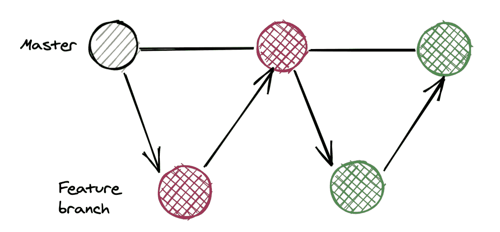
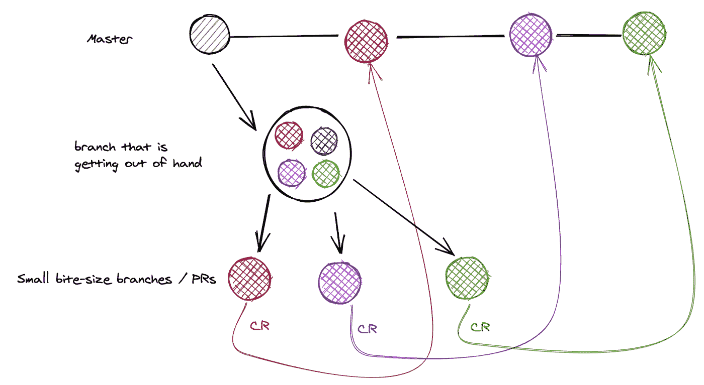
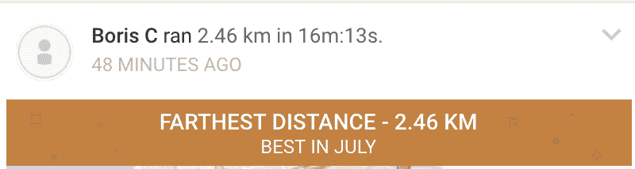

# 正面代码评审的 5 个实用技巧

> 原文：<https://betterprogramming.pub/five-practical-tips-for-positive-code-review-6a41211aaab1>

## 代码审查可能很难，但也不一定如此

约书亚·阿拉贡在 [Unsplash](https://unsplash.com?utm_source=medium&utm_medium=referral) 上拍摄的照片。

大多数开发人员都认为代码评审是开发周期的一个重要部分。更多的开发人员认为代码评审是学习和提高专业技能的好平台。但是*所有的*开发人员都能理解这样一个事实:在某些情况下，代码审查对于缺乏“正确”文化的团队来说会变得丑陋和痛苦。

在我看来，代码审查是我们作为软件工程师学习过程中的一个关键部分。从代码评审中最大的收获不是代码的质量，也不是发现一两个 bug 的可能性。这是学习和指导的机会。

关于如何进行代码评审，已经说了很多，也写了很多。我想回顾一下我认为最有效的一些主要做法。

# 1.区分“不好”和“不是我会怎么做”

我见过的一些最血腥的 CR 争论都是围绕调味展开的——两种不同的方式，几乎同样好/坏，来达到相同的目标。因此，在我对代码进行评论之前，我会对自己说，“我的评论通过了这两个标准吗？”

1.  提议的改变真的不好吗，或者只是与我的做法不同？
2.  我的评论*真的会*让代码变得更好吗？

我会添加评论，只有当它通过这两个标准。我通常也会明确地提到一个评论是“次要的”或“不同的味道”，作者应该选择是否接受它。PR 无论如何都会被批准。

# 2.确保作者从你的评论中学到一些东西

你的评论被接受后代码质量更好是好事，但如果作者通过实现你的评论学到了什么就更牛逼了！这将使未来的 PRs 更好，我们都作为专业人员和公司发展，我们觉得代码审查不仅仅是一些官僚的过程。它实际上给了我们价值！

代码评审是传递高级语言/框架特性、最佳实践、业务领域和公司知识的沃土。向缺乏经验的开发人员传授有关缓存、性能、稳定性、可伸缩性和漏洞的知识。如果我必须量化它，我会说在过去几年中我所学到的大约 30%来自代码评审(令人敬畏的 [Ruby tap 方法](https://apidock.com/ruby/Object/tap)只是一个例子)。

为了确保知识被有效地传递，重要的是强调*为什么*建议的注释是正确的方法(干净的代码/通用设计模式/已知的安全漏洞/将严重影响性能)。如果你真的想更进一步，给作者链接一些阅读材料。

作为一名作家，在参与一个“必要的形式”的过程中学习一些东西总是很有趣的。这给了我充分利用它的可能性。

# 3.作者承担责任，因此有最后的发言权

当争论无法解决，继续争论也没有用时，作者——他(通常)对提议的改变有更好的背景，并会为此承担责任——有最后的发言权。是的，你听到了。而不是更有经验的开发人员或技术领导。作者。

我知道这可能对一些人来说听起来很奇怪，但是当使用技术和逻辑论据无法说服作者有不同的方法时，作为专家或技术负责人，你应该自己更好地陈述你的情况。但是现在，代码将进入生产阶段。
这也将使审查成为双向的。技术领导可能会发现他们缺乏一些知识来说服作者他们的建议是正确的。此外，这可能会迫使技术领导担任“导师”的职位，并努力提高他们的指导和知识传授技能。

*注意:很明显，有一些例外情况会危及生产的稳定性，技术主管/高级主管会坚决否决。*

# 4.向小型 PRs 发展

小 PRs 就像披萨:它们让每个人都更快乐。评审人员的工作量更少，可以很容易地对代码、提议的变更及其质量进行推理，因此可以给出更好的反馈。另一方面，作者得到反馈更快——而且反馈通常更好。此外，通过将一系列小的 PRs 组合成一个大的特性，可以更早地审查代码片段，使得后续的 PRs 越来越好。

我的经验是，一个公关应该少于 12 个文件。那是我的最爱。

你会理所当然地认为有些特性需要更大的变更集，我同意。这些特征仍然可以分解成更小的 PRs。

根据我的经验，有几种方法可以有效地做到这一点(按优先顺序排列):

1.  将小的(可能是部分的)更改推入主文件。我通常从推送我需要的构建块(模式、模型)开始，然后是基础设施代码的另一个 PR(Kafka publishers、消息缓冲区、DB 查询)，最后是连接这些代码的 pull 请求。如果可能的话，我还会将最后一个将整个特性连接到现有系统的拉请求分离出来。

使用特征分支的咬大小 PRs。作者照片。

2.创建一个“发布分支”来创建小的改变，让你更接近一个工作特性。为您的“发布分支”中的“成熟变更”创建拉请求这样，每个变更都很小，并且最终“发布分支”中的所有代码都被分块审查。

使用释放分支的一口尺寸钻杆排放系统

3.当您的分支已经包含一个大的变更集时，您可以将它分成更小的“可审查的”块，并有选择地为每个块创建拉请求。有一些方法可以做到这一点(例如，使用 *git interactive rebase* 将提交分成有意义的提交，以创建一个包含变更子集的 PR)。

将一个大的变更集分解成小的 PRs

最后，作者有责任及时发现未来的拉请求会变得很大，并采取主动措施使其变得更好。

# 5.问候

我的灵感来自我使用的健身应用程序，它会在我表现好时称赞我:

我正在恢复！不要嘲笑我的结果！

这个过程的一部分也是为了让作者意识到他们做得很好！对于缺乏经验的开发人员来说，这是建立他们的信心、主人翁意识和他们能够独立完成复杂事情的感觉的关键部分。

我试着称赞他们酷/高效的代码片段、聪明的测试、对语言特性的酷的使用，或者用得好的设计模式。我还会加一个小小的“kudos！”在一个主要的功能代码审查。

这是我让开发伙伴知道他们做得很好的首选 gif:

来源:https://media3.giphy.com/media/KxiRwO7tqXCTDVKobo/200.gif

我鼓励你找到你的天赋定位。

这是显而易见但也值得一提的:要有礼貌！记住底线是你在批评某人的工作！

所以把“做”和“必须”改成“考虑”和“你觉得……怎么样？”包括“请”和表情符号也不会有什么坏处。

# 结束语

我喜欢代码审查。它们是我学习新事物和指导开发伙伴的主要工具之一。有保留地使用它们，并保持良好的情绪。

感谢阅读！