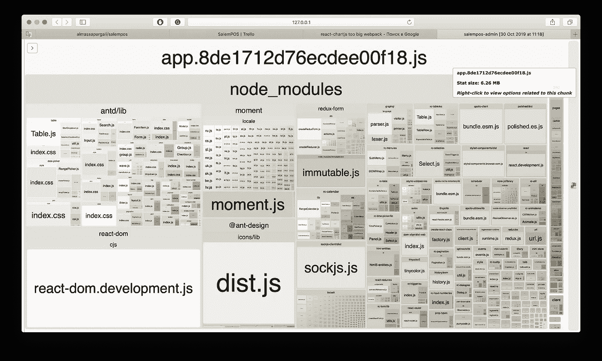
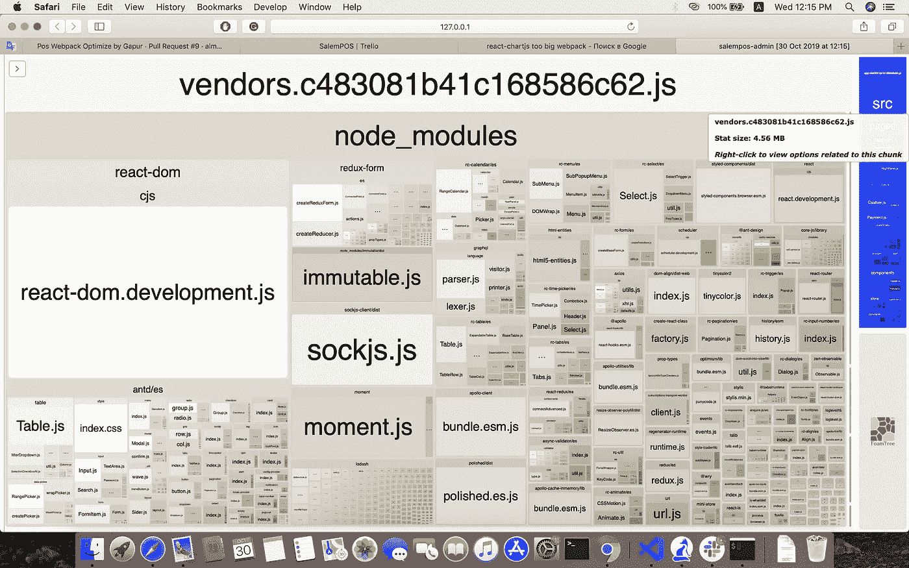

# 缩减 webpack 4 捆绑包大小的五个步骤

> 原文：<https://betterprogramming.pub/five-steps-to-reduce-webpack-bundle-size-8aebcd8e1562>

## 如何优化应用程序的大小


照片由 [René Porter](https://unsplash.com/@reneporter?utm_source=unsplash&utm_medium=referral&utm_content=creditCopyText) 在 [Unsplash](https://unsplash.com/s/photos/size?utm_source=unsplash&utm_medium=referral&utm_content=creditCopyText) 上拍摄

我已经做了几个关于材料反应的项目-用户界面和蚂蚁设计。Material-UI 是一套很棒的 React 组件，可以用来开发 web 应用程序。 [Ant Design](https://ant.design) 是一套令人惊叹的 React 组件。如果你和他们一起工作，你会知道他们丰富多样的组件。

不幸的是，我对包的大小有困难。我在互联网上搜索了很多，希望找到一种优化 webpack 捆绑包大小的方法。下面是我的方法，用五个步骤来优化和减少包的大小。

如果你不知道如何设置 webpack 4，这里是我以前的文章，“[如何设置 webpack 4](https://medium.com/better-programming/how-to-set-up-webpack-4-49012dedbfd6) ”

让我们开始改进我们的 webpack 配置。

# 1.分析我们的产品包

首先，我们必须知道代码中哪个组件的大小更大。

我通过[web pack-bundle-analyzer](https://www.npmjs.com/package/webpack-bundle-analyzer)分析我们的包依赖关系。这个库分析 webpack 统计数据，并通过一个交互式的可缩放树状图给出了一个很好的可视化效果。

它将创建两个视图:一个用于 React 代码，另一个用于 node_modules。为此，我们需要安装它:

```
npm install --save-dev webpack-bundle-analyzer
```

我们需要将以下代码添加到`webpack.config.js`:

当我们运行这个应用程序时，这个可视化效果会显示出来:



web pack-捆绑包-分析器报告

这有助于理解哪个组件太大。现在我们知道`Ant-Design`、`Ant-Design Icons`和`moment.js`有问题。

# 2.巴别塔构型

## **巴别-插件-转换-导入**

大多数开发人员是这样导入`lodash`的:

```
import { get } from 'lodash';
```

因为我们导入了所有的 Lodash 模块，这似乎会导致包的大小非常大。我们应该这样使用它:

```
import _get from 'lodash/get';
```

在这种情况下，我们从 Lodash 导入特定的方法，而不是将整个包导入到我们的代码中。

**注:**我们可以用[巴别-插件-转换-导入](https://www.npmjs.com/package/babel-plugin-transform-imports)。这个插件会用这个特殊的方法将你的第一行转换到第二行，并允许你拉你需要的模块。

您应该安装`babel-plugin-transform-imports`:

```
npm install --save-dev babel-plugin-transform-imports
```

接下来，我们应该配置我们的`wepback.config.js`:

```
["transform-imports"], {
  "lodash": {
    "transform": "lodash/${member}",
    "preventFullImport": true
  }
}
```

## **巴别塔-插件-导入**

当我们从`Ant-Design`进口一个组件时，我们将进口所有未使用的组件。

为了让`Ant-Design`只加载需要的模块，你应该使用 [babel-plugin-import](https://github.com/ant-design/babel-plugin-import) 。该插件兼容`antd`、`antd-mobile`、`lodash`、`material-UI`等。

让我们安装并测试它:

```
npm install babel-plugin-import --save-dev
```

将以下代码添加到`webpack.config.js`:

我们将从`Ant-Design`组件导入仅使用来自`es`目录的 CSS 的模块。

对于`lodash`:

```
{
  "libraryName": "lodash",
  "libraryDirectory": "",
  "camel2DashComponentName": false,  // default: true
}
```

对于`material-ui`:

```
{
  "libraryName": "@material-ui/core",
  "libraryDirectory": "components",  // default: lib
  "camel2DashComponentName": false,  // default: true
}
```

# 3.减小 Moment.js 的大小

Moment.js 是一个很好的库，可以用来更新对象。但是如果你研究一下这个包的大小，moment.js 是 500Kb。

我们可以用`ContextReplacementPlugin`把 moment.js 的大小从 500Kb 缩小到 125Kb。它指定在 webpack 配置文件中包含区域设置文件:

我们不需要在代码中加载语言环境文件。

# 4.缩小蚂蚁图案图标的尺寸

如果你看看我们的包，我们装了一堆巨大的`Ant-Design SVG icons`。让我们通过向`webpack.config.js`添加以下代码来减小它们的大小:

```
resolve: {
  alias: {
      "@ant-design/icons/lib/dist$": path.resolve(__dirname, "src/constants/icons.js")
  }
}
```

接下来，我们应该在文件夹`src/constants`中创建`icons.js`(或者你想要的任何地方)。确保它与别名路径匹配。在这个文件中，你定义了 Ant Design 应该包含哪些图标。

```
export {
  default as BarChartOutline
} from "[@ant](http://twitter.com/ant)-design/icons/lib/outline/BarChartOutline";
```

# 5.使用 SplitChunksPlugin 进行代码拆分

SplitChunksPlugin 将我们的包分成几个小部分，只在需要的时候加载包。webpack 在内部使用这个插件，我们可以在`webpack.config.js`的`optimization`块中启用/配置它。

在我的例子中，我分成了两部分(`node_modules`和`src`)。

```
optimization: {
  splitChunks: {
    cacheGroups: {
      commons: {
        test: /[\\/]node_modules[\\/]/,
        name: "vendors",
        chunks: "all"
      }
    }
  }
}
```



优化捆绑包

最后，包的大小从 6.26MB 减少到了 4.56MB

我希望这篇文章对你有用。

# 资源

*   [“以下是我如何将我的包大小减少 90%](https://medium.com/@poshakajay/heres-how-i-reduced-my-bundle-size-by-90-2e14c8a11c11) ”
*   [“用 webpack 将你的 React 包大小减半](https://www.linkedin.com/pulse/reduce-your-react-bundle-size-webpack-half-amit-gaikwad/)”
*   [“使用 webpack](https://medium.com/hackernoon/optimising-your-application-bundle-size-with-webpack-e85b00bab579) 优化您的应用捆绑包大小”
*   [“如何使用 React & Webpack](https://medium.com/@GeoffMiller/how-to-customize-ant-design-with-react-webpack-the-missing-guide-c6430f2db10f) 定制 Ant 设计”