# 由于竞争条件，您的 Web 应用程序可能会有错误

> 原文：<https://betterprogramming.pub/fix-race-conditions-in-react-187afc87d9e>

## 这六个序列图可以帮助你找出原因

迪伦·亨特在 [Unsplash](https://unsplash.com?utm_source=medium&utm_medium=referral) 上拍摄的照片

# 普通的 Web 应用程序

我们知道一个普通的 web 服务模型是这样的:

1.  用户在客户端执行操作并发送 HTTP 请求。
2.  服务器返回一个 HTTP 响应。
3.  客户端基于该数据呈现网页。
4.  重复这些过程。

如果用序列图来表示，它看起来像这样:

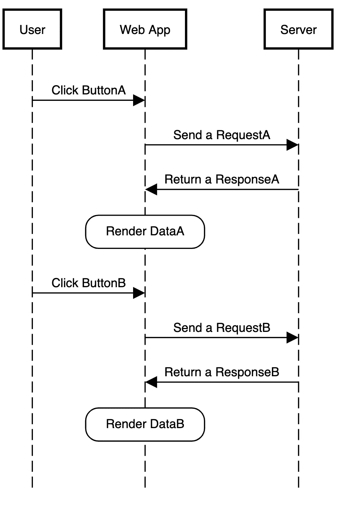

一切正常。

# 竞赛条件

但是，总有一个“但是”

在上面的模型中，我们假设`ResponseA`总是在`ResponseB`之前返回给客户端。但是真实的场景是复杂的，总会出现各种各样的问题。可能是由于用户网络波动或服务器堵塞，`ResponseA`可能会比`ResponseB`晚返回给客户端。

这可能会导致以下结果:

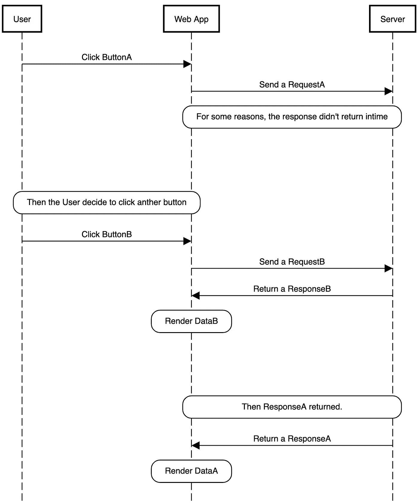

这个结果有什么问题？对于用户来说，他们点击的最后一个按钮是`B`，但是页面最终呈现的是与按钮`A`相关的数据。也就是说页面显示的信息与用户的行为不一致！

这是一个 bug。

如果对数据的请求略有不同，应用程序会根据哪个请求先完成而显示不同的结果，那么这就是竞争条件。

# 真实的案例

前面的内容是理论分析。现在，我们来看一个实际案例。

我们正在使用 React 编写一个显示文章数据的简单项目。

*   当我们单击按钮 1 时，项目将请求并显示与帖子 1 相关的信息。
*   当我们单击按钮 2 时，它将请求并显示与帖子 2 相关的信息。

并且我使用`jsonplaceholder`作为伪 API 服务器。如果您感兴趣，这里有更多关于 JSONPlaceholder 的信息:

 [## JSONPlaceholder

### JSON}占位符由 JSON Server + LowDB 提供支持。用 XV 测试。截至 2021 年 10 月，每个服务约 17 亿个请求…

jsonplaceholder.typicode.com](https://jsonplaceholder.typicode.com) 

## 示例应用程序

这是一个非常普通的 React 应用程序。我们可以通过页面上的两个按钮控制`postID`的值，`Post`组件会根据`postID`请求并渲染相应的帖子。

在`Post`组件中，我们使用`useEffect`来监控`postID`的变化，并通过获取 API 请求数据。

如果您不熟悉这些基础知识，可以查看与 React 相关的教程。

当我们点击按钮`post 1`时，它会渲染 post 1。当我们点击`post 2`按钮时，它将呈现帖子 2。挺好的。

接下来，我们稍微修改一下这段代码来模拟真实的场景。

我们将这段代码添加到`Post`组件的`useEffect`中，如下所示:

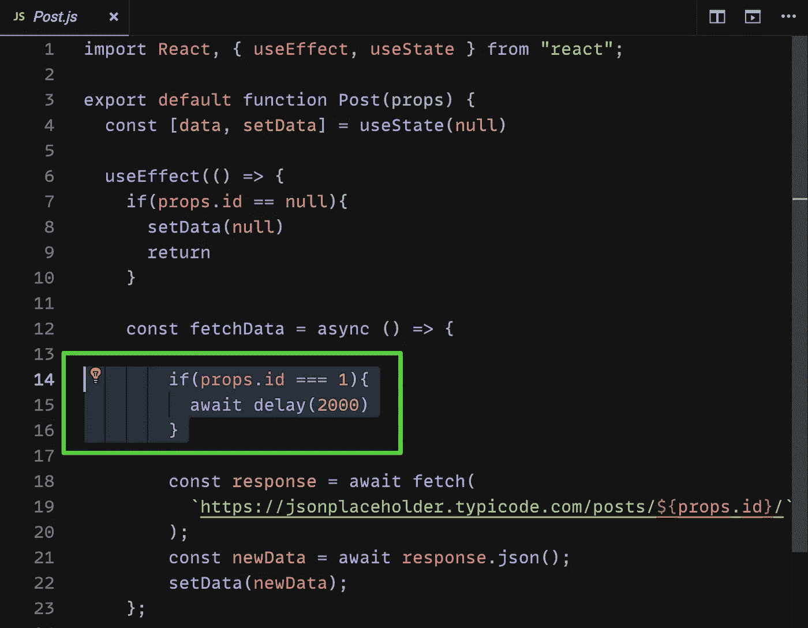

这个代码模拟网络波动。当用户请求 post 1 的数据时，响应会比正常情况慢两秒。

这是一个嵌入式演示:

现在，让我们模拟一下用户做了什么。

首先，我们点击`post1`按钮。很快我们发现页面不返回与 post1 相关的数据。这时，我们变得焦虑，继续点击`post2`按钮，希望页面显示 post2 相关数据。然后会发生以下情况:

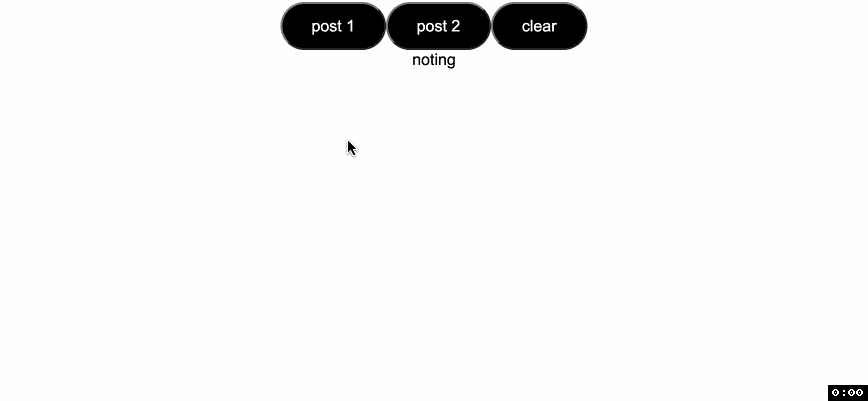

我们最后点击的按钮是`post2`，但是页面最后显示的是`post1`。用户的行为与页面的内容不一致，这是一个 bug。

出现这种现象是因为当我们第一次将`postID`设置为 1 时，一个`useEffect`被触发，当我们再次点击按钮将`postID`设置为 2 时，另一个`useEffect`被触发。两个`useEffects`都会修改数据的值，数据的最终值取决于哪一个更慢。

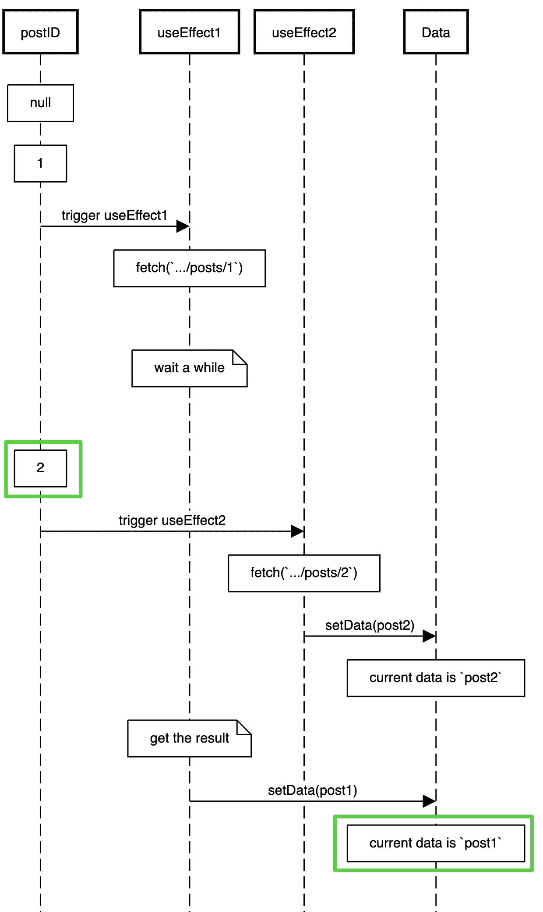

最终帖子 ID 为`2`，但最终帖子数据为`post1`。

# 解决办法

那么，如何解决这个问题呢？事实上，从上面的序列图中，我们可以清楚地看到，我们只需要取消最后三个步骤。

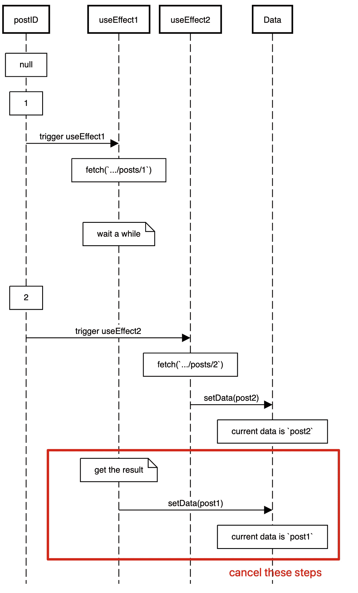

该页面将显示`post2`相关数据，用户行为和页面数据一致。

那么，如何取消这三步呢？

首先我们可以发现这三个步骤都发生在第一个`useEffect`。如果在我们的页面上触发了第二个`useEffect`，那么我们应该取消前面的`useEffect`的后续步骤。

在 React Hooks 中，有一个函数完美解决了这个问题，那就是`useEffect`的返回函数。

从[官方文档](https://reactjs.org/docs/hooks-reference.html#cleaning-up-an-effect)，`useEffect`可以返回一个清理功能。

> 此外，如果一个组件渲染多次(通常如此)，则在执行下一个效果之前，会清除上一个效果。

所以我们可以在清理中写相关的逻辑。

具体有两种解决方案:一种是使用布尔标志，另一种是使用`AbortController`。

## 布尔标志

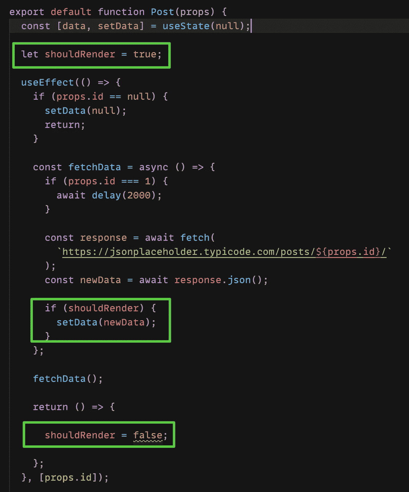

我们给`useEffect`添加了一面名为`shouldRender`的旗帜。默认值为 true。HTTP 请求完成后，数据应该呈现到页面上。

在前一个请求完成之前，一旦另一个`useEffect`被触发，第二个`useEffect`将触发第一个`useEffect`的清除功能。它会将`shouldRender`的值设置为假。这样，即使将来完成了第一个`useEffect`请求，也不会修改数据的值。

这是一个在线演示:

下面是表示该过程的图表:

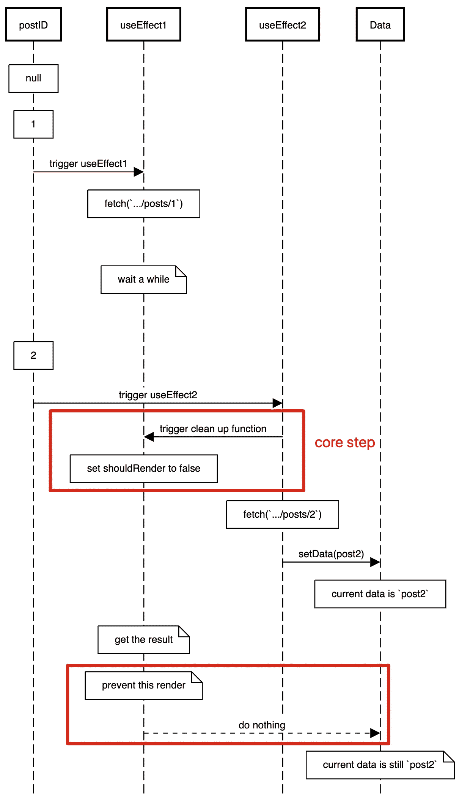

## 堕胎控制员

上面的写法可以解决问题，但是有一个问题。也就是第二个`useEffect`被触发后，第一个`useEffect`发起的 HTTP 请求会继续，即使我们不再关心 HTTP 请求的结果。

考虑到性能优化，我们可以在`useEffect`的清理函数中直接取消这个 HTTP 请求。

与取消 HTTP 请求相关的 API 是`AbortController`。这是一个 WebAPI。如果您不熟悉这个 API，可以参考 MDN 文档。

 [## abort controller-Web API | MDN

### 注意:在 AbortSignal 参考中有额外的例子。在下面的片段中，我们的目标是下载一个视频…

developer.mozilla.org](https://developer.mozilla.org/en-US/docs/Web/API/AbortController) 

以下是更多代码:

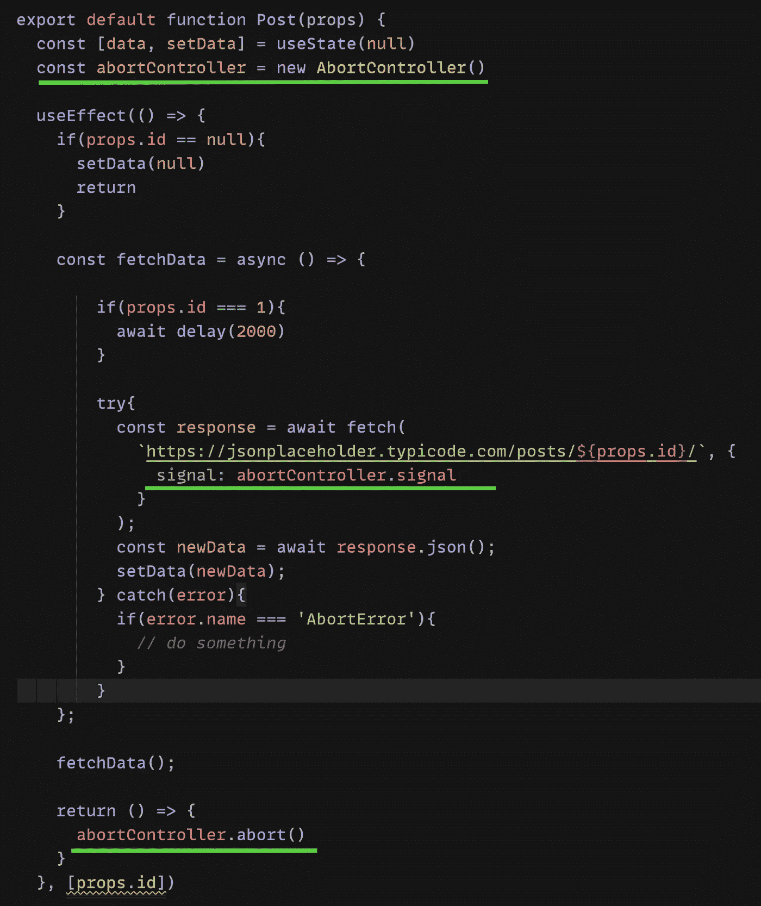

欣赏在线演示:

下面是表示该过程的图表:

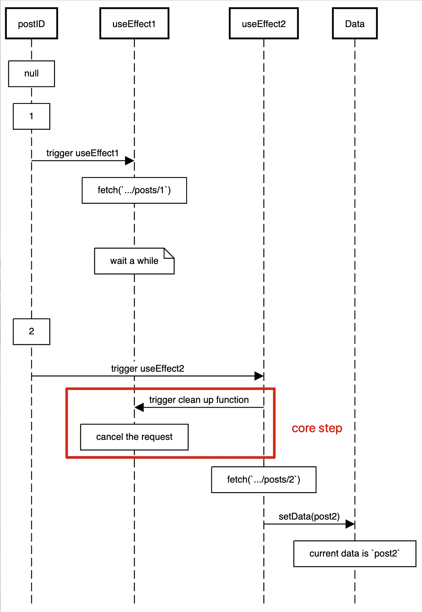

使用网站，我可以使用，我们可以检查`AbortController`是否兼容。结果如下:

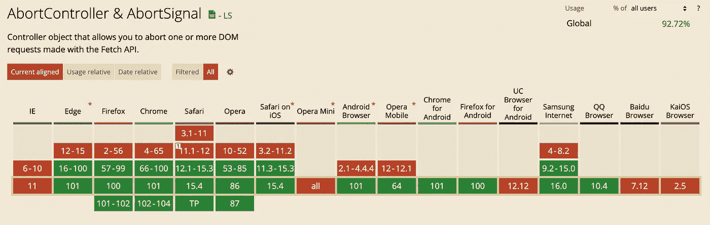

# 结论

竞态条件是一个不明显但经常重复出现的错误。如果你的网站有几百万用户，总会有一些用户在网络不稳定的情况下使用你的网站，他们很可能会遇到这个问题。

作为有抱负的前端开发者，我们应该尽力解决这样的问题。好吧，你之前的项目有这个问题吗？

感谢阅读。