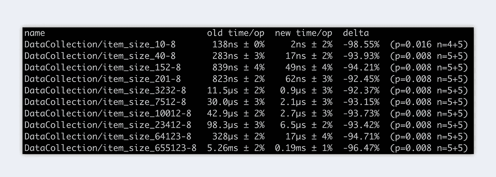

# Go 1.18 中固定大小和动态大小的数据集合

> 原文：<https://betterprogramming.pub/fixed-vs-dynamic-sized-data-collections-in-go-1-18-cc45c7c1e61b>

## 这次我们来看看固定大小和动态大小的数据集合之间的性能差异


地鼠是由[埃贡·厄尔布尔](https://egonelbre.com/)画的。

在 Golang 中，您可以使用固定大小的数据集，如数组，也可以使用动态大小的数据集，如切片。但是，您有没有想过，当您选择其中一个时，应用程序的性能会发生怎样的变化？今天，我们将探索这两种变体，并找出哪种更快，差异有多大。作为小先睹为快，我已经可以告诉你，结果会让你大吃一惊。所以，我现在就不说了，让我们开始吧！！

# 介绍

在我们开始之前，让我们看看现有的不同数据集合。对于固定大小的数据集，有数组。另一方面，我们有地图和切片。简单来说，切片就像数组，具有更通用、更强大的接口，没有固定的大小。地图在其他语言中被称为字典或哈希。只是一个数据集合，其中每个记录都有自己的自定义键。

现在，在我们描绘了我们的各种数据收集之后，我们可以制定我们的主要问题。

*   切片与数组！哪个表现更好？
*   切片 vs 贴图！使用自定义键会影响性能吗？

# 切片与阵列

为了更深入地比较切片和数组，我为两种情况都创建了基准测试。我们首先对这两种方法运行它们。将结果保存到文件中，最后与 benchstat 进行比较。下面您可以看到两个基准测试:

## 阵列基准测试

## 切片基准测试

我认为这两段代码很大程度上都是不言自明的。您可以看到每个代码片段有两个函数。在第一个例子中，根据函数中输入的数字，我在数组/片上附加了许多数字。第二个是我实际的基准测试。在这里，我调用第一个函数，并测试用所有数字充实数组/切片需要多长时间。

# 比较

接下来，我们想知道哪个性能更好，差别有多大。为此，我们存储两个基准测试的结果，并与 benchstat 进行比较。

```
benchstat slice.txt array.txt
```

结果耐人寻味。我已经想到，使用数组的方法应该比使用切片的方法更快。但是我没有意识到两个版本之间有这样的性能差距。使用数组的版本要快得多，而且随着数据集的增大，这种差异会迅速增大。



基准阵列与切片

# 外卖食品

我想大多数人已经意识到数组比切片快。但是我们前面看到的这种影响应该使我们更加注意选择使用哪种类型。我们的数据集越大，我们的决策就越有影响力。

# 最后的想法

这是“固定大小与动态大小的数据收集”的第一部分我希望数组和切片的比较是有趣的，并且您学到了一些新的东西。如果你有什么要提的或有问题，如果你能在评论里留下来，那就太好了。回头见。

这篇文章是一个新系列的一部分。在接下来的几周里，我将研究各种通用的助手函数、有趣的基准和有用的特性。

如果你和我一样兴奋，敬请期待！