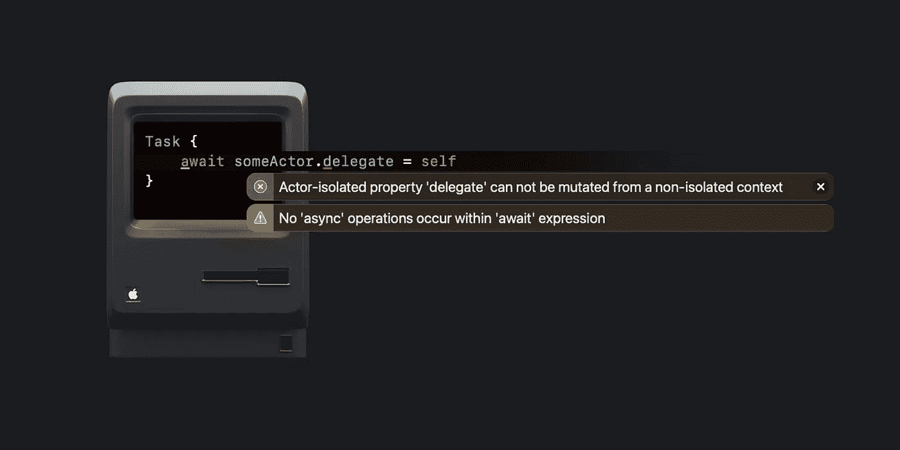
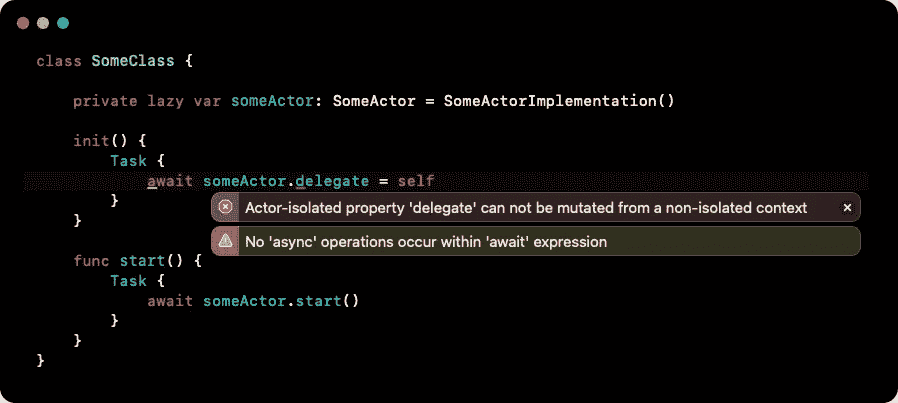

# 修复 Xcode 14 上的 Swift Actors 和 Delegate 错误

> 原文：<https://betterprogramming.pub/fixing-swift-actors-and-delegate-error-on-xcode-14-87f933c9bbcc>

## 如果您已经将 Xcode 更新到版本 14，您可能会得到一个关于在项目中变更 actor-isolated 属性的错误。让我们修理它。



我不会再跟你说什么从零开始的演员，是什么，怎么运作的。自从苹果推出 Swift 5.5 以来，有大量关于它们的酷文章。如果你仍然不使用演员，那么是时候看看了。我敢打赌，总有一天你会把你的一些职业变成演员。

这篇特别的文章是关于在用版本 14 更新 Xcode 之后，使用 actors 和 delegates 时的一个特定的潜在问题。这听起来有点琐碎，但我认为它可能是有用的。让我们开始吧。

# Xcode 14 之前

假设我们有一个带委托的类`SomeClass`:

具有委托的某个类

和`SomeViewModel` —在那里我们将使用我们的`SomeClass`:

带有 SomeClass 的 SomeView 模型

如您所见，我们通过将 delegate 设置为 self 并使视图模型符合`SomeClassDelegate.`进行了原始操作，因此，让我们打印出一些结果。

```
**let someViewModel = SomeViewModel()
someViewModel.start()**// Printed: some class did start
```

好的。现在是时候用一个 actor 重构我们的类了。如何实现(也许你已经在你的项目中以类似的方式完成了):

同样，让我们在视图模型中使用它。当然，因为我们和演员有协议，我们需要任务。

# 在...之后

如果您仍在使用 Xcode 13，您可能不会在这个实现中看到任何警告。但是如果您已经用版本 14 更新了 Xcode，您很可能会得到这个错误:



参与者隔离的属性“delegate”不能从非隔离的上下文中变异

乍一看，这很令人困惑，尤其是当委托是一个 actor 的属性时，“await expression 中没有发生异步操作”。此外，这可能是一个问题—如果我们等待从外部更改属性，为什么我们会看到这个关于隔离的消息？

实际上，这些错误既有意义，又看起来有点怪异。正如我们所知，参与者的基本思想是隔离属性。这意味着你不能仅仅从外部更新属性。所以，很可能，这些错误教会我们如何正确使用 actor，并且属性委托的更新应该只发生在 actor `SomeActor`内部。

合理的解决方案是添加一个额外的方法。此方法将为委托设置一个新值。

setDelegate 方法

查看车型中的`Task`内部更换为:

```
// await someActor.delegate = self
**await someActor.setDelegate(self)**
```

预期结果:

```
**let someViewModel = SomeViewModel()
someViewModel.start()**// Printed: some actor did start
```

# 包扎

如果错误不是如此出乎意料，我不会写这篇文章。我看到 Stackoverflow 或 Swift [讨论](https://forums.swift.org/t/used-to-work-xcode-14b4-now-doesnt-actor-isolated-property-lastloggedtimestamp-can-not-be-mutated-from-a-sendable-closure/59262)中已经出现了一些问题，我也提出了同样的问题。如果这个演员隔离属性错误只是为了教会我们如何正确使用演员，为什么不能只是一个警告呢？

感谢您的阅读。

```
**Want to Connect?**Don't hesitate to follow me on [Twitter](https://twitter.com/maxkalik).I appreciate any suggestions or comments regarding my research and articles.
```