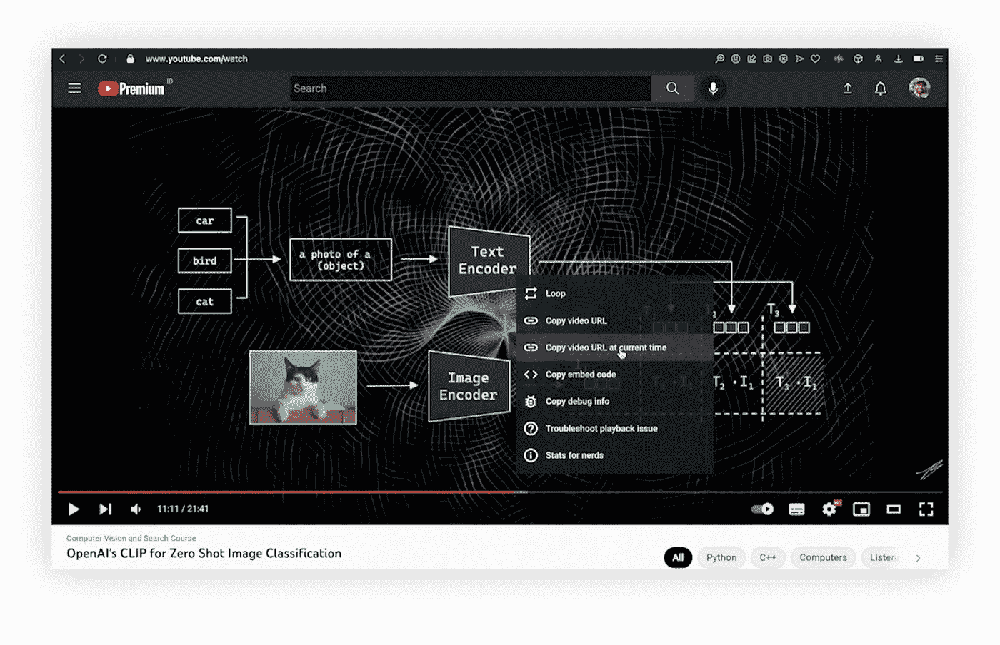
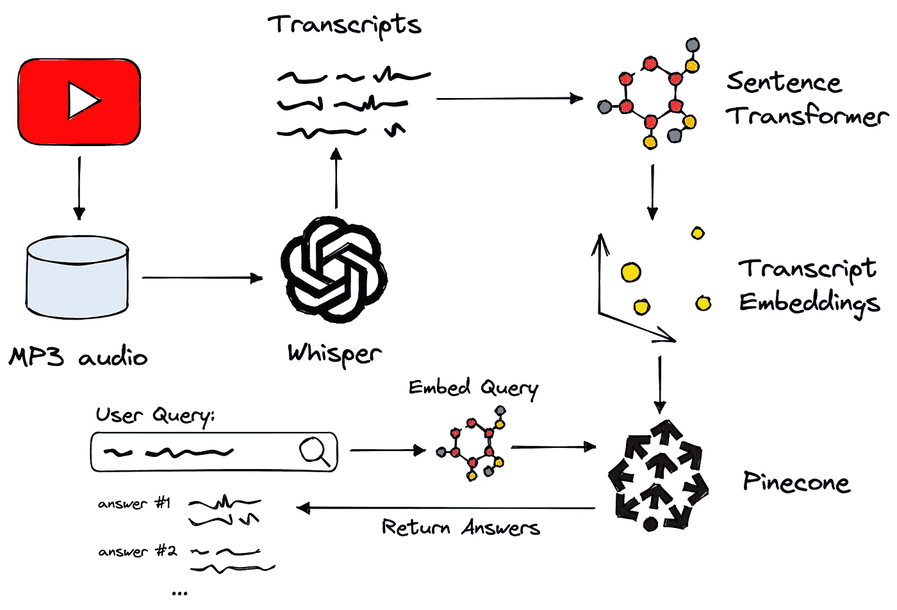
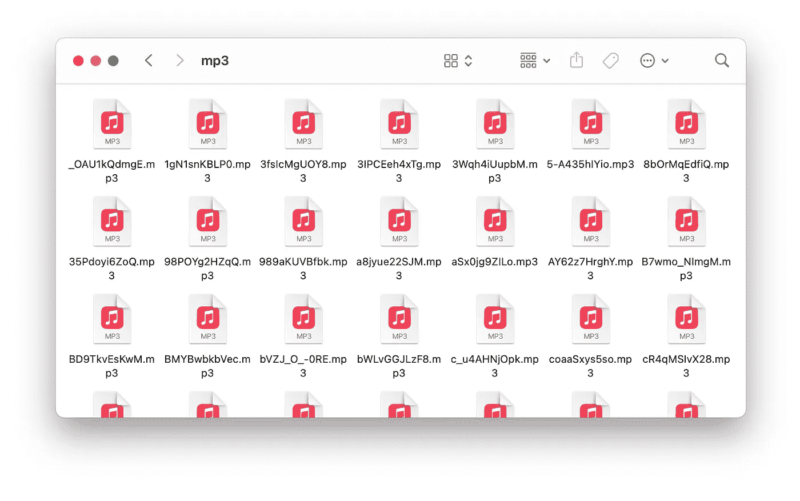
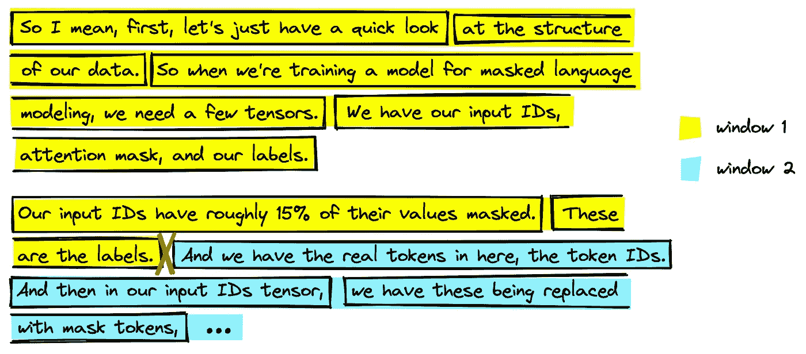
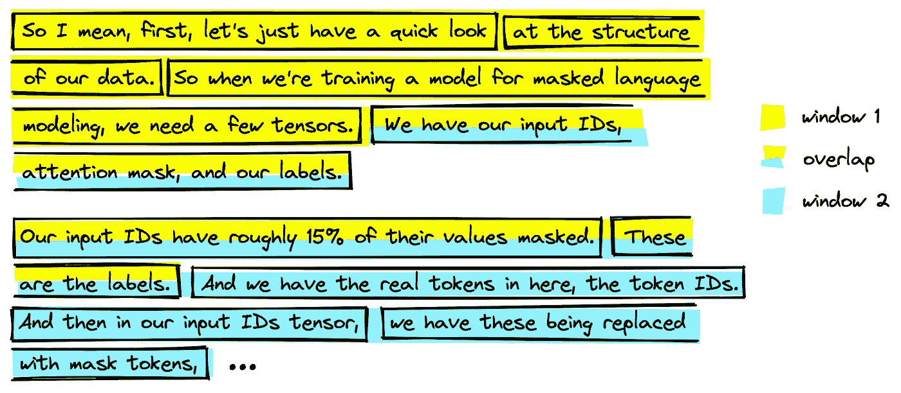

# 用 OpenAI 的耳语修复 YouTube 搜索

> 原文：<https://betterprogramming.pub/fixing-youtube-search-with-openais-whisper-90bb569073cf>

## 如何使用 OpenAI 的 Whisper 进行更好的语音搜索


电气化搜索。这篇文章中的这张图片和所有其他图片都是作者的。

OpenAI 的 *Whisper* 是语音到文本转换中的一种新的最先进的(SotA)模型。它几乎可以完美地转录几十种语言的语音，甚至可以处理糟糕的音频质量或过度的背景噪音。

口语领域对于 ML 用例来说总是有些遥不可及。Whisper 改变了以语音为中心的用例。我们将通过构建一个新的改进的 YouTube 搜索来展示 Whisper 以及其他技术(如变形金刚和矢量搜索)的威力。

YouTube 上的搜索很好，但也有其局限性，尤其是在回答问题的时候。拥有数万亿小时的内容，几乎每个问题都应该有答案。

然而，如果我们有一个特定的问题，比如“*open ai 的剪辑是什么？”*我们得到的不是一个简洁的答案，而是大量非常长的视频，我们必须从头到尾看完。

如果我们想要的只是一个 20 秒的简短解释呢？目前的 YouTube 搜索对此没有解决方案。也许有一个很好的理由来鼓励用户尽可能多地观看视频(更多广告，有人吗？).

耳语是这个问题*和其他许多涉及口语单词*的问题的解决方案。本文将探讨更好的支持语音的搜索背后的想法。

# 这个想法

我们希望获得特定的时间戳来回答我们的搜索查询。YouTube 确实支持视频中的特定时间链接，因此使用这些链接进行更精确的搜索应该是可能的。



时间戳网址可以直接从视频中复制，我们可以在我们的搜索应用程序中使用相同的网址格式。

为了构建这样的东西，我们首先需要将视频中的音频转录成文本。YouTube 会自动为每个视频添加字幕，字幕没问题— *但是* OpenAI 只是开源了一个叫“耳语”的东西。

Whisper 最恰当的描述是语音转文本的 GPT-3 或 DALL-E 2。它是开源的，可以实时转录音频*或更快的*，具有*无与伦比的性能*。这似乎是最令人兴奋的选择。

一旦我们有了转录的文本和每个文本片段的时间戳，我们就可以进入[问答(QA)](https://www.pinecone.io/learn/question-answering) 部分。问答是一种搜索形式，给定一个自然语言查询，如“*open ai 的耳语是什么？”我们可以返回准确的自然语言答案。*

我们可以认为问答是搜索信息的最直观的形式，因为这是我们向他人询问信息的方式。唯一的区别是我们在搜索栏中输入问题，而不是口头交流——就目前而言。

这一切看起来怎么样？



我们演示中使用的流程概述。涵盖 OpenAI 的耳语，句子变形金刚，松果矢量数据库，等等。

现在，让我们给细节上色，并逐步完成。

# 视频数据

第一步是下载我们的 YouTube 视频数据，并提取每个视频附带的音频。幸运的是，有一个名为`pytube`的 Python 库可以满足这个需求。

通过`pytube`，我们提供了一个视频 ID(可以在地址栏中找到，如果您有频道，也可以下载)。我直接下载了一个频道内容的概要，包括 id，标题，出版日期等。，通过 YouTube。同样的数据可以通过一个叫做`jamescalam/channel-metadata`的数据集中的*数据集*得到。

我们对`Title`和`Video ID`领域最感兴趣。有了视频 ID，我们就可以开始下载视频并使用`pytube`保存音频文件。

在此之后，我们应该可以找到存储在`./mp3`目录中的大约 108 个音频 MP3 文件。



下载了**中的 MP3 文件*。/mp3*** 目录。

有了这些，我们就可以继续用 OpenAI 的耳语进行转录了。

# 带耳语的语音转文本

OpenAI 的 Whisper 语音转文本模型是完全开源的，可以通过 GitHub 从`pip install`获得:

```
pip install git+https://github.com/openai/whisper.git
```

Whisper 依靠另一款名为 FFMPEG 的软件来转换视频和音频文件。此操作系统的安装因操作系统而异[1]；以下内容涵盖了主要系统:

```
# on Ubuntu or Debian
sudo apt update && sudo apt install ffmpeg# on Arch Linux
sudo pacman -S ffmpeg# on MacOS using Homebrew (https://brew.sh/)
brew install ffmpeg# on Windows using Chocolatey (https://chocolatey.org/)
choco install ffmpeg# on Windows using Scoop (https://scoop.sh/)
scoop install ffmpeg
```

安装后，我们下载并初始化*大型*模型，如果 CUDA 可用的话，将它移动到 GPU。

其他型号都有，给个小一点的 GPU(甚至 CPU)都应该考虑。我们这样转录音频:

由此，我们有一个大约 27K 转录音频片段的列表，包括开始和结束秒旁边的文本。如果您需要等待很长时间来处理，可以使用数据集的预构建版本。下载说明在以下部分。

上面的最后一个单元格缺少从前面初始化的`videos_dict`中提取和添加元数据所需的逻辑。我们这样补充:

处理完所有数据段后，它们将作为 JSON lines 文件保存到文件中，其中包含:

准备就绪后，让我们构建 QA 嵌入和矢量搜索组件。

# 问题回答

在拥抱脸*数据集*上，你可以找到我在一个名为`jamescalam/youtube-transcriptions`的数据集中搜集的数据:

目前，数据集只包含来自我个人频道的视频，但我将在未来添加更多来自其他 ML 聚焦频道的视频。

数据包括一小段文本(转录的音频)。每个组块都相对没有意义:

理想情况下，我们希望文本块比这个大 4-6 倍，以捕捉足够有用的意思。我们通过简单地迭代数据集并合并每*六个*段来实现这一点。

这里发生了一些事情。首先，如前所述，我们将每六个分段进行合并。然而，单独这样做可能会减少相关部分之间的许多意义。



即使在合并片段的时候，我们仍然会留下一个必须分割文本的点(上面用红色叉号标注)。这会导致我们错过重要信息。

避免切割相关片段的一种常见技术是在片段之间添加一些*重叠*，这里使用了`stride`。对于每一步，我们向前移动*三个*段，同时合并*六个*段。这样，在一个步骤中切割的任何有意义的段都将包含在下一个步骤中。



我们可以通过在合并片段时添加重叠来避免这种意义的损失。它返回更多的数据，但意味着我们不太可能在有意义的片段之间切换。

这样，我们就有了更大更有意义的文本。现在我们需要用一个 QA 嵌入模型对它们进行编码。许多高性能、预训练的 QA 模型可以通过拥抱脸*变形金刚*和*句子变形金刚*库获得。我们就用一个叫`[multi-qa-mpnet-base-dot-v1](https://huggingface.co/sentence-transformers/multi-qa-mpnet-base-dot-v1)`的。

使用这个模型，我们可以用`model.encode("<some text>")`将一段文本编码成一个有意义的*768 维向量。一次对我们所有的片段进行编码或者将它们存储在本地需要太多的计算或内存——所以我们首先初始化存储它们的向量数据库:*

我们应该看到索引(向量数据库)当前是空的，带有`0`的`total_vector_count`。现在我们可以开始对我们的片段进行编码，并将嵌入内容(和元数据)插入到我们的索引中。

这就是我们准备数据和向 vector 数据库添加所有内容所需的一切。剩下的就是查询和返回结果。

# 进行查询

查询很简单；我们:

1.  使用我们用来编码片段的相同嵌入模型来编码查询。
2.  传递到我们的索引查询。

我们通过以下方式做到这一点:

这些结果与问题相关；特别是，有三个来自同一视频中的相似位置。我们可能希望改进搜索界面，使其比 Jupyter 笔记本更友好。

让基于网络的搜索 UI 运行起来的最简单的方法之一就是使用拥抱脸*空间*和 Streamlit(或者 Gradio，如果喜欢的话)。

我们不会在这里讨论代码，但是如果你熟悉 Streamlit，你可以在几个小时内非常容易地构建一个搜索应用。或者你可以使用我们的例子，在 5-10 分钟内完成。

[你可以在这里](https://huggingface.co/spaces/jamescalam/ask-youtube)测试应用。当再次查询`"what is OpenAI's clip?"`时，我们将从单个视频中返回多个合并的结果。有了这个，我们可以通过点击我们最感兴趣的文本部分跳到每个片段。

尝试更多的查询，如:

```
What is the best unsupervised method to train a sentence transformer?What is vector search?How can I train a sentence transformer with little-to-no data?
```

我们可以使用耳语、拥抱脸、句子变形金刚和[松果的矢量数据库](https://www.pinecone.io/learn/vector-database)快速构建令人难以置信的支持语音的搜索应用。

Whisper 已经解锁了一个完整的模式——口语——我们看到语音搜索和其他以语音为中心的用例显著增加只是时间问题。

近年来，机器学习和向量搜索都出现了指数级增长。这些技术已经看起来像科幻小说了。然而，尽管我们在这里使用的一切都有令人难以置信的性能，但这一切变得更好只是时间问题。

[*本文原载 Pinecone.io*](https://www.pinecone.io/learn/openai-whisper/)

# 资源

[所有代码笔记本](https://github.com/jamescalam/ask-youtube/tree/main/youtube-search)

*   [MP3 下载](https://colab.research.google.com/github/jamescalam/ask-youtube/blob/main/youtube-search/00-download-videos.ipynb)
*   [耳语转录](https://colab.research.google.com/github/jamescalam/ask-youtube/blob/main/youtube-search/01-openai-whisper.ipynb)
*   [编码和查询](https://colab.research.google.com/github/jamescalam/ask-youtube/blob/main/youtube-search/02-build-embeddings.ipynb)

[演示 App](https://huggingface.co/spaces/jamescalam/ask-youtube)

[1] [OpenAI 耳语回购](https://github.com/openai/whisper) (2022)，GitHub