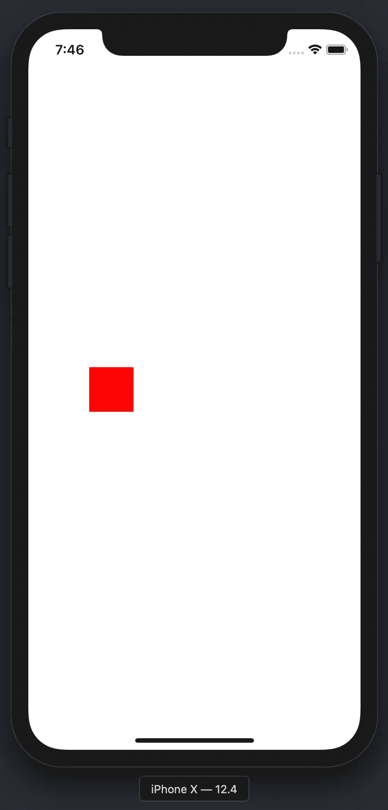
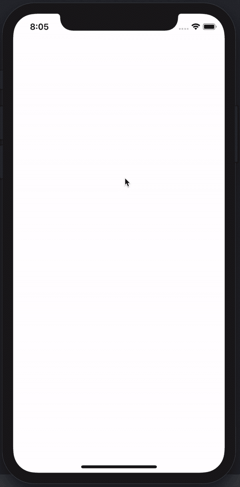
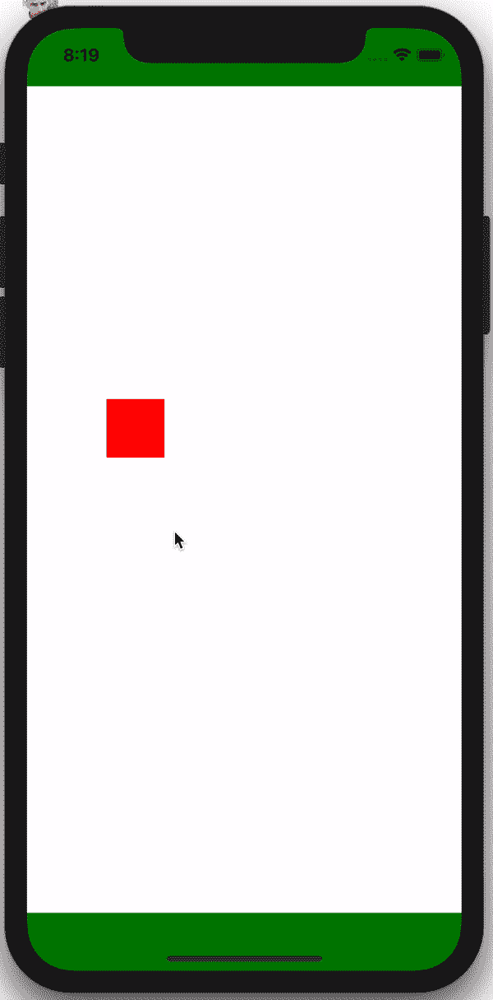
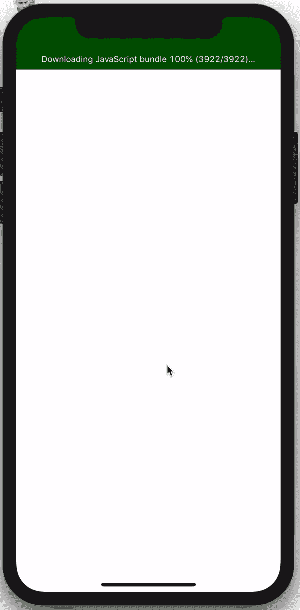
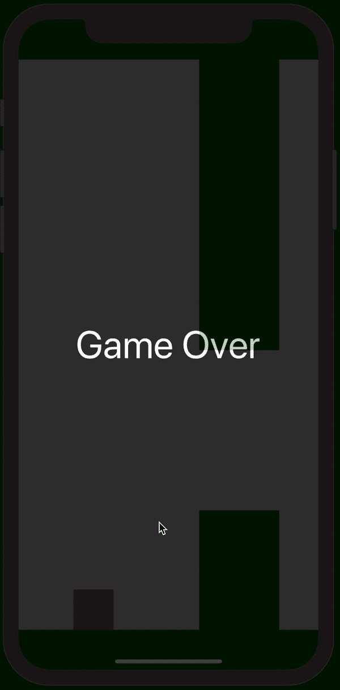

# 带有 React-Native-Game-Engine 和 Matter.js 的 Flappy Bird

> 原文：<https://betterprogramming.pub/flappy-bird-with-react-native-game-engine-and-matter-js-d5673f50eb9>

## 重现烦人的病毒游戏

Flappy Bird 是大多数人都知道的游戏之一，即使他们从来没有玩过。它最初是由越南开发者 Dong Nguyen 于 2013 年 5 月发布的，但直到 2014 年初才开始流行，当时它一飞冲天，成为 iOS 应用商店的第一名。

这个游戏不可否认地会让人上瘾，同时也让人讨厌，但更大的问题是:它能在 React Native 中制作吗？答案显然是肯定的，否则这个帖子就不存在了！

TL；博士 1:更喜欢看视频格式的？

TL；博士 2:只想要代码？来了:[https://github . com/lepunk/react-native-videos/tree/master/flappy bird](https://github.com/lepunk/react-native-videos/tree/master/FlappyBird)

为了重新制作这个游戏，我决定再次使用[react-native-game-engine](https://github.com/bberak/react-native-game-engine)(RNGE)。如果你还没有这样做，考虑阅读[我之前的帖子](https://medium.com/@tamasszikszai/building-snake-with-react-native-game-engine-bbc8abfdebda)作为对引擎的介绍。然而，与 Snake 不同，Flappy Bird 具有一些基本的物理特性——仅靠 react-native 游戏引擎是不够的。

进入 [Matter.js](http://brm.io/matter-js/) ，一个为 Javascript 开发的成熟的 2d 物理引擎:

```
npm install react-native-game-engine matter-js --save
```

就像这样，我们拥有了制作 Flappy Bird 基本版本所需的一切。

像往常一样，让我们从设置一些常数开始:

```
import { Dimensions } from 'react-native';

export default Constants = {
    MAX_WIDTH: Dimensions.get("screen").width,
    MAX_HEIGHT: Dimensions.get("screen").height,
    GAP_SIZE: 200, // gap between the two parts of the pipe
    PIPE_WIDTH: 100 // width of the pipe
}
```

接下来，我们需要为 RNGE 设置我们的“实体”和“系统”。首先，让我们创建我们的世界，画一只“鸟”,用一个鲜红色的正方形来表示。

我们的 App.js 将如下所示:

```
import React, { Component } from 'react';
import { StyleSheet, View, } from 'react-native';
import Matter from "matter-js";
import { GameEngine } from "react-native-game-engine";
import Bird from './Bird';
import Constants from './Constants';

export default class App extends Component {
    constructor(props){
        super(props);

        this.state = {
            running: true
        };

        this.gameEngine = null;

        this.entities = this.setupWorld();
    }

    setupWorld = () => {
        let engine = Matter.Engine.create({ enableSleeping: false });
        let world = engine.world;

        let bird = Matter.Bodies.rectangle( Constants.MAX_WIDTH / 4, Constants.MAX_HEIGHT / 2, 50, 50);

        Matter.World.add(world, [bird]);

        return {
            physics: { engine: engine, world: world },
            bird: { body: bird, size: [50, 50], color: 'red', renderer: Bird},
        }
    }

    render() {
        return (
            <View style={styles.container}>
                <GameEngine
                    ref={(ref) => { this.gameEngine = ref; }}
                    style={styles.gameContainer}
                    running={this.state.running}
                    entities={this.entities}>
                    <StatusBar hidden={true} />
                </GameEngine>
            </View>
        );
    }
}

const styles = StyleSheet.create({
    container: {
        flex: 1,
        backgroundColor: '#fff',
    },
    gameContainer: {
        position: 'absolute',
        top: 0,
        bottom: 0,
        left: 0,
        right: 0,
    },
});
```

这里重要的部分在`setupWorld`方法中。

```
let engine = Matter.Engine.create({ enableSleeping: false });
let world = engine.world;let bird = Matter.Bodies.rectangle( Constants.MAX_WIDTH / 4, Constants.MAX_HEIGHT / 2, 50, 50);Matter.World.add(world, [bird]);
```

我们创造了一种新的物质“引擎”。然后我们创建一个虚拟尺寸为 50x50 的鸟“身体”,垂直居中，水平位于屏幕的前 25%。最后，我们将鸟的身体添加到我们创建的世界中。

重要的是要注意，Matter 不会处理我们的鸟的渲染，它只会计算它在屏幕上的位置。在 setupWorld 的 return 语句中定义的 React Native 和 RNGE 将在每个节拍进行渲染:

```
return {
    physics: { engine: engine, world: world },
    bird: { body: bird, size: [50, 50], color:'red',renderer: Bird},
}
```

为了看到一些东西，我们需要创建一个 Bird.js 组件，看起来像这样:

这里没什么花里胡哨的。我唯一想指出的是 *x* 和 *y* 值。我们从 Matter.js 管理的鸟的身体道具中提取了这个。



太好了。在超过 100 行代码后，我们在白屏上看到一个红色方块。现在怎么办？

我们在物质中创造的世界默认有一个重力，设置为 1.0。为了让它工作，我们需要定期调用引擎上的 update 方法，以便 Matter 可以重新计算每个物体的位置。正如我在上一篇文章中所讨论的，RNGE 提供了一种方便的方法来周期性地调用一组函数，称为“系统”。

让我们通过添加 include 来修改我们的 App.js:

```
import Physics from './Physics';
```

并将物理系统添加到我们的游戏引擎中

```
<GameEngine
    ref={(ref) => { this.gameEngine = ref; }}
    style={styles.gameContainer}
    running={this.state.running}
    systems={[Physics]}
    entities={this.entities}>
</GameEngine>
```

我们现在需要的是一个 Physics.js 文件，它将在每次滴答时被调用



现在我们有进展了！

好了，我们再加一个天花板和地板。将 App.js 中的 setupWorld()方法改为:

```
setupWorld = () => {
        let engine = Matter.Engine.create({ enableSleeping: false });
        let world = engine.world;

        let bird = Matter.Bodies.rectangle( Constants.MAX_WIDTH / 4, Constants.MAX_HEIGHT / 2, 50, 50);
        let floor = Matter.Bodies.rectangle( Constants.MAX_WIDTH / 2, Constants.MAX_HEIGHT - 25, Constants.MAX_WIDTH, 50, { isStatic: true });
        let ceiling = Matter.Bodies.rectangle( Constants.MAX_WIDTH / 2, 25, Constants.MAX_WIDTH, 50, { isStatic: true });

        Matter.World.add(world, [bird, floor, ceiling]);

        return {
            physics: { engine: engine, world: world },
            bird: { body: bird, size: [50, 50], color: 'red', renderer: Bird},
            floor: { body: floor, size: [Constants.MAX_WIDTH, 50], color: "green", renderer: Wall },
            ceiling: { body: ceiling, size: [Constants.MAX_WIDTH, 50], color: "green", renderer: Wall },
        }
    }
```

我们所做的就是给物质世界增加两个新的身体:*地板*和*天花板*。它们类似于鸟，除了它们的 *isStatic* 属性为真，这告诉物质物理不影响它们。

他们的渲染器叫做 Wall —让我们来实现它:

```
import React, { Component } from "react";
import { View } from "react-native";

export default class Wall extends Component {
    render() {
        const width = this.props.size[0];
        const height = this.props.size[1];
        const x = this.props.body.position.x - width / 2;
        const y = this.props.body.position.y - height / 2;

        return (
            <View
                style={{
                    position: "absolute",
                    left: x,
                    top: y,
                    width: width,
                    height: height,
                    backgroundColor: this.props.color
                }} />
    );
  }
}
```

Wall 的代码实际上与 Bird 完全相同——从技术上讲，它们可能是同一个组件——但我喜欢将它们分开。

在这一点上，我们有一个红色的正方形自由落体到一个绿色的长方形。让我们实现一些更令人兴奋的东西。如果用户点击屏幕上的任何地方，我们希望我们的鸟改变方向一会儿，并开始向上弹跳。

为了实现这一点，我们必须修改 Physics.js:

```
import Matter from "matter-js";

const Physics = (entities, { touches, time }) => {
    let engine = entities.physics.engine;
    let bird = entities.bird.body;

    touches.filter(t => t.type === "press").forEach(t => {
        Matter.Body.applyForce( bird, bird.position, {x: 0.00, y: -0.10});
    });

    Matter.Engine.update(engine, time.delta);

    return entities;
};

export default Physics;
```

好吧，这里发生了什么？

*   RNGE 方便地将所有触摸事件传递给传递给引擎的每个系统。
*   因为我们只关心“点击”事件，所以我们需要过滤这些事件。
*   每当我们遇到一个水龙头，我们施加一个力，我们的鸟的中心与-0.10(稍微向上)。



事情进展顺利。我们来加点障碍吧！

在《Flappy Bird》中，障碍物用管子来表示。一个从顶部，一个从底部，它们之间有恒定的间隙。最初，我将在屏幕上总共添加两组管道(总共四个管道)。一个在屏幕右侧(`Constants.MAX_WIDTH-Constants.PIPE_WIDTH / 2`)，另一个在屏幕右侧(`Constants.MAX_WIDTH * 2-(Constants.PIPE_WIDTH / 2`)

接下来，我们在每一次点击时将这些管道向左移动一个像素。如果一组管道移出屏幕，我们将它们向右移动一个屏幕的像素。

管道的 Y 位置应该是随机的，所以我们在 App.js 中定义了两个函数(但是在组件定义之外，因为这些函数可以在以后重用)。

```
export const randomBetween = (min, max) => {
    return Math.floor(Math.random() * (max - min + 1) + min);
}

export const generatePipes = () => {
    let topPipeHeight = randomBetween(100, (Constants.MAX_HEIGHT / 2) - 100);
    let bottomPipeHeight = Constants.MAX_HEIGHT - topPipeHeight - Constants.GAP_SIZE;

    let sizes = [topPipeHeight, bottomPipeHeight]

    if (Math.random() < 0.5) {
        sizes = sizes.reverse();
    }

    return sizes;
}
```

这实际上是生成一个由两个数字组成的数组:一个表示顶部管道的高度，一个表示底部管道的高度。

我们现在可以更新我们的`setupWorld`方法了:

```
setupWorld = () => {
        let engine = Matter.Engine.create({ enableSleeping: false });
        let world = engine.world;

        let bird = Matter.Bodies.rectangle( Constants.MAX_WIDTH / 4, Constants.MAX_HEIGHT / 2, 50, 50);
        let floor = Matter.Bodies.rectangle( Constants.MAX_WIDTH / 2, Constants.MAX_HEIGHT - 25, Constants.MAX_WIDTH, 50, { isStatic: true });
        let ceiling = Matter.Bodies.rectangle( Constants.MAX_WIDTH / 2, 25, Constants.MAX_WIDTH, 50, { isStatic: true });

        let [pipe1Height, pipe2Height] = generatePipes();

        let pipe1 = Matter.Bodies.rectangle( Constants.MAX_WIDTH - (Constants.PIPE_WIDTH / 2), pipe1Height / 2, Constants.PIPE_WIDTH, pipe1Height, { isStatic: true });
        let pipe2 = Matter.Bodies.rectangle( Constants.MAX_WIDTH - (Constants.PIPE_WIDTH / 2), Constants.MAX_HEIGHT - (pipe2Height / 2), Constants.PIPE_WIDTH, pipe2Height, { isStatic: true });

        let [pipe3Height, pipe4Height] = generatePipes();

        let pipe3 = Matter.Bodies.rectangle( Constants.MAX_WIDTH * 2 - (Constants.PIPE_WIDTH / 2), pipe3Height / 2, Constants.PIPE_WIDTH, pipe3Height, { isStatic: true });
        let pipe4 = Matter.Bodies.rectangle( Constants.MAX_WIDTH * 2 - (Constants.PIPE_WIDTH / 2), Constants.MAX_HEIGHT - (pipe4Height / 2), Constants.PIPE_WIDTH, pipe4Height, { isStatic: true });

        Matter.World.add(world, [bird, floor, ceiling, pipe1, pipe2, pipe3, pipe4]);

        return {
            physics: { engine: engine, world: world },
            bird: { body: bird, size: [50, 50], color: 'red', renderer: Bird},
            floor: { body: floor, size: [Constants.MAX_WIDTH, 50], color: "green", renderer: Wall },
            ceiling: { body: ceiling, size: [Constants.MAX_WIDTH, 50], color: "green", renderer: Wall },
            pipe1: { body: pipe1, size: [Constants.PIPE_WIDTH, pipe1Height], color: "green", renderer: Wall },
            pipe2: { body: pipe2, size: [Constants.PIPE_WIDTH, pipe2Height], color: "green", renderer: Wall },
            pipe3: { body: pipe3, size: [Constants.PIPE_WIDTH, pipe3Height], color: "green", renderer: Wall },
            pipe4: { body: pipe4, size: [Constants.PIPE_WIDTH, pipe4Height], color: "green", renderer: Wall }
        }
    }
```

让我们更新 Physics.js 来移动这些管道:

```
import Matter from "matter-js";

const Physics = (entities, { touches, time }) => {
    let engine = entities.physics.engine;
    let bird = entities.bird.body;

    touches.filter(t => t.type === "press").forEach(t => {
        Matter.Body.applyForce( bird, bird.position, {x: 0.00, y: -0.10});
    });

    for(let i=1; i<=4; i++){
        if (entities["pipe" + i].body.position.x <= -1 * (Constants.PIPE_WIDTH / 2)){
            Matter.Body.setPosition( entities["pipe" + i].body, {x: Constants.MAX_WIDTH * 2 - (Constants.PIPE_WIDTH / 2), y: entities["pipe" + i].body.position.y});
        } else {
            Matter.Body.translate( entities["pipe" + i].body, {x: -1, y: 0});
        }
    }

    Matter.Engine.update(engine, time.delta);

    return entities;
};

export default Physics;
```

正如我所说的，在每个滴答，我们将管道 1px 向左移动。如果管道看不见了，我们把它移到右边，给用户一种有无数管道的感觉。



这一切都很好，但不完全具有挑战性，考虑到球员不能失败。用 Matter.js 添加碰撞检测很简单。

在我们的`setupWorld`方法中添加这些行

```
Matter.Events.on(engine, 'collisionStart', (event) => {
    var pairs = event.pairs;
    this.gameEngine.dispatch({ type: "game-over"});         
});
```

这将设置一个事件侦听器，它将在 Matter 发出的“collisionStart”事件上被触发。侦听器将使用 RNGE 的分派方法发出另一个类型为“game-over”的事件

这样，剩下要做的就是监听这个事件，并在用户失败时在屏幕上显示一个游戏。你可以通过给你的<游戏引擎>添加一个`onEvent`道具来收听 RNGE 事件

最终的 App.js 应该是这样的:

```
import React, { Component } from 'react';
import { Dimensions, StyleSheet, Text, View, StatusBar, Alert, TouchableOpacity } from 'react-native';
import Matter from "matter-js";
import { GameEngine } from "react-native-game-engine";
import Bird from './Bird';
import Wall from './Wall';
import Physics from './Physics';
import Constants from './Constants';

export const randomBetween = (min, max) => {
    return Math.floor(Math.random() * (max - min + 1) + min);
}

export const generatePipes = () => {
    let topPipeHeight = randomBetween(100, (Constants.MAX_HEIGHT / 2) - 100);
    let bottomPipeHeight = Constants.MAX_HEIGHT - topPipeHeight - Constants.GAP_SIZE;

    let sizes = [topPipeHeight, bottomPipeHeight]

    if (Math.random() < 0.5) {
        sizes = sizes.reverse();
    }

    return sizes;
}

export default class App extends Component {
    constructor(props){
        super(props);

        this.state = {
            running: true
        };

        this.gameEngine = null;

        this.entities = this.setupWorld();
    }

    setupWorld = () => {
        let engine = Matter.Engine.create({ enableSleeping: false });
        let world = engine.world;
        world.gravity.y = 1.2;

        let bird = Matter.Bodies.rectangle( Constants.MAX_WIDTH / 4, Constants.MAX_HEIGHT / 2, 50, 50);
        bird.restitution = 20;
        let floor = Matter.Bodies.rectangle( Constants.MAX_WIDTH / 2, Constants.MAX_HEIGHT - 25, Constants.MAX_WIDTH, 50, { isStatic: true });
        let ceiling = Matter.Bodies.rectangle( Constants.MAX_WIDTH / 2, 25, Constants.MAX_WIDTH, 50, { isStatic: true });

        let [pipe1Height, pipe2Height] = generatePipes();

        let pipe1 = Matter.Bodies.rectangle( Constants.MAX_WIDTH - (Constants.PIPE_WIDTH / 2), pipe1Height / 2, Constants.PIPE_WIDTH, pipe1Height, { isStatic: true });
        let pipe2 = Matter.Bodies.rectangle( Constants.MAX_WIDTH - (Constants.PIPE_WIDTH / 2), Constants.MAX_HEIGHT - (pipe2Height / 2), Constants.PIPE_WIDTH, pipe2Height, { isStatic: true });

        let [pipe3Height, pipe4Height] = generatePipes();

        let pipe3 = Matter.Bodies.rectangle( Constants.MAX_WIDTH * 2 - (Constants.PIPE_WIDTH / 2), pipe3Height / 2, Constants.PIPE_WIDTH, pipe3Height, { isStatic: true });
        let pipe4 = Matter.Bodies.rectangle( Constants.MAX_WIDTH * 2 - (Constants.PIPE_WIDTH / 2), Constants.MAX_HEIGHT - (pipe4Height / 2), Constants.PIPE_WIDTH, pipe4Height, { isStatic: true });

        Matter.World.add(world, [bird, floor, ceiling, pipe1, pipe2, pipe3, pipe4]);
        Matter.Events.on(engine, 'collisionStart', (event) => {
            var pairs = event.pairs;

            this.gameEngine.dispatch({ type: "game-over"});

        });

        return {
            physics: { engine: engine, world: world },
            floor: { body: floor, size: [Constants.MAX_WIDTH, 50], color: "green", renderer: Wall },
            ceiling: { body: ceiling, size: [Constants.MAX_WIDTH, 50], color: "green", renderer: Wall },
            bird: { body: bird, size: [50, 50], color: 'red', renderer: Bird},
            pipe1: { body: pipe1, size: [Constants.PIPE_WIDTH, pipe1Height], color: "green", renderer: Wall },
            pipe2: { body: pipe2, size: [Constants.PIPE_WIDTH, pipe2Height], color: "green", renderer: Wall },
            pipe3: { body: pipe3, size: [Constants.PIPE_WIDTH, pipe3Height], color: "green", renderer: Wall },
            pipe4: { body: pipe4, size: [Constants.PIPE_WIDTH, pipe4Height], color: "green", renderer: Wall }
        }
    }

    onEvent = (e) => {
        if (e.type === "game-over"){
            //Alert.alert("Game Over");
            this.setState({
                running: false
            });
        }
    }

    reset = () => {
        this.gameEngine.swap(this.setupWorld());
        this.setState({
            running: true
        });
    }

    render() {
        return (
            <View style={styles.container}>
                <GameEngine
                    ref={(ref) => { this.gameEngine = ref; }}
                    style={styles.gameContainer}
                    systems={[Physics]}
                    running={this.state.running}
                    onEvent={this.onEvent}
                    entities={this.entities}>
                    <StatusBar hidden={true} />
                </GameEngine>
                {!this.state.running && <TouchableOpacity style={styles.fullScreenButton} onPress={this.reset}>
                    <View style={styles.fullScreen}>
                        <Text style={styles.gameOverText}>Game Over</Text>
                    </View>
                </TouchableOpacity>}
            </View>
        );
    }
}

const styles = StyleSheet.create({
    container: {
        flex: 1,
        backgroundColor: '#fff',
    },
    gameContainer: {
        position: 'absolute',
        top: 0,
        bottom: 0,
        left: 0,
        right: 0,
    },
    gameOverText: {
        color: 'white',
        fontSize: 48
    },
    fullScreen: {
        position: 'absolute',
        top: 0,
        bottom: 0,
        left: 0,
        right: 0,
        backgroundColor: 'black',
        opacity: 0.8,
        justifyContent: 'center',
        alignItems: 'center'
    },
    fullScreenButton: {
        position: 'absolute',
        top: 0,
        bottom: 0,
        left: 0,
        right: 0,
        flex: 1
    }
});
```



这就是:一个丑陋的，几乎没有功能的 flappy 鸟克隆体。

让事情变得更好的几个“要做的事”(如果你愿意的话):

*   目前管道正在重复。每次我们把它们送回屏幕右侧时，应该很容易改变它们的 Y 位置
*   鸟应该根据它前进的方向稍微上下旋转
*   一些图片会让事情变得更令人兴奋(无意冒犯红色方块)

如果你觉得可以改进，请随时[发送 PR/fork 回购](https://github.com/lepunk/react-native-videos/tree/master/FlappyBird)。