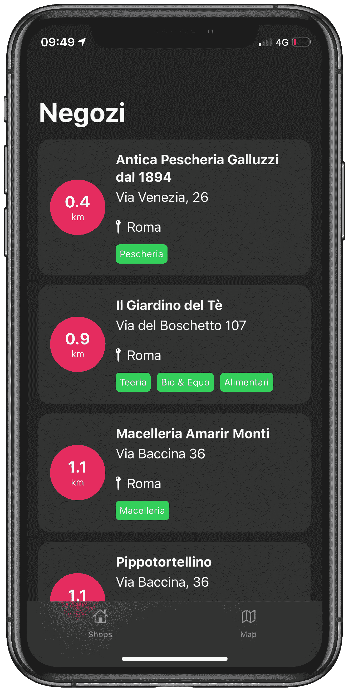
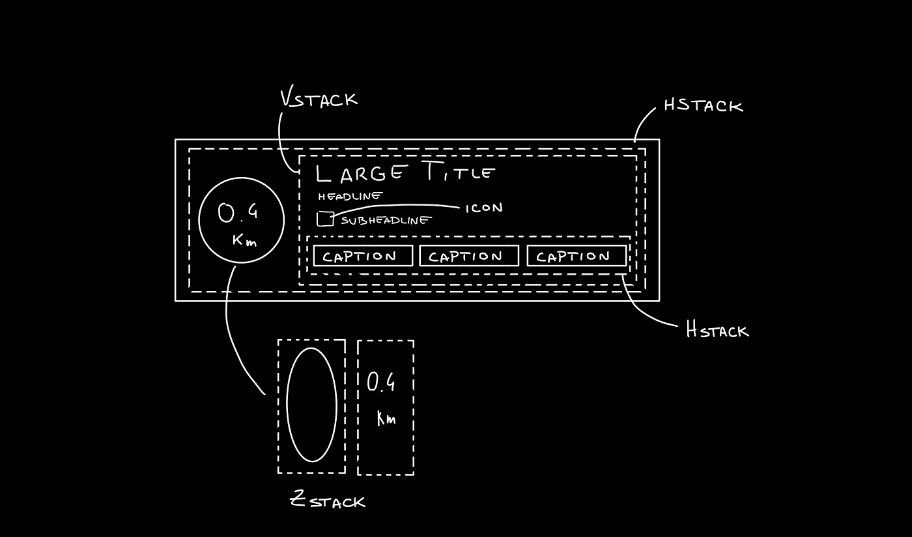
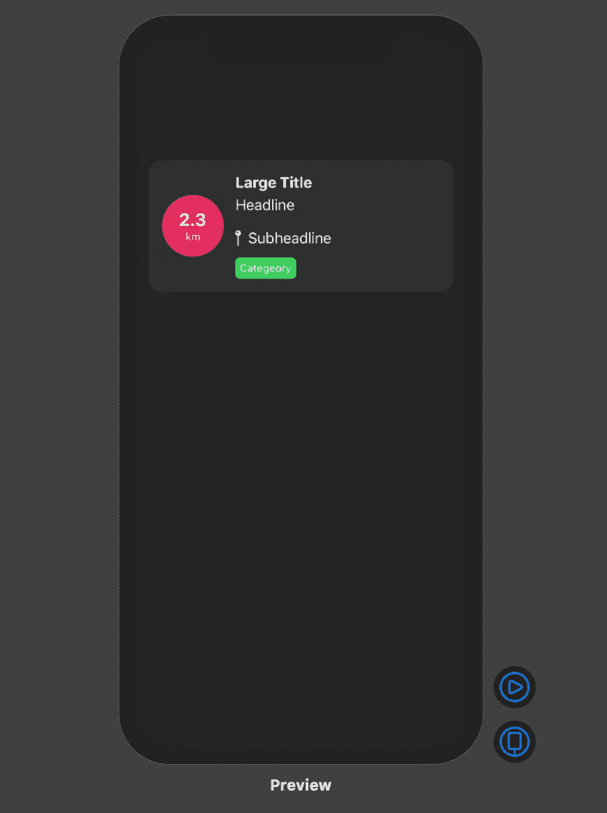

# SwiftUI 中的平面列表设计

> 原文：<https://betterprogramming.pub/flat-design-list-swiftui-part-i-ab9e841720cd>

## 如何在 SwiftUI 中设计和样式化列表和单元格

今天我将解释在一个显示列表的 iOS 应用程序中实现一个好看的平面设计所需的小步骤。这是我要构建的例子。

# 更改列表的背景并隐藏其分隔符

我们需要做的第一件事是改变列表的背景并隐藏它的分隔符。

由于`List`使用了 UIKit 的旧`UITableView`，当 SwiftUI `View`将要被初始化时，我们只需要改变一些参数。

注意，为了方便起见，我还为`UIColor`定义了一些扩展。

完成后，我们将看到一个带有预定义背景颜色的列表。分隔符现在没有了，但是行本身将以黑色或白色显示，这取决于应用程序的`colorScheme`。为了使它与背景颜色相同，我们只需将该属性添加到行`.listRowBackground(Color.flatDarkBackground)`中，瞧。

# 行卡分解

我创建了这个小信息图，让您更好地了解如何在 SwiftUI 中创建卡本身。

正如您所看到的，我们可以将行卡分为四个不同的部分:

*   **ZStack** 封装公里数指示
*   **VStack** 封装行卡信息
*   **h 点击**布置上述两个组件
*   **h 点击**在行卡的信息体中布局字幕片

# 代码

让我们来看一下实现。

我们要声明的第一件事是我们要在卡片上显示的信息——这样我们以后可以从它的父视图动态传递这些变量。

为了给行卡一个更亮的背景，我们声明了一个包含`Color.flatDarkCardBacground`的外部 ZStack 和一个包含每个行卡组件的 HStack。

接下来，我们实现一个 ZStack，它将生成带有公里指示的红色圆圈。这将包含一个圆形填充线性梯度，给它一个很好的触摸。最重要的是，将会有一些简单的公里信息文本。

移动到行卡主体，我们将信息嵌入到 VStack 中。前两个组件是字体大小不同的简单文本。第三个元素是一个 HStack，用于在文本旁边显示图标图像。最后一个元素是一个简单的 HStack，它将使用一个动态的`ForEach`元素呈现绿色药丸，给定一个字符串数组。

**注意:**尽可能地分离这些组件，使它们易于重用和灵活，这总是一个好的做法。

`CategoryPill`视图看起来就像这样简单:

正如您所想象的，我们正在处理一个带有背景颜色和圆角半径的简单文本元素。

# 最后的结果

# 结论

我希望你喜欢这篇教程，并了解到在 SwiftUI 这样的声明性语言的帮助下设计优秀的 UI 是多么简单。我们都期待在 WWDC20 上看到 2.0 版本会有多好。

下一篇文章再见，感谢您的光临！