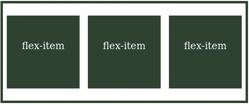

# Flexbox:对齐项目和对齐内容

> 原文：<https://betterprogramming.pub/flexbox-align-items-and-align-content-a60b6f8451e3>

## 两种属性的简短比较

[拉拉 V](https://unsplash.com/@lala_v?utm_source=unsplash&utm_medium=referral&utm_content=creditCopyText) 在 [Unsplash](https://unsplash.com/s/photos/layout?utm_source=unsplash&utm_medium=referral&utm_content=creditCopyText) 上拍照

当我学习使用 Flexbox 时，我不太容易理解`align-items`属性与`align-content`的不同之处。在这篇短文中，我将解释我对它们的理解。首先，让我们看看什么是 flex 容器、flex 项目和 flex 行。

# 弹性容器、弹性项目和弹性行

具有三个弹性项目的弹性容器

flex 容器是指一个 HTML 元素(通常是一个 div)，其 CSS 显示属性设置为`flex`或`flex-inline`。这个元素充当我们寻求对齐的其他元素的容器。要对齐的元素是 flex 容器的直接子元素，是 flex 项目。flex 容器中 flex 项目的每一行或每一列都是一条 flex 线。

# 对齐项目和对齐内容的比较

## 两者在同一轴上起作用

沿着横轴可以看到`align-items`和`align-content`的效果。我认为这种相似性导致了我最初的困惑。这两种属性都沿着横轴起作用。记住你的横轴取决于你的`flex-direction` *。*

如果您的`flex-direction`设置为`row`(这是默认设置)，您的横轴就是纵轴。如果你的`flex-direction`设置为`column`，你的横轴就是横轴。

## 否`wrap`，否`*align-content*`

只有当您的`flex-container`设置为`wrap`时，`align-content`属性才是相关的。换句话说，除非您有多条挠曲线，否则您不需要`align-content`属性。

## `*align-items*` 沿横轴在伸缩线内定位伸缩项目

`align-items` 属性决定伸缩项目在伸缩线内沿横轴的位置。它可以具有以下任意值:`flex-start`、`flex-end`、`center`、`baseline`和`stretch`。考虑下面这支笔:

我们有一个包装灵活物品的灵活集装箱。(我为 flex 项目设置了交替的高度，以帮助您可视化它们的定位。)将`align-items`设置为`center` 确保我们的 flex 项目垂直居中(即。沿着横轴)在每个挠曲线内(在这种情况下，每行)。要查看其他`align-items`选项如何工作，您可以查看此[参考文档](https://tympanus.net/codrops/css_reference/flexbox/#section_align-items)。

## *对齐内容*决定如何沿横轴定位挠曲线

`align-content`属性决定了挠曲线(不是特定的挠曲线项目)如何沿横轴定位。它可以具有以下任意值:`flex-start`、`flex-end`、`center`、`space-between`、`space-around`、`space-evenly`和`stretch`。考虑下面这支笔。

我们将`align-content`属性设置为`flex-start`。这确保了挠曲线朝向横轴的起点堆叠。由于`align-items`被设置为`center`，即使挠曲线与横轴的起点对齐，每个项目在每个挠曲线内垂直居中(即沿横轴)。要查看其他`align-content`选项是如何工作的，您可以查看这个[参考文档](https://tympanus.net/codrops/css_reference/flexbox/#section_align-content)。

# **结论**

`align-content`属性决定伸缩线如何沿横轴对齐，而`align-items`属性决定伸缩项目如何在伸缩线内沿横轴对齐。

我希望这对你有所帮助。感谢阅读。

# 资源

[https://tympanus.net/codrops/css_reference/flexbox/](https://tympanus.net/codrops/css_reference/flexbox/)