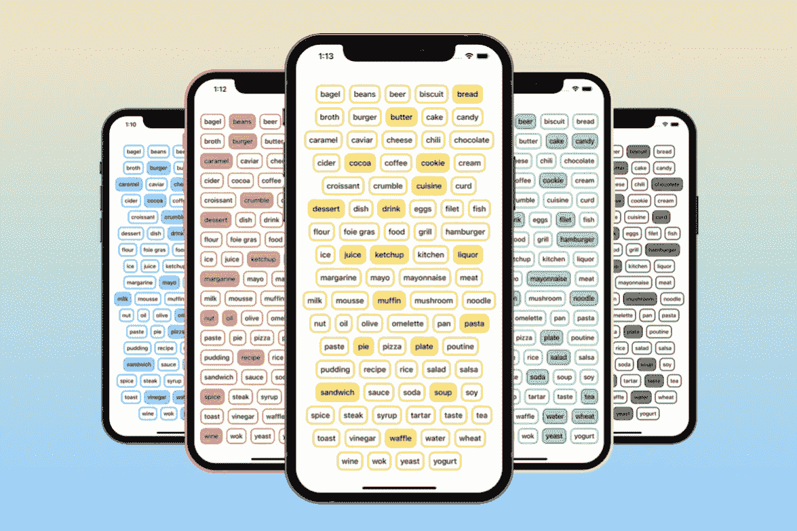

# 使用 SwiftUI 构建灵活的拣选器

> 原文：<https://betterprogramming.pub/flexible-picker-with-swiftui-5817ffe9fddf>

## 基于可滴设计

[https://previewed.app/template/78D6A989](https://previewed.app/template/78D6A989)

最近，当我致力于 Dribbble 上的一个设计的 SwiftUI 实现时，我想到了一个用一些很酷的过滤器来扩展该项目以缩小结果列表的想法。

我决定过滤器视图将由两个独立的过滤器选项组成，它们都有一些选项可供选择。但是后来我遇到了一个问题。当我使用 UIKit 时，我总是用特定的`UICollectionViewFlowLayout`来实现那种视图。但是我如何在 SwiftUI 中做到这一点？

让我们来看看我用 SwiftUI 实现的灵活选取器！

# 可选协议

选择器最重要的部分是我们可以通过视图组件选择一些需要的选项。这就是为什么在一开始我创建了一个`Selectable`协议。

符合该协议的所有对象都必须实现两个属性:`displayedName` —将显示在选择器中的名称，以及`isSelected` —告诉给定选项是否被选中的布尔值。

此外，为了使仅通过映射字符串值数组来创建`Selectable`对象成为可能，必须由符合 Selectable 的对象提供带有`displayedName`作为参数的自定义`init`。

`Identifiable`和`Hashable`协议确保我们能够使用`ForEach`循环轻松创建 SwiftUI 视图。此外，所有符合`Selectable`协议的对象都将实现一个常量值`id`来存储一个`UUID`值。

我将故意省略符合`Selectable`协议的对象的实现，因为我相信这是显而易见的。如果没有，那么您可以在本文末尾提到的我的 GitHub 资源库中查看它。

可选协议的代码片段。

# 用户化

我的目标不仅是创建一个灵活的选择器的实现，而且尽可能使它可定制。

这就是为什么`FlexiblePicker`将使用符合`Selectable`协议的通用类型`T`来创建。这样，以后重用该组件就更容易了，因为它是独立于类型的。

在实现选择器之前，我写下了所有可定制的属性。下一步是创建字符串扩展，用于计算特定字符串值的宽度和高度。

因为我的实现提供了改变字体大小和粗细的可能性，所以前面提到的两个扩展都以灵活选取器使用的参数`UIFont`作为参数。

字符串扩展的代码段。

作为计算给定字符串大小的字符串扩展，将 a `UIFont`作为输入，我需要将所有的`UIFont`权重转换成 SwiftUI 的等价物。

这就是为什么我引入了一个`FontWeight`枚举，由所有以`UIFont`权重命名的可能情况组成。

此外，该枚举有两个属性，一个返回`UIFont`权重，另一个返回 SwiftUI 字体权重。这样，我们只是为我们的`FlexiblePicker`提供了`FontWeight`枚举的一个特例。

FontWeight 枚举的代码段。

# FlexiblePicker 逻辑

在那之后，我终于准备好开始进行`FlexiblePicker`实现了。

首先，我需要一个函数来计算并返回作为输入传递的所有数据的宽度。我通过将所有输入值映射到由输入值和自身宽度组成的元组来实现。

在地图内部，我使用了 reduce 函数，总结了与给定输入值相关的所有宽度(文本宽度、边框宽度、文本填充、间距)。

现在，当计算宽度的函数准备好了，我们可以遍历所有输入数据，并把它们分成单独的数组。每个数组由能够放入同一个`HStack`的项目组成。逻辑很简单。我们必须阵列:

*   `singleLineResult`数组——负责存储适合特定行的项目
*   `allLinesResult`数组——负责存储项目的所有数组(每个数组相当于一行项目)

首先我们检查从`HStack`的线宽中减去项目宽度的结果是否大于 0。

如果满足条件，我们将当前项目追加到`singleLineResult`，更新可用的`HStack`的线宽，并转到下一个元素。

如果结果小于 0，这意味着我们无法将下一个元素放入给定的行中，因此我们将`singleLineResult`附加到`allLinesResult`，将`singleLineResult`设置为仅包含当前元素(无法放入前一行的元素)的数组，并通过减去当前项目的宽度来更新`HStack`的行宽。

在经历了所有的元素之后，我们必须处理一个特定的极限情况。有可能`singleLineResult`不会为空，也不会追加到`allLinesResult`——因为我们只在减去项目宽度的结果小于 0 时追加`singleLineResult`。在这种情况下，我们必须检查`singleLineResult`是否为空，如果为真，我们返回`allLinesResult`，如果不是，我们必须首先追加`singleLineResult`，然后返回`allLinesResult`。

将项目分成单独行的函数的代码段。

最后但同样重要的是，我们必须计算`VStack`的高度，以使 SwiftUI 更容易解释我们的视图组件。`VStack`的高度基于两个值计算:

*   输入数据中任何项目的高度(计算方法与宽度相似，使用 reduce 函数，将与项目相关的所有高度相加)
*   将在`VStack`中显示的行数

计算 VStack 高度的函数的代码片段。

这两个数字相乘的结果就是我们的`VStack`的高度。很简单，是吧？

# FlexiblePicker 视图

最后，当整个逻辑准备就绪时，我们需要实现一个视图体。正如我之前提到的，视图将使用`ForEach`循环创建，一个嵌套在另一个中。

记住`ForEach`循环要求迭代集合的每个元素都必须符合`Identifiable`协议，或者应该有一个唯一的标识符，这一点很重要。

这就是为什么我将被划分的行的结果映射到由每行和 id(即`UUID`值)组成的元组中。

因此，我可以向`ForEach`循环提供一个 id 参数。第二件要记住的事情是,`ForEach`循环期望得到一些视图作为返回值。

如果我们只是在那里插入另一个`ForEach`循环，我们的视图的正确功能将会有问题，因为`ForEach`不是一个视图类型。

这就是为什么我将整个`ForEach`循环首先打包到`HStack`，然后打包到`Group`，以确保编译器能够正确解释一切。

FlexiblePicker 视图实现的代码段。

几乎所有的工作都完成了，我们只需要添加一个功能来处理用户与按钮的交互。该函数只是切换特定数据的`isSelected`属性。

用户交互处理程序的代码片段。

代码的其余部分很简单，它主要是所有属性的配置，如字体、颜色或边框。此外，在`VStack`结束时，我们设置了一个框架，其宽度取自`GeometryReader`，高度由之前创建的函数计算。

FlexiblePicker 实现的最终结果。

现在我们准备好了！我们的 FlexiblePicker 已经完成，可以使用了！

我希望你喜欢它！像往常一样，整个实现可以在我的 [GitHub 库](https://github.com/jcholuj/FlexiblePickerExample)上获得。非常感谢你的时间。