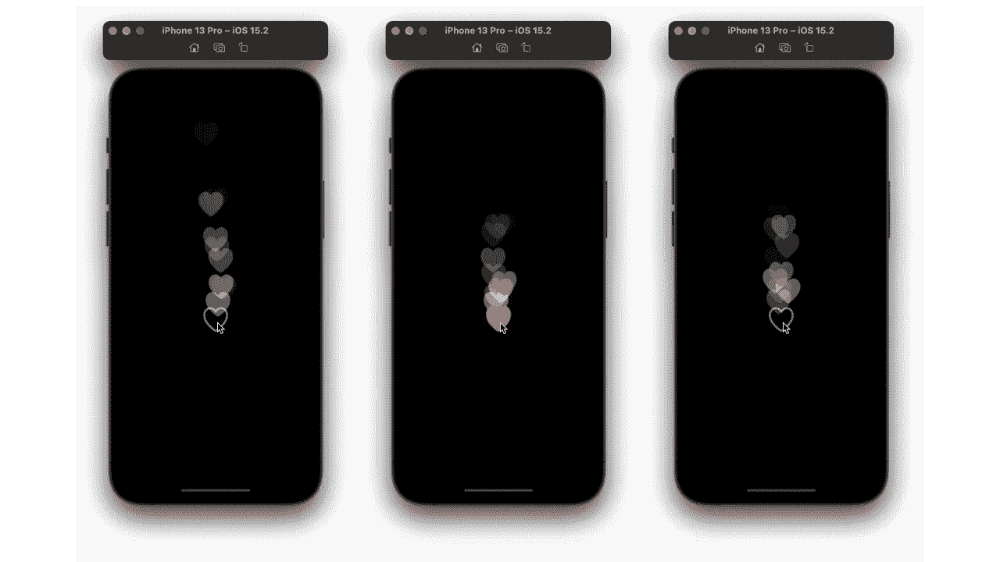
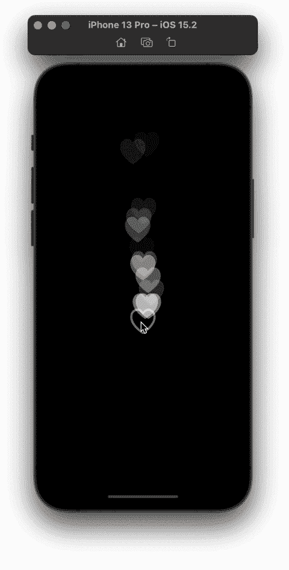
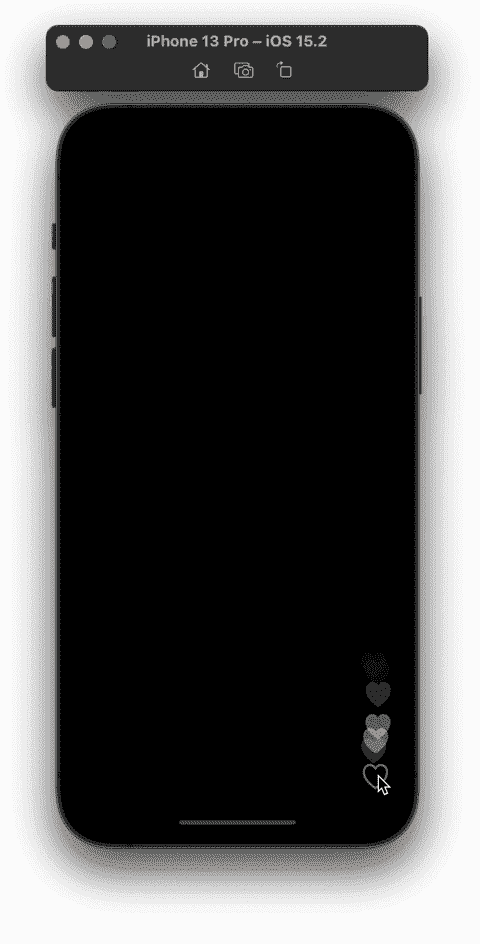

# SwiftUI 中的浮动心形动画

> 原文：<https://betterprogramming.pub/floating-hearts-animation-in-swiftui-1bf2f0404b12>

## 如何让 Instagram 像 SwiftUI 中的按钮动画一样活起来

为了制作一个类似 Instagram 的 like 按钮动画，我们将使用`GeometryEffect`和`ViewModifier`。你也可以使用`SKScene`和`SpriteView`来达到类似的效果。

# 心脏的几何效应

首先，我们需要创建一个随着时间改变心脏的 x 和 y 方向/位置的几何效果。x 位置将彼此靠近，居中或偏心，数值在-0.05 和 0.05 之间。y 方向将随着 sin 和-pi 和 0 之间的 y 值而变化。如果你的喜欢按钮很大，这些轻微的移动可能还不够。根据需要调整 x 和 y 值。

按照以下步骤返回正确的投影变换:

*   添加一个速度变量，并给它一个 100 到 200 之间的随机值。
*   添加一个时间变量和一个 Double 类型的 animatableData 变量。animatableData 将启动我们的时间和 0，并逐渐将其更改为给定的时间，我们将从我们接下来创建的 ViewModifier 中传递该时间。
*   创建一个 xTranslation 变量，将 x 方向和速度相乘。
*   创建一个 yTranslation 变量，它乘以 y 方向、速度和时间的 sin。
*   用我们的 xTranslation 和 yTranslation 创建并返回一个 CGAffineTransform。

# 点击喜欢的视图修饰符

在本节中，我们将创建一个包含我们内容的`ViewModifier`。这里，我们将使用`WithAnimation`改变时间值，并将其传递给我们的`GeometryEffect`修改器。

要使心形淡出，添加一个不透明度修改器，当我们的时间等于心形动画的持续时间时，给它一个 0。参见下面的代码。

# ContentView 中的 Like 按钮

在符号中，使用`heart`表示我们喜欢的按钮，使用`heart. fill`表示我们喜欢的按钮。跟踪变量中的点赞数。

为喜欢的数量创建一个变量。每次用户点击心脏，增加喜欢。将`heart.fill`图像嵌入到一个`ForEach`循环中，该循环循环到喜欢的数量。

最后，将我们的`LikeTapModifier`添加到循环内部的图像中。

# 性能增强

在调试导航器中，我们可以看到内存不断增加。为了解决这个问题，我们可以将 likes 从 int 转换成一个可识别的结构，然后遍历它们。

使用`onChange`，我们可以将喜欢数保持在一个较低的数字(下面的检查代码)。

本教程到此为止。感谢您的阅读！