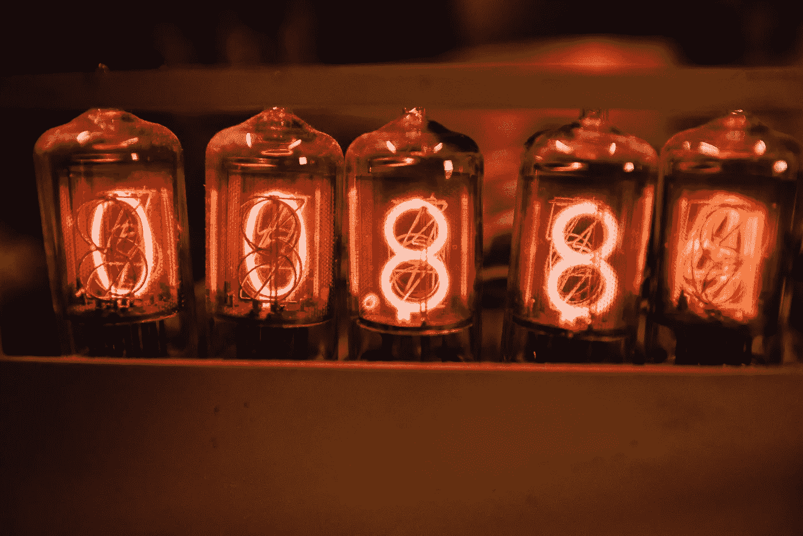

# 浮点数在 Python 中很奇怪——以下是解决它们的方法

> 原文：<https://betterprogramming.pub/floating-point-numbers-are-weird-in-python-heres-how-to-fix-them-51336e4ad51a>

## 用 Python 处理浮点运算



在 [Unsplash](https://unsplash.com/s/photos/numbers?utm_source=unsplash&utm_medium=referral&utm_content=creditCopyText) 上由 [Carlos Irineu da Costa](https://unsplash.com/@carlosirineu?utm_source=unsplash&utm_medium=referral&utm_content=creditCopyText) 拍摄的照片

在处理浮点数时，你有没有遇到过奇怪的问题——例如，在做如下事情时？

```
a = 10b = 0.1c = 0.2a*(b+c) == a*b + a*c # This will print False
```

等等，什么？如果我的数学课是正确的，这种比较应该是正确的。

让我们看另一个例子。

```
>>> .2 + .2 + .2 == .6False
```

或者看看这个循环——它将无限期运行。

```
foo = 0while foo != 1.0: foo = foo + 0.1print(foo)
```

# 发生了什么事？

**TL；** — 博士浮点数诡异！

浮点数的行为不同于你在所有编程语言中习惯的行为，不仅仅是在 Python 中。这是因为一些十进制数在二进制系统中没有精确的表示。

要理解为什么，我们先来看看计算机是如何表示分数的。

# 计算机如何处理浮点数？

所有计算机都使用 IEEE 浮点运算标准来近似计算分数的值。

分数在计算机上用二进制表示。例如，分数 3/4 (0.75)的二进制表示是 0.11。我们自己看看怎么算吧。

为了得到十进制数的二进制表示，我们必须遵循以下步骤:

1.  将十进制数乘以 2。
2.  取出整数(进位)，将新分数乘以 2。
3.  重复这个过程，直到不再有小数值。
4.  现在把你所有的进位放在一起。

**例 1**

```
0.75 * 2 = 1.5 # Carry 10.5 * 2 = 1 # Carry 1Binary representation: 0.11
```

**例 2**

让我们做一个更长的:0.8125

```
0.8125 * 2 = 1.625 # Carry 10.625 * 2 = 1.25 # Carry 10.25 * 2 = 0.5 # Carry 00.5 * 2 = 1.0 # Carry 1Binary representation = 0.1101
```

到目前为止，我们还没有真正看到这一切的问题是什么。为此，让我们看看十进制世界中类似的问题。当我们得到分数 1/3 时，我们可以把它表示为 0.3，或者更准确地说是 0.33，或者更准确地说是 0.333333。你可以添加无限数量的 3，1/3 的表示每次都会更接近。

对于计算机，同样的情况也会发生。让我们按照之前的步骤，尝试用二进制表示十进制值 0.8。

```
0.8 * 2 = 1.6 # Carry 10.6 * 2 = 1.2 # Carry 10.2 * 2 = 0.4 # Carry 00.4 * 2 = 0.8 # Carry 00.8 * 2 = 1.6 # Carry 1  – Do you start to notice the problem?
```

如果我们继续前进:

```
0.6 * 2 = 1.2 # Carry 10.2 * 2 = 0.4 # Carry 00.4 * 2 = 0.8 # Carry 00.8 * 2 = 1.6 # Carry 1
```

好了，停下来！

如你所见，十进制数 0.8 实际上不能用二进制来表示。我们可以通过写出 0.11001 或者更好的 0.110011001 或者更好的 0.1100110011001 来近似它，并且我们可以不断增加无限数量的位来获得更精确的近似。

回到我们最初的一个例子:

```
>>> .2 + .2 + .2 == .6False
```

你现在明白为什么会这样了吗？计算机基本上是在做近似值的求和，正如我们之前看到的，0.2 和 0.6 都不能在二进制世界中精确表示。

# 这些问题有解决方法吗？

有几种方法可以缓解这个问题。在 Python 中，您可以使用下面的包进行浮点数运算，

```
from fractions import Fraction
```

现在，您可以像下面这样做，而不必编写 foo = 0.3。

```
foo = Fraction(1, 3)
```

让我们看看我们的例子的变通办法。

**第一个例子**

```
a = 10b = Fraction(1,10)c = Fraction(2,10)a*(b+c) == a*b + a*c # Prints True
```

**第二个例子**

```
>>> Fraction(2,10) + Fraction(2,10) + Fraction(2,10) == Fraction(6,10)True
```

对于`for`循环，我们可以用两种不同的方法来解决它。最简单的方法是通过如下改变条件操作符。

```
foo = 0while foo <= 1: foo = foo + 0.1print(foo) # 1.09999999999
```

第二个选择是再次使用`fractions`包。举个例子，

```
foo = 0while foo != Fraction(1,10): foo = foo + Fraction(1,10)print(foo) # 1/10
```

# 结论

浮点数在二进制系统中的行为非常奇怪。因此，了解这种行为很重要。我将帮助你避免容易被忽略的简单错误，比如无限循环或者仅仅是基本的比较。

# 进一步阅读

*   [IEEE 浮点运算标准(IEEE 754)](https://en.wikipedia.org/wiki/IEEE_754)
*   [Python 中的分数模块](https://www.geeksforgeeks.org/fraction-module-python/)
*   [浮点运算:问题与限制](https://docs.python.org/3/tutorial/floatingpoint.html)