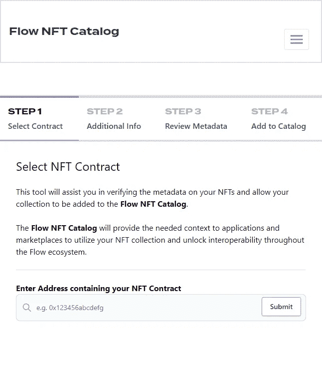

# 流区块链和 Cadence 语言—了解最佳实践

> 原文：<https://betterprogramming.pub/flow-blockchain-and-cadence-language-learn-best-practices-f4678b8c2bcb>

## 看看最佳实践、模式和反模式


[来自像素的图像](https://www.pexels.com/photo/red-and-brass-dart-pin-on-dartboard-226569/)

在这个系列文章中，[向您介绍了区块链流](https://medium.com/better-programming/an-introduction-to-the-flow-blockchain-60ccc7a35598)，它的[智能合同语言 Cadence](https://medium.com/better-programming/smart-contracts-which-is-better-ethereum-or-flow-39f766c72e5d) ，以及一些开发人员应该知道的最[基本工具](https://medium.com/better-programming/an-overview-of-the-tools-for-developing-on-flow-cadence-24bfe3b34d83)，所有这些都与以太坊进行了比较和对比。

在本文中，我们将讨论使用 Cadence 语言和在 Flow network 上开发解决方案时应遵循的最佳实践和模式，以及应避免的模式。

# 最佳实践

## 使用流量测试网络和流量模拟器

开发任何区块链最重要的步骤之一是在模拟环境中测试您的项目。流动区块链也不例外。为此, [Flow testnet](https://developers.flow.com/learn/concepts/accessing-testnet) 和 [Flow Emulator](https://developers.flow.com/tools/emulator) 是包含在您的开发流程中的关键组件。它们不仅让您了解您的 dapp 将如何执行，而且还将帮助您在部署到 mainnet 之前捕获任何关键的 bug。

## 使用标准合同

任何区块链最常见的两个用例是数字货币和通过 NFTs 提供数字所有权的证明。流开发人员应该始终导入正式的核心合同，以确保用户安全以及与网络其余部分的一致性，而不是试图从头开始重写必要的合同。

目前您应该使用三种标准合同:

*   [可替换令牌](https://developers.flow.com/flow/core-contracts/fungible-token) —用于创建新令牌
*   [不可替换令牌](https://developers.flow.com/flow/core-contracts/non-fungible-token) —用于创建 NFT
*   [元数据视图](https://developers.flow.com/flow/core-contracts/nft-metadata) —用作 NFTs 的元数据模式

这些契约本质上是接口，迫使实现它们的人添加他们的变量和方法声明，使它们能够与流生态系统中的其他智能契约互操作。它们已经存在于 testnet 和 mainnet 网络上，所以在你的合同中实现它们时，一定要从上面链接的官方地址导入。

你可以在流程文档中找到其他核心合同[。](https://developers.flow.com/flow/core-contracts)

## 为您的智能合约、交易和脚本创建测试

[流 JavaScript 测试框架](https://github.com/onflow/flow-js-testing)对于测试合同的部署场景至关重要。然而，需要注意的是，您需要在后台运行[流命令行界面](https://developers.flow.com/tools/flow-cli)来获得完整的功能。有了这些，您可以测试创建新帐户、发送事务、运行查询、执行脚本等等。此外，它与流模拟器集成，以创建、运行和停止模拟器实例。

## 将您的合同添加到 Flow NFT 目录

[流 NFT 目录](https://www.flow-nft-catalog.com/)作为存储 NFT 合同和元数据的数据库而存在。通过上传你的合同，你的 NFTs 可以和其他的 Flow 生态系统互操作，其他开发者可以很容易地在他们的市场或其他 dapps 中支持你的收藏。

您可以[将您的合同添加到目录](https://www.flow-nft-catalog.com/v)中，方法是完成一个简单的四步流程，该流程需要选择合同、获取附加信息、检查元数据，然后将流 NFT 添加到目录中。



## 具体到类型

Cadence 是一种[强](https://www.techopedia.com/definition/24434/strongly-typed)和[静态](https://www.techopedia.com/definition/22321/statically-typed)类型化语言，允许开发者指定哪些类型包含或返回变量、接口和函数。所以你在做申报的时候要尽量具体；仅在必要的情况下使用泛型类型。不这样做可能会导致笨拙的错误。

## 访问控制

只要有可能，您应该仔细考虑访问控制。幸运的是，在流区块链上，调用者无法在没有引用的情况下访问另一个用户的帐户存储中的对象。这被称为基于引用的安全性，这意味着默认情况下没有任何东西是真正公共的。

然而，在编写 Cadence 代码时，在声明变量、结构、函数、资源等时必须小心。开发人员可以在声明中包含四个级别的访问控制:

*   `pub/access(all)` —在所有范围内可访问/可见
*   `access(account)` —只能在其定义的整个账户中访问(同一账户中的其他合同可以访问)
*   `access(contract)` —仅在定义的合同范围内可访问(不能在合同之外访问)
*   `priv/access(self)` —仅在当前和内部范围内可访问

尽可能避免使用 pub/access(all)。查看[的流程文档，了解更多关于访问控制](https://developers.flow.com/cadence/language/access-control)的信息。

## 在协定中创建 StoragePath 和 PublicPath 常量

契约资源的路径非常重要，必须在所有事务和脚本中保持一致。为了确保一致性，你应该为`PublicPath`和`StoragePath`创建常量。

```
pub contract BestPractices {
 pub let CollectionStoragePath: StoragePath
 pub let CollectionPublicPath: PublicPath
```

```
 init(){
  self.CollectionStoragePath = /storage/bestPracticesCollection
  self.CollectionPublicPath = /public/bestPracticesCollection
 }
}
```

当您创建一个使用这些路径之一的事务时，您只需要用导入的契约调用它各自的变量来引用所需的路径。

```
//This script checks if a user has the public Collection from BestPractices contract
import BestPractices from 0x...
```

```
pub fun main(addr: Address): Bool {
 return getAccount(addr).getLinkTarget(BestPractices.CollectionPublicPath) != nil
}
```

## 管理资源

创建一个管理资源是一个很好的实践，该管理资源包含执行契约下的操作的特定函数，比如一个 mint 函数。这种约定确保只有拥有该资源或能力的帐户才能执行管理功能。

```
pub contract BestPractices {
 pub let CollectionStoragePath: StoragePath
 pub let CollectionPublicPath: PublicPath
 pub let AdminStoragePath: StoragePath
```

```
 pub resource AdminResource {
  pub fun mintNFT(){
   //your mint NFT code here! 
  }
 } init(){
  self.CollectionStoragePath = /storage/bestPracticesCollection
  self.CollectionPublicPath = /public/bestPracticesCollection
  self.AdminStoragePath = /storage/bestPracticesAdmin

  //Create the adminResource and store it inside Contract Deployer account
  let adminResource <- create AdminResource()
  self.account.save(<- adminResource, to: self.AdminStoragePath)
 }
}
```

## 创建自定义事件

事件是可以在执行 Cadence 代码期间发出的值。例如，当在契约中定义重要的操作时，您可以发出事件来表示它们的完成或交付特定的值。因此，与智能合约交互的事务可以通过这些事件接收附加信息。

```
pub contract BestPractices {
 pub let CollectionStoragePath: StoragePath
 pub let CollectionPublicPath: PublicPath
 pub let AdminStoragePath: StoragePath
```

```
//Create your own events
pub event AdminCreated() pub resource AdminResource {
  pub fun mintNFT(){
   //your mint NFT code here! 
  }
 } init(){
  self.CollectionStoragePath = /storage/bestPracticesCollection
  self.CollectionPublicPath = /public/bestPracticesCollection
  self.AdminStoragePath = /storage/bestPracticesAdmin

  //Create the adminResource and store it inside Contract Deployer account
  let adminResource <- create AdminResource()
  self.account.save(<- adminResource, to: self.AdminStoragePath)
 }
}
```

# Cadence/Flow 区块链上的模式

## 特定于类型约束中的类型

Cadence 语言最强大的特性之一无疑是[功能](https://developers.flow.com/cadence/language/capability-based-access-control)。通过能力，资源访问的范围扩大了。

创建功能时，重要的一点是指定您的资源的哪些特性应该对其他人可用。这可以在使用类型约束创建链接时完成。

在本例中，我们使用 [ExampleNFT 契约](https://github.com/onflow/flow-nft/blob/master/contracts/ExampleNFT.cdc)来创建一个基本功能，其中任何想要接收 ExampleNFT 的帐户都必须有一个集合。

```
import NonFungibleToken from 0x...
import ExampleNFT from 0x...
```

```
transaction{
 prepare(acct: AuthAccount){
  let collection <- ExampleNFT.createEmptyCollection()
    // Put the new collection in storage
   acct.save(<-collection, to: ExampleNFT.CollectionStoragePath)
    // Create a public Capability for the collection
    acct.link<&ExampleNFT.Collection{ExampleNFT.CollectionPublic}>(ExampleNFT.CollectionPublicPath, target: ExampleNFT.CollectionStoragePath)
 }
}
```

`&ExampleNFT`中的`&`符号表示我们正在使用一个[参考](https://developers.flow.com/cadence/language/references)。在引用符号之后，我们添加我们创建的功能将访问的类型。在这一点上，我们需要尽可能具体。

这种模式增强了安全性，并限制了调用该功能的`borrow`函数的用户可以使用的功能。

省略`{ExampleNFT.CollectionPublic}`类型将允许您访问`ExampleNFT.Collection`引用中的所有函数，包括撤销函数，因此任何人都可以访问用户的集合并窃取他们的 NFT。

## 使用借用功能

要使用资源的特性，您可以调用`Load`函数从帐户中删除资源，使用它的特性，并调用`Save`函数再次保存它。然而，这种方法成本高且效率低。

为避免这种情况，请使用`borrow`功能。它允许您使用对正在调用的资源的引用。这种方法使你的交易更有效率和成本效益。

## 使用 check 和 getLinkTarget 函数

在流量区块链上构建应用时，你会发现用户的账号起着至关重要的作用。与以太坊等其他区块链不同，Flow 将资源、资产等更直接地存储在用户的账户中，而不是作为对公共数字账本上的地址的引用。

这种方法要求帐户有一个特定的存储位置，如可替换令牌的集合或保管库。然而，这也增加了复杂性。必须确保用户的帐户中有或没有收藏。

向用户帐户添加集合和功能时，必须使用`check()`函数(检查给定路径中是否存在功能)和`getLinkTarget()`函数(返回给定功能的路径)。这些函数确保事务执行时没有问题。

## 利用恐慌

Panic 是 Cadence 中的一个内置功能，允许您无条件终止程序。这可能发生在智能合约代码的执行过程中，并返回一条错误消息，这使得更容易理解什么时候事情没有按预期进行。

在声明变量时，可以将它们定义为可选的，这意味着如果它们不是指定的类型，它们的值为 nil。

因此，在 Cadence 中，当查询返回可选变量的特定变量或函数的值时，可以使用两个问号后跟`panic("treatment message")`函数。

```
let optionalAccount: AuthAccount? = //...
let account = optionalAccount ?? panic("missing account")
```

这个命令`??panic("treatment message")` 试图返回指定类型的值。如果返回值是错误的类型或 nil，则执行中止，并且所选的处理消息显示在控制台上。

# 反模式

虽然 Cadence 旨在避免在其他区块链生态系统中发现的许多潜在错误和漏洞，但开发人员在构建时应该了解一些反模式。下面列出了一些需要考虑的重要因素。要获得完整的反模式列表，[查看流程文档](https://developers.flow.com/cadence/anti-patterns)。

## 使用借入函数时未指定类型

开发人员应该使用上面提到的借用功能来利用功能中可用的特性。然而，应该清楚的是，用户可以在他们的存储器中存储任何东西。因此，确保所借的是正确的类型是至关重要的。

不指定类型是一种反模式，最终会导致事务和应用程序出错甚至崩溃。

```
//Bad Practice. Should be avoided
let collection = getAccount(address).getCapability(ExampleNFT.CollectionPublicPath)
                    .borrow<&ExampleNFT.Collection>()?? panic("Could not borrow a reference to the nft collection")
```

```
//Correct! 
let collection = getAccount(address).getCapability(ExampleNFT.CollectionPublicPath)
                    .borrow<&ExampleNFT.Collection{NonFungibleToken.CollectionPublic}>()
                    ?? panic("Could not borrow a reference to the nft collection")
```

## 使用 AuthAccount 作为函数参数

对于准备阶段的交易，可以访问用户的`AuthAccount`字段。该对象允许提供它的用户访问内存存储和帐户的所有其他私有区域。

将此字段作为参数传递是不必要的，应该避免，因为需要此方法的情况非常少见。

```
//Bad Practice. Should be avoided
```

```
transaction() {
 prepare(acct: AuthAccount){
  //You take sensitive and important user data out of the scope of the transaction prepare phase
  ExampleNFT.function(acct: acct)
 }
}
```

## 对字典和数组使用公共访问控制

通过在带有`pub/access(all)`作用域的契约中存储字典和数组变量，您的智能契约变得易受攻击，因为任何人都可以操纵和更改这些值。

## 使用 auth 关键字创建功能和引用

使用`auth`关键字创建功能和引用会将值暴露给向下转换，这可能会提供对原本不打算使用的功能的访问。

```
//AVOID THIS!
signer.link<auth &ExampleNFT.CollectionPublic{NonFungibleToken.Receiver}>(
    /public/exampleNFT,
    target: /storage/exampleNFT
)
```

# 结论

当使用 Cadence 在流区块链上开发时，了解设计模式、反模式和最佳实践会有所帮助。

通过遵循这些最佳实践，我们可以确保整个流程生态系统的一致安全级别，从而为用户提供最佳体验。为了更全面的理解，[通读流程文档](https://developers.flow.com/cadence/design-patterns)。

祝你今天过得愉快！