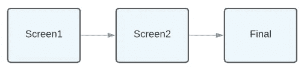
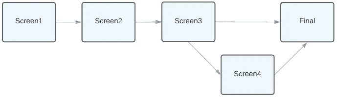
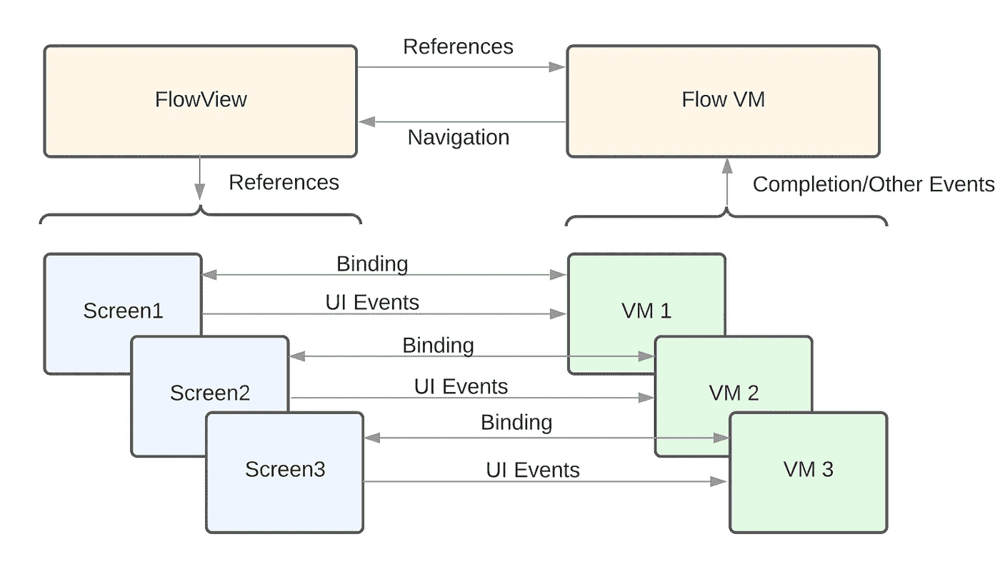

# 使用 SwiftUI 4 进行流程导航

> 原文：<https://betterprogramming.pub/flow-navigation-with-swiftui-4-e006882c5efa>

## 以编程方式实现新的 NavigationStack，并且不使用 NavigationLink

刚刚在 SwiftUI 3 [这里](/flow-navigation-with-swiftui-revisited-791f89421923)重新审视了这个导航(它更新了 SwiftUI 1 [这里](https://medium.com/swlh/flow-with-swiftui-and-mvvm-7cc394440ab8)的原始方法)，苹果已经在最新的 SwiftUI 4 版本中重新思考了新`NavigationStack`的导航。这是个好消息…涵盖了我之前的大部分建议！

以前，`NavigationView`要求明确定义导航“边缘”和使用多个标志，这可能会导致混乱。新方法使用一个堆栈来创建现有导航的非 UI 表示，并且与我们以前的编程方法完美地结合在一起，没有太多的变化。

这种方法最初是从使用 SwiftUI 审查多屏幕入职流程开始的。与所有的多屏数据输入流一样，它们通常代表了一个有趣的问题，即如何分离数据、视图和导航逻辑。

那么，是什么造就了一个伟大的多屏数据输入流程呢？这是我想到的。由于缺少一个不那么宏大的术语，我称它为我的“屏幕流动宣言”我在这里使用“屏幕”而不是视图，因为我们明确地指的是全屏导航。

1.  屏幕不应该有“父”知识，也不应该负责导航进出。
2.  每个屏幕都有单独的视图模型。
3.  总体流控制逻辑与 UI 实现相分离，并且可以在没有 UI 的情况下进行测试。
4.  灵活，允许在流程中分支到不同的屏幕。
5.  尽可能简单，但可组合和可扩展。

# 导航要求

因此，onboarding 可能很简单，可能两三个屏幕询问用户一些简单的个人信息。“下一步”按钮将使用户在流程中向前移动。

简单屏幕流

然而，通常更典型的是带有分支的更复杂的流程。可能用户还没有准备好分享所有这些细节，或者可能需要更多的细节，这取决于之前的回复。所以，也许这更有代表性:

带分支的屏幕流

# 初始实施

如前所述，我们将使用`NavigationStack`。这可以绑定(双向绑定)到导航路径。在我们的第一个实现中，只有 3 个屏幕的流程，我们将使用`NavigationPath()`，这是一个类型擦除序列。我们将把导航路径添加到一个以导航为中心的视图模型中，并传递它(稍后将详细介绍)。

在`NavigationStack`中，我们定义了一个根视图(在我们的例子中是一个带有文本和按钮的`VStack`)。这还包含触发实际导航的导航目的地修饰符。对导航路径的任何追加都将根据类型将 SwiftUI 指向新屏幕的适当新视图，并执行推送动画。

在这个实现中，我们使用一个名为`FlowVM`的视图模型来控制导航流(不同于屏幕视图模型)。这个视图模型包含导航路径，允许我们触发视图之外的实际导航(声明点 1 和 3)。

在我们的例子中，向导航路径添加一个整数会将一个`ContentView2`推入堆栈，向路径添加一个字符串会推入一个`ContentView3`。现在，只对导航路径(这是一个序列)进行简单的操作将直接影响导航，给我们完全的编程控制。美就在这里(涵盖了宣言第四点)！

1.  推送:附加一个特定的类型。
2.  返回根目录:重新初始化导航路径。
3.  返回 1 屏:删除最后一个值。

我们也可以用`removeLast(x)`回到多屏。

你还会注意到我们不再需要使用`NavigationLink`。`NavigationLink`在 SwiftUI 4 中仍然是一个可用的选项，但是它的主要用途是视图到视图导航——这是我们在这里想要避免的！

# 查看模型和绑定

继续宣言第 2 点——每个屏幕都有独立的视图模型。在这里，视图模型的使用和实现可能会有所不同，我已经听到了对 SwiftUI 中过度使用 MVVM 设计模式的担忧。这肯定不是苹果官方使用的术语。

我想要的是视图的非 UI 表示，这样我可以干净地封装非 UI 逻辑，在没有视图的情况下对其进行单元测试，当然，也可以轻松地绑定到视图(两种方式)。它还应该是特定于视图的，这样视图就可以四处移动，并且不依赖于任何外部事物(例如，可组合的——声明点 5)。它是视图与应用程序其余部分的接口。我称之为视图模型。

SwiftUI `ObservableObject`(实际上是 Combine 的一部分)是一个很好的视图模型，支持双向视图绑定。使用`@StateObject`的新方法创建了一个稳定的视图模型，仅在需要时才被延迟加载。

还要注意，在这个版本的视图模型中，UI 事件也被从视图传递到视图模型中，并且任何特定于视图的逻辑(例如，网络调用)可以从那里被触发(例如，通常向下调用 API 层)。

我们还有流视图模型(`FlowVM`)来管理屏幕间导航。它不知道视图，并且被设计成可测试的。它本身可能需要 API 调用来确定要遵循的路径。注意，这类似于“协调器”，但对我来说，它被认为是导航的模型，因此我使用了术语“视图模型”

每个屏幕也有单独的视图模型。这些屏幕视图模型处理 UI 事件和屏幕逻辑。最终(例如，在“下一个”点击之后完成所有屏幕逻辑时)，我们将控制从屏幕视图模型传递回流视图模型，以最终决定导航到哪里。

为了完成，从屏幕视图模型返回到流视图模型，我们可以使用各种技术。委托和回调都是有效的实现，但是我喜欢使用 Combine 的`PassthroughSubject`来传递对屏幕视图模型本身的引用。

所以屏幕视图模型和`view`会像这样:

并连接到流程视图模型中，使用`sink`监听如下完成事件，并将其存储在`subscription`中。您会注意到这里处理了创建屏幕视图模型的工厂函数，它还添加了事件监听。该工厂函数由屏幕视图初始化中的流视图调用。

`sink`直接调用一个方法来处理任何逻辑(和导航)并将订阅存储在一个附加到视图模型的集合中(该集合可用于所有订阅)。

# 将它整合在一起

在导航栈的第一个实现中，我们使用了`NavigationPath`和一些不太重要的类型(整数和字符串)来驱动导航。因为现在每个屏幕都用一个视图模型来表示，所以我们实际上可以通过将视图模型本身添加到路径中来驱动导航。

我们可以将视图模型直接添加到`NavigationPath`中，并为每个视图模型类型创建多个导航目的地修饰符。然而，这种类型的擦除序列仅提供有限的查询能力(例如，不能容易地查询当前显示的屏幕)。

相反，我们可以将导航栈绑定到一个简单的枚举数组，该数组包含视图模型的相关值。现在路径是一个数组，我们可以最大限度地控制和反省它的当前状态。这里唯一的要求是数组是`Hashable`，这反过来要求视图模型是`Hashable`。这里做了一点额外的工作，但是很简单。

查看[回购](https://github.com/nickm01/NavigationFlow)的完整代码。这也包括向后导航的例子(包括回到根目录或屏幕二等)和`Hashable`一致性。

“最大控制”也允许我们处理一些有趣的情况，我不记得在 UIKit 中能做什么。您可以将之前的屏幕完全改变(`navigationPath[0] = ...`)，现在后退按钮会转到不同的屏幕。或者奇怪地移除堆栈中更深的前一个屏幕(例如`navigationPath.removeFirst()`)。这将以编程方式向后导航，从堆栈中移除第一个屏幕。也许最后一个是不合理的，但我喜欢 SwiftUI 的工作方式，即使在这些奇怪的情况下也是如此。干得好苹果！

# 测试

我们设计的很大一部分是为了提高可测试性，并允许独立于 UI 的导航流的单元测试(宣言点 3)。现在有了视图模型，这很容易做到。这里有一个例子:

我们能够触发“下一步”按钮点击，然后检查导航逻辑是否被触发——所有这些都不需要实际的 UI。

请注意，这显然是一个简单的实现。如果视图模型有 API 调用，我们将不得不考虑一些注入来模拟这些调用。另外，这显然不是 UI 测试。

我们可能还想添加一些 UI 测试(可能使用快照测试)，但这超出了本文的范围。

# 最后…

我希望这有意义！在 4 个版本之后，SwiftUI 推送导航的这一迭代是我们一直在寻找的方法。现在，这应该已经回答了社区普遍关注的大部分问题(以及我之前的建议[这里](/flow-navigation-with-swiftui-revisited-791f89421923))。

有什么改进吗？现在，还没有明显的方法来创建自定义的推送导航。另一个更大的想法是为推送和模态导航创建一个单一的融合导航 API。苹果——你的时钟现在开始了！😁

完整的代码可以在 https://github.com/nickm01/NavigationFlow 找到。尽情享受吧！