# 用 SonarQube 分析颤振项目

> 原文：<https://betterprogramming.pub/flutter-and-sonarqube-6aa06e4b9798>

## 颤振和共振

图片由 [PublicDomainPicture](https://pixabay.com/pt/users/publicdomainpictures-14/) 在 [Pixabay](https://pixabay.com/) 上拍摄

如果你有一个 Flutter 应用程序，并且你想知道你的代码质量或者项目的哪些部分需要改进，你可以使用 Sonarqube 来分析你的代码并为你恢复这些信息。

SonarQube(又名 Sonar)是一个开源平台，它基于代码分析来测量代码质量，以检测代码气味、bug、代码覆盖率、代码复杂性、安全问题等。

在本文中，我将通过以下步骤详细展示如何使用 SonarQube 和 Docker 分析您的 Flutter 代码:

*   本地运行声纳
*   创建一个声纳项目
*   下载声纳扫描仪
*   分析你的颤振项目
*   检查结果

## 本地运行声纳

您可以使用 docker 在本地运行 Sonar，为此，在您的终端中运行命令`docker run --rm -d -p 9000:9000/tcp edsondiasalves/sonarqube-flutter`，它将提取并运行已经安装了[Sonar cube Flutter 插件](https://github.com/insideapp-oss/sonar-flutter)的 Sonar cube 映像。

> 注意 SonarQube Flutter 插件不是官方的，我使用的这个 docker 镜像在我自己的 docker 库中，你可以随意使用它，但我不对它可能出现的任何问题负责
> 
> 要创建声纳镜像并自己安装插件，[下载插件](https://github.com/insideapp-oss/sonar-flutter/releases)并将其复制到 docker 镜像运行:`docker cp ThePluginDownload.jar YourSonarQubeImage:/opt/sonarqube/extensions/plugins`

一旦映像完成提取并运行，它将在地址 [http://localhost:9000](http://localhost:9000) 上可用，使用 **admin** 作为用户并使用 1234 作为密码登录

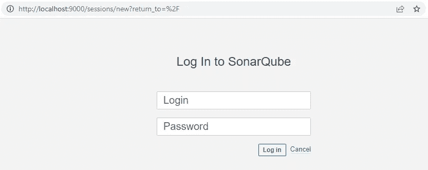

SonarQube 登录页面

当点击**管理**菜单选项，在**已安装**部分我们可以看到 Flutter 插件版本 0.4.0 已安装

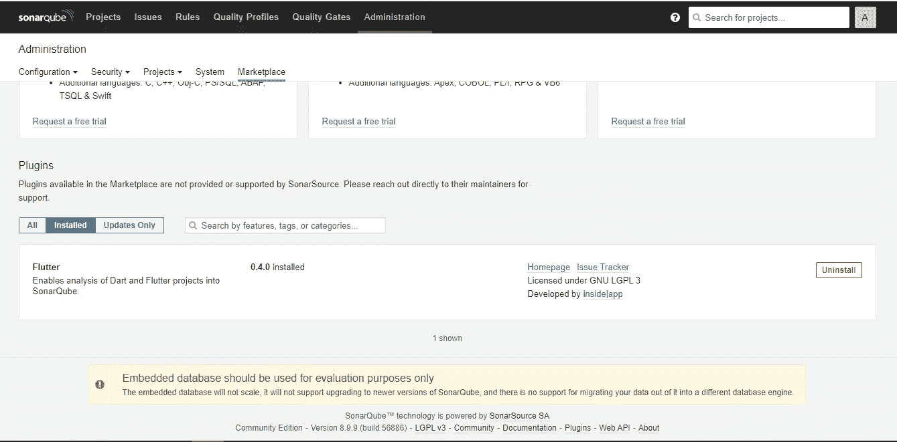

SonarQube 已安装插件页面

## 创建一个声纳项目

现在，是时候创建我们的声纳项目了，为此点击**项目**菜单选项

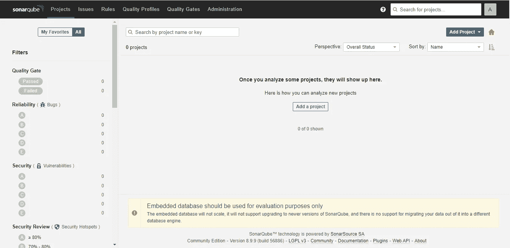

SonarQube 项目页面

并在页面中央的**按钮中添加一个项目**

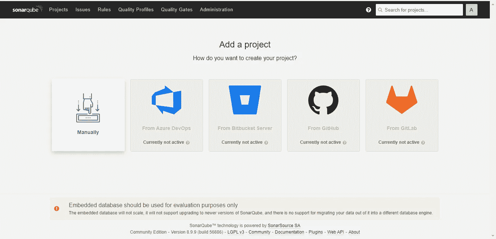

SonarQube 添加项目页面

现在，手动点击**，提供一个**项目键**，注意显示名称会自动完成，不需要更改-**

**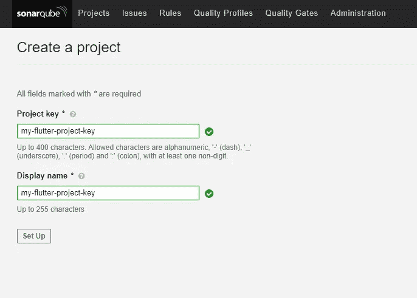**

**SonarQube 项目关键页**

**单击**设置**按钮，将出现一个新屏幕，要求您生成一个新令牌，提供一个名称，然后单击**生成**按钮。**

**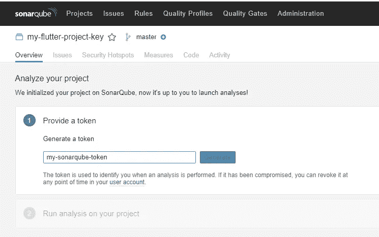**

**SonarQube 令牌生成页面**

**将为提供的令牌名称创建一个新令牌。**

**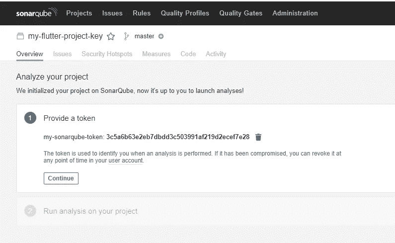**

**SonarQube 生成的令牌页面**

**当点击 but **Continue** 按钮时，将显示如何在不同平台上运行分析**

**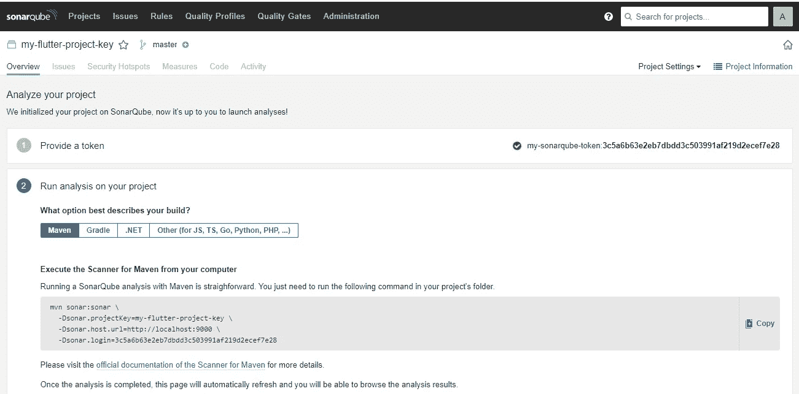**

**SonarQube 分析建议页**

**现在你的声纳项目已经创建好了。**

**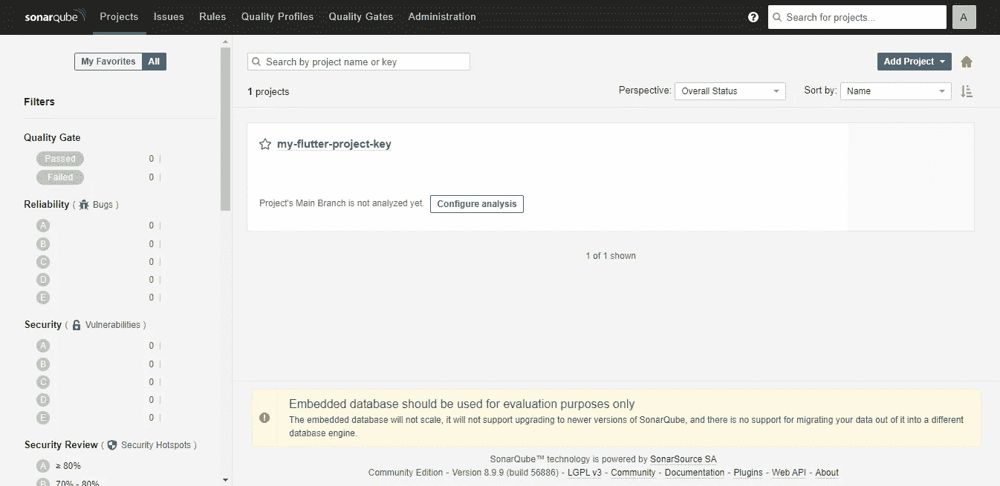**

**SonarQube 项目页面**

## **下载声纳扫描仪**

**SonarScanner 是一个官方的 SonarQube 工具，它将扫描你的项目并将分析上传到你的 Sonar 项目。**

****

**声纳扫描仪文档和下载部分**

**根据你的操作系统下载，并将 **/bin** 文件夹添加到路径中**

**作为 4.7.0 windows 版本的示例，需要将`sonar-scanner-cli-4.7.0.2747-windows\bin`添加到路径中**

**为了确保它是正确的，在您的终端上运行`sonar-scanner -v`并检查版本是否会被正确返回**

**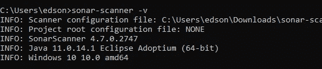**

**声纳扫描仪版本**

## **分析你的颤振项目**

**现在，在你的 Flutter 根文件夹中创建`sonar-project.properties`，并粘贴下面的代码。**

**用之前创建声纳项目时提供的信息替换`sonar.projectKey`、`sonar.projectName`和`sonar.login`。**

**现在运行`flutter test --machine --coverage > tests.output`，它将运行您的本地测试并在声纳扫描仪上传之前将其导出到一个文件中**

**最后，运行`sonar-scanner`开始分析并上传到你的声纳项目**

**如果一切正常，最后会出现类似的消息。**

**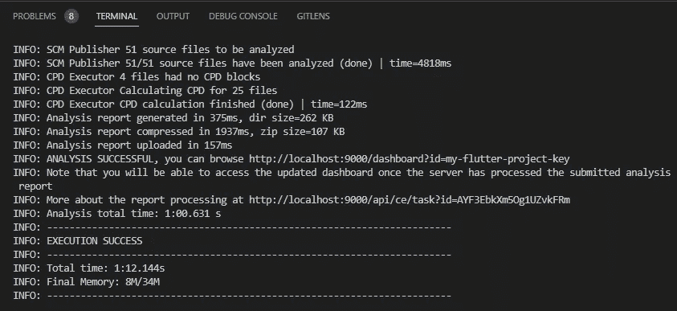**

**声纳扫描仪分析日志**

## **检查结果**

**完成扫描后，返回声纳并按 f5 或再次输入您的项目。现在我们可以看到关于该项目的主要信息。**

**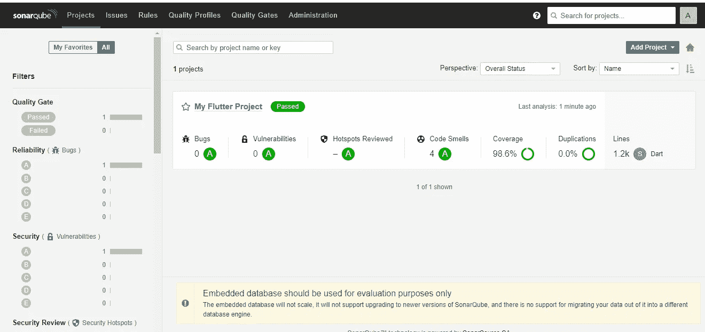**

**SonarQube 项目页面**

**在“概述”选项卡中，我们可以看到更多一般信息。**

**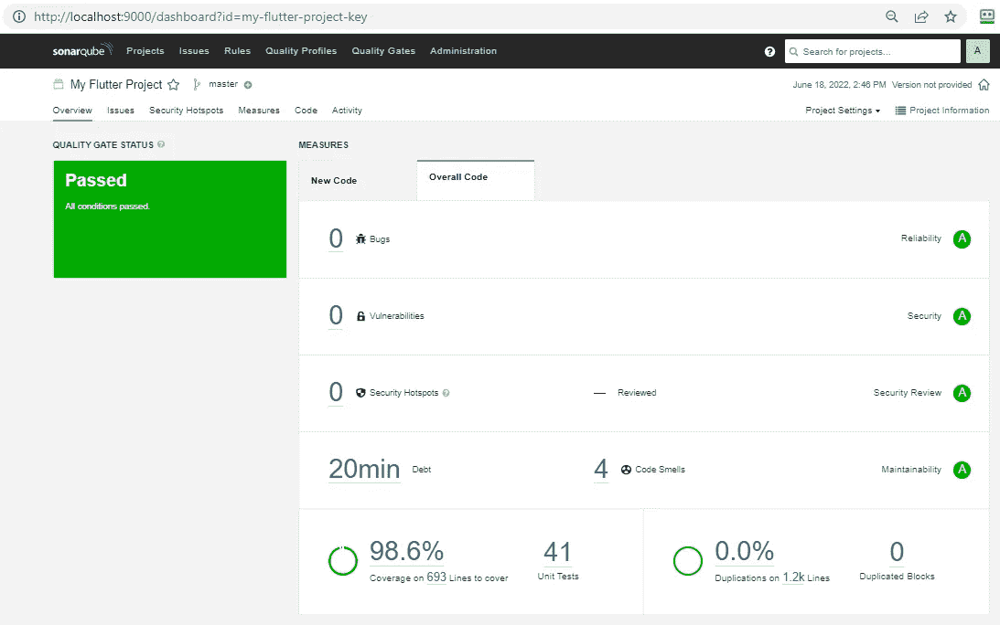**

**SonarQube 项目概述页面**

**如果您需要更多详细信息，请浏览其他选项卡**

**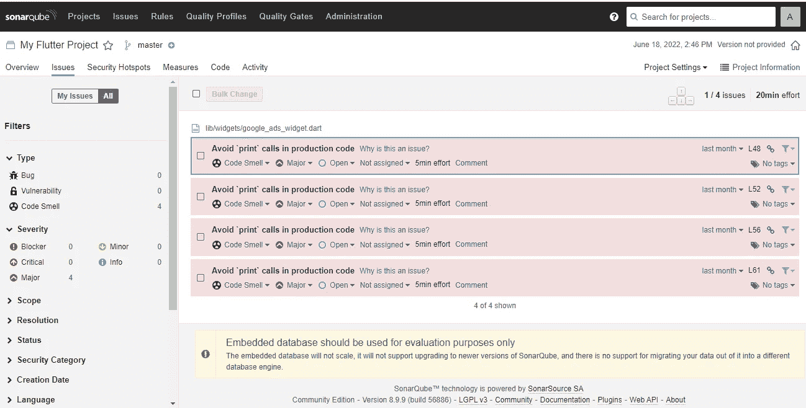**

**SonarQube 问题页面**

**瞧，完成了。**

**像往常一样，我只是提到了该工具的最基本的用法，请随意查看关于 [Docker](https://www.docker.com/) 、[sonar cube](https://www.sonarqube.org/)和 [Flutter](https://flutter.dev/) 的更多细节，请访问它们各自的文档页面。**

**再次，小心使用本文中的图片和插件，它不是一个官方插件，Sonar docker 图片在我的个人报告中。**

**希望能对你有用，感谢你读到这里，下次见。**