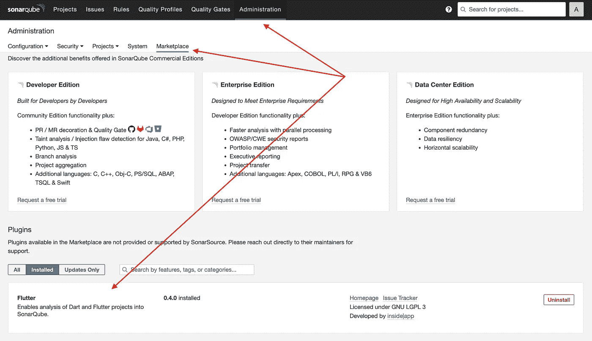
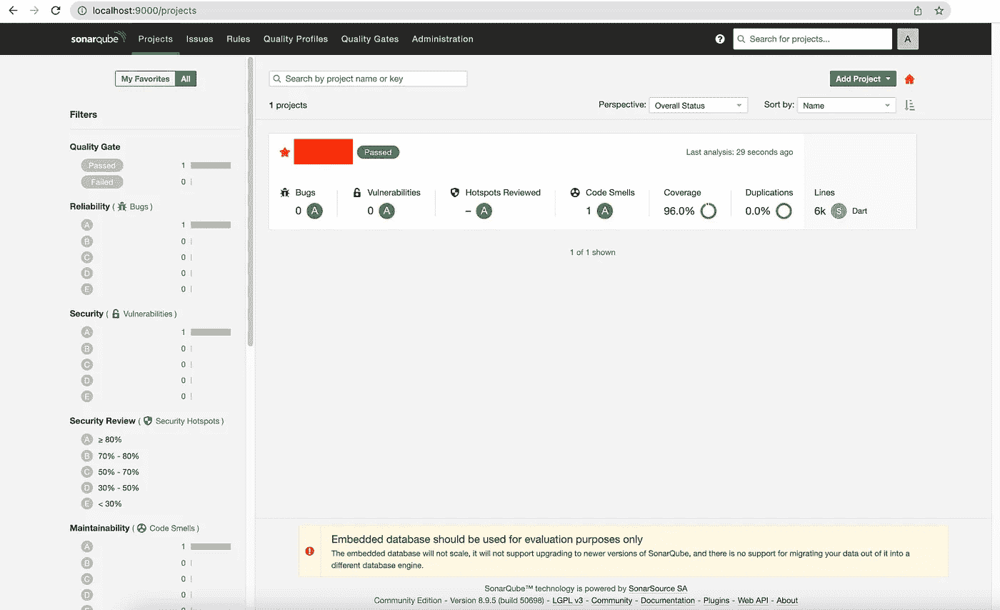

# 如何在 Apple Silicon Mac 上使用 Docker 通过 8 个步骤设置 SonarQube 和 Flutter

> 原文：<https://betterprogramming.pub/flutter-and-sonarqube-for-static-code-analysis-51368a85c51c>

## 静态代码分析用的颤振和声纳立方体


Alex Kotliarskyi 在 [Unsplash](https://unsplash.com?utm_source=medium&utm_medium=referral) 上拍摄的照片

首先，如果你正在阅读这篇文章，你可能对`Flutter`应用程序开发感兴趣，所以我们可以跳过那里的介绍。

那`SonarQube`呢？这是任何开发人员都应该知道的工具之一:*高代码质量的守护者*。

还有什么是`Docker`？这是一个开源的容器化平台。想象一下，拥有一个更轻的虚拟机，已经预配置了您需要的一切，只需轻轻一点就可以部署。

话题上有文章和`YouTube`视频的语气，本帖就不细说了。

所以让我们开始吧:

# 1.下载并安装 Docker

前往[https://docs.docker.com/engine/install/](https://docs.docker.com/engine/install/)为你的操作系统安装`Docker Desktop`版本。

它支持苹果硅，所以在这方面很大的荣誉。

下载并首次运行后，前往[https://hub.docker.com](https://hub.docker.com/)*创建一个帐户。我们可以假设现在我们需要的只是一个免费账户。*

*如果你搞不清楚`Docker Id`是什么:那是你的用户名。*

# *2.下载 SonarQube 映像并创建您的容器*

*假设您想从免费的`Community version`开始，您可以从您的终端运行:*

```
*docker pull sonarqube:9.3-community*
```

*您最终可能会看到如下错误:*

```
*no matching manifest for linux/arm64/v8 in the manifest list entries*
```

*在撰写本文时，还没有官方的苹果芯片支持，所以如果你想要 9+版本的`SonarQube`你可以尝试一下，但我不建议这样做，因为它的工作速度非常慢，如果一些任务在苹果芯片上的加载时间超过 30 秒，至少在第一年，那就不值得了。*

*下面的命令将迫使我们为我们的架构下载 Docker 镜像，但它将作为仿真运行，这意味着超级慢，因此我的评论。*

```
*docker pull sonarqube:9.3-community --platform linux/amd64*
```

# *3.扔掉第二点，我们再试一次！*

*因此，让我们忘记这一点，并找到一个非官方的 Docker 图像，可以为我们的硅芯片工作(如果你想知道，这不是一些随机的图像，这是很多开发人员正在使用的东西):*

```
*docker pull mwizner/sonarqube:8.9.5-community*
```

*下一步是创建我们的容器/应用程序，但是首先，我们将检查我们刚刚下载的图像。*

```
*docker images *REPOSITORY           TAG               IMAGE ID* *mwizner/sonarqube    8.9.5-community   f5e2e7d2d122** 
```

*让我们给我们的容器命名为`sonarqubeapp`,并使用上面的图像 ID:*

```
*docker create --name sonarqubeapp -p 9000:9000 f5e2e7d2d122*
```

*现在，让我们开始我们的容器:*

```
*docker start sonarqubeapp*
```

*加载*15-20 秒后，*你就可以去 [http://localhost:9000](http://localhost:9000) 拥有一个正在运行的网站了。开始时，使用 *admin/admin* 作为用户名和密码。*

# *4.获得一个分析飞镖和颤振的插件*

*在撰写本文的时候，还没有来自`SonarQube`的对`Dart`和`Flutter`的官方支持，但是`GitHub`和社区万岁。*

*已经有一个插件/扩展可以在[https://github.com/insideapp-oss/sonar-flutter](https://github.com/insideapp-oss/sonar-flutter)下载。*

*去`Releases`拿最新的。在我们的例子中，它意味着[声纳-颤振-插件-0.4.0.jar](https://github.com/insideapp-oss/sonar-flutter/releases/download/0.4.0/sonar-flutter-plugin-0.4.0.jar)*

# *5.复制。容器的 jar 插件*

*前往`Downloads`文件夹或下载插件的地方，运行这个命令*

```
*docker cp sonar-flutter-plugin-0.4.0.jar sonarqubeapp:/opt/sonarqube/extensions/plugins*
```

*我们正在使用`docker cp`进行文件复制，因为从外部来看容器的文件系统是不可见的。如果你愿意，类似于 iOS 上的沙盒。*

*`sonarqubeapp`是容器的名称，在`:`之后是容器内插件文件夹的路径。*

*然后我们需要重启容器来刷新插件。*

```
*docker restart sonarqubeapp*
```

*如果到目前为止所有步骤都是成功的，那么在门户内部，我们应该能够看到类似的内容:*

**

# *6.下载声纳扫描仪*

*扫描仪将使我们能够上传本地结果到门户网站来显示数据。*

*它可以从 Docker 映像运行并访问源代码库，但是我们现在将关注本地安装。*

*前往[https://docs . sonar qube . org/latest/analysis/scan/sonar scanner/](https://docs.sonarqube.org/latest/analysis/scan/sonarscanner/)下载归档文件并将其解压缩到您的主文件夹中。*

*确保将路径添加到您的`.bash_profile`或`.zshrc`或您系统上可能有的任何 shell 配置中，以便在任何地方都可以看到该命令，然后重新启动您的终端。*

```
*export PATH="$HOME/sonar-scanner-4.7.0.2747-macosx/bin:$PATH"*
```

# *7.创建配置文件*

*最后一步，我们需要在`Flutter`项目的根目录下有一个配置文件，它将在源代码和`SonarQube`门户之间交换一些信息。*

***第 2–4 行:**在门户中创建新项目后，您将获得它们。*

# *8.试一试！*

*在最后一步，让我们把它们放在一起，转到`Flutter`项目的根目录，运行下面的代码:*

```
*flutter pub get # just in case
flutter test --machine --coverage > tests.output
sonar-scanner*
```

*它会将我们的测试结果和关于代码库的详细信息上传到门户网站供我们分析。如果一切顺利的话，它应该看起来像这样:*

**

# *加分*

*还记得第三点吗？我们从某处获得了初始图像，然后对其进行配置以适应我们的特殊情况。*

*如果我们想保存整个设置的图像，以便在另一台 Mac 上使用，或者甚至向全世界发布，我们可以将我们的容器/应用程序发布为私有或公共存储库。*

```
*# First head to your Docker Hub account and create a new repository (either private or public)docker commit sonarqubeappdocker images # get the newly created empty image iddocker tag [Empty Image Id] [Docker Id]/[Repository Name]:[Version]docker push [Docker Id]/[Image Name]:[Version]*
```

**举例:**

```
*docker commit sonarqubeapp
docker images 
docker tag b0dcc123456 myaccount/project-image:1.0
docker push myaccount/project-image:1.0*
```

*下一次，因为我们已经配置好了一切，我们可以跳过步骤 2-5。*

# *最后的想法*

*`SonarQube`是一个优秀的工具，它可以利用代码气味、代码覆盖率、重复行、圈复杂度等统计数据来提高团队的速度和代码质量。*

*它还可以与 CI/CD 环境集成，打开一个新的可能性世界，比如装饰您的 pull 请求或建立您自己团队的质量防护栏(比如，所有推送的代码应该没有代码气味或测试覆盖率超过 75%)，这个列表还可以继续下去。*

*而这只是一小部分功能。*

*走吧`#data-driven`！！！*